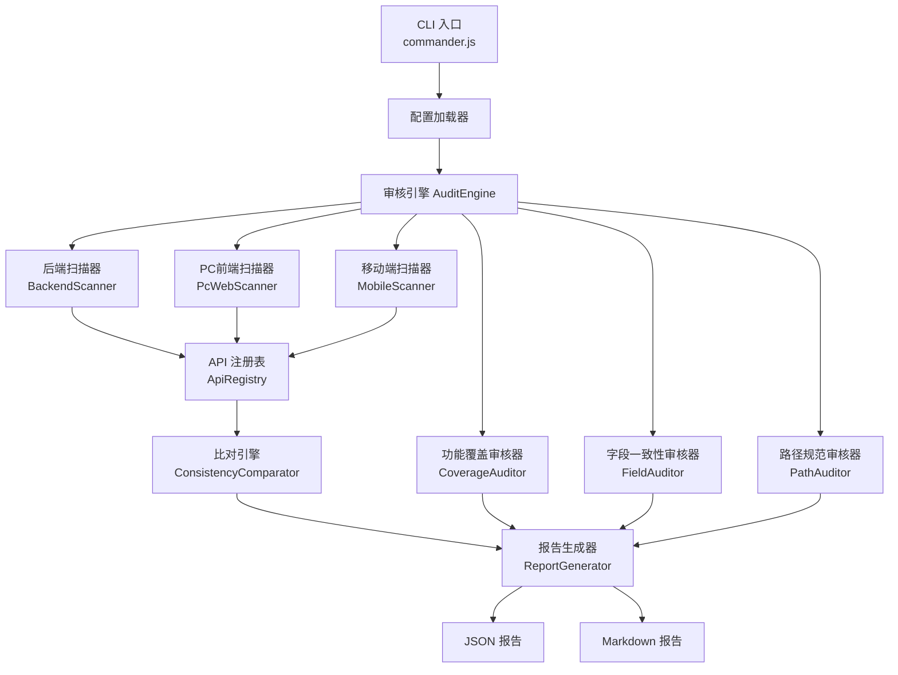
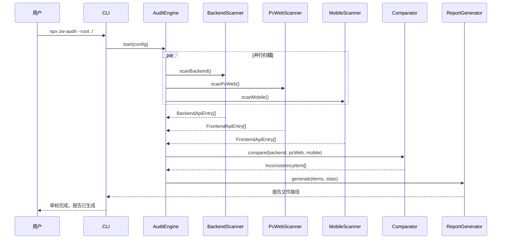

# 一致性审核引擎（Consistency Audit Engine）- 技术设计文档

## Overview

一致性审核引擎是一个 **Node.js CLI 工具**，用于自动化扫描中维智营（ZW Insight）三端代码库（后端 Spring Boot、PC 前端 Vue3、移动端 uni-app），执行 API 路径匹配、数据结构对齐、功能覆盖完整性审核，并输出结构化不一致项报告。

### 设计目标

- **准确性**：基于 AST 解析而非简单正则，确保路径和字段提取的准确性
- **可扩展性**：模块化设计，便于新增审核规则和扫描器
- **可读报告**：按模块分组、按严重程度分级的结构化报告
- **零侵入**：纯静态分析，不修改源代码，不依赖运行时环境

### 技术选型

| 组件 | 技术 | 版本 | 理由 |
|------|------|------|------|
| 运行时 | Node.js | 20+ LTS | 原生支持 TypeScript Compiler API |
| 语言 | TypeScript | 5.x | 与项目前端技术栈一致，类型安全 |
| TS AST 解析 | TypeScript Compiler API | 5.x | 官方 API，精确解析模板字符串和函数调用 |
| Java 解析 | 正则 + 行级分析 | - | Java 注解模式规律性强，无需引入 JavaParser 重依赖 |
| CLI 框架 | Commander.js | 12.x | 轻量 CLI 参数解析 |
| 报告输出 | 内置模板 | - | JSON + Markdown 双格式输出 |
| 测试框架 | Vitest | 2.x | 支持 Property-Based Testing (fast-check) |
| PBT 库 | fast-check | 3.x | TypeScript 原生 PBT 库 |

**为什么选 Node.js 而非 Java/Python？**
1. 前端代码（TypeScript）可直接使用 TypeScript Compiler API 做精确 AST 解析
2. 后端 Java 注解模式（`@XxxMapping("/path")`）高度规律，正则匹配足以覆盖
3. 与项目团队 TypeScript 技能栈一致，维护成本低
4. Node.js 文件系统操作和字符串处理性能满足扫描需求

---

## Architecture

### 整体架构



### 执行流程



---

## Components and Interfaces

### 核心模块接口定义

```typescript
// ===================== 扫描器接口 =====================

/** 后端 API 条目 */
interface BackendApiEntry {
  module: string;              // 业务模块名 (e.g., "finance")
  controllerClass: string;     // Controller 类名
  methodName: string;          // 方法名
  httpMethod: HttpMethod;      // GET|POST|PUT|DELETE
  fullPath: string;            // 完整路径 (e.g., "/api/v1/finance/invoice-apply")
  requestParamType?: string;   // 请求参数类型
  responseType?: string;       // 响应类型
  filePath: string;            // 源文件路径
  lineNumber: number;          // 行号
}

/** 前端 API 条目 */
interface FrontendApiEntry {
  source: 'pc-web' | 'mobile'; // 来源端
  fileName: string;            // 文件名 (e.g., "finance.ts")
  functionName: string;        // 函数名
  httpMethod: HttpMethod;      // HTTP 方法
  requestPath: string;         // 请求路径
  pathParams: string[];        // 路径参数列表
  module: string;              // 所属业务模块
  filePath: string;            // 源文件路径
  lineNumber: number;          // 行号
}

type HttpMethod = 'GET' | 'POST' | 'PUT' | 'DELETE';

// ===================== 比对结果 =====================

/** 不一致项类型 */
type InconsistencyType =
  | 'FRONTEND_EXTRA_API'       // 前端多余接口
  | 'BACKEND_ORPHAN_API'       // 后端孤立接口
  | 'HTTP_METHOD_MISMATCH'     // HTTP方法不匹配
  | 'FEATURE_MISSING'          // 功能缺失
  | 'FEATURE_EXTRA'            // 超范围实现
  | 'FIELD_NAME_MISMATCH'      // 字段名不匹配
  | 'FIELD_EXTRA_FRONTEND'     // 前端多余字段
  | 'FIELD_REQUIRED_MISSING'   // 必填字段前端缺失
  | 'PATH_NAMING_VIOLATION'    // 路径命名不规范
  | 'RESTFUL_NAMING_VIOLATION' // RESTful命名不规范
  | 'MOBILE_FEATURE_MISSING'   // 移动端功能缺失
  | 'PC_FEATURE_MISSING';      // PC端功能缺失

/** 严重程度 */
type Severity = 'Critical' | 'Major' | 'Minor';

/** 不一致项 */
interface InconsistencyItem {
  type: InconsistencyType;
  severity: Severity;
  module: string;
  frontendFilePath?: string;
  backendFilePath?: string;
  description: string;
  suggestion: string;
}

// ===================== 扫描器接口 =====================

interface IScanner<T> {
  scan(rootPath: string): Promise<T[]>;
}

interface IComparator {
  compare(
    backend: BackendApiEntry[],
    pcWeb: FrontendApiEntry[],
    mobile: FrontendApiEntry[]
  ): InconsistencyItem[];
}

interface IReportGenerator {
  generate(
    items: InconsistencyItem[],
    stats: AuditStats
  ): AuditReport;
}
```

### 后端扫描器 (BackendScanner)

```typescript
/**
 * 后端 Java Controller 扫描器
 * 
 * 扫描策略：
 * 1. 遍历 zw-insight-server 下各模块的 controller 目录
 * 2. 读取每个 .java 文件内容
 * 3. 用正则提取类级 @RequestMapping 前缀
 * 4. 用正则提取方法级 @XxxMapping 注解的路径和 HTTP 方法
 * 5. 拼接完整路径
 */
class BackendScanner implements IScanner<BackendApiEntry> {
  
  // 类级 @RequestMapping 正则
  private classRequestMappingRegex = 
    /@RequestMapping\s*\(\s*(?:value\s*=\s*)?["']([^"']+)["']/;
  
  // 方法级 Mapping 注解正则
  private methodMappingRegex = 
    /@(Get|Post|Put|Delete|Request)Mapping\s*\(\s*(?:value\s*=\s*)?["']([^"']+)["'](?:.*method\s*=\s*RequestMethod\.(\w+))?/g;
  
  async scan(rootPath: string): Promise<BackendApiEntry[]>;
}
```

### PC 前端扫描器 (PcWebScanner)

```typescript
/**
 * PC 前端 TypeScript API 扫描器
 * 
 * 使用 TypeScript Compiler API 进行精确 AST 解析：
 * 1. 使用 ts.createSourceFile() 解析每个 API 文件
 * 2. 遍历 AST 节点，查找 request.get/post/put/delete 调用
 * 3. 提取路径字符串（包括模板字符串中的变量）
 * 4. 将模板变量转换为路径参数占位符
 */
class PcWebScanner implements IScanner<FrontendApiEntry> {
  
  /**
   * 解析 TypeScript AST，提取 API 调用
   * 使用 ts.forEachChild 递归遍历，识别：
   * - request.get('/path') 
   * - request.post('/path', data)
   * - request.get(`/path/${id}`)  -> /path/{id}
   */
  private extractApiCalls(sourceFile: ts.SourceFile): FrontendApiEntry[];
  
  /**
   * 将模板字符串转换为路径参数格式
   * `/v1/finance/invoice-apply/${id}` -> `/v1/finance/invoice-apply/{id}`
   */
  private normalizeTemplateLiteral(node: ts.TemplateLiteral): { 
    path: string; 
    params: string[] 
  };
  
  async scan(rootPath: string): Promise<FrontendApiEntry[]>;
}
```

### 移动端扫描器 (MobileScanner)

```typescript
/**
 * 移动端 uni-app API 扫描器
 * 
 * 移动端 API 调用模式不同于 PC 端：
 * - 使用 request({ url: '/path', method: 'POST', data }) 形式
 * - method 字段可选，默认为 GET
 * 
 * 使用 TypeScript Compiler API 解析：
 * 1. 识别 request() 函数调用
 * 2. 提取对象字面量参数中的 url 和 method 属性
 */
class MobileScanner implements IScanner<FrontendApiEntry> {
  
  /**
   * 解析 request({ url, method }) 调用模式
   */
  private extractRequestCalls(sourceFile: ts.SourceFile): FrontendApiEntry[];
  
  async scan(rootPath: string): Promise<FrontendApiEntry[]>;
}
```

### 比对引擎 (ConsistencyComparator)

```typescript
/**
 * API 路径一致性比对引擎
 * 
 * 比对策略：
 * 1. 规范化路径（统一移除/保留 /api 前缀）
 * 2. 将路径参数统一为 {param} 格式
 * 3. 逐一匹配前端路径 -> 后端注册表
 * 4. 记录各类不一致项
 */
class ConsistencyComparator implements IComparator {
  
  /**
   * 路径规范化：移除 /api 前缀差异
   * 后端: /api/v1/finance/xxx -> /v1/finance/xxx
   * 前端: /v1/finance/xxx -> /v1/finance/xxx
   */
  normalizePath(path: string): string;
  
  /**
   * 路径匹配：支持路径参数通配
   * /v1/finance/invoice-apply/{id} 匹配 /v1/finance/invoice-apply/{id}
   */
  pathsMatch(frontendPath: string, backendPath: string): boolean;
  
  compare(
    backend: BackendApiEntry[],
    pcWeb: FrontendApiEntry[],
    mobile: FrontendApiEntry[]
  ): InconsistencyItem[];
}
```

### 功能覆盖审核器 (CoverageAuditor)

```typescript
/**
 * 功能覆盖率审核器
 * 
 * 基于 REQ-031 功能表定义，验证各端功能实现的完整性
 * 
 * 功能映射配置格式：
 * - 每个功能点 -> 对应的后端模块 + 预期的前端 API 文件
 * - 区分 PC 独有、移动独有、双端共有
 */
interface FeatureMapping {
  featureId: string;           // 功能编号
  featureName: string;         // 功能名称
  category: string;            // 所属大类
  backendModule: string;       // 对应后端模块
  pcRequired: boolean;         // PC端是否必须
  mobileRequired: boolean;    // 移动端是否必须
  expectedApiPatterns: string[]; // 预期的 API 路径模式
}

class CoverageAuditor {
  constructor(private featureMappings: FeatureMapping[]);
  
  audit(
    backend: BackendApiEntry[],
    pcWeb: FrontendApiEntry[],
    mobile: FrontendApiEntry[]
  ): InconsistencyItem[];
}
```

### 字段一致性审核器 (FieldAuditor)

```typescript
/**
 * 字段一致性审核器
 * 
 * 比对策略：
 * 1. 扫描后端 Domain/DTO 类字段（正则提取 private 字段和校验注解）
 * 2. 扫描前端 Vue 组件中 v-model 绑定的字段名
 * 3. 执行驼峰/下划线转换后比对
 */
class FieldAuditor {
  
  /**
   * 驼峰转下划线：invoiceAmount -> invoice_amount
   * 下划线转驼峰：invoice_amount -> invoiceAmount
   */
  normalizeFieldName(name: string, convention: 'camel' | 'snake'): string;
  
  /**
   * 提取 Java 实体类字段
   * 识别 private Type fieldName; 和 @NotNull/@NotBlank 注解
   */
  extractJavaFields(filePath: string): JavaField[];
  
  /**
   * 提取 Vue 组件 v-model 绑定字段
   */
  extractVueModelFields(filePath: string): string[];
  
  audit(backendModule: string, frontendFile: string): InconsistencyItem[];
}
```

### 路径规范审核器 (PathAuditor)

```typescript
/**
 * 路径规范性校验器
 * 
 * 校验规则：
 * 1. 后端路径必须以 /api/v1/{module}/ 为前缀
 * 2. 前端路径模块名必须与后端模块对应
 * 3. 资源命名使用小写字母和连字符 (kebab-case)
 */
class PathAuditor {
  
  private pathPrefixRegex = /^\/(?:api\/)?v1\/([a-z][a-z0-9-]*)\//;
  private kebabCaseRegex = /^[a-z][a-z0-9]*(-[a-z0-9]+)*$/;
  
  /**
   * 校验路径前缀规范
   */
  validatePathPrefix(entry: BackendApiEntry): InconsistencyItem | null;
  
  /**
   * 校验 RESTful 命名风格
   */
  validateRestfulNaming(entry: BackendApiEntry): InconsistencyItem | null;
  
  audit(entries: BackendApiEntry[]): InconsistencyItem[];
}
```

### 报告生成器 (ReportGenerator)

```typescript
/**
 * 审核报告生成器
 * 
 * 输出双格式：
 * 1. JSON: 供程序消费的结构化数据
 * 2. Markdown: 供人阅读的格式化报告
 */
class ReportGenerator implements IReportGenerator {
  
  generate(items: InconsistencyItem[], stats: AuditStats): AuditReport;
  
  /**
   * 按模块分组、按严重程度排序
   */
  private groupByModule(items: InconsistencyItem[]): Map<string, InconsistencyItem[]>;
  
  /**
   * 渲染 Markdown 报告
   */
  private renderMarkdown(report: AuditReport): string;
  
  /**
   * 严重程度分类规则
   */
  private classifySeverity(type: InconsistencyType): Severity;
}
```

---

## Data Models

### API 注册表

```typescript
/** API 注册表 - 审核基准数据 */
interface ApiRegistry {
  backend: BackendApiEntry[];
  pcWeb: FrontendApiEntry[];
  mobile: FrontendApiEntry[];
  metadata: {
    scanTime: string;
    backendModuleCount: number;
    pcWebFileCount: number;
    mobileFileCount: number;
  };
}
```

### 审核统计

```typescript
/** 审核覆盖率统计 */
interface AuditStats {
  totalBackendModules: number;
  auditedBackendModules: number;
  totalBackendApis: number;
  totalPcWebApis: number;
  totalMobileApis: number;
  totalInconsistencies: number;
  byType: Record<InconsistencyType, number>;
  bySeverity: Record<Severity, number>;
  consistencyRate: number; // 一致率百分比
}
```

### 审核报告

```typescript
/** 完整审核报告 */
interface AuditReport {
  summary: {
    scanTime: string;
    duration: number;           // 扫描耗时(ms)
    consistencyRate: number;    // 总体一致率
    stats: AuditStats;
  };
  moduleReports: ModuleReport[];
  platformDifferences: {
    pcOnly: string[];           // PC端独有功能
    mobileOnly: string[];      // 移动端独有功能
    pendingIntegration: string[]; // 待前端对接模块
  };
}

/** 模块级报告 */
interface ModuleReport {
  moduleName: string;
  backendApiCount: number;
  pcWebApiCount: number;
  mobileApiCount: number;
  inconsistencies: InconsistencyItem[];
}

/** Java 字段信息 */
interface JavaField {
  fieldName: string;
  fieldType: string;
  annotations: string[];      // 校验注解列表
  isRequired: boolean;        // 是否标注 @NotNull/@NotBlank
}

/** 功能覆盖检查结果 */
interface CoverageCheckResult {
  featureId: string;
  featureName: string;
  backendImplemented: boolean;
  pcWebImplemented: boolean;
  mobileImplemented: boolean;
  expectedPlatforms: ('pc' | 'mobile')[];
}
```

### CLI 配置

```typescript
/** CLI 运行配置 */
interface AuditConfig {
  rootPath: string;                    // 项目根目录
  backendPath: string;                 // 后端源码路径 (相对 rootPath)
  pcWebApiPath: string;                // PC前端API目录 (相对 rootPath)
  mobileApiPath: string;               // 移动端API目录 (相对 rootPath)
  outputDir: string;                    // 报告输出目录
  outputFormat: ('json' | 'markdown')[]; // 输出格式
  modules: string[];                    // 审核模块列表
  featureMappingFile?: string;          // 功能映射配置文件路径
  ignorePatterns?: string[];            // 忽略的路径模式
}
```

---


## Correctness Properties

*A property is a characteristic or behavior that should hold true across all valid executions of a system—essentially, a formal statement about what the system should do. Properties serve as the bridge between human-readable specifications and machine-verifiable correctness guarantees.*

### Property 1: 后端注解解析正确性

*For any* 合法的 Java Controller 源码字符串，其中包含类级 `@RequestMapping` 前缀和方法级 `@XxxMapping` 注解，BackendScanner 解析出的每个 `BackendApiEntry` 的 `httpMethod` 应与注解类型一致（@GetMapping→GET, @PostMapping→POST, @PutMapping→PUT, @DeleteMapping→DELETE），且 `fullPath` 应为类级路径与方法级路径的正确拼接。

**Validates: Requirements 1.1, 1.3**

### Property 2: 路径拼接一致性

*For any* 类级路径前缀 `classPrefix` 和方法级路径 `methodPath`，路径拼接函数 `joinPaths(classPrefix, methodPath)` 的结果应满足：结果以 classPrefix 开头，以 methodPath 的最后一段结尾，且不包含双斜杠 `//`。

**Validates: Requirements 1.3**

### Property 3: 模板字符串规范化

*For any* 包含模板变量的路径字符串（形如 `/v1/module/${variableName}/action`），normalizeTemplateLiteral 函数应将所有 `${xxx}` 替换为 `{xxx}`，且替换后的路径中不包含 `$` 字符，路径参数列表长度等于原始模板中 `${...}` 出现的次数。

**Validates: Requirements 2.2, 3.2**

### Property 4: 解析器输出完整性

*For any* 由扫描器（BackendScanner、PcWebScanner、MobileScanner）成功解析的 API 条目，结果必须包含非空的 `module`、`httpMethod`、`filePath` 和有效的请求路径字段。即解析器不会产出字段缺失的不完整记录。

**Validates: Requirements 1.2, 2.3, 3.3**

### Property 5: 路径规范化幂等性

*For any* API 路径 `P`，`normalizePath("/api" + P)` 应等于 `normalizePath(P)`。即无论路径是否包含 `/api` 前缀，规范化后的结果相同。同时 `normalizePath(normalizePath(P)) === normalizePath(P)`（幂等性）。

**Validates: Requirements 4.6**

### Property 6: 比对引擎分类正确性

*For any* 前端 API 条目集合和后端 API 注册表，ConsistencyComparator 的输出应满足：
- 若前端路径在后端不存在对应（规范化后），则结果包含 `FRONTEND_EXTRA_API` 类型条目
- 若后端路径在所有前端均不存在调用，则结果包含 `BACKEND_ORPHAN_API` 类型条目
- 若路径相同但 HTTP 方法不同，则结果包含 `HTTP_METHOD_MISMATCH` 类型条目
- 不会出现同一个前后端配对同时被标记为多种冲突类型

**Validates: Requirements 4.1, 4.2, 4.3, 4.4, 4.5**

### Property 7: 功能覆盖检测完备性

*For any* 功能映射配置和前端 API 列表，若某功能标记为 `pcRequired: true` 且 PC 前端 API 列表中不存在匹配该功能 `expectedApiPatterns` 的条目，则 CoverageAuditor 结果必须包含对应的 `FEATURE_MISSING` 类型不一致项。反之，若存在匹配，则不应产出该功能的缺失项。

**Validates: Requirements 5.2, 5.3, 5.4**

### Property 8: 字段名大小写转换 Round-Trip

*For any* 合法的驼峰命名字段名（匹配 `[a-z][a-zA-Z0-9]*` 模式），执行 `toCamelCase(toSnakeCase(fieldName))` 应得到与原始字段名相同的结果。即驼峰→下划线→驼峰的转换是可逆的。

**Validates: Requirements 6.3**

### Property 9: 字段审核分类正确性

*For any* 后端字段集合 `B` 和前端字段集合 `F`（经过大小写规范化后），FieldAuditor 结果应满足：
- F 中存在但 B 中不存在的每个字段，产出 `FIELD_EXTRA_FRONTEND` 条目
- B 中标记 `isRequired=true` 且 F 中不存在的每个字段，产出 `FIELD_REQUIRED_MISSING` 条目
- 产出的不一致项数量等于 |F\B| + |{b∈B : b.isRequired ∧ b∉F}|

**Validates: Requirements 6.4, 6.5**

### Property 10: 报告统计不变量

*For any* 不一致项列表，ReportGenerator 产出的 `AuditStats` 应满足：
- `totalInconsistencies` 等于输入列表长度
- `bySeverity` 各值之和等于 `totalInconsistencies`
- `byType` 各值之和等于 `totalInconsistencies`
- 按模块分组后，各组 `inconsistencies` 数组长度之和等于 `totalInconsistencies`

**Validates: Requirements 7.1, 7.4, 7.5**

### Property 11: 严重程度分类确定性

*For any* 两个具有相同 `type` 字段值的 `InconsistencyItem`，`classifySeverity` 函数对两者返回的结果相同。即严重程度完全由不一致类型决定，不受其他字段影响。

**Validates: Requirements 7.3**

### Property 12: 路径前缀规范验证

*For any* 符合 `/api/v1/{module}/...` 格式（module 为字母开头的小写字母数字串）的后端路径，PathAuditor 的 `validatePathPrefix` 不应产出不一致项。*For any* 不符合该格式的路径（如缺少 v1、模块名包含大写），应产出 `PATH_NAMING_VIOLATION` 类型条目。

**Validates: Requirements 10.1, 10.2**

### Property 13: RESTful 命名风格验证

*For any* 路径中资源名段匹配 kebab-case 模式（`/^[a-z][a-z0-9]*(-[a-z0-9]+)*$/`）的路径，`validateRestfulNaming` 不应产出不一致项。*For any* 包含大写字母、下划线或不合规字符的资源名段，应产出 `RESTFUL_NAMING_VIOLATION` 类型条目。

**Validates: Requirements 10.4**

---

## Error Handling

### 文件系统错误

| 错误场景 | 处理策略 |
|----------|----------|
| 源码目录不存在 | 抛出 `ConfigError`，提示用户检查路径配置 |
| 单个文件读取失败 | 记录警告日志，跳过该文件继续扫描，报告中标注"跳过" |
| 无 Java/TS 文件可扫描 | 记录为模块级警告，报告中标注该模块为"无源码" |
| 输出目录不可写 | 抛出 `OutputError`，提示用户检查目录权限 |

### 解析错误

| 错误场景 | 处理策略 |
|----------|----------|
| Java 文件语法错误 | 记录警告，跳过该文件，报告中标注"解析失败" |
| TypeScript 文件语法错误 | TypeScript Compiler API 容错解析，尽可能提取可用信息 |
| 注解格式非标准 | 无法匹配的注解跳过，记录到"未识别注解"列表中 |
| 模板字符串含复杂表达式 | 标记为"动态路径，无法静态分析"，不参与比对 |

### 比对异常

| 错误场景 | 处理策略 |
|----------|----------|
| 功能映射配置缺失 | 跳过功能覆盖审核，报告中注明 |
| 模块名无法识别 | 标记为"未知模块"，归入独立分组 |
| 路径参数类型不确定 | 路径参数统一按 `{param}` 占位符处理 |

### CLI 退出码

| 退出码 | 含义 |
|--------|------|
| 0 | 审核完成，无 Critical 级别不一致项 |
| 1 | 审核完成，存在 Critical 级别不一致项 |
| 2 | 配置错误，审核未执行 |
| 3 | 运行时错误，审核中断 |

---

## Testing Strategy

### 测试框架与工具

- **单元测试**: Vitest（与项目前端生态一致）
- **Property-Based Testing**: fast-check 3.x（TypeScript 原生 PBT 库）
- **最小迭代次数**: 每个 property test 至少 100 次随机输入

### Property-Based Tests

每个 Correctness Property 对应一个 PBT 测试用例，使用 fast-check 的 `fc.assert` + `fc.property` 模式：

```typescript
// 示例：Property 5 - 路径规范化幂等性
// Feature: consistency-audit, Property 5: 路径规范化幂等性
test.prop([fc.string()], (path) => {
  const normalized = normalizePath(path);
  expect(normalizePath(normalized)).toBe(normalized); // 幂等
});
```

**PBT 测试配置**:
- 每个测试标注 tag: `Feature: consistency-audit, Property {N}: {title}`
- 最小 100 次迭代: `fc.assert(property, { numRuns: 100 })`
- 自定义 Arbitrary 生成器用于：
  - Java Controller 源码片段
  - TypeScript API 调用代码片段
  - API 路径字符串（含路径参数）
  - 驼峰/下划线字段名

### Unit Tests（Example-Based）

| 测试范围 | 测试内容 |
|----------|----------|
| BackendScanner | 实际项目中 ArchiveController.java 的解析结果验证 |
| PcWebScanner | 实际项目中 finance.ts 的解析结果验证 |
| MobileScanner | 实际项目中 common.ts 的解析结果验证 |
| 模块列表 | 验证覆盖全部 20 个模块 |
| 报告格式 | 验证 JSON 和 Markdown 输出格式正确 |

### Integration Tests

| 测试范围 | 测试内容 |
|----------|----------|
| 端到端审核 | 使用项目真实代码执行完整审核流程 |
| CLI 参数 | 验证各 CLI 参数组合正常工作 |
| 报告文件 | 验证报告文件生成到指定目录 |

### 测试目录结构

```
tools/consistency-audit/
├── src/
│   ├── scanners/
│   ├── comparators/
│   ├── auditors/
│   ├── reporters/
│   └── cli.ts
├── tests/
│   ├── unit/
│   │   ├── backend-scanner.test.ts
│   │   ├── pc-web-scanner.test.ts
│   │   ├── mobile-scanner.test.ts
│   │   ├── comparator.test.ts
│   │   ├── field-auditor.test.ts
│   │   └── path-auditor.test.ts
│   ├── property/
│   │   ├── parsing.property.test.ts
│   │   ├── normalization.property.test.ts
│   │   ├── comparison.property.test.ts
│   │   ├── classification.property.test.ts
│   │   └── report.property.test.ts
│   ├── integration/
│   │   └── full-audit.test.ts
│   └── fixtures/
│       ├── java/          # Java 源码测试夹具
│       ├── typescript/    # TypeScript 源码测试夹具
│       └── vue/           # Vue 模板测试夹具
├── package.json
├── tsconfig.json
└── vitest.config.ts
```
