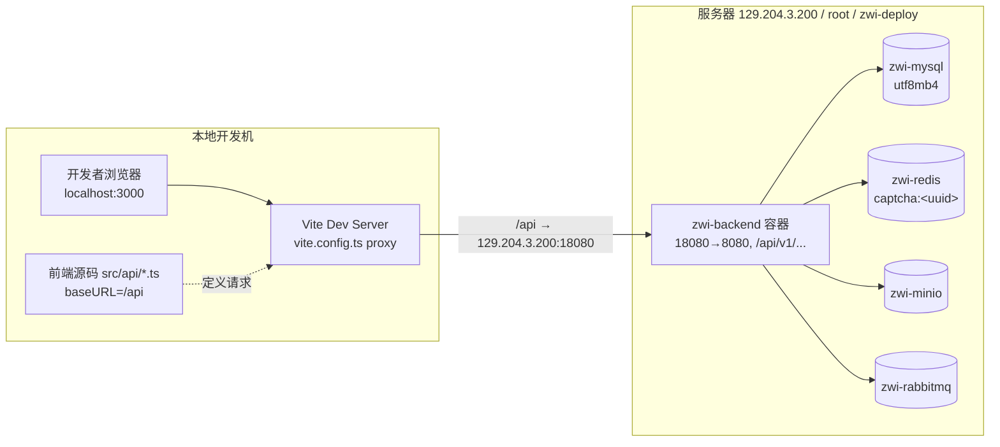
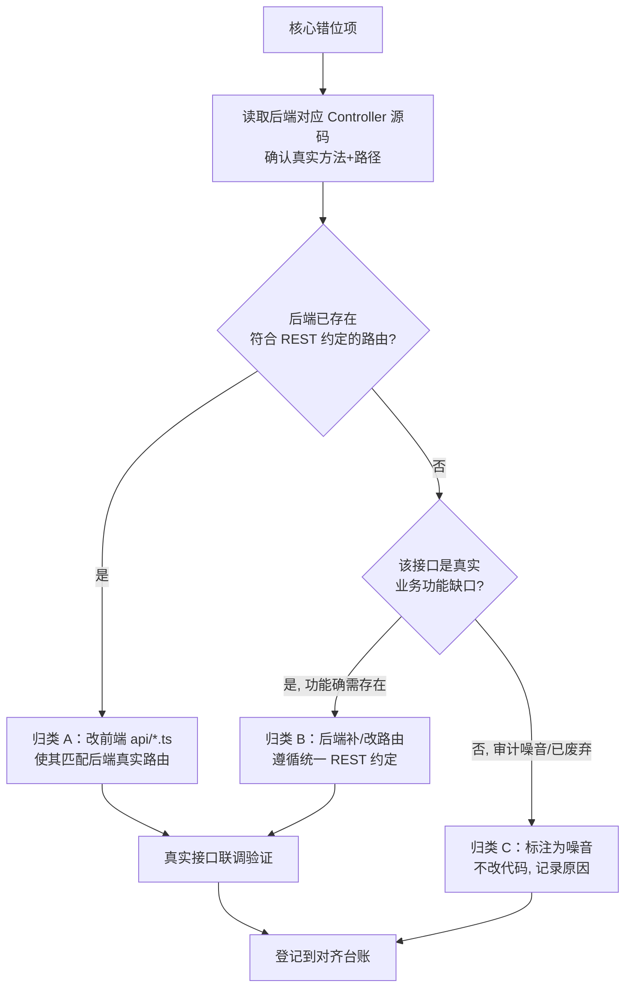
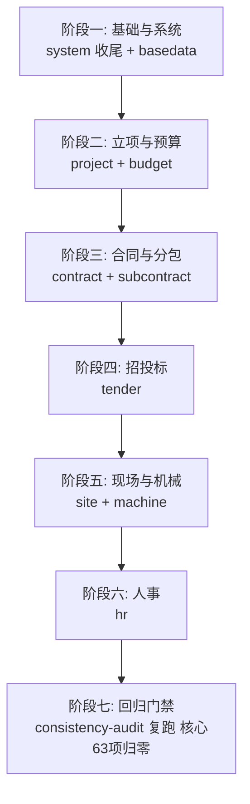
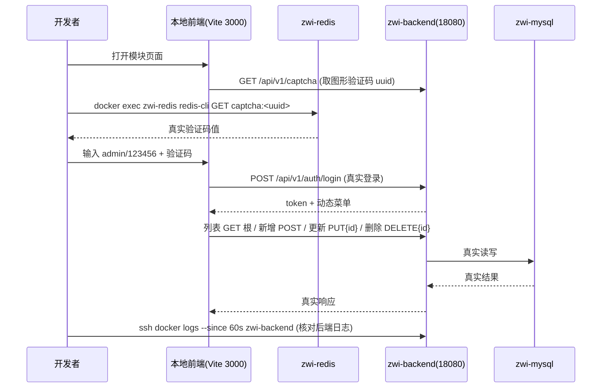
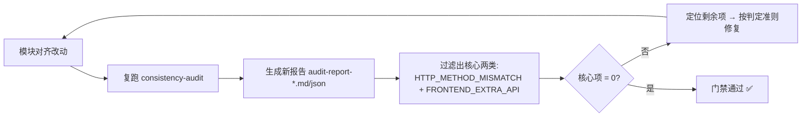

# 设计文档：前后端联调（frontend-backend-integration）

## Overview

> 概述

本设计针对 ZW-Insight 工程项目管理系统的"全流程前后端联调"。当前状态是：后端已稳定运行于服务器 Docker（容器 `zwi-backend`，对外 `18080`→容器 `8080`，context-path=`/`，路由前缀 `/api/v1/...`），本地前端 Vite 通过代理把 `/api` 转发到 `129.204.3.200:18080`；登录、动态侧边栏（18 模块）、首页、系统管理（人员/机构/角色/岗位）已联调通过且 `system.ts` 路径已对齐。

剩余的核心问题是**前后端 API 路径与 HTTP 方法在应用级范围内大面积错位**。consistency-audit 工具在 2026-06-30 报告中扫出 757 项不一致，但其中绝大多数（`BACKEND_ORPHAN_API` 304 / `FEATURE_EXTRA` 264 / `FEATURE_MISSING` 121）是审计对 `/page` 与根路径归一化产生的噪音、或功能表覆盖差异，**不应盲目当 bug 处理**。真正需要本次联调对齐的核心项为 **63 项**：`HTTP_METHOD_MISMATCH` 38 项 + `FRONTEND_EXTRA_API` 25 项，分布在 10 个模块。

本设计要做三件事：(1) 确立前后端统一的 REST 路径约定与"谁迁就谁"的判定准则；(2) 给出按依赖与风险排序的模块逐个对齐方案与真实接口验证策略（禁止假数据兜底）；(3) 修复阻碍联调的两项遗留问题（DB 种子中文乱码、未提交的本地改动），并建立 consistency-audit 复跑作为回归门禁（核心 63 项归零）。

本设计是高层设计（架构与接口契约视角），聚焦联调策略、统一约定、判定准则与验证流程，不展开具体函数级伪代码。

## 联调目标与非目标

**目标**
- 走通真实接口：登录（admin/123456 + 图形验证码）→ 动态侧边栏 → 各模块 CRUD 全部使用真实后端、真实数据流。
- 消除 63 项核心错位（38 方法不匹配 + 25 前端多出接口），使前端 `api/*.ts` 与后端实际 Controller 路由一致。
- 修复 DB 种子中文乱码，使菜单/字典等基础数据正确显示。
- 纳入并提交遗留本地改动（Vite 代理、动态侧边栏、WebMvcConfig 验证码白名单）。
- 建立回归门禁：consistency-audit 复跑后核心 63 项归零。

**非目标**
- 不处理审计中的噪音项（`BACKEND_ORPHAN_API` / `FEATURE_EXTRA` / `FEATURE_MISSING`），除非复核后确认其为真实功能缺口。
- 不新增业务功能、不重构与联调无关的代码。
- 不允许任何形式的 fallback、静默兜底或使用完全不真实的假数据来"绕过"接口问题。

## Architecture

> 架构

联调链路（本地前端 + 远程后端 Docker）如下：



要点：
- 前端 `request` 的 `baseURL=/api`，业务代码再拼 `/v1/<module>/...`，经 Vite 代理后到达后端 `http://129.204.3.200:18080/api/v1/...`，与后端 `@RequestMapping("/api/v1/...")` 一致。
- 联调时前端在本地热更新，后端为服务器上已部署的真实服务；只有"需要改后端路由"的对齐项才触发重打 jar 与重新部署。
- 验证码经 Redis 落地（key=`captcha:<uuid>`），联调脚本可读取真实验证码完成真实登录。

## 统一 REST 路径约定（对齐基准）

以下约定为本次联调的**目标契约**。后端绝大多数 Controller 已遵循该约定（已通过 `MaterialController` 等核实），前端存在多处偏离。

| 操作 | HTTP 方法 | 路径模式 | 说明 |
| --- | --- | --- | --- |
| 列表/分页 | GET | `/v1/<module>/<entity>`（根） | 后端常同时提供 `/page` 别名；以根 GET 为准 |
| 详情 | GET | `/v1/<module>/<entity>/{id}` | |
| 新增 | POST | `/v1/<module>/<entity>`（根） | 请求体为实体 |
| 更新 | PUT | `/v1/<module>/<entity>/{id}` | id 在路径，实体在请求体 |
| 删除 | DELETE | `/v1/<module>/<entity>/{id}` | |
| 批量删除 | DELETE | `/v1/<module>/<entity>/batch` | 请求体为 id 列表 |
| 状态/提交等动作 | PUT/POST | `/v1/<module>/<entity>/{id}/<action>` | 如 `/submit`、`/status`，以后端实际为准 |

**实证（来自 `MaterialController`）**：根 `@GetMapping` + `/page` 别名同为列表；`@PutMapping("/{id}")` 为更新；`@DeleteMapping("/{id}")` 为删除；`@DeleteMapping("/batch")` 为批量删除。这说明审计里"前端 PUT `/v1/basedata/material` vs 后端 POST"之类的描述是**归一化噪音**——后端真实更新路由是 PUT `/{id}`，前端却用了 PUT 根路径（无 id），需要前端改为 PUT `/{id}`。

## 判定准则：前端适配 vs 后端补改

每个核心错位项必须先**核对后端实际 Controller 源码**，再按下表归类，禁止仅凭审计描述就动手：



判定原则细化：

1. **后端 Controller 是事实来源（source of truth）**。审计报告的方法/路径描述可能因 `/page` 归一化而失真，一律以源码为准。
2. **归类 A（改前端，默认首选）**：当后端已有符合统一 REST 约定的路由（如真实更新是 PUT `/{id}`、列表是根 GET），而前端用了偏离写法（PUT 根、GET `/page` 但后端只认根、DELETE/GET 张冠李戴），则**只改前端 `api/*.ts`**。这是低风险、无需重新部署后端的修法，应作为默认。
3. **归类 B（改后端，谨慎）**：当 `FRONTEND_EXTRA_API` 经核对确认后端**确实缺少该业务接口**且该功能真实需要（例如 `hr/regular`、`hr/transfer`、`tender/certificate` 等可能是真实功能缺口），则后端按统一约定补充 Controller 方法/Service。改后端需走重打 jar + 重新部署流程，风险与成本更高，必须确认功能确需存在后再做。
4. **归类 C（噪音，不改）**：核对后确认是审计归一化噪音、或前端调用的是已废弃接口，则不改代码，但必须在对齐台账中记录"判定为噪音/废弃 + 理由"，供 context 保留。
5. **冲突优先级**：当"前端迁就成本"与"后端迁就成本"都低且后端已符合 REST 约定时，优先归类 A（改前端），保持后端契约稳定。仅当后端路由本身违反统一约定且无前端依赖该旧路由时，才考虑改后端使其规范化。

## 模块处理顺序

按"依赖在前、风险可控在前"排序，先打通基础数据与系统类模块（被其他业务模块引用），再处理业务模块。每个模块改完即做真实接口验证，验证通过再进入下一个，避免错位累积。



| 阶段 | 模块 | 核心项数 | 方法不匹配 | 前端多出 | 主要修法倾向 |
| --- | --- | --- | --- | --- | --- |
| 一 | system | 3 | 1 | 2 | A 为主，个别 B（status 接口核实） |
| 一 | basedata | 10 | 8 | 2 | A 为主（material/supplier 等 PUT→PUT/{id}） |
| 二 | project | 1 | 1 | 0 | A |
| 二 | budget | 6 | 6 | 0 | A（DELETE/PUT 方法纠正） |
| 三 | contract | 7 | 4 | 3 | A + B（settlement/output/change-visa 核实） |
| 三 | subcontract | 1 | 1 | 0 | A（settlement submit POST/PUT 核实） |
| 四 | tender | 11 | 7 | 4 | A + B（certificate/refund 核实） |
| 五 | site | 7 | 6 | 1 | A 为主（schedule/inspection 方法纠正） |
| 五 | machine | 3 | 2 | 1 | A 为主（repair POST/PUT 核实） |
| 六 | hr | 14 | 2 | 12 | B 占比较高（regular/transfer/seal-apply 多为功能缺口需核实） |

说明：上表"修法倾向"是基于审计描述的初步判断，**每一项仍须按判定准则核对后端源码后才能定论**。hr 的 12 项 `FRONTEND_EXTRA_API`（regular/transfer/seal-apply）需重点核实后端是否真缺接口——若缺且功能真实需要则归类 B，否则归类 C。

## 联调验证策略（真实接口，禁止假数据）

每个模块对齐后，统一按以下闭环验证，全程使用真实后端与真实数据流：



验证规则：
1. **真实登录**：通过 Redis 读取 `captcha:<uuid>` 的真实验证码完成登录，不绕过验证码、不 mock token。
2. **网络请求核对**：在浏览器 Network 面板确认每个 CRUD 请求的方法/路径与统一约定一致，状态码为 2xx，响应体为真实业务数据。
3. **后端日志核对**：用 `ssh -i <pem> root@129.204.3.200 "docker logs --since 60s zwi-backend"` 确认请求真实到达后端、无路由 404/405、无异常栈。
4. **禁止兜底**：不允许前端在请求失败时静默回退到本地假数据；若后端确实缺接口，必须归类 B 补后端或归类 C 登记，而不是用假数据掩盖。
5. **可视化辅助**：可用 Playwright 驱动浏览器走真实页面流程做回归式点检，但数据仍来自真实后端。
6. **逐模块门禁**：当前模块所有核心项验证通过（请求成功 + 日志干净 + 数据正确）才进入下一模块。

## Components and Interfaces

> 接口对齐契约 / 前端 api/*.ts 调整规范

前端调整统一遵循下述映射规范（归类 A 的标准改法），以 basedata 为示例模板，其余模块同构套用：

```typescript
// 统一约定：列表=根 GET，详情=GET /{id}，新增=POST 根，更新=PUT /{id}，删除=DELETE /{id}

// 列表：以后端"根 GET"为准（后端可能同时有 /page 别名，但统一收敛到根）
export function getMaterialDictPage(params: any) {
  return request.get('/v1/basedata/material', { params })   // 原: '/v1/basedata/material/page'
}

// 更新：id 进路径，实体进 body（修复"PUT 根路径"错位）
export function updateMaterialDict(data: any) {
  return request.put(`/v1/basedata/material/${data.id}`, data)  // 原: request.put('/v1/basedata/material', data)
}

// 删除：DELETE /{id}（修复方法/路径张冠李戴）
export function deleteMaterialDict(id: number) {
  return request.delete(`/v1/basedata/material/${id}`)
}
```

归类 B（后端补/改路由）的标准改法，遵循统一约定补 Controller：

```java
@RestController
@RequestMapping("/api/v1/hr/regular")   // 示例：确认为真实功能缺口后补充
@RequiredArgsConstructor
public class HrRegularController {
    private final HrRegularService service;

    @GetMapping                              // 列表（根 GET）
    public R<PageResult<HrRegular>> page(/* 分页+条件参数 */) { /* ... */ }

    @PostMapping                             // 新增（根 POST）
    public R<Void> save(@RequestBody HrRegular body) { /* ... */ }

    @PutMapping("/{id}")                     // 更新（PUT /{id}）
    public R<Void> update(@PathVariable Long id, @RequestBody HrRegular body) { /* ... */ }

    @DeleteMapping("/{id}")                  // 删除（DELETE /{id}）
    public R<Void> delete(@PathVariable Long id) { /* ... */ }
}
```

## Data Models

> 数据模型与契约一致性

本次联调不改业务数据模型，重点是保证**请求方法/路径/参数位置**与后端契约一致：

- **路径参数 vs 请求体**：更新类接口 id 必须在路径（`/{id}`），实体在 body；前端"PUT 根路径把 id 放 body"的写法须改为路径传 id。
- **分页参数**：列表统一走根 GET，分页参数 `page`/`size` 经 query 传递（与 `MaterialController.page` 的 `@RequestParam` 一致）。
- **响应包装**：后端统一返回 `R<T>`（含 `code`/`data`/`msg`）与 `PageResult<T>`；前端解包逻辑保持不变，仅纠正请求侧。
- **DB 字符集**：所有种子与表必须 `utf8mb4`，避免中文乱码污染基础数据（详见遗留问题修复）。

## 遗留问题修复

### 问题一：DB 种子中文乱码

**条件**：`data-menu.sql`（及其他种子脚本，如 `deploy/db-init/99_data-menu.sql`）灌库时未显式指定 utf8mb4，导致菜单名、字典等中文字段乱码，污染动态侧边栏与基础数据展示。

**修复方案**：
1. 确认 MySQL 容器与库表字符集为 `utf8mb4`/`utf8mb4_general_ci`（schema 已为 utf8mb4 时只需修客户端导入字符集）。
2. 重灌种子时显式带客户端字符集：
   ```bash
   docker exec -i zwi-mysql mysql --default-character-set=utf8mb4 -uroot -p<pwd> <db> < data-menu.sql
   ```
3. 对已写入的乱码行：优先**清表后用 utf8mb4 重灌种子**（菜单/字典为可重建的基础数据），而非逐行修补。
4. 重灌后通过真实登录观察动态侧边栏 18 模块中文显示正确，作为验证。

**约束**：种子重灌属于对共享数据库的写操作，执行前确认目标库与备份，避免误灌生产数据。

### 问题二：未提交的本地改动

需纳入版本管理的本地改动（最新已提交 commit：`ff2414f`）：
1. **Vite 代理**（`zw-insight-web/vite.config.ts`）：`/api` → `129.204.3.200:18080`。
2. **动态侧边栏**：前端按后端菜单动态渲染的改动。
3. **WebMvcConfig 验证码白名单**：后端放行验证码相关路径的改动。

**提交策略**：
- 仅暂存与联调相关的上述文件，逐文件 `git add`，避免 `git add .` 带入无关改动。
- 提交前检查是否含敏感文件（如 `zwinsight.pem` 已 gitignore，确认不被纳入）。
- 提交信息清晰描述"联调遗留改动纳入"，并在改造记录中登记，保留上下文。
- 联调过程中产生的前端 `api/*.ts` 对齐改动，按模块分批提交，便于回溯每个模块的对齐内容。

## 回归门禁：consistency-audit 复跑

建立"对齐 → 复跑审计 → 核心项归零"的回归门禁机制：



门禁规则：
1. **核心指标**：以 `HTTP_METHOD_MISMATCH` + `FRONTEND_EXTRA_API` 两类之和为门禁数（基线 63 项），噪音类（`BACKEND_ORPHAN_API`/`FEATURE_EXTRA`/`FEATURE_MISSING`）不计入门禁，但需在台账登记为"已判定噪音"。
2. **运行方式**：使用 `tools/consistency-audit` CLI 复跑，产出新的 `audit-reports/audit-report-<ts>.md/json`，并刷新核心项工作清单 `api-alignment-worklist.md`。
3. **逐步收敛**：每完成一个模块复跑一次，确认该模块核心项归零且未引入新错位（无回归）。
4. **最终门禁**：全部模块处理完，核心 63 项归零；若仍有残留，必须是经核实并书面登记的"功能缺口待排期(归类B 未做)"或"噪音(归类C)"，否则门禁不通过。
5. **对齐台账**：维护一份逐项台账（项 → 归类 A/B/C → 处理结果 → 验证证据），完整记录改造详情以保留上下文。

## Correctness Properties

> 正确性属性

联调完成后应满足的契约不变式（作为对齐与验证的可检查断言）：

### Property 1: 方法-路径一致性

对任一被前端调用的接口 `(method, path)`，后端必存在匹配的真实 Controller 路由；即 `HTTP_METHOD_MISMATCH` 数 = 0。

### Property 2: 无悬空前端接口

前端 `api/*.ts` 中每个被业务使用的接口都能在后端找到对应实现，或已被明确归类为 B（待补，已登记）/C（噪音，已登记）；即 `FRONTEND_EXTRA_API` 未登记数 = 0。

### Property 3: REST 约定收敛

所有 CRUD 满足 列表=根 GET、详情=GET `/{id}`、新增=POST 根、更新=PUT `/{id}`、删除=DELETE `/{id}`。

### Property 4: 真实数据不变式

任一通过验证的请求，其响应数据均来自真实后端与真实 DB，不存在前端假数据兜底路径。

### Property 5: 登录可达性

使用真实验证码（Redis `captcha:<uuid>`）+ admin/123456 必能完成真实登录并取得动态菜单。

### Property 6: 门禁单调收敛

每次模块对齐后复跑审计，核心两类（方法不匹配 + 前端多出）计数单调不增，最终归零。

## Error Handling

> 错误处理

| 场景 | 条件 | 处理 | 恢复 |
| --- | --- | --- | --- |
| 路由 404/405 | 前端请求方法或路径仍与后端不符 | 视为联调失败，回到判定准则重新核对后端源码 | 修正 api/*.ts 或补后端路由后重测 |
| 验证码失效 | Redis 中 `captcha:<uuid>` 过期或读取错误 key | 重新获取验证码 uuid 再读 Redis | 用新验证码真实登录 |
| 中文乱码 | 种子未用 utf8mb4 导入 | 不在前端"美化"掩盖，定位到 DB 层 | 清表 + utf8mb4 重灌种子 |
| 后端确缺接口 | FRONTEND_EXTRA_API 核实为真实功能缺口 | 归类 B 补后端，禁止前端假数据兜底 | 重打 jar + 重新部署后联调 |
| 部署后行为异常 | 改后端重新部署引入问题 | 拉 `docker logs` 定位 | 修复后重新 build/up，必要时回滚到 ff2414f 后的稳定 jar |

**禁止项**：任何 fallback 静默回退、用完全不真实的假数据替代真实响应、对失败请求吞异常不报。允许有"备选方案"（如先做归类 A，功能缺口排期做归类 B），但不得静默处理。

## Testing Strategy

> 测试策略

- **单元/接口层**：consistency-audit 已有单元测试（`tools/consistency-audit/tests`）保证扫描器与比较器正确；本次复用其作为静态契约校验。
- **联调端到端**：以真实登录 + 真实 CRUD 为主，按模块逐个走真实接口验证（见联调验证策略）。
- **回归**：consistency-audit 复跑作为自动化回归门禁，核心 63 项归零。
- **可视化点检**：可用 Playwright 驱动真实页面流程做关键路径回归，数据来自真实后端。

## 改后端的部署流程（仅归类 B 触发）

```bash
# 1. 本地重打 jar（JDK 21 / Maven 3.9.6）
mvn -pl zw-app -am package -DskipTests
# 2. 传到服务器部署目录
#    tar 打包 → scp 到 /root/zwi-deploy/
# 3. 服务器重建并重启后端容器
docker compose build --no-cache backend && docker compose up -d backend
# 4. 验证
ssh -i <pem> root@129.204.3.200 "docker logs --since 60s zwi-backend"
```

**约束**：重新部署影响服务器上的真实后端服务，属中高风险操作。仅在归类 B 确认后执行，执行前确认改动范围、保留可回滚的上一版 jar。

## 依赖

- **运行环境**：服务器 `129.204.3.200`（root，PEM：`C:\Users\gerrard\.ssh\zwinsight.pem`）；Docker 容器 `zwi-backend`/`zwi-mysql`/`zwi-redis`/`zwi-minio`/`zwi-rabbitmq`；部署目录 `/root/zwi-deploy`。
- **本地工具链**：Node/Vite（前端）、JDK 21（`D:\Android\jdk-21`）、Maven 3.9.6（`D:\Android\apache-maven-3.9.6`）、`tools/consistency-audit` CLI。
- **凭证**：登录 admin/123456 + 图形验证码（Redis key `captcha:<uuid>`）。
- **基线**：最新已提交 commit `ff2414f`；核心错位清单 `audit-reports/api-alignment-worklist.md`（63 项）。

## 安全考量

- PEM 私钥（`zwinsight.pem`）已 gitignore，提交时确认不被纳入版本库；不在文档/日志中回显密钥内容。
- 读取后端日志/Redis 时避免回显敏感凭证值。
- 改后端重新部署前确认目标为联调环境而非误操作生产数据；种子重灌前确认目标库与备份。
- 验证码白名单放行范围应最小化，仅放行验证码相关路径，不可顺带放行业务接口的鉴权。
