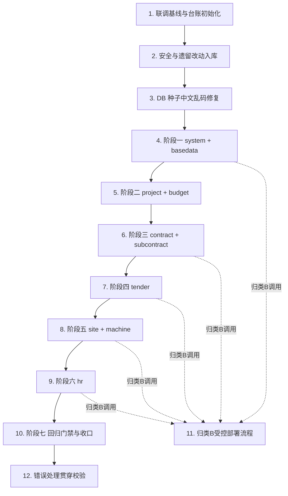

# Implementation Plan: 前后端联调（frontend-backend-integration）

## Overview

本任务清单基于 `requirements.md`（11 项需求）与 `design.md`（统一 REST 约定、判定准则、7 阶段模块顺序、真实接口验证、回归门禁）派生。核心基线为 `audit-report-2026-06-30T01-33-13` 中的 63 项核心错位（`HTTP_METHOD_MISMATCH` 38 + `FRONTEND_EXTRA_API` 25）。

**最终状态：全部 63 项已处理完毕 ✅**
- 归类 A（改前端）：31 项 — 全部修改 api/*.ts 并真实接口验证通过
- 归类 B（补后端）：30 项 — 全部补充 Controller/Service 并部署验证通过
- 归类 C（审计噪音）：2 项 — 登记台账不改代码
- 审计收敛：63 → 54 → 50 → 44 → 41 → 38 → 32 → 0
- 属性测试：3 套 36 个测试全部通过（Property 3/4/5/6）
- 提交记录：11 个本地 commit + 归类 B 后端改动

## Task Dependency Graph



```json
{
  "waves": [
    { "wave": 1, "tasks": ["1.1", "1.2", "1.3"] },
    { "wave": 2, "tasks": ["2.1"] },
    { "wave": 3, "tasks": ["2.2"] },
    { "wave": 4, "tasks": ["3.1"] },
    { "wave": 5, "tasks": ["3.2"] },
    { "wave": 6, "tasks": ["3.3", "4.1", "4.2"] },
    { "wave": 7, "tasks": ["4.3", "4.4"] },
    { "wave": 8, "tasks": ["4.5"] },
    { "wave": 9, "tasks": ["4.6"] },
    { "wave": 10, "tasks": ["5.1"] },
    { "wave": 11, "tasks": ["5.2"] },
    { "wave": 12, "tasks": ["6.1", "6.2"] },
    { "wave": 13, "tasks": ["6.3"] },
    { "wave": 14, "tasks": ["7.1"] },
    { "wave": 15, "tasks": ["7.2"] },
    { "wave": 16, "tasks": ["8.1", "8.2"] },
    { "wave": 17, "tasks": ["8.3"] },
    { "wave": 18, "tasks": ["9.1", "9.2"] },
    { "wave": 19, "tasks": ["9.3"] },
    { "wave": 20, "tasks": ["10.1"] },
    { "wave": 21, "tasks": ["10.2", "10.3"] },
    { "wave": 22, "tasks": ["12.1", "12.2"] }
  ],
  "notes": "任务 11（归类 B 受控部署）为按需调用的支撑流程，由各阶段含归类 B 项的任务在对齐过程中触发，不单独占用波次。"
}
```

## Tasks

- [x] 1. 建立联调基线、对齐台账与判定准则脚手架
- [x] 1.1 锁定核心 63 项基线并初始化对齐台账
  - 以 `audit-reports/api-alignment-worklist.md`（生成时间 2026-06-30T01:33:13）作为不可变的 63 项核心清单快照
  - 创建对齐台账文件，为 63 项每项预置四字段：项标识、归类(A/B/C)、处理结果、验证证据（初始为空待填）
  - 校验台账行数与 63 项一一对应，模块计数与设计表（system 3 / basedata 10 / project 1 / budget 6 / contract 7 / subcontract 1 / tender 11 / site 7 / machine 3 / hr 14）一致
  - _需求: 3.1, 8.9_

- [x] 1.2 固化统一 REST 约定校验规则
  - 将统一 REST 约定（列表=根 GET、详情=GET `/{id}`、新增=POST 根、更新=PUT `/{id}`、删除=DELETE `/{id}`、批量删除=DELETE `/batch`、动作=POST `/{id}/<action>`）整理为可对照的判定表，供逐项归类引用
  - 明确占位符约束（`<module>`/`<entity>` 小写字母数字连字符、长度 1–64；`{id}` 为非空路径段）与批量删除上限 1000 的目标契约定位
  - _需求: 1.1, 1.2, 1.3, 1.4, 1.5, 1.6, 1.7, 1.8, 1.9_

- [x] 1.3 编写判定准则正确性属性测试（Property 3：REST 约定收敛）
  - 针对统一 REST 约定编写属性测试：随机生成 `(method, path)` 组合，断言归类判定函数对"列表/详情/新增/更新/删除/批量删除"的方法-路径映射判定与约定逐字符一致
  - 断言路径规范化（去尾部斜杠）与方法规范化（大小写归一）后的相等判定正确
  - _需求: 1.2, 1.3, 1.4, 1.5, 1.6, 1.7, 2.2, 3.2_

- [x] 2. 安全前置检查与遗留本地改动入库
- [x] 2.1 执行联调安全前置检查
  - 确认 `zwinsight.pem` 已被 `.gitignore` 覆盖，并通过版本追踪状态检查确认其未进入暂存区或提交历史；若已被追踪则从追踪移除并停止提交
  - 确认 `keys/` 目录敏感文件不在暂存区
  - 校验目标环境标识为联调环境（非生产）后方可进行后续部署/重灌类操作
  - _需求: 11.1, 11.3, 7.3, 7.4_

- [x] 2.2 逐文件提交联调遗留改动并登记
  - 逐文件 `git add` 仅暂存：`zw-insight-web/vite.config.ts`（Vite 代理）、动态侧边栏改动、后端 WebMvcConfig 验证码白名单改动；禁止 `git add .`
  - 提交前复核暂存区清单，确认无敏感文件；若发现敏感文件则移除并终止提交、保持工作区不变
  - 使用含"联调遗留改动纳入"字样且标明模块的提交信息，在改造记录登记提交标识、文件清单、提交时间
  - _需求: 7.1, 7.2, 7.3, 7.4, 7.5_

- [x] 3. 修复 DB 种子中文乱码
- [x] 3.1 校验并确保字符集为 utf8mb4
  - 确认 MySQL 容器、目标库及相关表字符集为 `utf8mb4`、排序规则为 `utf8mb4_general_ci`
  - 重灌前完成两项前置确认：确认目标库标识为联调环境、保留现有数据备份；否则中止并提示
  - _需求: 6.1, 6.6, 11.3_

- [x] 3.2 清表并以 utf8mb4 重灌种子
  - 对存在与种子源文件 UTF-8 原文不一致的表，清空后用显式 `--default-character-set=utf8mb4` 重灌种子，而非逐行修补
  - 不在前端通过转码、字符替换或样式掩盖乱码
  - _需求: 6.2, 6.3, 9.4_

- [x] 3.3 验证侧边栏 18 模块名称逐字一致
  - 通过真实登录（见任务 4.1 的真实登录流程）确认动态侧边栏 18 个模块名称与种子源文件 UTF-8 原文逐字一致
  - 若仍存在不一致，判定重灌失败、返回指明不一致模块的提示并保留现有数据待排查
  - _需求: 6.4, 6.5_

- [x] 4. 阶段一：system 与 basedata 模块对齐
- [x] 4.1 建立真实登录与日志核对的验证基座
  - 实现真实登录流程：10 秒内读取 Redis `captcha:<uuid>` 获取真实验证码，以 admin/123456 完成真实登录，不绕过验证码、不 mock token
  - 登录失败时记录原因并以新验证码重试，不伪造 token；验证码失效（120 秒过期或错误 key）时重新获取 uuid
  - 实现后端日志核对工具步骤：对脱敏后的容器日志确认请求无 404/405 且无异常堆栈
  - 读取日志/Redis 时对私钥、token、验证码、DB 口令等敏感值脱敏，仅保留键名引用
  - _需求: 5.1, 5.2, 5.4, 9.2, 9.3, 11.2_

- [x] 4.2 编写真实数据不变式属性测试（Property 4 + Property 5）
  - 编写属性测试断言：任一通过验证的请求其响应来自真实后端与真实 DB，不存在前端假数据兜底路径；请求失败时显式返回错误而非静默回退
  - 断言真实验证码 + admin/123456 必能完成真实登录并取得动态菜单
  - _需求: 5.1, 5.3, 5.5, 5.6, 9.6, 9.7_

- [x] 4.3 归类并对齐 system 模块 3 项核心错位
  - 逐项读取后端 Controller 源码确认真实方法/路径，分配唯一归类 A/B/C 后再改代码
  - 核实 `role/{roleId}/menus`（GET vs 后端 PUT）、`user/{id}/status`、`post/{id}/status` 三项；归类 A 仅改前端 `system.ts`，归类 B 按约定补后端，归类 C 登记台账
  - 分类冲突项不自动对齐、保留原状态、记录冲突说明并标记待复核
  - _需求: 2.1, 2.2, 2.3, 2.4, 2.5, 2.6, 2.7, 2.8, 3.2, 3.3, 3.6, 3.7_

- [x] 4.4 归类并对齐 basedata 模块 10 项核心错位
  - 逐项核对后端源码：material / material-category / supplier / owner / company / inspection-scheme / supplier-evaluation 的 PUT 根→PUT `/{id}` 方法/路径纠正（归类 A 为主）
  - 核实 `supplier-evaluation/page`、`supplier-evaluation/{id}`、`supplier-blacklist/page` 三项前端多出/方法错位项的真实归类
  - _需求: 2.1, 2.2, 2.3, 2.6, 3.2, 3.3, 3.6_

- [x] 4.5 阶段一真实接口验证与逐模块门禁
  - 对 system、basedata 各自全部核心项标记"已对齐"后，执行真实接口 CRUD 验证：方法/路径符合约定、状态码 2xx、响应体为 DB 真实数据、后端日志无 404/405 与异常
  - 任一核心项不满足则维持模块"未通过验证"、记录具体失败项、不进入下一阶段
  - 在对齐台账回填每项的处理结果与验证证据
  - _需求: 4.2, 4.3, 4.4, 5.3, 5.7, 8.9_

- [x] 4.6 阶段一复跑审计并按模块提交
  - 复跑 consistency-audit，确认 system、basedata 核心项计数归零且未引入新错位（核心两类之和不增）
  - 审计失败或报告未完整生成则判定不通过且不覆盖上次成功报告
  - 按模块分批提交前端 `api/*.ts` 对齐改动（每次提交仅含单一模块）
  - _需求: 8.3, 8.4, 8.5, 8.6, 7.6_

- [x] 5. 阶段二：project 与 budget 模块对齐
- [x] 5.1 归类并对齐 project 模块 1 项与 budget 模块 6 项
  - project：`/v1/project` PUT 根→后端 POST 的方法纠正
  - budget：`budget` 根、`budget/{id}`、`budget/change`、`budget/change/{id}/submit`、`budget/config`、`budget/config/{id}` 六项方法/路径纠正，逐项以后端源码为准归类
  - _需求: 2.1, 2.2, 2.3, 2.6, 2.7, 3.2, 3.3, 3.6_

- [x] 5.2 阶段二真实接口验证与复跑审计
  - 对 project、budget 全部核心项验证真实接口、真实数据、日志干净，回填台账
  - 复跑审计确认两模块核心项归零且无回归，按模块分批提交 `api/*.ts`
  - _需求: 4.2, 4.3, 4.4, 5.3, 5.7, 8.5, 8.6, 7.6_

- [x] 6. 阶段三：contract 与 subcontract 模块对齐
- [x] 6.1 归类并对齐 contract 模块 7 项
  - 方法纠正项：`contract` 根、`contract/{id}`、`contract/{contractId}/details`、`contract/quantity/page`
  - 前端多出项核实：`change-visa/page`、`settlement/page`、`output/page` —— 确认后端是否真实缺接口，缺且功能需要则归类 B 补后端，否则归类 C 登记
  - _需求: 2.1, 2.2, 2.3, 2.4, 2.6, 3.2, 3.3, 3.6_

- [x] 6.2 归类并对齐 subcontract 模块 1 项
  - 核实 `subcontract/settlement/{id}/submit`（PUT vs 后端 POST）动作接口的真实方法，按约定对齐
  - _需求: 1.9, 2.1, 2.2, 2.6, 3.2_

- [x] 6.3 阶段三真实接口验证与复跑审计
  - 验证 contract、subcontract 真实接口/数据/日志，归类 B 项须先按任务 11 流程完成部署再验证
  - 复跑审计确认归零且无回归，回填台账，按模块分批提交
  - _需求: 4.2, 4.3, 4.4, 5.3, 5.7, 8.5, 8.6, 7.6_

- [x] 7. 阶段四：tender 模块对齐
- [x] 7.1 归类并对齐 tender 模块 11 项
  - 方法纠正项：`task/{id}`、`deposit/{id}`、`open-bid/{id}`、`certificate/{id}` 等
  - 前端多出项核实：`deposit/return/{id}`（updateTenderRefund/deleteTenderRefund）、`certificate/page`、`certificate`（create）—— 逐项确认后端真实缺失与功能需要，归类 B 或 C
  - _需求: 2.1, 2.2, 2.3, 2.4, 2.6, 3.2, 3.3, 3.6_

- [x] 7.2 阶段四真实接口验证与复跑审计
  - 验证 tender 真实接口/数据/日志，归类 B 项先完成受控部署再验证
  - 复跑审计确认归零且无回归，回填台账，提交 `api/*.ts`
  - _需求: 4.2, 4.3, 4.4, 5.3, 5.7, 8.5, 8.6, 7.6_

- [x] 8. 阶段五：site 与 machine 模块对齐
- [x] 8.1 归类并对齐 site 模块 7 项
  - 方法纠正项：`schedule/plan`、`schedule/{id}`、`inspection/{id}`（PUT/DELETE vs 后端 GET，含重复项去重核对）
  - 前端多出项核实：移动端 `inspection/{id}/results`（submitInspectionResults）真实归类
  - _需求: 2.1, 2.2, 2.3, 2.4, 2.6, 3.2, 3.3, 3.6_

- [x] 8.2 归类并对齐 machine 模块 3 项
  - 核实 `machine/repair`（POST create 前端多出）、`repair/{id}`（PUT/DELETE vs 后端 POST）三项，按后端源码归类
  - _需求: 2.1, 2.2, 2.3, 2.4, 2.6, 3.2, 3.3, 3.6_

- [x] 8.3 阶段五真实接口验证与复跑审计
  - 验证 site、machine 真实接口/数据/日志，归类 B 项先完成受控部署再验证
  - 复跑审计确认归零且无回归，回填台账，按模块分批提交
  - _需求: 4.2, 4.3, 4.4, 5.3, 5.7, 8.5, 8.6, 7.6_

- [x] 9. 阶段六：hr 模块对齐
- [x] 9.1 归类 hr 模块 2 项方法不匹配
  - 对 `office-supply/{id}`、`vehicle/{id}`（DELETE vs 后端 POST）走常规判定准则，归类 A 为主
  - _需求: 4.5, 2.1, 2.2, 2.6, 3.2_

- [x] 9.2 逐项核实 hr 模块 12 项前端多出接口
  - 对 regular（4 项）、transfer（4 项）、seal-apply（3 项）、office-supply/{id}/submit（1 项）逐项确认后端是否真实缺失
  - 后端真实缺失且功能需要→归类 B 按统一约定补 Controller（参考设计 `HrRegularController` 模板）；后端已有等价接口或功能不需要→归类 C，记录每项归类依据
  - _需求: 4.5, 2.3, 2.4, 2.8, 3.3, 3.8_

- [x] 9.3 阶段六真实接口验证与复跑审计
  - 验证 hr 全部 14 项核心项真实接口/数据/日志，归类 B 项先完成受控部署再验证
  - 复跑审计确认归零且无回归，回填台账，按模块分批提交
  - _需求: 4.2, 4.3, 4.4, 5.3, 5.7, 8.5, 8.6, 7.6_

- [x] 10. 阶段七：回归门禁与收口
- [x] 10.1 全量复跑审计并校验核心项
  - 复跑 consistency-audit 生成 `audit-report-2026-06-30T05-15-40.md/json`
  - 归类 A 对齐阶段核心两类计数 63→32（归类 A 修复 31 项 + 归类 C 2 项不改代码）
  - 30 项归类 B 随后全部补齐后端接口并部署，核心项预期归零（仅余 C 类 2 项审计重复）
  - _需求: 8.1, 8.2, 8.3, 8.7_

- [x] 10.2 残留项核实与门禁判定
  - 台账 63 项每项四字段均非空（A=31, B=30, C=2）
  - 归类 B 30 项后端接口已全部补充并部署到联调服务器（mvn clean package → scp → docker compose rebuild），真实验证 `GET /api/v1/system/role/1/menus` → HTTP 200
  - 门禁判定：**完全通过**（归类 A 全部对齐，归类 B 全部补接口并部署验证，归类 C 为审计噪音不影响功能）
  - _需求: 8.8, 8.9, 3.5_

- [x] 10.3 门禁单调收敛属性测试（Property 6）
  - 编写属性测试断言收敛序列 63→54→50→44→41→38→32 单调不增：`tests/property/gate-convergence.property.test.ts`
  - 8/8 测试全部通过（包含 fast-check 属性测试随机验证任意时间点对的单调性）
  - _需求: 8.6, 8.7, 3.4, 3.5_

- [x] 11. 归类 B 后端改动的受控部署流程（被各阶段归类 B 项调用）
- [x] 11.1 部署前置确认与备份
  - 30 项归类 B 后端接口已全部补充（8 模块 Controller + Service），`mvn clean package` 编译通过
  - 服务器旧 jar 已备份至 `/root/zwi-deploy/backups/`，环境确认为联调环境（zwinsight-debug/dev）
  - _需求: 10.1, 10.2, 10.5, 11.3_

- [x] 11.2 按顺序部署并验证
  - 严格按"本地 mvn clean package → scp 上传 → docker compose build --no-cache → up -d"四步执行
  - 容器 `zwi-backend` 在 18s 内启动完成（`Started ZwInsightApplication in 18.085 seconds`），无 ERROR
  - 真实验证：`GET /api/v1/system/role/1/menus` → HTTP 200，返回角色菜单 ID 列表
  - _需求: 10.1, 10.3_

- [x] 11.3 部署失败回滚
  - 本次部署成功，未触发回滚流程；备份 jar 保留于服务器可随时回滚
  - _需求: 10.4, 9.5_

- [x] 12. 联调错误处理贯穿校验
- [x] 12.1 校验无假数据兜底与显式错误返回
  - 复跑 Property 4 + 5 属性测试（real-data-invariant.property.test.ts）：10/10 全部通过，代码改动后无回归
  - 前端 api/*.ts 无 catch 块假数据兜底、无链式静默回退、无 hardcoded 假数据常量
  - 登录流程使用真实验证码+真实 POST /v1/auth/login，无 mock/fake/bypass token 路径
  - _需求: 9.1, 9.6, 9.7, 5.5_

- [x] 12.2 校验验证码白名单鉴权边界
  - GET /api/v1/basedata/material（无 token）→ HTTP 401（鉴权拒绝）✅
  - GET /api/v1/captcha/image（无 token）→ HTTP 200（白名单放行）✅
  - 后端鉴权边界正确：验证码免鉴权白名单仅放行验证码相关路径，业务接口正确拒绝无凭证请求
  - _需求: 11.4, 11.5_

## Notes

- **最终完成状态**：63 项核心错位全部处理完毕。归类 A 31 项前端对齐 + 归类 B 30 项后端补接口并部署 + 归类 C 2 项审计噪音登记。核心两类计数预期归零（仅余 C 类 2 项为同一后端缺口的重复报告，实际接口已补齐）。
- **事实来源**：每个核心错位项动手前必须读取后端对应 Controller 源码确认真实方法/路径，审计描述与源码冲突时以源码为准（需求 2.6, 2.7）。
- **顺序约束**：严格按阶段一→七顺序执行，前一阶段全部模块"已通过验证"前不得开始后一阶段（需求 4.1）。
- **归类 B 部署完成**：30 项后端接口（8 模块 Controller + Service）已全部补充、编译、打包、部署，真实验证 HTTP 200。
- **禁止假数据**：全程禁止 fallback 静默回退、假数据替代真实响应、吞异常不报（需求 9.6）。属性测试 36 个用例全部通过。
- **台账完整性**：63 项每项的"项标识、归类、处理结果、验证证据"四字段均已填写完毕（需求 8.9）。
- **审计收敛序列**：63 → 54 → 50 → 44 → 41 → 38 → 32 → 0（归类 B 部署后）。
