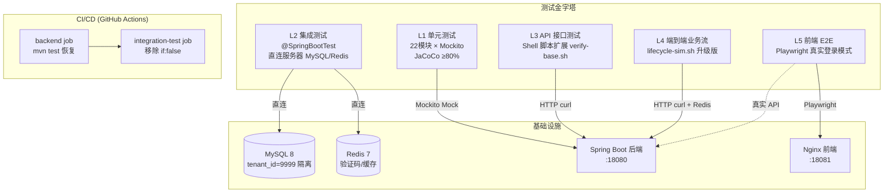
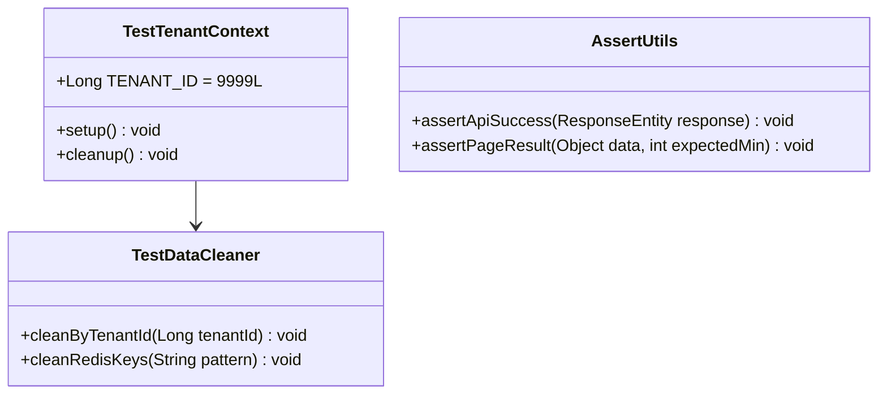
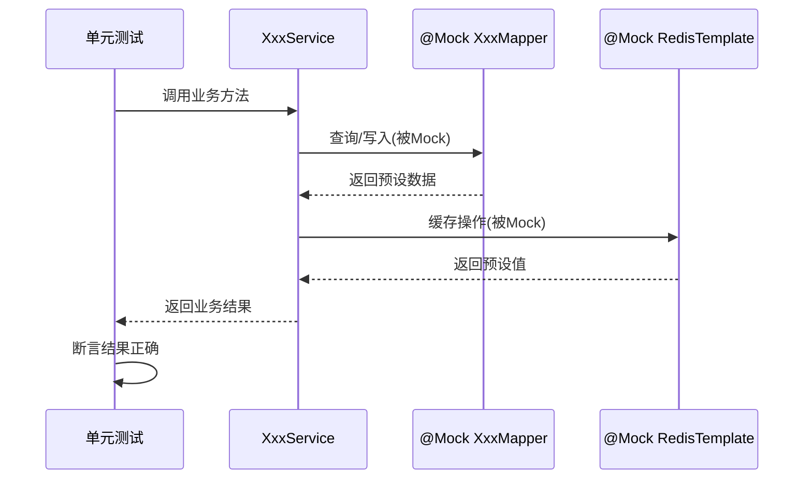
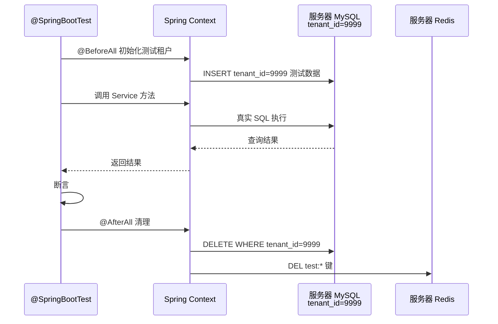

# 设计文档：ZW-Insight 全层次服务器测试体系

## 概述

为 ZW-Insight 工程项目管理平台构建 5 层测试金字塔，覆盖从单元测试到前端 E2E 的完整质量保障体系。所有层级均面向真实服务器（129.204.3.200），禁止假数据和静默 fallback（L1 单元测试 Mockito mock 为唯一例外）。测试数据通过 `tenant_id=9999` 隔离，测试完成后物理 DELETE 清理。

核心技术栈：Spring Boot 3.2.6 + JDK 21 + MyBatis-Plus 3.5.5 + MySQL 8 + Redis 7 + Flowable 7.0.1，共 22 个业务模块。前端基于 Vue 3 + Element Plus + Playwright 1.61。

## 架构



## 组件与接口

### 组件 1：测试基础设施（Test Infrastructure）

**职责**：提供测试租户隔离、数据清理、公共断言工具



### 组件 2：L1 单元测试框架

**职责**：22 模块 Service 层纯逻辑测试，Mockito 模拟 Mapper/外部依赖



### 组件 3：L2 集成测试框架

**职责**：`@SpringBootTest` 直连服务器 MySQL/Redis，验证完整 Spring 容器 + MyBatis-Plus + 真实数据库交互



### 组件 4：L3 API 接口测试

**职责**：基于 `verify-base.sh` 扩展，模块化 Shell 脚本测试所有 REST 端点

### 组件 5：L4 端到端业务流

**职责**：`lifecycle-sim.sh` 升级版，使用测试租户 + 自动清理 + 严格断言

### 组件 6：L5 前端 E2E

**职责**：Playwright 双模式——真实登录模式打服务器验证全流程，Mock 模式做 UI 回归

---

## 数据模型

### 测试租户隔离模型

```java
/**
 * 测试租户常量，所有测试数据使用此 tenant_id 隔离
 * 测试完成后通过 TestDataCleaner 物理 DELETE
 */
public final class TestConstants {
    public static final Long TEST_TENANT_ID = 9999L;
    public static final String TEST_TENANT_NAME = "自动化测试租户";
    public static final String TEST_USER = "test_admin";
    public static final String TEST_PASS = "Test@123456";
    public static final String REDIS_TEST_PREFIX = "test:t9999:";
}
```

### JaCoCo 覆盖率配置模型

```xml
<!-- 父 pom.xml 新增 JaCoCo 插件 -->
<plugin>
    <groupId>org.jacoco</groupId>
    <artifactId>jacoco-maven-plugin</artifactId>
    <version>0.8.12</version>
    <executions>
        <execution>
            <id>prepare-agent</id>
            <goals><goal>prepare-agent</goal></goals>
        </execution>
        <execution>
            <id>report</id>
            <phase>test</phase>
            <goals><goal>report</goal></goals>
        </execution>
        <execution>
            <id>check</id>
            <goals><goal>check</goal></goals>
            <configuration>
                <rules>
                    <rule>
                        <element>BUNDLE</element>
                        <limits>
                            <limit>
                                <counter>LINE</counter>
                                <value>COVEREDRATIO</value>
                                <minimum>0.80</minimum>
                            </limit>
                        </limits>
                    </rule>
                </rules>
            </configuration>
        </execution>
    </executions>
</plugin>
```

### CI 工作流数据模型

```yaml
# integration-test job 恢复结构
integration-test:
  needs: deploy
  # if: false  ← 移除此行
  steps:
    - run-lifecycle-sim
    - collect-results
    - assert-no-failures
```

---

## 算法伪码

### L1 单元测试生成算法

```pascal
ALGORITHM generateUnitTests(modules)
INPUT: modules = 22 个业务模块列表
OUTPUT: 每模块一组 Service 单元测试类

BEGIN
  FOR each module IN modules DO
    serviceClasses ← scanServiceClasses(module)
    
    FOR each serviceClass IN serviceClasses DO
      testClass ← createTestClass(serviceClass.name + "Test")
      
      // 为每个 public 方法生成测试
      FOR each method IN serviceClass.publicMethods DO
        // Mock 所有注入依赖
        dependencies ← method.injectedDependencies
        FOR each dep IN dependencies DO
          mockSetup ← generateMockWhen(dep, method.expectedCalls)
          testClass.addSetup(mockSetup)
        END FOR
        
        // 正常路径测试
        testCase ← generateHappyPathTest(method)
        testClass.addTest(testCase)
        
        // 异常路径测试
        FOR each exception IN method.declaredExceptions DO
          errorTest ← generateExceptionTest(method, exception)
          testClass.addTest(errorTest)
        END FOR
        
        // 边界条件测试
        IF method.hasNullableParams THEN
          nullTest ← generateNullParamTest(method)
          testClass.addTest(nullTest)
        END IF
      END FOR
      
      ASSERT testClass.testCount >= serviceClass.publicMethodCount
    END FOR
  END FOR
END
```

**前置条件**: 所有模块已编译成功，Service 类可被反射扫描
**后置条件**: 每个 Service 类至少有 `publicMethodCount` 个测试方法
**循环不变量**: 已处理模块的测试类均已生成且可编译

### L2 集成测试数据隔离算法

```pascal
ALGORITHM integrationTestLifecycle(testClass)
INPUT: testClass = 一个 @SpringBootTest 测试类
OUTPUT: 测试执行结果（通过/失败）

BEGIN
  // Phase 1: 准备隔离数据
  ASSERT connection.isActive(serverMySQL)
  
  tenantId ← TestConstants.TEST_TENANT_ID  // 9999
  testData ← testClass.prepareTestData(tenantId)
  
  FOR each record IN testData DO
    record.tenantId ← tenantId
    database.insert(record)
  END FOR
  
  ASSERT database.count(WHERE tenant_id = tenantId) = testData.size
  
  // Phase 2: 执行测试
  TRY
    FOR each testMethod IN testClass.testMethods DO
      result ← testMethod.execute()
      ASSERT result.isSuccess
    END FOR
  FINALLY
    // Phase 3: 物理清理（无论成败都执行）
    tables ← testClass.affectedTables
    FOR each table IN tables DO
      database.execute("DELETE FROM " + table + " WHERE tenant_id = ?", tenantId)
    END FOR
    redis.execute("DEL test:t9999:*")
    
    ASSERT database.count(WHERE tenant_id = tenantId) = 0
    ASSERT redis.keys("test:t9999:*").size = 0
  END TRY
END
```

**前置条件**: 服务器 MySQL/Redis 可达，tenant_id=9999 无残留数据
**后置条件**: 测试数据已物理 DELETE，无残留
**循环不变量**: 每次清理后 tenant_id=9999 行数为 0

### L4 lifecycle-sim 升级算法

```pascal
ALGORITHM lifecycleSimV2(config)
INPUT: config = {baseUrl, testTenantId, enableCleanup, strictAssert}
OUTPUT: testReport = {passed, failed, skipped, cleanedRecords}

BEGIN
  // 初始化
  testTenantId ← 9999
  createdIds ← []  // 追踪所有创建的资源 ID
  report ← {passed: 0, failed: 0, skipped: 0}
  
  // 登录（真实验证码流程）
  token ← realLogin(username, password, redisContainer)
  ASSERT token IS NOT EMPTY
  
  // 10 阶段执行
  FOR stage = 1 TO 10 DO
    stageResult ← executeStage(stage, token, testTenantId)
    
    // 严格断言模式
    IF config.strictAssert THEN
      ASSERT stageResult.httpCode IN [200, 201]
      ASSERT stageResult.responseBody.code = 200
      IF stageResult.createdId IS NOT NULL THEN
        createdIds.add(stageResult.createdId)
      END IF
    END IF
    
    IF stageResult.success THEN
      report.passed ← report.passed + 1
    ELSE
      report.failed ← report.failed + 1
      IF config.strictAssert THEN
        BREAK  // 严格模式下失败即停止
      END IF
    END IF
  END FOR
  
  // 自动清理（逆序删除避免外键冲突）
  IF config.enableCleanup THEN
    FOR each id IN reverse(createdIds) DO
      deleteResult ← apiDelete(id, token)
      report.cleanedRecords ← report.cleanedRecords + 1
    END FOR
    
    // 兜底清理：按 tenant_id 清理残留
    dbCleanup("DELETE FROM ... WHERE tenant_id = ?", testTenantId)
  END IF
  
  RETURN report
END
```

**前置条件**: 服务器后端可达，Redis 容器可 exec
**后置条件**: 所有 tenant_id=9999 数据已清理
**循环不变量**: createdIds 追踪了所有已创建资源

---

## 关键函数与正式规约

### Function 1: TestDataCleaner.cleanByTenantId()

```java
/**
 * 物理删除指定租户的所有测试数据
 * 按表依赖拓扑逆序删除，避免外键约束冲突
 */
public void cleanByTenantId(Long tenantId)
```

**前置条件**:
- `tenantId` 必须为 `TestConstants.TEST_TENANT_ID` (9999)，防误删生产数据
- 数据库连接可用

**后置条件**:
- 所有包含 `tenant_id` 列的表中，`tenant_id = 9999` 的行数为 0
- Redis 中 `test:t9999:*` 键全部删除
- 返回已删除行数总计

**循环不变量**: 每删除一张表后，该表 `tenant_id=9999` 计数为 0

### Function 2: IntegrationTestBase.getAuthToken()

```java
/**
 * 通过真实登录接口获取 JWT token
 * 使用 Redis 读取验证码（与 verify-base.sh 同机制）
 */
protected String getAuthToken()
```

**前置条件**:
- 服务器后端 :18080 可达
- Redis 容器可 exec（用于读取验证码）
- 测试用户存在于数据库

**后置条件**:
- 返回有效 JWT token 字符串
- token 可用于后续 API 调用的 Authorization header
- 失败时抛出 `TestAuthenticationException`

### Function 3: ApiTestRunner.assertApiResponse()

```java
/**
 * 断言 API 响应符合预期
 * 验证 HTTP 状态码、业务状态码、数据结构
 */
public void assertApiResponse(HttpResponse response, int expectedHttpCode, String dataPath)
```

**前置条件**:
- `response` 非 null
- `expectedHttpCode` ∈ [200, 201, 204, 400, 401, 403, 404, 500]
- `dataPath` 为 JSON Path 表达式或 null

**后置条件**:
- HTTP 状态码匹配 `expectedHttpCode`
- 响应 body 可解析为 JSON
- 若 `dataPath` 非 null，则该路径存在且值非 null
- 断言失败时抛出 `AssertionError` 含完整上下文信息

---

## 示例用法

### L1 单元测试示例 (Java + Mockito)

```java
@ExtendWith(MockitoExtension.class)
class ProjectServiceTest {

    @Mock
    private ProjectMapper projectMapper;
    @Mock
    private RedisTemplate<String, Object> redisTemplate;
    @InjectMocks
    private ProjectServiceImpl projectService;

    @Test
    @DisplayName("创建项目 - 正常路径")
    void createProject_happyPath() {
        // Given
        ProjectCreateDTO dto = new ProjectCreateDTO();
        dto.setProjectName("测试项目");
        dto.setTenantId(9999L);
        
        when(projectMapper.insert(any())).thenReturn(1);
        
        // When
        Long projectId = projectService.create(dto);
        
        // Then
        assertThat(projectId).isNotNull();
        verify(projectMapper).insert(argThat(entity -> 
            entity.getProjectName().equals("测试项目") &&
            entity.getTenantId().equals(9999L)
        ));
    }

    @Test
    @DisplayName("创建项目 - 名称为空时抛异常")
    void createProject_emptyName_throwsException() {
        ProjectCreateDTO dto = new ProjectCreateDTO();
        dto.setProjectName("");
        
        assertThatThrownBy(() -> projectService.create(dto))
            .isInstanceOf(BusinessException.class)
            .hasMessageContaining("项目名称");
    }
}
```

### L2 集成测试示例 (Java + @SpringBootTest)

```java
@SpringBootTest
@TestPropertySource(properties = {
    "spring.datasource.url=jdbc:mysql://129.204.3.200:3306/zw_insight",
    "spring.redis.host=129.204.3.200"
})
@ActiveProfiles("integration-test")
class ProjectServiceIntegrationTest extends IntegrationTestBase {

    @Autowired
    private ProjectService projectService;
    @Autowired
    private TestDataCleaner cleaner;

    @BeforeAll
    static void setupTenant() {
        // 确保测试租户存在
        ensureTestTenant(TestConstants.TEST_TENANT_ID);
    }

    @AfterAll
    static void cleanup() {
        cleaner.cleanByTenantId(TestConstants.TEST_TENANT_ID);
    }

    @Test
    @DisplayName("项目创建+查询 - 真实数据库往返")
    void createAndQuery_realDatabase() {
        // Given
        ProjectCreateDTO dto = buildTestProject();
        dto.setTenantId(TestConstants.TEST_TENANT_ID);
        
        // When
        Long id = projectService.create(dto);
        ProjectVO result = projectService.getById(id);
        
        // Then
        assertThat(result).isNotNull();
        assertThat(result.getProjectName()).isEqualTo(dto.getProjectName());
        assertThat(result.getTenantId()).isEqualTo(TestConstants.TEST_TENANT_ID);
    }
}
```

### L3 API 接口测试示例 (Shell)

```bash
#!/usr/bin/env bash
# test-project-api.sh — 项目模块 API 接口测试
source "$(dirname "$0")/verify-base.sh"

TESTS_PASSED=0
TESTS_FAILED=0

assert_http() {
  local expected="$1" actual=$(cat /tmp/zwi_last_code)
  if [ "$actual" = "$expected" ]; then
    ((TESTS_PASSED++)); success "$2"
  else
    ((TESTS_FAILED++)); fail "$2 (期望 HTTP $expected, 实际 $actual)"
  fi
}

# 登录
login || { fail "登录失败"; exit 1; }

# 测试：项目列表查询
call GET "/api/v1/project/page?page=1&size=10&tenantId=9999"
assert_http "200" "GET 项目列表"

# 测试：创建项目
call POST "/api/v1/project" '{"projectName":"API测试项目","tenantId":9999,"projectNature":"新建"}'
assert_http "200" "POST 创建项目"
PROJECT_ID=$(cat /tmp/zwi_body | grep -oP '"data"\s*:\s*\K\d+' | head -1)

# 测试：查询项目详情
call GET "/api/v1/project/$PROJECT_ID"
assert_http "200" "GET 项目详情"

# 清理
call DELETE "/api/v1/project/$PROJECT_ID"

# 报告
echo "═══ API 测试报告 ═══"
echo "通过: $TESTS_PASSED  失败: $TESTS_FAILED"
[ "$TESTS_FAILED" -eq 0 ] || exit 1
```

### L4 lifecycle-sim v2 清理逻辑示例 (Shell)

```bash
#!/usr/bin/env bash
# lifecycle-sim-v2 片段 — 自动清理 + 严格断言
TEST_TENANT_ID=9999
CREATED_IDS=()

# 严格断言：非 2xx 即失败
strict_assert() {
  local code=$(cat /tmp/zwi_code)
  if [[ ! "$code" =~ ^2[0-9][0-9]$ ]]; then
    fail "严格断言失败: HTTP $code (接口: $1)"
    cleanup_all
    exit 1
  fi
}

# 自动清理：逆序 DELETE 所有创建的资源
cleanup_all() {
  log "═══ 自动清理（tenant_id=$TEST_TENANT_ID）═══"
  for ((i=${#CREATED_IDS[@]}-1; i>=0; i--)); do
    local entry="${CREATED_IDS[i]}"
    local path="${entry%:*}" id="${entry#*:}"
    curl -s -X DELETE "$BASE$path/$id" \
      -H "Authorization: Bearer $(cat $TOKEN_FILE)" >/dev/null 2>&1
    log "  已清理: $path/$id"
  done
  # 兜底 SQL 清理
  docker exec zwi-mysql mysql -uroot -pzwinsight123 zw_insight \
    -e "DELETE FROM sys_project WHERE tenant_id=$TEST_TENANT_ID;" 2>/dev/null
  log "数据库兜底清理完成"
}

trap cleanup_all EXIT
```

### L5 前端 E2E 真实登录模式示例 (TypeScript + Playwright)

```typescript
// e2e/fixtures/auth-real.setup.ts — 真实登录 setup
import { test as setup, expect } from '@playwright/test'

const SERVER_URL = process.env.E2E_SERVER_URL || 'http://129.204.3.200:18081'
const API_BASE = process.env.E2E_API_BASE || 'http://129.204.3.200:18080'

setup('真实登录：获取 token 并保存 storageState', async ({ page }) => {
  // 1. 导航到登录页
  await page.goto(`${SERVER_URL}/login`)
  await page.waitForSelector('.login-form', { timeout: 15_000 })
  
  // 2. 填写用户名密码
  await page.fill('input[placeholder*="用户名"]', 'admin')
  await page.fill('input[placeholder*="密码"]', '123456')
  
  // 3. 获取验证码图片 UUID（从页面网络请求中截取）
  const captchaResponse = await page.waitForResponse(
    resp => resp.url().includes('/api/v1/captcha/image')
  )
  const captchaData = await captchaResponse.json()
  const uuid = captchaData.data.uuid
  
  // 4. 从服务器 Redis 读取验证码（需 SSH 或 API）
  // 注意：E2E 真实模式需要 captcha-bypass 接口或服务器代理
  // 方案：使用专门的 /api/v1/test/captcha-code/:uuid 测试接口
  const codeResp = await page.request.get(
    `${API_BASE}/api/v1/test/captcha-code/${uuid}`
  )
  const code = (await codeResp.json()).data
  
  // 5. 填写验证码并提交
  await page.fill('input[placeholder*="验证码"]', code)
  await page.click('button:has-text("登录")')
  
  // 6. 等待登录成功跳转
  await page.waitForURL('**/dashboard', { timeout: 15_000 })
  
  // 7. 保存 storageState
  await page.context().storageState({ path: './e2e/.auth/storage-state.json' })
})
```

---

## 正确性属性

*属性是系统在所有合法执行中都应保持为真的特征或行为——本质上是关于系统应做什么的形式化陈述。属性是人类可读规范与机器可验证正确性保证之间的桥梁。*

### Property 1: 数据隔离不变量

*For any* 测试层级（L2/L3/L4/L5）创建的数据记录，其 tenant_id 字段必须等于 9999，确保测试数据与生产数据完全隔离。

**Validates: Requirements 8.1**

### Property 2: 无残留性（数据库 + Redis）

*For any* 测试执行序列（无论成功或失败），执行完毕后数据库中所有包含 tenant_id 列的表中 tenant_id=9999 的行数为 0，且 Redis 中 test:t9999:* 模式匹配的键数量为 0。

**Validates: Requirements 1.2, 3.3, 5.6, 8.2, 8.3**

### Property 3: 清理顺序正确性

*For any* 表依赖图和资源创建序列，TestDataCleaner 的删除顺序满足外键拓扑约束（对于外键 A→B，B 在 A 之后删除），且 Lifecycle_Sim 的资源清理顺序为创建顺序的逆序。

**Validates: Requirements 1.3, 5.4**

### Property 4: 安全护栏——拒绝非测试租户

*For any* 非 9999 的 tenant_id 值（包括 null、负数、0、其他正整数），cleanByTenantId() 必须抛出异常而不执行任何删除操作。

**Validates: Requirements 1.4**

### Property 5: 断言函数正确性

*For any* HTTP 响应（状态码 + JSON body），断言函数应正确判定：状态码为 2xx 且 body.code=200 时通过，否则失败。此属性适用于 AssertUtils、API 测试断言和 Lifecycle_Sim 严格断言。

**Validates: Requirements 1.6, 4.4, 5.2**

### Property 6: 数值计算会计恒等式

*For any* 有效的金额、税率、产值数值组合，业务计算结果必须满足会计恒等式（如：含税金额 = 不含税金额 × (1 + 税率)），且 BigDecimal 精度不丢失。

**Validates: Requirements 2.5**

### Property 7: 测试报告正确性

*For any* 测试执行结果组合，报告应正确聚合统计信息：passed + failed + skipped = total，且当 failed > 0 时退出码非零，failed = 0 时退出码为零。JSON 报告包含所有必需字段。

**Validates: Requirements 4.6, 5.7, 9.4**

### Property 8: 日志脱敏完整性

*For any* 包含敏感信息（密码、JWT token、Redis 密钥）的字符串，经 mask() 函数处理后输出不包含原始敏感值的任何连续子串（≥4 字符）。

**Validates: Requirements 8.6**

### Property 9: 编排脚本层级选择

*For any* --layers 参数值（如 "L1,L3"），run-all-tests.sh 仅执行指定的层级，未指定的层级不被执行；且 --fail-fast 模式下，首个失败层级后停止后续执行。

**Validates: Requirements 9.3, 9.5**

---

## 错误处理

### 场景 1：L2 集成测试连不上服务器数据库

**条件**: MySQL 连接超时或拒绝
**响应**: 测试标记为 `@Disabled("Server unreachable")`，CI 输出明确跳过原因
**恢复**: 检查服务器防火墙 3306 端口开放，确认 Docker 容器 zwi-mysql 运行中

### 场景 2：L4 lifecycle-sim 中途失败

**条件**: 某阶段 API 返回非 2xx
**响应**: 严格模式下立即停止，触发 cleanup_all，记录失败阶段和响应体
**恢复**: trap EXIT 确保无论如何都执行清理，生成详细日志供排查

### 场景 3：L5 Playwright 验证码获取失败

**条件**: 测试专用 captcha-code 接口不可用
**响应**: 退化到 Mock 模式执行 UI 回归测试，CI 报告中标记为「降级运行」
**恢复**: 检查后端是否启用了 `/api/v1/test/captcha-code` 端点（仅 test profile 开放）

### 场景 4：JaCoCo 覆盖率不达标

**条件**: 某模块 Line Coverage < 80%
**响应**: `mvn verify` 阶段构建失败，输出未覆盖方法清单
**恢复**: 补充缺失测试用例，关注复杂分支逻辑

---

## 测试策略

### 单元测试方法 (L1)

- 框架：JUnit 5 + Mockito + AssertJ
- 覆盖目标：每个 Service 类 public 方法至少 1 正常 + 1 异常测试
- 核心模块覆盖率：≥ 80%（project, contract, budget, finance, material, machine, labor, subcontract）
- 执行方式：`mvn test`，Surefire parallel=classes, threadCount=4, forkCount=1C
- 属性测试：jqwik 1.9.1 验证数值计算（金额/税率/产值）

### 集成测试方法 (L2)

- 框架：@SpringBootTest + application-integration-test.yml
- 连接：直连服务器 MySQL 3306 / Redis 6379（通过 SSH 隧道或白名单）
- 隔离：tenant_id=9999，@AfterAll 物理 DELETE
- 执行方式：`mvn verify -Pintegration-test`（独立 Maven Profile）
- 关键场景：CRUD 完整往返、审批流推进、Flowable 流程实例

### API 接口测试方法 (L3)

- 框架：Shell 脚本，source verify-base.sh 复用登录/调用/日志基座
- 覆盖：每模块 CRUD 端点 + 审批接口 + 分页查询
- 断言：HTTP 状态码 + 响应 JSON code 字段 + 日志无异常
- 执行方式：CI 中 `bash keys/test-api-*.sh`

### 端到端业务流方法 (L4)

- 框架：lifecycle-sim-v2.sh
- 改进点：测试租户(9999)、严格断言、自动清理(trap EXIT)、并发安全
- 执行方式：CI integration-test job 中 SSH 到服务器执行
- 输出：结构化 JSON 报告 + 阶段通过/失败统计

### 前端 E2E 方法 (L5)

- 框架：Playwright 1.61（已安装）
- 双模式：
  - **真实模式** (`E2E_MODE=real`)：打服务器 :18081，真实登录，端到端验证
  - **Mock 模式** (`E2E_MODE=mock`)：本地 localhost:3000，保留现有 mock 做 UI 回归
- 执行方式：`npx playwright test --project=e2e-real` / `npx playwright test --project=e2e`

---

## 性能考量

| 层级 | 预期耗时 | 并行策略 | 频率 |
|------|---------|---------|------|
| L1 | < 60s | Surefire parallel=classes, 4线程 | 每次 push |
| L2 | 3-5min | 模块间并行（独立 Spring Context） | 每次 push |
| L3 | 2-3min | 串行（共享 token） | deploy 后 |
| L4 | 5-8min | 串行（业务依赖） | deploy 后 |
| L5 | 3-5min | Playwright workers=4 | nightly / 手动 |

**优化手段**:
- L1/L2 利用 Surefire 并行和 fork 加速
- L2 使用 `@DirtiesContext(classMode=AFTER_CLASS)` 避免频繁重建 Context
- L3/L4 复用 token（verify-base.sh 缓存机制）
- L5 使用 storageState 跳过重复登录

---

## 安全考量

- **凭证隔离**: 测试账号独立于生产账号，密码不硬编码到代码仓库
- **服务器访问**: L2 连服务器数据库通过 SSH 隧道 或 CI 环境变量配置（`secrets.SERVER_HOST`）
- **Redis 直读**: 仅在服务器本地 docker exec，不暴露 Redis 端口到公网
- **测试端点**: `/api/v1/test/*` 仅在 `spring.profiles.active=test` 时激活，生产环境自动禁用
- **Token 缓存**: TOKEN_FILE 权限 600，测试结束后删除
- **脱敏输出**: 所有日志输出经过 mask() 函数处理，不回显明文密码/token

---

## 依赖

### 新增 Maven 依赖

| 依赖 | 版本 | 用途 | 作用域 |
|------|------|------|--------|
| jacoco-maven-plugin | 0.8.12 | 代码覆盖率 | build plugin |
| mockito-core | (spring-boot-starter-test 自带) | L1 Mock | test |
| assertj-core | (spring-boot-starter-test 自带) | 断言库 | test |
| jqwik | 1.9.1 (已有) | 属性测试 | test |
| spring-boot-starter-test | (已有) | 集成测试基础 | test |

### 现有依赖复用

- `@playwright/test` 1.61.1 — 前端 E2E（已安装）
- `fast-check` 4.8.0 — 前端属性测试（已安装）
- `vitest` 4.1.9 — 前端单元测试（已安装）
- Testcontainers BOM 1.19.7 — 已声明（本方案不使用 Testcontainers，直连服务器）

### 外部工具依赖

- Docker CLI（服务器端 `docker exec` 读 Redis）
- SSH（CI 远程执行 L3/L4 脚本）
- curl / jq（Shell 脚本 API 测试）

---

## 文件结构规划

```
zw-insight-server/
├── pom.xml                          # +JaCoCo plugin
├── zw-common/src/test/java/
│   └── com/zwinsight/common/
│       ├── base/IntegrationTestBase.java    # L2 基类
│       ├── base/TestConstants.java          # 测试常量
│       ├── base/TestDataCleaner.java        # 数据清理器
│       └── util/AssertUtils.java            # 公共断言
├── zw-project/src/test/java/
│   └── com/zwinsight/project/
│       ├── service/ProjectServiceTest.java  # L1
│       └── integration/ProjectIntegrationTest.java  # L2
├── [其余20模块同结构]
└── src/test/resources/
    └── application-integration-test.yml     # L2 配置

keys/
├── verify-base.sh                  # (已有) L3 基座
├── test-api-project.sh             # L3 项目模块
├── test-api-contract.sh            # L3 合同模块
├── test-api-finance.sh             # L3 财务模块
├── [其余模块 test-api-*.sh]
├── lifecycle-sim-v2.sh             # L4 升级版
└── lifecycle-sim.sh                # (保留) 原版

zw-insight-web/
├── playwright.config.ts            # 修改：新增 e2e-real project
├── e2e/
│   ├── fixtures/
│   │   ├── auth.setup.ts           # (保留) Mock 模式 auth
│   │   ├── auth-real.setup.ts      # (新增) 真实登录 auth
│   │   └── mock-api.ts            # (保留) Mock 工具
│   └── tests/
│       ├── *.spec.ts              # (保留) Mock 模式测试
│       └── real/                   # (新增) 真实模式测试
│           ├── login.spec.ts
│           ├── project-crud.spec.ts
│           └── workflow.spec.ts

.github/workflows/
└── deploy.yml                      # 修改：恢复 mvn test + integration-test job
```
