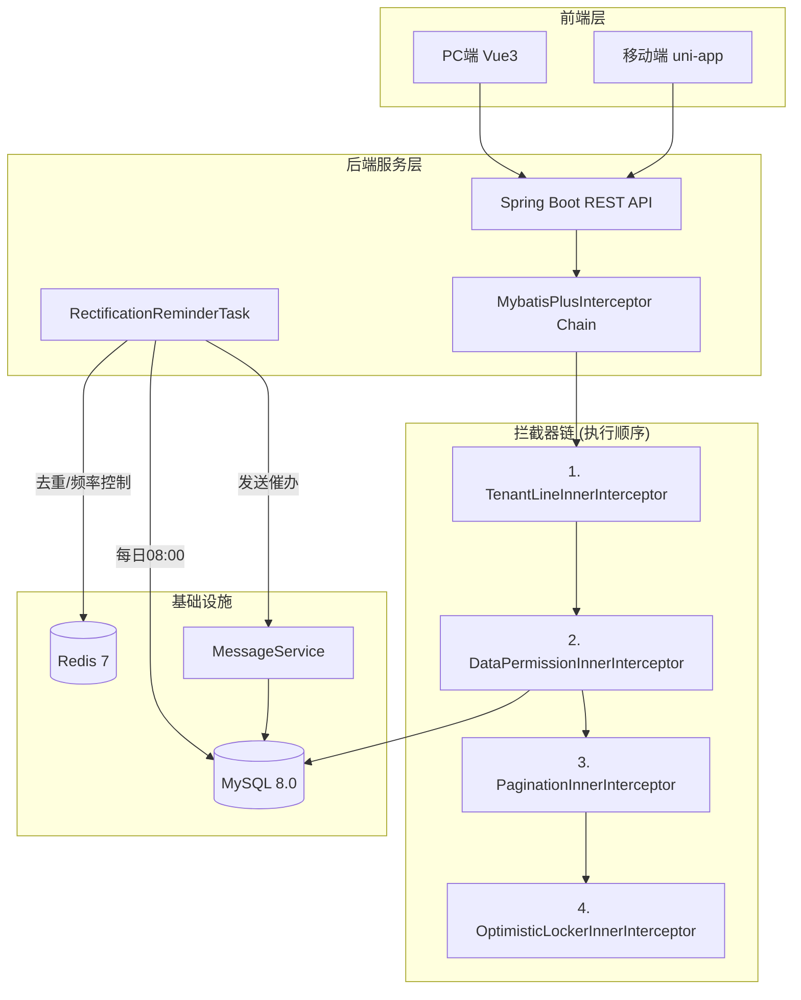
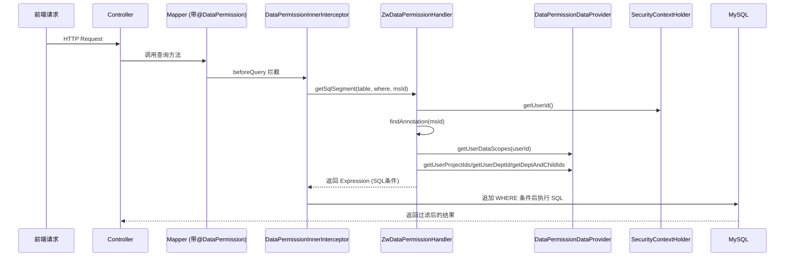
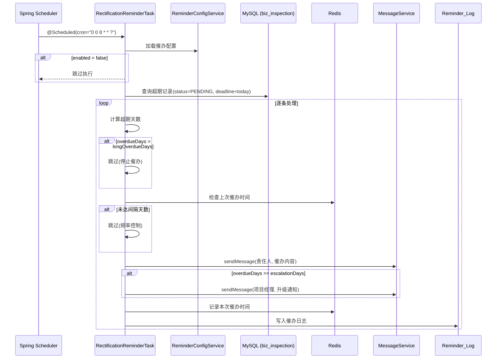

# Design Document: P0 数据权限隔离 & 整改超期催办

## Overview

本设计文档覆盖 ZW-Insight 平台两个 P0 级别核心能力：

1. **数据权限隔离**：基于 MyBatis-Plus `DataPermissionInterceptor` 实现行级数据过滤，在现有租户隔离之上按角色配置的数据范围（ALL / DEPT_AND_CHILDREN / DEPT / PROJECT / SELF）自动注入 SQL WHERE 条件。
2. **整改超期催办**：定时任务每日 08:00 扫描超期未完成整改记录，通过已有 `MessageService` 站内消息服务发送催办通知，支持分级升级、频率控制和催办追溯。

### 设计目标

- 数据权限对业务代码零侵入（注解声明 + 拦截器自动处理）
- 与现有 `TenantLineInnerInterceptor` 协同，叠加而非替代
- 催办任务参考现有 `RetentionWarningTask` 模式，保持架构一致性
- 利用现有 Redis 去重机制 + `MessageService` 通知能力，不引入新中间件

---

## Architecture

### High-Level Architecture



### Low-Level Architecture — 数据权限



### Low-Level Architecture — 整改超期催办



---

## Components and Interfaces

### 模块一：数据权限隔离

#### 1. 注解层（已存在，需补充完善）

| 组件 | 位置 | 职责 |
|------|------|------|
| `@DataPermission` | `zw-common/datapermission` | 声明 Mapper 方法需要数据权限过滤 |
| `@DataColumn` | `zw-common/datapermission` | 指定表别名和过滤列映射 |
| `DataScopeEnum` | `zw-common/datapermission` | 数据范围枚举（5种） |

#### 2. 拦截器层（已存在骨架，需完善实现）

| 组件 | 位置 | 职责 |
|------|------|------|
| `DataPermissionInnerInterceptor` | `zw-common/datapermission` | 继承 MyBatis-Plus `DataPermissionInterceptor`，挂载自定义 handler |
| `ZwDataPermissionHandler` | `zw-common/datapermission` | 实现 `MultiDataPermissionHandler`，生成 SQL 条件 |
| `DataPermissionDataProvider` | `zw-common/datapermission` | 数据查询接口（获取用户范围信息） |

#### 3. 数据提供层（需新建实现类）

| 组件 | 位置 | 职责 |
|------|------|------|
| `DataPermissionDataProviderImpl` | `zw-system/service` | 实现 `DataPermissionDataProvider`，查询角色 dataScope、用户项目列表、部门树等 |

#### 4. 配置管理层

| 组件 | 位置 | 职责 |
|------|------|------|
| `SysRoleController` (已有) | `zw-system/controller` | 新增 dataScope 配置接口 |
| `DataScopeUpdateRequest` (已有) | `zw-system/domain/dto` | 数据范围更新 DTO |

#### 5. 前端权限层（已有基础，需补充）

| 组件 | 位置 | 职责 |
|------|------|------|
| `v-permission` 指令 | `zw-insight-web/directives` | 按钮级权限控制 |
| `permission.ts` | `zw-insight-web/router` | 动态路由守卫 + 403 跳转 |

---

### 模块二：整改超期催办

#### 1. 定时任务层

| 组件 | 位置 | 职责 |
|------|------|------|
| `RectificationReminderTask` | `zw-site/task` | 定时扫描超期整改，发送催办通知 |

#### 2. 配置管理层

| 组件 | 位置 | 职责 |
|------|------|------|
| `BizReminderConfig` | `zw-site/domain` | 催办配置实体 |
| `ReminderConfigService` | `zw-site/service` | 催办配置 CRUD |
| `ReminderConfigController` | `zw-site/controller` | 催办配置管理 API |

#### 3. 催办日志层

| 组件 | 位置 | 职责 |
|------|------|------|
| `BizReminderLog` | `zw-site/domain` | 催办日志实体 |
| `ReminderLogService` | `zw-site/service` | 催办日志查询/统计 |
| `ReminderLogController` | `zw-site/controller` | 催办历史/统计 API |

#### 4. 去重与频率控制层

| 组件 | 位置 | 职责 |
|------|------|------|
| `ReminderDeduplicationService` | `zw-site/service` | Redis 去重 + DB 降级逻辑 |

---

### 关键接口定义

#### DataPermissionDataProvider（已存在）

```java
public interface DataPermissionDataProvider {
    List<String> getUserDataScopes(Long userId);
    List<Long> getUserProjectIds(Long userId);
    Long getUserDeptId(Long userId);
    List<Long> getDeptAndChildIds(Long deptId);
}
```

#### ReminderConfigService

```java
public interface ReminderConfigService {
    BizReminderConfig getConfig(Long tenantId);
    void updateConfig(Long tenantId, ReminderConfigUpdateRequest request);
}
```

#### ReminderDeduplicationService

```java
public interface ReminderDeduplicationService {
    /**
     * 判断是否应该发送催办
     * @return true-应发送, false-应跳过
     */
    boolean shouldSend(Long inspectionId, LocalDate today, int intervalDays);
    
    /** 标记已发送 */
    void markSent(Long inspectionId, LocalDate today);
    
    /** 清除催办标记（整改完成时调用） */
    void clearMarks(Long inspectionId);
}
```

---

## Data Models

### 已有表（需新增字段）

#### sys_role（角色表 — 新增 data_scope 字段）

```sql
ALTER TABLE sys_role ADD COLUMN data_scope VARCHAR(30) NOT NULL DEFAULT 'SELF' 
    COMMENT '数据范围(ALL/DEPT_AND_CHILDREN/DEPT/PROJECT/SELF)';
```

### 新建表

#### biz_reminder_config（催办配置表）

```sql
CREATE TABLE biz_reminder_config (
    id BIGINT PRIMARY KEY AUTO_INCREMENT,
    tenant_id BIGINT NOT NULL COMMENT '租户ID',
    interval_days INT NOT NULL DEFAULT 3 COMMENT '催办间隔天数(1-30)',
    escalation_days INT NOT NULL DEFAULT 7 COMMENT '升级通知阈值天数',
    long_overdue_days INT NOT NULL DEFAULT 30 COMMENT '长期超期停止催办天数',
    enabled TINYINT(1) NOT NULL DEFAULT 1 COMMENT '是否启用(0-停用/1-启用)',
    created_at DATETIME NOT NULL DEFAULT CURRENT_TIMESTAMP,
    updated_at DATETIME NOT NULL DEFAULT CURRENT_TIMESTAMP ON UPDATE CURRENT_TIMESTAMP,
    UNIQUE KEY uk_tenant (tenant_id)
) COMMENT '整改催办配置表';
```

#### biz_reminder_log（催办日志表）

```sql
CREATE TABLE biz_reminder_log (
    id BIGINT PRIMARY KEY AUTO_INCREMENT,
    tenant_id BIGINT NOT NULL COMMENT '租户ID',
    inspection_id BIGINT NOT NULL COMMENT '检查记录ID(biz_inspection.id)',
    receiver_id BIGINT NOT NULL COMMENT '接收人ID',
    reminder_level VARCHAR(20) NOT NULL COMMENT '催办级别(NORMAL/ESCALATED)',
    send_status VARCHAR(20) NOT NULL COMMENT '发送状态(SENT/FAILED)',
    overdue_days INT NOT NULL COMMENT '超期天数',
    sent_at DATETIME COMMENT '发送时间',
    created_at DATETIME NOT NULL DEFAULT CURRENT_TIMESTAMP,
    INDEX idx_inspection (inspection_id),
    INDEX idx_receiver (receiver_id),
    INDEX idx_tenant_created (tenant_id, created_at)
) COMMENT '整改催办日志表';
```

### 实体类定义

#### BizReminderConfig

```java
@Data
@EqualsAndHashCode(callSuper = true)
@TableName("biz_reminder_config")
public class BizReminderConfig extends BaseEntity {
    private Long tenantId;
    
    @Range(min = 1, max = 30, message = "催办间隔天数必须在1-30之间")
    private Integer intervalDays;
    
    private Integer escalationDays;
    private Integer longOverdueDays;
    private Boolean enabled;
}
```

#### BizReminderLog

```java
@Data
@EqualsAndHashCode(callSuper = true)
@TableName("biz_reminder_log")
public class BizReminderLog extends BaseEntity {
    private Long tenantId;
    private Long inspectionId;
    private Long receiverId;
    private String reminderLevel;  // NORMAL / ESCALATED
    private String sendStatus;     // SENT / FAILED
    private Integer overdueDays;
    private LocalDateTime sentAt;
}
```

### Redis Key 设计

| Key Pattern | 用途 | TTL |
|-------------|------|-----|
| `rectification:reminder:last:{inspectionId}` | 记录上次催办日期 | 90天（超过 longOverdueDays 自然过期） |
| `rectification:reminder:lock` | 分布式锁（防止任务并发执行） | 30分钟 |

---

## Correctness Properties

*A property is a characteristic or behavior that should hold true across all valid executions of a system — essentially, a formal statement about what the system should do. Properties serve as the bridge between human-readable specifications and machine-verifiable correctness guarantees.*

### Property 1: DataScope 枚举值校验

*For any* 字符串 s，将其作为 dataScope 保存时，当且仅当 s 属于 {ALL, DEPT_AND_CHILDREN, DEPT, PROJECT, SELF} 之一时保存成功；否则系统应拒绝并返回校验错误。

**Validates: Requirements 1.1, 1.5**

### Property 2: DataScope 配置立即生效

*For any* 合法 DataScopeEnum 值 v 和角色 r，将 r 的 dataScope 设为 v 后，后续对 getUserDataScopes 的调用应返回包含 v 的列表。

**Validates: Requirements 1.2**

### Property 3: SQL 条件生成正确性

*For any* DataScopeEnum 值和已标注 @DataPermission 的 Mapper 方法，ZwDataPermissionHandler.getSqlSegment 应：
- ALL → 返回 null（不追加条件）
- DEPT → 生成 `dept_column = userDeptId`
- DEPT_AND_CHILDREN → 生成 `dept_column IN (deptId + 所有子部门ID)`
- PROJECT → 生成 `project_column IN (用户项目ID列表)`
- SELF → 生成 `user_column = userId`

**Validates: Requirements 2.1, 2.2, 2.3, 2.4, 2.5, 2.6**

### Property 4: 未注解方法不过滤

*For any* 未标注 @DataPermission 注解的 Mapper 方法，ZwDataPermissionHandler.getSqlSegment 应返回 null，不追加任何数据权限条件。

**Validates: Requirements 3.4**

### Property 5: 租户条件与数据权限 AND 组合

*For any* 同时触发租户过滤和数据权限过滤的查询，最终 SQL 中 tenant_id 条件和数据权限条件通过 AND 逻辑连接。

**Validates: Requirements 5.2**

### Property 6: 超期扫描只返回符合条件的记录

*For any* 检查记录集合，超期扫描应仅返回满足 `rectificationStatus = PENDING AND rectificationDeadline < today` 的记录。状态为 SUBMITTED、APPROVED 或 REJECTED 的记录不在扫描结果中。

**Validates: Requirements 6.2, 9.4**

### Property 7: 超期天数计算正确性

*For any* 超期记录的 rectificationDeadline（早于 today 的日期），计算出的超期天数应等于 `ChronoUnit.DAYS.between(rectificationDeadline, today)`。

**Validates: Requirements 6.3**

### Property 8: 催办通知内容完整性

*For any* 超期整改记录（含随机项目名称、检查类型、问题描述、整改期限和超期天数），生成的催办消息内容应包含上述全部五项信息。

**Validates: Requirements 7.2**

### Property 9: 升级通知阈值正确触发

*For any* 超期记录，当 overdueDays >= escalationDays 时，应触发项目经理升级通知；当 overdueDays < escalationDays 时，不应触发升级通知。

**Validates: Requirements 7.3**

### Property 10: 长期超期停止催办

*For any* 超期记录，当 overdueDays > longOverdueDays 时，系统不应发送任何催办通知。

**Validates: Requirements 7.4**

### Property 11: intervalDays 参数校验

*For any* 整数 n，当 1 ≤ n ≤ 30 时 intervalDays 校验通过；当 n < 1 或 n > 30 时校验失败并返回错误。

**Validates: Requirements 8.1, 8.6**

### Property 12: 催办频率控制

*For any* 整改记录 和 lastSentDate，当 `today - lastSentDate < intervalDays` 时，shouldSend 返回 false（跳过）；当 `today - lastSentDate >= intervalDays` 时返回 true（发送）。

**Validates: Requirements 9.2**

### Property 13: 催办日志完整性

*For any* 成功发送的催办通知，系统应创建一条 ReminderLog 记录，且该记录的 inspectionId、receiverId、reminderLevel、sendStatus、sentAt 字段均非空。

**Validates: Requirements 10.1, 10.2**

### Property 14: 催办日志时间排序

*For any* 某整改记录的催办日志列表查询结果，返回的记录应按 sentAt 降序排列。

**Validates: Requirements 10.3**

---

## Error Handling

### 数据权限模块

| 场景 | 处理策略 |
|------|----------|
| SecurityContextHolder.getUserId() 返回 null（未登录/系统调用） | 对已标注 @DataPermission 的方法抛出 `DataPermissionException`；对未标注的方法正常执行 |
| DataPermissionDataProvider 查询异常 | 记录 ERROR 日志，降级为 SELF 范围（最小权限原则） |
| 用户无关联角色 | 默认使用 SELF 范围 |
| 用户未分配部门且 scope 为 DEPT/DEPT_AND_CHILDREN | 降级为 SELF 范围 |
| 用户未参与任何项目且 scope 为 PROJECT | 生成 `1=0` 条件（无数据可见） |

### 整改催办模块

| 场景 | 处理策略 |
|------|----------|
| 单条记录处理异常 | 记录 ERROR 日志 + 异常堆栈，继续处理后续记录 |
| MessageService 发送失败 | 记录 ReminderLog.sendStatus = FAILED，不重试（下次定时任务自然重试） |
| Redis 不可用 | 降级为查询 biz_reminder_log 表的最新记录时间作为 lastSentDate |
| 催办配置不存在 | 使用默认值（intervalDays=3, escalationDays=7, longOverdueDays=30, enabled=true） |
| 定时任务并发执行（多实例部署） | 使用 Redis 分布式锁，获取锁失败则跳过本次执行 |

---

## Testing Strategy

### 测试方法

本功能采用**双重测试策略**：

1. **属性测试（Property-Based Testing）**：使用 [jqwik](https://jqwik.net/) 库（项目已引入），对核心业务逻辑编写属性测试，每个属性最少运行 100 次迭代
2. **单元测试**：针对具体示例和边界情况编写 JUnit 5 测试
3. **集成测试**：验证组件间协作（拦截器 + 数据库、定时任务 + MessageService）

### 属性测试计划

| 属性编号 | 测试类 | 库 | 最少迭代 |
|---------|--------|-----|---------|
| Property 1 | `DataScopeValidationPropertyTest` | jqwik | 100 |
| Property 3 | `SqlConditionGenerationPropertyTest` | jqwik | 100 |
| Property 6 | `OverdueScanFilterPropertyTest` | jqwik | 100 |
| Property 7 | `OverdueDaysCalculationPropertyTest` | jqwik | 100 |
| Property 8 | `ReminderContentPropertyTest` | jqwik | 100 |
| Property 9 | `EscalationThresholdPropertyTest` | jqwik | 100 |
| Property 10 | `LongOverdueStopPropertyTest` | jqwik | 100 |
| Property 11 | `IntervalDaysValidationPropertyTest` | jqwik | 100 |
| Property 12 | `FrequencyControlPropertyTest` | jqwik | 100 |
| Property 13 | `ReminderLogCompletenessPropertyTest` | jqwik | 100 |
| Property 14 | `ReminderLogOrderingPropertyTest` | jqwik | 100 |

每个属性测试类需包含注释引用对应设计文档属性：
```java
// Feature: p0-data-permission-overdue, Property 3: SQL 条件生成正确性
```

### 单元测试计划

- `ZwDataPermissionHandlerTest`：注解查找、缓存命中、别名匹配
- `DataPermissionDataProviderImplTest`：Mock 数据库验证 SQL 查询正确性
- `RectificationReminderTaskTest`：各级别判定逻辑、异常处理
- `ReminderDeduplicationServiceTest`：Redis 去重 + DB 降级
- `ReminderConfigServiceTest`：配置 CRUD + 校验

### 集成测试计划

- `DataPermissionIntegrationTest`：真实数据库 + 拦截器链验证 SQL 输出
- `ReminderTaskIntegrationTest`：定时任务 + MessageService + Redis 全链路验证
- 前端：v-permission 指令单元测试 + 路由守卫 E2E 测试
