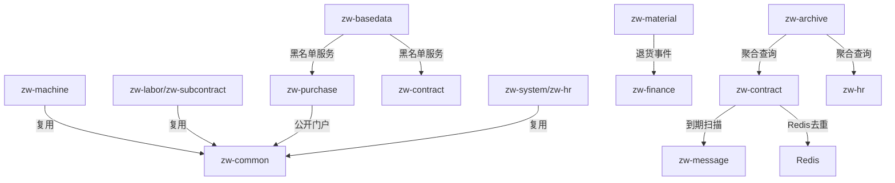

# P1 业务完善功能 - 技术设计文档

## Overview

本文档为 ZW-Insight 平台 8 项 P1 级别业务完善功能的技术设计方案。这些功能在现有系统架构基础上进行扩展，复用已有的 Controller/Service/Mapper 分层模式、Flowable 审批集成、Redis 去重机制和领域事件驱动的数据回写模式。

### 功能范围

| # | 功能 | 所属模块 | 关键技术点 |
|---|------|----------|------------|
| 1 | 机械工作量结算（按项目汇总） | zw-machine | 已有实现，需补充审批通过后状态回写 |
| 2 | 分包结算明细表 | zw-labor（或 zw-subcontract） | 新增明细表 + Excel 导出 |
| 3 | 供应商黑名单自动拦截 | zw-basedata + zw-purchase + zw-contract | 拦截器模式 |
| 4 | 人事花名册统计 | zw-system（或 zw-hr） | 聚合统计查询 |
| 5 | 合同到期提醒 | zw-contract | 定时任务 + Redis 去重 |
| 6 | 公开报价查询（免登录） | zw-purchase（portal） | 免认证接口 + 短信验证 |
| 7 | 退货退款关联 | zw-material + zw-finance | 事件驱动自动生成 |
| 8 | 档案补全 | zw-archive | 只读聚合查询 |

---

## Architecture

### 整体架构复用

本批功能完全复用现有系统架构，不引入新的基础设施组件：

```
┌─────────────────────────────────────────────────────────────────┐
│  PC Web (Vue3)  │  uni-app (Mobile)  │  供应商门户 (Vue3 SPA)   │
└────────┬────────┴────────┬───────────┴────────┬─────────────────┘
         │                 │                    │
         └─────────────────┼────────────────────┘
                           │ HTTPS
┌──────────────────────────┼──────────────────────────────────────┐
│                     Nginx 反向代理                                │
│  /api/v1/**  → 需认证   │  /api/v1/supplier-portal/public/** → 免认证 │
└──────────────────────────┼──────────────────────────────────────┘
                           │
┌──────────────────────────┼──────────────────────────────────────┐
│               Spring Boot 单体应用                                │
│                                                                  │
│  ┌───────────────────────────────────────────────────────────┐  │
│  │  Security Filter Chain                                     │  │
│  │  - /api/v1/supplier-portal/public/** → permitAll          │  │
│  │  - /api/v1/** → authenticated                             │  │
│  └───────────────────────────────────────────────────────────┘  │
│                                                                  │
│  ┌──── 新增/修改组件 ────────────────────────────────────────┐  │
│  │  • ContractExpiryTask (定时任务)                           │  │
│  │  • SupplierBlacklistInterceptor (合同保存拦截)             │  │
│  │  • MaterialRefundEventListener (退货→退款事件)             │  │
│  │  • PublicInquiryController (免登询价)                      │  │
│  │  • HrStatisticsService (人事统计)                          │  │
│  │  • SubcontractSettlementDetailService (分包明细)           │  │
│  │  • ArchiveService 扩展 (档案补全)                          │  │
│  └───────────────────────────────────────────────────────────┘  │
└──────────────────────────────────────────────────────────────────┘
         │            │           │
    ┌────┴────┐  ┌───┴───┐  ┌───┴───┐
    │  MySQL  │  │ Redis │  │ MinIO │
    └─────────┘  └───────┘  └───────┘
```

### 模块依赖关系



---

## Components and Interfaces

### 功能 1：机械工作量结算（按项目汇总）

**现状分析：** 已有 `MachineSettlementController`、`MachineWorkSettlementService`、`BizMachineWorkSettlement`、`BizMachineWorkSettlementDetail` 实体和完整的创建/审批流程。需要补充：
- 审批通过后将关联工作日志状态更新为"已结算"
- 创建时排除已被其他结算单包含的工作日志

**修改点：**

```java
// MachineWorkSettlementService.java - 补充审批通过事件监听
@EventListener
@Transactional(rollbackFor = Exception.class)
public void onSettlementApproved(WorkflowApprovedEvent event) {
    if (!"MACHINE_WORK_SETTLEMENT".equals(event.getBusinessType())) return;
    
    Long settlementId = event.getBusinessId();
    BizMachineWorkSettlement settlement = getSettlementById(settlementId);
    settlement.setStatus(2); // 已审批
    settlementMapper.updateById(settlement);
    
    // 回写工作日志状态为"已结算"
    List<BizMachineWorkSettlementDetail> details = detailMapper.selectList(
        new LambdaQueryWrapper<BizMachineWorkSettlementDetail>()
            .eq(BizMachineWorkSettlementDetail::getSettlementId, settlementId));
    
    List<Long> allWorkLogIds = details.stream()
        .flatMap(d -> d.getWorkLogIds().stream())
        .collect(Collectors.toList());
    
    if (!allWorkLogIds.isEmpty()) {
        workLogMapper.batchUpdateStatus(allWorkLogIds, "SETTLED");
    }
}
```

```java
// createSettlement 中排除已结算日志 - 在查询工作日志时增加过滤
logWrapper.eq(BizMachineWorkLog::getProjectId, projectId)
    .ge(BizMachineWorkLog::getWorkDate, periodStart)
    .le(BizMachineWorkLog::getWorkDate, periodEnd)
    .ne(BizMachineWorkLog::getStatus, "SETTLED"); // 排除已结算
```

**接口（已有）：**

| 方法 | 路径 | 说明 |
|------|------|------|
| POST | `/api/v1/machine/settlement` | 创建结算单 |
| POST | `/api/v1/machine/settlement/{id}/submit` | 提交审批 |
| GET | `/api/v1/machine/settlement` | 分页列表 |
| GET | `/api/v1/machine/settlement/{id}` | 详情 |
| GET | `/api/v1/machine/settlement/{id}/export` | 导出Excel |

---

### 功能 2：分包结算明细表

**设计方案：** 在 `zw-labor`（或 `zw-subcontract`）模块中新增分包结算明细实体和服务。

**新增组件：**

- `BizSubcontractSettlementDetail` - 分包结算明细实体
- `SubcontractSettlementDetailMapper` - 数据访问
- `SubcontractSettlementService` - 结算服务（含明细管理）
- `SubcontractSettlementController` - REST接口

```java
/**
 * 分包结算明细行
 */
@Data
@TableName("biz_subcontract_settlement_detail")
public class BizSubcontractSettlementDetail implements Serializable {
    @TableId(type = IdType.ASSIGN_ID)
    private Long id;
    private Long tenantId;
    private Long settlementId;      // 关联结算单ID
    private String itemName;         // 工程项名称
    private String unit;             // 计量单位
    private BigDecimal quantity;     // 本次结算数量
    private BigDecimal unitPrice;    // 单价
    private BigDecimal amount;       // 本次结算金额 (quantity × unitPrice)
    private String remark;
    private Integer sortOrder;
    private LocalDateTime createdAt;
}
```

**接口：**

| 方法 | 路径 | 说明 |
|------|------|------|
| POST | `/api/v1/subcontract/settlement` | 创建分包结算单（含明细行） |
| PUT | `/api/v1/subcontract/settlement/{id}` | 编辑结算单及明细 |
| GET | `/api/v1/subcontract/settlement` | 分页列表 |
| GET | `/api/v1/subcontract/settlement/{id}` | 详情（含明细） |
| POST | `/api/v1/subcontract/settlement/{id}/submit` | 提交审批 |
| GET | `/api/v1/subcontract/settlement/{id}/export` | 导出 Excel |

**金额计算逻辑：**

```java
@Service
@RequiredArgsConstructor
public class SubcontractSettlementService {

    public Long createSettlement(SubcontractSettlementCreateRequest request) {
        // 1. 创建结算单主表
        BizSubcontractSettlement settlement = new BizSubcontractSettlement();
        settlement.setContractId(request.getContractId());
        settlement.setProjectId(request.getProjectId());
        settlement.setSettlementCode(serialNumberService.generate("SUBCONTRACT_SETTLEMENT", tenantId));
        settlement.setStatus("DRAFT");
        
        // 2. 保存明细行并计算总金额
        BigDecimal totalAmount = BigDecimal.ZERO;
        for (SubcontractSettlementDetailDTO item : request.getDetails()) {
            BizSubcontractSettlementDetail detail = new BizSubcontractSettlementDetail();
            detail.setSettlementId(settlement.getId());
            detail.setItemName(item.getItemName());
            detail.setUnit(item.getUnit());
            detail.setQuantity(item.getQuantity());
            detail.setUnitPrice(item.getUnitPrice());
            // 行金额 = 数量 × 单价
            BigDecimal lineAmount = item.getQuantity()
                .multiply(item.getUnitPrice())
                .setScale(2, RoundingMode.HALF_UP);
            detail.setAmount(lineAmount);
            totalAmount = totalAmount.add(lineAmount);
            detailMapper.insert(detail);
        }
        
        // 3. 更新总金额
        settlement.setTotalAmount(totalAmount);
        settlementMapper.updateById(settlement);
        return settlement.getId();
    }
}
```

---

### 功能 3：供应商黑名单自动拦截

**现状分析：** 已有 `SupplierBlacklistService.isBlacklisted(supplierId)` 方法。需要在合同保存时调用拦截。

**设计方案：** 采用 AOP 切面 + 自定义注解方式实现拦截，复用已有的 `SupplierBlacklistService`。

```java
/**
 * 供应商黑名单校验注解
 */
@Target(ElementType.METHOD)
@Retention(RetentionPolicy.RUNTIME)
public @interface BlacklistCheck {
}

/**
 * 黑名单拦截切面
 */
@Aspect
@Component
@RequiredArgsConstructor
public class SupplierBlacklistAspect {

    private final SupplierBlacklistService blacklistService;

    @Before("@annotation(blacklistCheck)")
    public void checkBlacklist(JoinPoint joinPoint, BlacklistCheck blacklistCheck) {
        // 从方法参数中提取 supplierId
        Object[] args = joinPoint.getArgs();
        Long supplierId = extractSupplierId(args);
        if (supplierId == null) return;
        
        if (blacklistService.isBlacklisted(supplierId)) {
            String reason = blacklistService.getBlacklistReason(supplierId);
            throw new BusinessException(
                String.format("该供应商已被列入黑名单（原因：%s），禁止签约", reason));
        }
    }
}
```

**SupplierBlacklistService 扩展：**

```java
// 新增方法：获取黑名单原因
public String getBlacklistReason(Long supplierId) {
    BizSupplierBlacklist record = blacklistMapper.selectOne(
        new LambdaQueryWrapper<BizSupplierBlacklist>()
            .eq(BizSupplierBlacklist::getSupplierId, supplierId)
            .eq(BizSupplierBlacklist::getStatus, 1)
            .last("LIMIT 1"));
    return record != null ? record.getReason() : "未知原因";
}
```

**前端实时查询接口（已有）：**

| 方法 | 路径 | 说明 |
|------|------|------|
| GET | `/api/v1/basedata/supplier/blacklist/check/{supplierId}` | 查询是否在黑名单 |

---

### 功能 4：人事花名册统计

**设计方案：** 在 `zw-system`（或 `zw-hr`）模块中新增统计服务，基于 `sys_user` 表和入离职申请表聚合查询。

**新增组件：**

- `HrStatisticsController` - 统计接口
- `HrStatisticsService` - 统计逻辑
- `HrStatisticsVO` - 统计结果VO

```java
@Data
public class HrStatisticsVO {
    private Long totalActive;              // 在职总人数
    private Long monthlyEntry;             // 本月入职人数
    private Long monthlyResign;            // 本月离职人数
    private List<DeptStatItem> byDept;     // 按部门统计
    private List<PostStatItem> byPost;     // 按岗位统计
    private List<SeniorityStatItem> bySeniority; // 按工龄段统计
    private List<TrendStatItem> monthlyTrend;    // 近12个月入离职趋势
}

@Data
public static class DeptStatItem {
    private Long deptId;
    private String deptName;
    private Long count;
}

@Data
public static class SeniorityStatItem {
    private String range;  // "0-1年", "1-3年", "3-5年", "5年以上"
    private Long count;
}
```

**接口：**

| 方法 | 路径 | 说明 |
|------|------|------|
| GET | `/api/v1/hr/statistics/overview` | 获取人事统计总览数据 |

**SQL 示例（按工龄段统计）：**

```sql
SELECT 
  CASE 
    WHEN TIMESTAMPDIFF(YEAR, entry_date, CURDATE()) < 1 THEN '0-1年'
    WHEN TIMESTAMPDIFF(YEAR, entry_date, CURDATE()) < 3 THEN '1-3年'
    WHEN TIMESTAMPDIFF(YEAR, entry_date, CURDATE()) < 5 THEN '3-5年'
    ELSE '5年以上'
  END AS seniority_range,
  COUNT(*) AS count
FROM sys_user
WHERE status = 1 AND tenant_id = #{tenantId}
GROUP BY seniority_range;
```

---

### 功能 5：合同到期提醒

**设计方案：** 参照现有 `RetentionWarningTask` 模式，新增 `ContractExpiryTask` 定时任务。使用 Redis 分布式锁确保集群环境只执行一次，使用 Redis Key 实现同级别去重。

**新增组件：**

- `ContractExpiryTask` - 定时任务
- `ContractExpiryService` - 到期判断逻辑（便于单元测试）

```java
@Component
@RequiredArgsConstructor
public class ContractExpiryTask {

    private final ContractExpiryService expiryService;
    private final RedisUtils redisUtils;
    private static final String LOCK_KEY = "task:contract-expiry:lock";

    public static final String LEVEL_UPCOMING = "UPCOMING"; // 30天内
    public static final String LEVEL_URGENT = "URGENT";     // 7天内

    @Scheduled(cron = "0 0 9 * * ?")
    public void execute() {
        // Redis 分布式锁
        if (!redisUtils.tryLock(LOCK_KEY, 300)) return;
        try {
            LocalDate today = LocalDate.now();
            LocalDate thirtyDaysLater = today.plusDays(30);
            
            // 扫描所有类型合同
            List<ContractExpiryDTO> contracts = expiryService.queryExpiringContracts(today, thirtyDaysLater);
            
            for (ContractExpiryDTO contract : contracts) {
                processContract(contract, today);
            }
        } finally {
            redisUtils.unlock(LOCK_KEY);
        }
    }

    private void processContract(ContractExpiryDTO contract, LocalDate today) {
        // 跳过已终止/已结算的合同
        if (expiryService.shouldSkip(contract)) return;
        
        String level = expiryService.determineLevel(contract.getEndDate(), today);
        if (level == null) return;
        
        // Redis 去重
        if (!expiryService.shouldSendNotification(contract.getId(), level)) return;
        
        // 发送消息
        expiryService.sendExpiryNotification(contract, level, today);
        expiryService.markAsSent(contract.getId(), level);
    }
}
```

```java
@Service
@RequiredArgsConstructor
public class ContractExpiryService {

    private final RedisUtils redisUtils;
    private final MessageService messageService;

    /**
     * 判断通知级别
     * @return URGENT(≤7天) / UPCOMING(≤30天) / null(不需通知)
     */
    public String determineLevel(LocalDate endDate, LocalDate today) {
        long remainingDays = ChronoUnit.DAYS.between(today, endDate);
        if (remainingDays <= 0) return null;  // 已过期不处理
        if (remainingDays <= 7) return LEVEL_URGENT;
        if (remainingDays <= 30) return LEVEL_UPCOMING;
        return null;
    }

    /**
     * 是否应跳过合同
     */
    public boolean shouldSkip(ContractExpiryDTO contract) {
        return "CLOSED".equals(contract.getStatus()) 
            || "SETTLED".equals(contract.getStatus())
            || "TERMINATED".equals(contract.getStatus());
    }

    /**
     * Redis 去重判断
     */
    public boolean shouldSendNotification(Long contractId, String level) {
        String key = buildWarnedKey(contractId, level);
        return !redisUtils.hasKey(key);
    }

    public void markAsSent(Long contractId, String level) {
        String key = buildWarnedKey(contractId, level);
        redisUtils.set(key, "1", 90, TimeUnit.DAYS); // 90天过期
    }

    public String buildWarnedKey(Long contractId, String level) {
        return "contract:expiry:warned:" + contractId + ":" + level;
    }

    /**
     * 查询即将到期的合同（所有类型）
     */
    public List<ContractExpiryDTO> queryExpiringContracts(LocalDate today, LocalDate thirtyDaysLater) {
        // 联合查询：采购合同 + 分包合同 + 机械合同 + 劳务合同
        // 条件：end_date BETWEEN today AND thirtyDaysLater AND status NOT IN ('CLOSED','SETTLED','TERMINATED')
        return contractMapper.selectExpiringContracts(today, thirtyDaysLater);
    }
}
```

**扫描范围 SQL：**

```sql
-- 联合查询多类型合同
SELECT id, contract_code, contract_name, end_date, contract_category, 
       party_b_name AS counterpart_name, status, responsible_user_id,
       'EXPENSE' AS contract_table
FROM biz_expense_contract
WHERE tenant_id = #{tenantId}
  AND end_date BETWEEN #{today} AND #{thirtyDaysLater}
  AND status NOT IN ('CLOSED', 'SETTLED', 'TERMINATED')
  AND deleted = 0
  AND contract_category IN ('MATERIAL', 'LABOR', 'MACHINE', 'SUBCONTRACT')
```

---

### 功能 6：公开报价查询（免登录）

**现状分析：** 已有 `SupplierPortalController` 提供供应商门户功能，但需登录后才能查看询价。需要新增免登录的公开询价列表和详情接口。

**设计方案：** 在 `zw-purchase/portal` 包中新增 `PublicInquiryController`，配置安全放行路径。

```java
/**
 * 公开询价接口（免登录）
 */
@RestController
@RequestMapping("/api/v1/supplier-portal/public/inquiry")
@RequiredArgsConstructor
public class PublicInquiryController {

    private final SupplierInquiryService inquiryService;
    private final SupplierAuthService authService;
    private final SupplierQuotationService quotationService;

    /**
     * 公开询价列表（无需认证）
     * 仅返回 inviteMode=PUBLIC 且 status=OPEN/PUBLISHED 的询价
     */
    @GetMapping("/list")
    public R<PageResult<PublicInquiryVO>> publicList(
            @RequestParam(defaultValue = "1") int page,
            @RequestParam(defaultValue = "10") int size) {
        return R.ok(inquiryService.listPublicInquiries(page, size));
    }

    /**
     * 公开询价详情（无需认证）
     */
    @GetMapping("/{id}")
    public R<PublicInquiryDetailVO> publicDetail(@PathVariable Long id) {
        return R.ok(inquiryService.getPublicInquiryDetail(id));
    }

    /**
     * 提交报价（需验证码验证）
     */
    @PostMapping("/{id}/quote")
    public R<Void> submitQuote(
            @PathVariable Long id,
            @RequestBody PublicQuotationSubmitRequest request) {
        // 1. 验证短信验证码
        authService.verifyCode(request.getPhone(), request.getSmsCode());
        
        // 2. 校验询价是否已截止
        inquiryService.checkDeadline(id);
        
        // 3. 关联或创建临时供应商
        Long supplierId = authService.getOrCreateSupplierByPhone(request.getPhone());
        String supplierName = authService.getSupplierName(supplierId);
        
        // 4. 提交报价
        quotationService.submitQuotation(supplierId, supplierName, id, request.getDetails());
        return R.ok("报价提交成功", null);
    }
}
```

**Security 配置放行：**

```java
// SecurityConfig.java 中增加
.requestMatchers("/api/v1/supplier-portal/public/**").permitAll()
```

**接口：**

| 方法 | 路径 | 认证 | 说明 |
|------|------|------|------|
| GET | `/api/v1/supplier-portal/public/inquiry/list` | 免登录 | 公开询价列表 |
| GET | `/api/v1/supplier-portal/public/inquiry/{id}` | 免登录 | 询价详情 |
| POST | `/api/v1/supplier-portal/public/inquiry/{id}/quote` | 短信验证码 | 提交报价 |

---

### 功能 7：退货退款关联

**设计方案：** 采用 Spring 事件驱动模式。当退货出库单创建且关联了采购合同时，发布领域事件，监听器自动创建退款申请。

**新增组件：**

- `BizMaterialRefund` - 退款申请实体
- `MaterialRefundService` - 退款服务
- `MaterialRefundController` - 退款查询接口
- `MaterialReturnRefundEventListener` - 事件监听器

```java
/**
 * 退货出库事件
 */
@Data
@AllArgsConstructor
public class MaterialReturnCreatedEvent {
    private Long outboundId;
    private Long contractId;
    private Long projectId;
    private List<OutboundDetailDTO> details;
}

/**
 * 退货退款事件监听
 */
@Component
@RequiredArgsConstructor
public class MaterialReturnRefundEventListener {

    private final MaterialRefundService refundService;

    @EventListener
    @Transactional(rollbackFor = Exception.class)
    public void onMaterialReturn(MaterialReturnCreatedEvent event) {
        // 仅当关联了采购合同时才生成退款申请
        if (event.getContractId() == null) return;
        
        refundService.createRefundFromReturn(event);
    }
}
```

```java
@Service
@RequiredArgsConstructor
public class MaterialRefundService {

    public Long createRefundFromReturn(MaterialReturnCreatedEvent event) {
        BizMaterialRefund refund = new BizMaterialRefund();
        refund.setOutboundId(event.getOutboundId());
        refund.setContractId(event.getContractId());
        refund.setProjectId(event.getProjectId());
        refund.setStatus("DRAFT");
        
        // 按入库单价计算退款金额
        BigDecimal refundAmount = BigDecimal.ZERO;
        for (OutboundDetailDTO detail : event.getDetails()) {
            BigDecimal lineAmount = detail.getQuantity()
                .multiply(detail.getInboundUnitPrice())
                .setScale(2, RoundingMode.HALF_UP);
            refundAmount = refundAmount.add(lineAmount);
        }
        refund.setRefundAmount(refundAmount);
        refundMapper.insert(refund);
        
        // 保存退款明细
        saveRefundDetails(refund.getId(), event.getDetails());
        
        // 自动提交审批
        approvalService.startProcess("MATERIAL_REFUND", refund.getId(), 
            "material_refund_approval", Map.of("amount", refundAmount));
        
        return refund.getId();
    }

    /**
     * 审批通过后回写合同已付款金额
     */
    @EventListener
    @Transactional(rollbackFor = Exception.class)
    public void onRefundApproved(WorkflowApprovedEvent event) {
        if (!"MATERIAL_REFUND".equals(event.getBusinessType())) return;
        
        BizMaterialRefund refund = refundMapper.selectById(event.getBusinessId());
        refund.setStatus("APPROVED");
        refundMapper.updateById(refund);
        
        // 扣减采购合同的累计付款金额
        expenseContractMapper.deductPaidAmount(refund.getContractId(), refund.getRefundAmount());
    }
}
```

**接口：**

| 方法 | 路径 | 说明 |
|------|------|------|
| GET | `/api/v1/material/refund` | 退款记录分页列表（支持合同ID/时间筛选） |
| GET | `/api/v1/material/refund/{id}` | 退款记录详情 |

---

### 功能 8：档案补全（其它合同 + 办公用品）

**现状分析：** 已有 `ArchiveController` 提供项目、合同、供应商等档案查询。需要扩展三个新端点。

**修改点：** 在 `ArchiveController` 和 `ArchiveService` 中新增方法。

```java
// ArchiveController.java - 新增接口
/**
 * 其它收入合同档案列表
 */
@GetMapping("/other-income-contract")
public R<PageResult<OtherContractArchiveVO>> otherIncomeContractArchive(
        @RequestParam(defaultValue = "1") int page,
        @RequestParam(defaultValue = "10") int size,
        @RequestParam(required = false) String keyword) {
    return R.ok(archiveService.pageOtherContractArchive("OTHER_INCOME", page, size, keyword));
}

/**
 * 其它支出合同档案列表
 */
@GetMapping("/other-expense-contract")
public R<PageResult<OtherContractArchiveVO>> otherExpenseContractArchive(
        @RequestParam(defaultValue = "1") int page,
        @RequestParam(defaultValue = "10") int size,
        @RequestParam(required = false) String keyword) {
    return R.ok(archiveService.pageOtherContractArchive("OTHER_EXPENSE", page, size, keyword));
}

/**
 * 办公用品档案列表
 */
@GetMapping("/office-supply")
public R<PageResult<OfficeSupplyArchiveVO>> officeSupplyArchive(
        @RequestParam(defaultValue = "1") int page,
        @RequestParam(defaultValue = "10") int size,
        @RequestParam(required = false) String keyword) {
    return R.ok(archiveService.pageOfficeSupplyArchive(page, size, keyword));
}
```

```java
@Data
public class OtherContractArchiveVO {
    private Long id;
    private String contractCode;     // 合同编号
    private String contractName;     // 合同名称（从cooperation_content提取或自定义字段）
    private BigDecimal contractAmount; // 金额
    private LocalDate signingDate;   // 签约日期
    private String status;           // 状态
    private Long projectId;          // 关联项目
    private String projectName;      // 项目名称
}

@Data
public class OfficeSupplyArchiveVO {
    private Long id;
    private String supplyName;       // 用品名称
    private BigDecimal currentStock; // 当前库存
    private BigDecimal totalInbound; // 累计入库量
    private BigDecimal totalIssued;  // 累计领用量
    private LocalDate lastInboundDate; // 最近入库日期
}
```

**接口：**

| 方法 | 路径 | 说明 |
|------|------|------|
| GET | `/api/v1/archive/other-income-contract` | 其它收入合同档案 |
| GET | `/api/v1/archive/other-expense-contract` | 其它支出合同档案 |
| GET | `/api/v1/archive/office-supply` | 办公用品档案 |

---

## Data Models

### 新增表结构

```sql
-- ============================================================
-- 功能2：分包结算明细表
-- ============================================================
CREATE TABLE biz_subcontract_settlement_detail (
    id BIGINT PRIMARY KEY AUTO_INCREMENT COMMENT '主键',
    tenant_id BIGINT NOT NULL COMMENT '租户ID',
    settlement_id BIGINT NOT NULL COMMENT '结算单ID（关联biz_expense_contract的结算记录）',
    item_name VARCHAR(200) NOT NULL COMMENT '工程项名称',
    unit VARCHAR(20) COMMENT '计量单位',
    quantity DECIMAL(18,4) NOT NULL COMMENT '本次结算数量',
    unit_price DECIMAL(18,4) NOT NULL COMMENT '单价',
    amount DECIMAL(18,2) NOT NULL COMMENT '本次结算金额',
    remark VARCHAR(500) COMMENT '备注',
    sort_order INT DEFAULT 0 COMMENT '排序号',
    created_at DATETIME DEFAULT CURRENT_TIMESTAMP COMMENT '创建时间',
    INDEX idx_settlement (settlement_id),
    INDEX idx_tenant (tenant_id)
) ENGINE=InnoDB DEFAULT CHARSET=utf8mb4 COMMENT='分包结算明细表';

-- ============================================================
-- 功能5：合同到期提醒日志表
-- ============================================================
CREATE TABLE biz_contract_expiry_log (
    id BIGINT PRIMARY KEY AUTO_INCREMENT COMMENT '主键',
    tenant_id BIGINT NOT NULL COMMENT '租户ID',
    contract_id BIGINT NOT NULL COMMENT '合同ID',
    contract_table VARCHAR(50) NOT NULL COMMENT '合同表名',
    contract_code VARCHAR(50) COMMENT '合同编号',
    contract_category VARCHAR(20) COMMENT '合同类型',
    level VARCHAR(20) NOT NULL COMMENT '提醒级别（UPCOMING/URGENT）',
    remaining_days INT COMMENT '剩余天数',
    notify_user_id BIGINT COMMENT '通知人ID',
    notify_status VARCHAR(20) DEFAULT 'SENT' COMMENT '通知状态（SENT/FAILED）',
    created_at DATETIME DEFAULT CURRENT_TIMESTAMP COMMENT '创建时间',
    INDEX idx_contract (contract_id),
    INDEX idx_tenant_date (tenant_id, created_at)
) ENGINE=InnoDB DEFAULT CHARSET=utf8mb4 COMMENT='合同到期提醒日志';

-- ============================================================
-- 功能7：材料退款申请表
-- ============================================================
CREATE TABLE biz_material_refund (
    id BIGINT PRIMARY KEY AUTO_INCREMENT COMMENT '主键',
    tenant_id BIGINT NOT NULL COMMENT '租户ID',
    project_id BIGINT NOT NULL COMMENT '项目ID',
    outbound_id BIGINT NOT NULL COMMENT '关联出库单ID',
    contract_id BIGINT NOT NULL COMMENT '关联采购合同ID',
    refund_code VARCHAR(50) COMMENT '退款单号',
    refund_amount DECIMAL(18,2) NOT NULL COMMENT '退款金额',
    refund_reason VARCHAR(500) COMMENT '退款原因',
    status VARCHAR(20) DEFAULT 'DRAFT' COMMENT '状态（DRAFT/PENDING/APPROVED/REJECTED）',
    workflow_instance_id VARCHAR(64) COMMENT '流程实例ID',
    created_by BIGINT COMMENT '创建人',
    created_at DATETIME DEFAULT CURRENT_TIMESTAMP COMMENT '创建时间',
    updated_at DATETIME DEFAULT CURRENT_TIMESTAMP ON UPDATE CURRENT_TIMESTAMP COMMENT '更新时间',
    version INT DEFAULT 0 COMMENT '乐观锁版本号',
    deleted TINYINT DEFAULT 0 COMMENT '逻辑删除',
    INDEX idx_project (project_id),
    INDEX idx_contract (contract_id),
    INDEX idx_outbound (outbound_id),
    INDEX idx_tenant (tenant_id)
) ENGINE=InnoDB DEFAULT CHARSET=utf8mb4 COMMENT='材料退款申请';
```

```sql
-- ============================================================
-- 功能7：材料退款明细表
-- ============================================================
CREATE TABLE biz_material_refund_detail (
    id BIGINT PRIMARY KEY AUTO_INCREMENT COMMENT '主键',
    refund_id BIGINT NOT NULL COMMENT '退款申请ID',
    material_name VARCHAR(200) NOT NULL COMMENT '材料名称',
    specification VARCHAR(100) COMMENT '规格',
    unit VARCHAR(20) COMMENT '单位',
    quantity DECIMAL(18,4) NOT NULL COMMENT '退货数量',
    unit_price DECIMAL(18,4) NOT NULL COMMENT '入库单价',
    amount DECIMAL(18,2) NOT NULL COMMENT '退款金额',
    INDEX idx_refund (refund_id)
) ENGINE=InnoDB DEFAULT CHARSET=utf8mb4 COMMENT='材料退款明细';

-- ============================================================
-- 功能8：办公用品库存表（如不存在则新建）
-- ============================================================
CREATE TABLE IF NOT EXISTS biz_office_supply (
    id BIGINT PRIMARY KEY AUTO_INCREMENT COMMENT '主键',
    tenant_id BIGINT NOT NULL COMMENT '租户ID',
    supply_name VARCHAR(200) NOT NULL COMMENT '用品名称',
    specification VARCHAR(100) COMMENT '规格型号',
    unit VARCHAR(20) COMMENT '单位',
    current_stock DECIMAL(18,4) DEFAULT 0 COMMENT '当前库存数量',
    total_inbound DECIMAL(18,4) DEFAULT 0 COMMENT '累计入库量',
    total_issued DECIMAL(18,4) DEFAULT 0 COMMENT '累计领用量',
    last_inbound_date DATE COMMENT '最近入库日期',
    created_at DATETIME DEFAULT CURRENT_TIMESTAMP,
    updated_at DATETIME DEFAULT CURRENT_TIMESTAMP ON UPDATE CURRENT_TIMESTAMP,
    INDEX idx_tenant (tenant_id),
    INDEX idx_name (supply_name)
) ENGINE=InnoDB DEFAULT CHARSET=utf8mb4 COMMENT='办公用品库存';
```

### 已有表修改

```sql
-- biz_machine_work_log 表增加状态字段（如不存在）
ALTER TABLE biz_machine_work_log 
ADD COLUMN IF NOT EXISTS settlement_status VARCHAR(20) DEFAULT 'UNSETTLED' 
COMMENT '结算状态（UNSETTLED/SETTLED）';

-- biz_expense_contract 表确认 end_date 字段存在
-- 用于合同到期扫描
ALTER TABLE biz_expense_contract
ADD COLUMN IF NOT EXISTS end_date DATE COMMENT '合同到期日期';

-- biz_expense_contract 增加合同名称字段（用于消息和档案展示）
ALTER TABLE biz_expense_contract
ADD COLUMN IF NOT EXISTS contract_name VARCHAR(200) COMMENT '合同名称';
```

---

## Correctness Properties

*正确性属性是在系统所有有效执行中都应成立的特征或行为——本质上是对系统行为的形式化声明。属性是连接人类可读规格与机器可验证正确性保证之间的桥梁。*

### Property 1: 机械结算汇总正确性

*For any* 项目和结算周期，创建结算单后，结算明细的分组数量应等于该周期内未结算工作日志按机械ID分组的组数，且每条明细行的台班数/工作量应等于对应机械分组内所有工作日志的台班数/工作量之和。

**Validates: Requirements 1.2, 1.3**

### Property 2: 机械结算总金额不变量

*For any* 机械工作量结算单，结算单的 totalAmount 应严格等于其所有明细行 subtotal 之和（sum(detail.subtotal) == settlement.totalAmount）。

**Validates: Requirements 1.4**

### Property 3: 审批通过后工作日志状态变更

*For any* 已审批通过的机械工作量结算单，其所有明细行关联的工作日志记录的 settlementStatus 必须为 "SETTLED"。

**Validates: Requirements 1.6**

### Property 4: 工作日志结算唯一性

*For any* 两个不同的机械工作量结算单，它们的工作日志ID集合之间不能有交集（即同一条工作日志只能属于一个结算单）。

**Validates: Requirements 1.7**

### Property 5: 分包结算金额计算不变量

*For any* 分包结算明细行，行金额应等于数量 × 单价（detail.amount == detail.quantity × detail.unitPrice），且结算单总金额应等于所有明细行金额之和（settlement.totalAmount == sum(detail.amount)）。

**Validates: Requirements 2.4, 2.5**

### Property 6: 黑名单拦截一致性

*For any* 供应商和任意类型的合同（采购合同或分包合同），如果该供应商在黑名单中（status=1），则创建合同操作必须被拒绝并返回包含黑名单原因的错误消息；如果该供应商不在黑名单中，则创建合同操作应被允许通过。

**Validates: Requirements 3.1, 3.2, 3.3, 3.5**

### Property 7: 人事统计分区不变量

*For any* 租户的人事数据集，按部门统计的人数之和应等于在职总人数，按岗位统计的人数之和应等于在职总人数，按工龄段统计的人数之和应等于在职总人数。

**Validates: Requirements 4.1, 4.2**

### Property 8: 合同到期通知级别判断

*For any* 合同到期日和当前日期的组合，如果合同状态为有效且剩余天数在 (0, 7] 范围内则级别为 URGENT，剩余天数在 (7, 30] 范围内则级别为 UPCOMING，剩余天数 ≤ 0 或 > 30 则不产生通知；如果合同状态为 CLOSED/SETTLED/TERMINATED，无论剩余天数多少都不产生通知。

**Validates: Requirements 5.2, 5.3, 5.7**

### Property 9: 到期提醒消息完整性

*For any* 合同到期提醒消息，消息内容必须包含：合同编号、合同名称、供应商/分包商名称、到期日期、剩余天数这五项信息。

**Validates: Requirements 5.4**

### Property 10: 到期提醒去重幂等性

*For any* 合同和通知级别，第一次执行应成功发送通知并标记已发送，第二次以相同级别执行应跳过发送（shouldSendNotification 返回 false）。

**Validates: Requirements 5.5**

### Property 11: 公开询价过滤不变量

*For any* 公开询价列表查询返回的结果集，每条记录必须满足 inviteMode == "PUBLIC" 且 status ∈ {"OPEN", "PUBLISHED"}，不满足条件的记录不能出现在结果中。

**Validates: Requirements 6.2**

### Property 12: 询价截止拦截

*For any* 询价记录和提交报价的时间点，如果当前时间超过询价的 deadline，则提交报价操作必须被拒绝；如果未超过 deadline，则应被允许（假设验证码正确）。

**Validates: Requirements 6.7**

### Property 13: 退款申请条件触发与完整性

*For any* 退货出库单，如果 outboundType == "RETURN" 且 contractId 不为空，则必须自动生成一条退款申请记录且该记录包含所有必需字段（outboundId、contractId、退款金额、明细列表）；如果 contractId 为空，则不生成退款申请。

**Validates: Requirements 7.1, 7.2, 7.6**

### Property 14: 退款后合同金额扣减

*For any* 退款申请审批通过事件，该退款申请关联的采购合同的 cumulativePaid 应减少恰好等于退款金额的数值（即 contract.cumulativePaid_after == contract.cumulativePaid_before - refund.refundAmount）。

**Validates: Requirements 7.4**

### Property 15: 退款记录筛选正确性

*For any* 退款记录查询参数（合同ID和/或时间范围），返回的每条记录必须满足所有指定的筛选条件。

**Validates: Requirements 7.5**

### Property 16: 档案接口搜索过滤正确性

*For any* 档案列表接口的关键字搜索参数，返回的每条记录必须在合同编号或合同名称（或用品名称）中包含该关键字。

**Validates: Requirements 8.6**

---

## Error Handling

### 统一错误处理策略

所有功能复用系统已有的统一异常处理机制（`GlobalExceptionHandler`）：

| 异常类型 | HTTP 状态码 | 场景 |
|---------|-------------|------|
| `BusinessException` | 400 | 业务校验失败（黑名单拦截、周期重叠、询价截止等） |
| `NotFoundException` | 404 | 资源不存在 |
| `UnauthorizedException` | 401 | 验证码错误/认证失败 |
| `OptimisticLockException` | 409 | 并发修改冲突 |

### 各功能特有错误处理

**功能1 - 机械结算：**
- 结算周期重叠 → `BusinessException("该项目在选定周期内已存在结算单，结算周期不能重叠")`
- 周期内无可结算记录 → `BusinessException("该周期内无可结算的工作量记录")`
- 开始日期晚于结束日期 → `BusinessException("周期开始日期不能晚于结束日期")`

**功能3 - 黑名单拦截：**
- 供应商在黑名单 → `BusinessException("该供应商已被列入黑名单（原因：{reason}），禁止签约")`

**功能5 - 合同到期提醒：**
- 消息发送失败 → 记录日志（notify_status=FAILED），不抛异常，不阻塞后续合同处理
- Redis 连接异常 → 跳过去重判断，允许重复发送（宁多勿少）

**功能6 - 公开报价：**
- 验证码错误 → `UnauthorizedException("验证码错误或已过期")`
- 验证码发送频率限制 → `BusinessException("请求过于频繁，请1分钟后重试")`
- 询价已截止 → `BusinessException("该询价已截止，无法提交报价")`
- 询价不存在或非公开 → `NotFoundException("询价不存在")`

**功能7 - 退货退款：**
- 退货出库单不存在 → 事件不触发（前置校验在OutboundService中完成）
- 审批通过后合同已删除 → 记录错误日志，不抛异常，标记退款为异常状态

---

## Testing Strategy

### 测试分层

```
┌────────────────────────────────────┐
│       Property-Based Tests         │  ← 验证正确性属性（100+次迭代）
│     (jqwik / JUnit-Quickcheck)     │
├────────────────────────────────────┤
│         Unit Tests                 │  ← 具体示例和边界条件
│       (JUnit 5 + Mockito)          │
├────────────────────────────────────┤
│       Integration Tests            │  ← 数据库 + Redis + Flowable
│  (Spring Boot Test + Testcontainers)│
└────────────────────────────────────┘
```

### 属性测试（Property-Based Testing）

**框架选择：** [jqwik](https://jqwik.net/) — Java 生态主流 PBT 框架，与 JUnit 5 兼容。

**配置：**
- 每个属性测试最少运行 100 次迭代
- 每个属性测试必须注释引用设计文档中的属性编号

**属性测试用例映射：**

| 属性 | 测试类 | 生成器 |
|------|--------|--------|
| P1 机械结算汇总 | `MachineSettlementAggregationPropertyTest` | 随机工作日志列表（不同机械ID、不同日期） |
| P2 总金额不变量 | `SettlementTotalAmountPropertyTest` | 随机明细行（数量、单价） |
| P4 日志唯一性 | `WorkLogUniquenessPropertyTest` | 随机生成多个结算单场景 |
| P5 分包结算计算 | `SubcontractSettlementCalcPropertyTest` | 随机明细行 |
| P6 黑名单拦截 | `BlacklistInterceptionPropertyTest` | 随机供应商（在/不在黑名单） |
| P7 人事统计分区 | `HrStatisticsPartitionPropertyTest` | 随机人员数据（不同部门、岗位、入职日期） |
| P8 到期级别判断 | `ContractExpiryLevelPropertyTest` | 随机到期日和当前日期组合 |
| P9 消息完整性 | `ExpiryNotificationContentPropertyTest` | 随机合同数据 |
| P10 去重幂等 | `ExpiryDeduplicationPropertyTest` | 随机合同ID和级别 |
| P11 公开询价过滤 | `PublicInquiryFilterPropertyTest` | 随机询价（不同mode、status） |
| P12 截止拦截 | `InquiryDeadlinePropertyTest` | 随机时间点 |
| P13 退款触发 | `RefundTriggerPropertyTest` | 随机出库单（有/无合同关联） |
| P14 金额扣减 | `RefundDeductionPropertyTest` | 随机退款金额和合同原有金额 |
| P15 退款筛选 | `RefundQueryFilterPropertyTest` | 随机筛选条件 |
| P16 档案搜索 | `ArchiveSearchFilterPropertyTest` | 随机关键字和数据集 |

**标签格式示例：**

```java
// Feature: p1-business-completion, Property 8: 合同到期通知级别判断
@Property(tries = 100)
@Label("Feature: p1-business-completion, Property 8: 合同到期通知级别判断")
void contractExpiryLevelDetermination(
    @ForAll @DateRange LocalDate endDate,
    @ForAll @DateRange LocalDate today,
    @ForAll("validContractStatus") String status) {
    
    String level = contractExpiryService.determineLevel(endDate, today);
    long remaining = ChronoUnit.DAYS.between(today, endDate);
    
    if (shouldSkipByStatus(status)) {
        assertThat(level).isNull();
    } else if (remaining <= 0 || remaining > 30) {
        assertThat(level).isNull();
    } else if (remaining <= 7) {
        assertThat(level).isEqualTo("URGENT");
    } else {
        assertThat(level).isEqualTo("UPCOMING");
    }
}
```

### 单元测试

针对以下场景编写具体示例测试：

- 功能1：创建结算单时周期重叠检测、空日志场景
- 功能2：明细行CRUD操作、Excel导出格式验证
- 功能3：黑名单添加/移出后的即时生效
- 功能4：统计接口返回格式、空数据场景
- 功能5：各时间边界（第7天、第30天）的级别判断
- 功能6：验证码过期/错误场景、询价状态校验
- 功能7：退货无合同时不生成退款、退款金额计算
- 功能8：分页参数边界、空结果处理

### 集成测试

- Flowable 流程启动/审批通过回调（功能1、7）
- Redis 去重 Key 生命周期验证（功能5）
- 短信验证码发送与验证流程（功能6）
- 数据库事务一致性（退款金额回写功能7）
