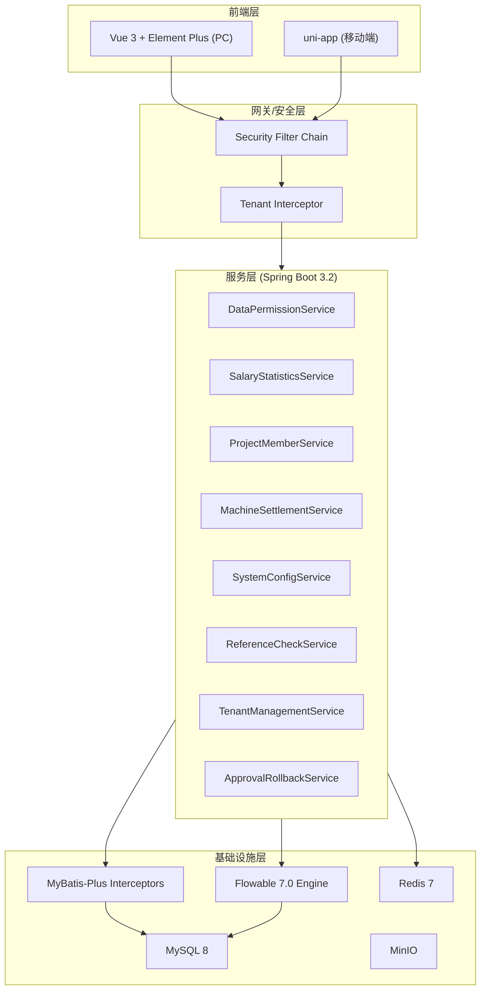
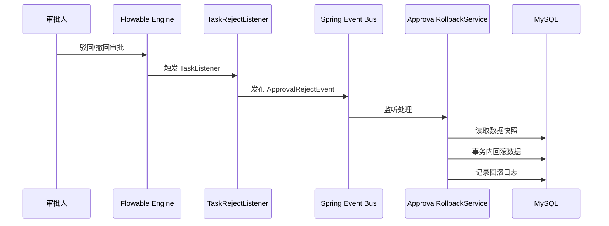

# Design Document: P1 系统完整度增强

## Overview

本设计文档描述 ZW-Insight 工程项目管理系统 P1 优先级的 8 个系统完整度增强功能的技术方案。涵盖数据权限隔离、薪资统计、项目成员管理、机械工作量结算、系统设置、引用校验、SaaS 多租户管理和审批数据回滚。

设计基于现有技术栈：Spring Boot 3.2 单体应用 + MyBatis-Plus + Flowable 7.0 + Vue 3 + Element Plus + uni-app + MySQL + Redis 7 + MinIO。复用已有基础设施：BaseEntity（含 tenantId、version 字段）、RBAC 角色权限体系、TenantLineInnerInterceptor 多租户拦截器、乐观锁并发控制、SecurityContextHolder 线程上下文、Spring 事件驱动审批回调模式。

### 设计决策

| 决策 | 选型 | 理由 |
|------|------|------|
| 数据权限实现 | MyBatis-Plus @DataScope + 自定义 DataPermissionInterceptor | 官方推荐方案，通过 InnerInterceptor 在 SQL 层自动拼接过滤条件，无侵入性 |
| 引用校验方案 | 自定义 @ReferenceCheck 注解 + AOP 切面 | 配置化引用关系，降低维护成本 |
| 审批回滚触发 | Flowable TaskListener + Spring Event | 复用已有的 ProcessCompleteListener 事件驱动模式 |
| 配置缓存 | Redis String + 事件通知清除 | 读多写少场景，缓存减少 DB 压力 |
| 薪资报表导出 | Apache POI (EasyExcel) | 支持多 Sheet 导出，内存友好 |
| 结算单审批 | 复用 Flowable 7 已有审批流程引擎 | 与系统现有审批体系统一 |

---

## Architecture

### 系统架构图



### MyBatis-Plus 拦截器执行顺序


### 审批回滚事件流



---

## Components and Interfaces

### 1. 数据权限服务 (DataPermissionService)

**所属模块**: `zw-common`（拦截器）+ `zw-system`（配置管理）

```java
// 数据权限拦截器 - 基于 MyBatis-Plus DataPermissionInterceptor
public class DataPermissionInnerInterceptor implements InnerInterceptor {
    // 在 SQL WHERE 子句中追加数据范围过滤条件
    void beforeQuery(Executor executor, MappedStatement ms, Object parameter, ...);
}

// 数据权限处理器接口
public interface IDataPermissionHandler {
    /**
     * 获取当前用户的数据权限 SQL 片段
     * @param tableName 表名
     * @param tableAlias 表别名
     * @return SQL WHERE 片段
     */
    Expression getPermissionSql(String tableName, String tableAlias);
}

// 注解：标记需要数据权限过滤的 Mapper 方法
@Target(ElementType.METHOD)
@Retention(RetentionPolicy.RUNTIME)
public @interface DataPermission {
    DataColumn[] value();
}

@interface DataColumn {
    String alias() default "";      // 表别名
    String name();                  // 过滤字段名
}
```

**REST API**:
- `PUT /api/v1/system/role/{id}/data-scope` - 配置角色数据范围

---

### 2. 薪资统计服务 (SalaryStatisticsService)

**所属模块**: `zw-labor`

```java
public interface SalaryStatisticsService {
    /** 按班组汇总薪资 */
    SalaryStatsSummary getStatsByTeam(Long projectId, String month);
    
    /** 班组薪资明细 */
    PageResult<SalaryDetailVO> getTeamDetail(Long projectId, String month, Long teamId, PageParam page);
    
    /** 生成月度报表数据 */
    SalaryMonthlyReport generateMonthlyReport(Long projectId, String month);
    
    /** 导出 Excel */
    void exportReport(Long projectId, String month, HttpServletResponse response);
    
    /** 获取同比环比 */
    SalaryCompareVO getCompareData(Long projectId, String month);
}
```

**REST API**:
- `GET /api/v1/labor/salary/stats` - 薪资统计汇总
- `GET /api/v1/labor/salary/detail` - 班组明细
- `GET /api/v1/labor/salary/report` - 月度报表
- `GET /api/v1/labor/salary/export` - Excel 导出
- `GET /api/v1/labor/salary/compare` - 同比环比

---

### 3. 项目成员管理服务 (ProjectMemberService)

**所属模块**: `zw-project`

```java
public interface ProjectMemberService {
    /** 添加项目成员 */
    void addMember(ProjectMemberAddRequest request);
    
    /** 移除项目成员 */
    void removeMember(Long projectId, Long userId);
    
    /** 变更成员角色 */
    void updateRoles(Long projectId, Long userId, List<String> roles);
    
    /** 查询项目成员列表 */
    PageResult<ProjectMemberVO> listMembers(Long projectId, String role, PageParam page);
    
    /** 获取用户参与的项目 ID 列表（供数据权限使用）*/
    List<Long> getUserProjectIds(Long userId);
    
    /** 用户离职时标记失效 */
    void deactivateByUserId(Long userId);
}
```

**REST API**:
- `POST /api/v1/project/{projectId}/member` - 添加成员
- `DELETE /api/v1/project/{projectId}/member/{userId}` - 移除成员
- `PUT /api/v1/project/{projectId}/member/{userId}/roles` - 变更角色
- `GET /api/v1/project/{projectId}/member` - 成员列表

---

### 4. 机械工作量结算服务 (MachineSettlementService)

**所属模块**: `zw-machine`

```java
public interface MachineSettlementService {
    /** 创建结算单 */
    Long createSettlement(MachineSettlementCreateRequest request);
    
    /** 提交审批 */
    void submitForApproval(Long settlementId);
    
    /** 审批通过回调 */
    void onApproved(Long settlementId);
    
    /** 查询项目结算汇总 */
    MachineSettlementSummaryVO getProjectSummary(Long projectId);
    
    /** 导出结算单 Excel */
    void exportSettlement(Long settlementId, HttpServletResponse response);
    
    /** 结算单分页查询 */
    PageResult<MachineSettlementVO> page(MachineSettlementQuery query);
}
```

**REST API**:
- `POST /api/v1/machine/settlement` - 创建结算单
- `POST /api/v1/machine/settlement/{id}/submit` - 提交审批
- `GET /api/v1/machine/settlement` - 结算单列表
- `GET /api/v1/machine/settlement/{id}` - 结算单详情
- `GET /api/v1/machine/settlement/summary` - 项目费用总览
- `GET /api/v1/machine/settlement/{id}/export` - 导出 Excel

---

### 5. 系统设置服务 (SystemConfigService)

**所属模块**: `zw-system`

```java
public interface SystemConfigService {
    /** 按分组查询配置列表 */
    List<SysConfigVO> listByGroup(String group);
    
    /** 更新配置值（含校验） */
    void updateConfig(String configKey, String configValue);
    
    /** 批量更新配置 */
    void batchUpdate(List<ConfigUpdateRequest> requests);
    
    /** 恢复默认值 */
    void resetToDefault(String configKey);
    
    /** 获取配置值（带 Redis 缓存） */
    String getConfigValue(String configKey);
    
    /** 获取配置值并转换类型 */
    <T> T getConfigValue(String configKey, Class<T> type);
}
```

**REST API**:
- `GET /api/v1/system/config/group/{group}` - 按分组查询
- `PUT /api/v1/system/config` - 更新配置
- `PUT /api/v1/system/config/batch` - 批量更新
- `POST /api/v1/system/config/{key}/reset` - 恢复默认值

---

### 6. 引用校验服务 (ReferenceCheckService)

**所属模块**: `zw-common`（注解 + AOP）

```java
// 引用校验注解
@Target(ElementType.METHOD)
@Retention(RetentionPolicy.RUNTIME)
public @interface ReferenceCheck {
    ReferenceRelation[] value();
}

@interface ReferenceRelation {
    String tableName();           // 引用表名
    String column();              // 引用字段
    String displayName();         // 引用实体中文名
    String codeColumn() default ""; // 单据编号字段（用于返回引用信息）
}

// AOP 切面
@Aspect
@Component
public class ReferenceCheckAspect {
    @Before("@annotation(referenceCheck)")
    public void checkReferences(JoinPoint point, ReferenceCheck referenceCheck);
}

// 引用信息 VO
public class ReferenceInfoVO {
    private String referenceType;   // 引用类型（中文）
    private String documentCode;    // 引用单据编号
    private LocalDateTime referenceTime; // 引用时间
}
```

---

### 7. 租户管理服务 (TenantManagementService)

**所属模块**: `zw-system`（增强已有 SysTenantService）

在已有 `SysTenantService` 基础上增强：

```java
// 新增接口方法
public interface TenantManagementService {
    /** 创建租户（自动生成管理员账号） */
    void createTenant(TenantCreateRequest request);
    
    /** 停用租户（清除 Token） */
    void disableTenant(Long tenantId);
    
    /** 启用租户 */
    void enableTenant(Long tenantId);
    
    /** 续期 */
    void renewTenant(Long tenantId, Integer days);
    
    /** 配置功能模块权限 */
    void updateModules(Long tenantId, List<String> modules);
    
    /** 检查用户数上限 */
    void checkUserLimit(Long tenantId);
    
    /** 到期检查定时任务 */
    void checkExpiredTenants();
    
    /** 续期提醒定时任务 */
    void sendRenewalReminders();
}
```

**REST API**（增强已有 `/api/v1/platform/tenant`）:
- `POST /api/v1/platform/tenant/{id}/disable` - 停用
- `POST /api/v1/platform/tenant/{id}/enable` - 启用
- `PUT /api/v1/platform/tenant/{id}/modules` - 配置功能模块

---

### 8. 审批数据回滚服务 (ApprovalRollbackService)

**所属模块**: `zw-workflow`

```java
public interface ApprovalRollbackService {
    /** 审批提交时保存数据快照 */
    void saveSnapshot(String workflowInstanceId, String bizType, Long bizId, Map<String, Object> snapshotData);
    
    /** 执行数据回滚 */
    RollbackResult executeRollback(String workflowInstanceId);
    
    /** 查询回滚记录 */
    PageResult<RollbackLogVO> queryRollbackLogs(RollbackLogQuery query);
    
    /** 确认冲突处理 */
    void confirmConflict(Long rollbackLogId, String resolution);
}

// 回滚策略接口（各业务模块实现）
public interface RollbackStrategy {
    String getBizType();
    void rollback(Long bizId, Map<String, Object> snapshotData);
}
```

**REST API**:
- `GET /api/v1/workflow/rollback/logs` - 回滚记录查询
- `POST /api/v1/workflow/rollback/{id}/confirm` - 确认冲突处理

---

## Data Models

### 数据库 ER 图

```mermaid
erDiagram
    SYS_ROLE {
        bigint id PK
        varchar role_name
        varchar role_code
        varchar data_scope "ALL/DEPT_AND_CHILDREN/DEPT/PROJECT/SELF"
        int status
        bigint tenant_id
    }

    SYS_USER_PROJECT {
        bigint id PK
        bigint user_id FK
        bigint project_id FK
        bigint tenant_id
    }

    BIZ_PROJECT_MEMBER {
        bigint id PK
        bigint project_id FK
        bigint user_id FK
        json project_roles "JSON 数组"
        date join_date
        int status "1-正常 2-已失效"
        bigint tenant_id
    }

    SYS_CONFIG {
        bigint id PK
        varchar config_key UK
        varchar config_value
        varchar config_name
        varchar config_group
        varchar value_type "STRING/NUMBER/BOOLEAN/JSON"
        varchar default_value
        varchar value_range
        varchar remark
    }

    SYS_TENANT {
        bigint id PK
        varchar tenant_code UK
        varchar tenant_name
        varchar contact_name
        varchar contact_phone
        varchar user_type "TRIAL/STANDARD/ENTERPRISE"
        date start_date
        date end_date
        int max_users
        json modules "已授权功能模块"
        int status "1-正常 2-已停用 3-已过期"
    }

    BIZ_MACHINE_WORK_SETTLEMENT {
        bigint id PK
        bigint project_id FK
        date period_start
        date period_end
        decimal total_amount "精度 16,2"
        int status "0-草稿 1-审批中 2-已审批 3-已驳回"
        varchar workflow_instance_id
        bigint tenant_id
    }

    BIZ_MACHINE_WORK_SETTLEMENT_DETAIL {
        bigint id PK
        bigint settlement_id FK
        bigint ledger_id FK
        json work_log_ids "关联的工作量记录 ID"
        decimal shift_count "台班数 精度 10,2"
        decimal work_volume "工作量 精度 10,2"
        decimal unit_price "单价 精度 10,2"
        decimal subtotal "费用小计 精度 16,2"
    }

    BIZ_APPROVAL_SNAPSHOT {
        bigint id PK
        varchar workflow_instance_id
        varchar biz_type
        bigint biz_id
        varchar field_name
        text original_value "JSON 格式"
        datetime created_at
    }

    BIZ_APPROVAL_ROLLBACK_LOG {
        bigint id PK
        varchar workflow_instance_id
        varchar biz_type
        bigint biz_id
        json rollback_fields "回滚字段详情"
        int rollback_status "1-成功 2-失败 3-冲突待确认"
        int retry_count
        varchar error_msg
        datetime created_at
    }

    SYS_CONFIG_CHANGE_LOG {
        bigint id PK
        varchar config_key
        varchar old_value
        varchar new_value
        bigint operator_id
        datetime created_at
    }

    SYS_ROLE ||--o{ SYS_USER_PROJECT : "data_scope=PROJECT时关联"
    BIZ_PROJECT_MEMBER }o--|| SYS_USER_PROJECT : "成员关系"
    BIZ_MACHINE_WORK_SETTLEMENT ||--|{ BIZ_MACHINE_WORK_SETTLEMENT_DETAIL : "一对多"
    BIZ_APPROVAL_SNAPSHOT }o--|| BIZ_APPROVAL_ROLLBACK_LOG : "快照关联回滚"
```



### DDL 设计

#### 1. 角色表增加数据范围字段

```sql
ALTER TABLE sys_role ADD COLUMN data_scope VARCHAR(30) DEFAULT 'SELF' 
    COMMENT '数据范围：ALL/DEPT_AND_CHILDREN/DEPT/PROJECT/SELF';
```

#### 2. 用户-项目关联表

```sql
CREATE TABLE sys_user_project (
    id BIGINT NOT NULL COMMENT '主键',
    user_id BIGINT NOT NULL COMMENT '用户ID',
    project_id BIGINT NOT NULL COMMENT '项目ID',
    tenant_id BIGINT NOT NULL COMMENT '租户ID',
    created_at DATETIME NOT NULL DEFAULT CURRENT_TIMESTAMP,
    PRIMARY KEY (id),
    UNIQUE KEY uk_user_project (user_id, project_id),
    INDEX idx_project_id (project_id),
    INDEX idx_tenant_id (tenant_id)
) COMMENT='用户-项目关联表';
```

#### 3. 项目成员表

```sql
CREATE TABLE biz_project_member (
    id BIGINT NOT NULL COMMENT '主键',
    project_id BIGINT NOT NULL COMMENT '项目ID',
    user_id BIGINT NOT NULL COMMENT '系统用户ID',
    project_roles JSON NOT NULL COMMENT '项目角色列表',
    join_date DATE NOT NULL COMMENT '加入日期',
    status TINYINT NOT NULL DEFAULT 1 COMMENT '状态：1-正常 2-已失效',
    tenant_id BIGINT NOT NULL COMMENT '租户ID',
    created_by BIGINT COMMENT '创建人',
    created_at DATETIME NOT NULL DEFAULT CURRENT_TIMESTAMP,
    updated_at DATETIME NOT NULL DEFAULT CURRENT_TIMESTAMP ON UPDATE CURRENT_TIMESTAMP,
    deleted TINYINT DEFAULT 0 COMMENT '逻辑删除',
    version INT DEFAULT 0 COMMENT '乐观锁',
    PRIMARY KEY (id),
    UNIQUE KEY uk_project_user (project_id, user_id),
    INDEX idx_user_id (user_id),
    INDEX idx_tenant_id (tenant_id)
) COMMENT='项目成员表';
```

#### 4. 系统配置表

```sql
CREATE TABLE sys_config (
    id BIGINT NOT NULL COMMENT '主键',
    config_key VARCHAR(100) NOT NULL COMMENT '参数键',
    config_value VARCHAR(2000) COMMENT '参数值',
    config_name VARCHAR(100) NOT NULL COMMENT '参数名称',
    config_group VARCHAR(50) NOT NULL COMMENT '参数分组',
    value_type VARCHAR(20) NOT NULL DEFAULT 'STRING' COMMENT '值类型：STRING/NUMBER/BOOLEAN/JSON',
    default_value VARCHAR(2000) COMMENT '默认值',
    value_range VARCHAR(200) COMMENT '值范围描述',
    remark VARCHAR(500) COMMENT '备注',
    created_at DATETIME NOT NULL DEFAULT CURRENT_TIMESTAMP,
    updated_at DATETIME NOT NULL DEFAULT CURRENT_TIMESTAMP ON UPDATE CURRENT_TIMESTAMP,
    PRIMARY KEY (id),
    UNIQUE KEY uk_config_key (config_key),
    INDEX idx_config_group (config_group)
) COMMENT='系统配置表';
```

#### 5. 系统配置变更日志表

```sql
CREATE TABLE sys_config_change_log (
    id BIGINT NOT NULL COMMENT '主键',
    config_key VARCHAR(100) NOT NULL COMMENT '参数键',
    old_value VARCHAR(2000) COMMENT '修改前值',
    new_value VARCHAR(2000) COMMENT '修改后值',
    operator_id BIGINT NOT NULL COMMENT '修改人ID',
    created_at DATETIME NOT NULL DEFAULT CURRENT_TIMESTAMP,
    PRIMARY KEY (id),
    INDEX idx_config_key (config_key),
    INDEX idx_created_at (created_at)
) COMMENT='系统配置变更日志';
```

#### 6. 机械工作量结算单

```sql
CREATE TABLE biz_machine_work_settlement (
    id BIGINT NOT NULL COMMENT '主键',
    project_id BIGINT NOT NULL COMMENT '项目ID',
    settlement_code VARCHAR(50) NOT NULL COMMENT '结算单编号',
    period_start DATE NOT NULL COMMENT '结算周期开始日期',
    period_end DATE NOT NULL COMMENT '结算周期结束日期',
    total_amount DECIMAL(16,2) NOT NULL DEFAULT 0 COMMENT '合计费用',
    status TINYINT NOT NULL DEFAULT 0 COMMENT '状态：0-草稿 1-审批中 2-已审批 3-已驳回',
    workflow_instance_id VARCHAR(64) COMMENT '流程实例ID',
    tenant_id BIGINT NOT NULL COMMENT '租户ID',
    created_by BIGINT COMMENT '创建人',
    created_at DATETIME NOT NULL DEFAULT CURRENT_TIMESTAMP,
    updated_at DATETIME NOT NULL DEFAULT CURRENT_TIMESTAMP ON UPDATE CURRENT_TIMESTAMP,
    deleted TINYINT DEFAULT 0 COMMENT '逻辑删除',
    version INT DEFAULT 0 COMMENT '乐观锁',
    PRIMARY KEY (id),
    UNIQUE KEY uk_settlement_code (settlement_code),
    INDEX idx_project_id (project_id),
    INDEX idx_period (period_start, period_end),
    INDEX idx_tenant_id (tenant_id)
) COMMENT='机械工作量结算单';
```

#### 7. 机械工作量结算明细

```sql
CREATE TABLE biz_machine_work_settlement_detail (
    id BIGINT NOT NULL COMMENT '主键',
    settlement_id BIGINT NOT NULL COMMENT '结算单ID',
    ledger_id BIGINT NOT NULL COMMENT '机械台账ID',
    work_log_ids JSON COMMENT '关联工作量记录ID列表',
    shift_count DECIMAL(10,2) NOT NULL DEFAULT 0 COMMENT '台班数',
    work_volume DECIMAL(10,2) NOT NULL DEFAULT 0 COMMENT '工作量',
    unit_price DECIMAL(10,2) NOT NULL DEFAULT 0 COMMENT '单价',
    subtotal DECIMAL(16,2) NOT NULL DEFAULT 0 COMMENT '费用小计',
    pricing_type VARCHAR(20) NOT NULL COMMENT '计价方式：SHIFT/VOLUME',
    tenant_id BIGINT NOT NULL COMMENT '租户ID',
    created_at DATETIME NOT NULL DEFAULT CURRENT_TIMESTAMP,
    PRIMARY KEY (id),
    INDEX idx_settlement_id (settlement_id),
    INDEX idx_ledger_id (ledger_id)
) COMMENT='机械工作量结算明细';
```

#### 8. 审批数据快照表

```sql
CREATE TABLE biz_approval_snapshot (
    id BIGINT NOT NULL COMMENT '主键',
    workflow_instance_id VARCHAR(64) NOT NULL COMMENT '流程实例ID',
    biz_type VARCHAR(50) NOT NULL COMMENT '业务类型',
    biz_id BIGINT NOT NULL COMMENT '业务单据ID',
    field_name VARCHAR(100) NOT NULL COMMENT '快照字段名',
    original_value TEXT COMMENT '变更前值(JSON)',
    created_at DATETIME NOT NULL DEFAULT CURRENT_TIMESTAMP,
    PRIMARY KEY (id),
    INDEX idx_workflow_instance (workflow_instance_id),
    INDEX idx_biz (biz_type, biz_id)
) COMMENT='审批数据快照表';
```

#### 9. 审批回滚记录表

```sql
CREATE TABLE biz_approval_rollback_log (
    id BIGINT NOT NULL COMMENT '主键',
    workflow_instance_id VARCHAR(64) NOT NULL COMMENT '流程实例ID',
    biz_type VARCHAR(50) NOT NULL COMMENT '业务类型',
    biz_id BIGINT NOT NULL COMMENT '业务单据ID',
    rollback_fields JSON COMMENT '回滚字段详情',
    rollback_status TINYINT NOT NULL COMMENT '回滚状态：1-成功 2-失败 3-冲突待确认',
    retry_count INT DEFAULT 0 COMMENT '重试次数',
    error_msg VARCHAR(500) COMMENT '错误信息',
    operator_id BIGINT COMMENT '操作人',
    created_at DATETIME NOT NULL DEFAULT CURRENT_TIMESTAMP,
    PRIMARY KEY (id),
    INDEX idx_workflow_instance (workflow_instance_id),
    INDEX idx_biz (biz_type, biz_id),
    INDEX idx_status (rollback_status)
) COMMENT='审批回滚记录表';
```

#### 10. 租户表增强（在已有 sys_tenant 基础上）

```sql
ALTER TABLE sys_tenant ADD COLUMN user_type VARCHAR(20) DEFAULT 'STANDARD' 
    COMMENT '用户类型：TRIAL/STANDARD/ENTERPRISE';
ALTER TABLE sys_tenant ADD COLUMN start_date DATE COMMENT '有效期开始日期';
ALTER TABLE sys_tenant ADD COLUMN end_date DATE COMMENT '有效期结束日期';
ALTER TABLE sys_tenant ADD COLUMN max_users INT DEFAULT 50 COMMENT '用户数上限';
ALTER TABLE sys_tenant ADD COLUMN modules JSON COMMENT '已授权功能模块列表';
ALTER TABLE sys_tenant MODIFY COLUMN status TINYINT DEFAULT 1 
    COMMENT '状态：1-正常 2-已停用 3-已过期';
```

---


## Correctness Properties

*正确性属性是一种在系统所有有效执行中都应成立的特征或行为——本质上是关于系统应该做什么的形式化声明。属性是人类可读规范和机器可验证正确性保证之间的桥梁。*

### Property 1: 数据权限过滤正确性

*For any* 用户、任意数据范围配置（ALL/DEPT_AND_CHILDREN/DEPT/PROJECT/SELF）和任意业务数据集，DataPermissionInterceptor 生成的 SQL 过滤条件应确保查询结果中的每条记录都满足该数据范围的定义：SELF 范围仅包含 created_by 等于当前用户的记录；PROJECT 范围仅包含用户参与项目的记录；DEPT 范围仅包含用户所属部门的记录；DEPT_AND_CHILDREN 范围包含用户所属部门及其所有子部门的记录；ALL 范围不追加额外过滤。

**Validates: Requirements 1.3, 1.4, 1.5, 1.6, 1.7, 1.8**

### Property 2: 多角色数据范围取最大值

*For any* 用户拥有的角色集合（每个角色有不同的 data_scope），系统计算出的有效数据范围应等于集合中优先级最高的值（优先级：ALL > DEPT_AND_CHILDREN > DEPT > PROJECT > SELF）。

**Validates: Requirements 1.9**

### Property 3: 薪资汇总计算正确性

*For any* 项目和月份对应的已审批工资单数据集，按班组分组汇总时：每个班组的应发工资总额应等于该班组所有工资单应发金额之和；项目薪资合计应等于所有班组应发总额之和；金额精确到小数点后 2 位（不存在精度丢失）。

**Validates: Requirements 2.1, 2.4**

### Property 4: 薪资筛选条件完整性

*For any* 筛选条件组合（项目、月份、班组、工人姓名），返回结果集中的每条记录都应满足所有指定的筛选条件。

**Validates: Requirements 2.5**

### Property 5: 同比环比计算公式正确性

*For any* 本期金额和上期金额（上期不为零），变化率应等于 (本期 - 上期) ÷ 上期 × 100%，精确到小数点后 1 位。

**Validates: Requirements 2.8**

### Property 6: 项目成员唯一性约束

*For any* 项目和已存在的成员关系，重复添加同一用户到该项目应被拒绝并返回错误信息。

**Validates: Requirements 3.4**

### Property 7: 项目经理最少保留约束

*For any* 项目，如果当前只有一名项目经理角色持有者，移除该成员的操作应被拒绝。

**Validates: Requirements 3.5**

### Property 8: 用户离职全项目失效

*For any* 被停用的系统用户，其在所有项目中的成员状态应变为"已失效"，且该用户不应再出现在任何项目的有效成员列表中。

**Validates: Requirements 3.9**

### Property 9: 机械费用计算公式正确性

*For any* 机械工作量记录和合同约定的计价方式：台班计价时，费用 = 台班数 × 台班单价；工作量计价时，费用 = 工作量 × 工作量单价。金额精确到小数点后 2 位。

**Validates: Requirements 4.2**

### Property 10: 结算周期重叠检测正确性

*For any* 两个时间区间 [start1, end1] 和 [start2, end2]，当且仅当 start1 <= end2 且 start2 <= end1 时判定为重叠，系统应拒绝创建重叠周期的结算单。

**Validates: Requirements 4.6**

### Property 11: 结算审批通过累加正确性

*For any* 结算单审批通过，其合计金额应准确累加到对应机械合同的已结算金额字段，累加后的值等于原值加上本次结算金额。

**Validates: Requirements 4.5**

### Property 12: 系统参数值范围校验

*For any* 参数和任意输入值：如果值超出参数定义的允许范围，保存应被拒绝；如果值在允许范围内，保存应成功。

**Validates: Requirements 5.7**

### Property 13: 系统参数恢复默认值

*For any* 参数，执行恢复默认值操作后，该参数的 config_value 应等于其 default_value。

**Validates: Requirements 5.9**

### Property 14: 引用校验阻止删除

*For any* 基础数据记录和引用关系，如果该记录被任何业务数据引用（COUNT > 0），删除操作应被阻止；如果无任何引用，删除应被允许。

**Validates: Requirements 6.1, 6.2, 6.3, 6.4, 6.5, 6.6**

### Property 15: 租户续期计算正确性

*For any* 租户的当前有效期结束日期和续期天数 N（1 ≤ N ≤ 1095），续期后的有效期结束日期应等于原结束日期 + N 天。

**Validates: Requirements 7.4**

### Property 16: 租户用户数上限约束

*For any* 活跃用户数已达上限的租户，新增用户操作应被拒绝。

**Validates: Requirements 7.7**

### Property 17: 租户功能模块权限隔离

*For any* 租户和其功能模块配置，未授权模块对应的 API 请求应返回 403 且菜单列表中不包含未授权模块的菜单项。

**Validates: Requirements 7.3**

### Property 18: 审批快照-回滚 Round Trip

*For any* 业务数据变更和对应的审批提交，快照记录的原始值应与提交前数据一致；当审批驳回或撤回时，回滚操作应将业务数据恢复到快照记录的值。

**Validates: Requirements 8.1, 8.2, 8.4**

### Property 19: 审批回滚冲突检测

*For any* 审批快照数据，如果当前业务数据的值与快照记录的值不一致（说明数据已被后续操作修改），回滚操作应标记为"冲突待确认"而非直接覆盖。

**Validates: Requirements 8.8**

### Property 20: 审批回滚乐观锁重试

*For any* 回滚操作遇到乐观锁冲突时，系统应自动重试，重试次数不超过 3 次；3 次仍失败则标记为"回滚失败"。

**Validates: Requirements 8.6**

---

## Error Handling

### 全局错误处理策略

| 错误类型 | 处理方式 | HTTP 状态码 |
|----------|---------|-------------|
| 业务校验失败 | 抛出 BusinessException，返回明确错误信息 | 400 |
| 数据权限拒绝 | 拦截器过滤后返回空结果集（不抛异常） | 200（空数据） |
| 引用校验异常 | 阻止删除，记录异常日志，返回"引用校验异常，请稍后重试" | 500 |
| 乐观锁冲突 | 自动重试（最多 3 次），仍失败则标记异常状态 | 409（告知前端） |
| 租户过期/停用 | 拒绝登录，返回明确提示 | 403 |
| 用户数上限 | 拒绝创建用户，返回当前用量信息 | 400 |
| 结算周期重叠 | 拒绝创建，返回冲突结算单信息 | 400 |
| 回滚冲突 | 标记"冲突待确认"，通知管理员 | 202（已接受待处理） |

### 各模块错误处理细节

#### 数据权限模块
- 拦截器内部异常：记录 ERROR 日志，不追加过滤条件（安全优先：默认返回空数据）
- 数据范围配置缺失：使用默认值 SELF（最小权限原则）

#### 薪资统计模块
- 工资单数据缺失：返回空结果 + 提示信息"该月份暂无已审批的薪资数据"
- 金额计算溢出：使用 BigDecimal ROUND_HALF_UP 模式
- Excel 导出超时：设置 30 秒超时，超时返回错误提示

#### 项目成员模块
- 重复添加：返回 400 + "该用户已是本项目成员"
- 移除唯一 PM：返回 400 + "项目至少需要保留一名项目经理"
- 用户不存在/已停用：返回 400 + 具体原因

#### 机械结算模块
- 周期重叠：返回 400 + 冲突结算单编号和周期信息
- 无工作量记录：返回 400 + "该周期内无可结算的工作量记录"
- 审批流程启动失败：记录日志，返回 500 + "审批流程启动异常"

#### 系统设置模块
- 参数值校验失败：返回 400 + "参数 {name} 的值必须在 {range} 范围内"
- Redis 缓存操作失败：降级为直接读 DB，记录 WARN 日志

#### 引用校验模块
- 数据库查询异常：阻止删除（安全优先），返回 500 + "引用校验异常，请稍后重试"
- 引用信息过多：最多返回前 10 条引用记录

#### 租户管理模块
- 停用操作 Token 清除失败：记录 ERROR 日志，继续更新数据库状态（最终一致）
- 续期天数超限（>1095）：返回 400 + "续期天数不得超过 1095 天"

#### 审批回滚模块
- 回滚超时（>5s）：标记为失败，触发消息通知
- 快照数据缺失：标记为失败，通知管理员手动处理
- 乐观锁重试耗尽：标记为"回滚失败"，通过 Message_Service 通知管理员

---

## Testing Strategy

### 测试分层架构

```
┌─────────────────────────────────────────────┐
│  E2E Tests (Playwright/Cypress)              │  → PC 端关键路径验证
├─────────────────────────────────────────────┤
│  Integration Tests (Spring Boot Test)        │  → 服务间协作、DB 交互
├─────────────────────────────────────────────┤
│  Property-Based Tests (jqwik)                │  → 核心业务逻辑正确性
├─────────────────────────────────────────────┤
│  Unit Tests (JUnit 5 + Mockito)              │  → 单元逻辑、边界条件
└─────────────────────────────────────────────┘
```

### Property-Based Testing 配置

**测试框架**: [jqwik](https://jqwik.net/) — JUnit 5 平台上的 Java 属性测试库

**配置要求**:
- 每个属性测试运行最少 100 次迭代
- 每个测试方法以注释标注对应的 Correctness Property
- 标签格式：`@Tag("Feature: p1-system-integrity, Property {N}: {title}")`

**PBT 覆盖范围**（对应 Correctness Properties）:

| Property | 测试目标 | 生成器策略 |
|----------|---------|-----------|
| Property 1 | DataPermissionHandler SQL 生成 | 随机用户+角色+部门树+项目集 |
| Property 2 | DataScope 优先级计算 | 随机角色集合 |
| Property 3 | 薪资汇总聚合 | 随机工资单列表 |
| Property 5 | 变化率公式 | 随机金额对 |
| Property 9 | 费用计算公式 | 随机台班数/工作量/单价 |
| Property 10 | 时间区间重叠判断 | 随机日期区间对 |
| Property 12 | 参数值范围校验 | 随机参数+超范围/合法值 |
| Property 14 | 引用校验决策 | 随机引用关系图 |
| Property 15 | 续期日期计算 | 随机日期+天数 |
| Property 18 | 快照-回滚 Round Trip | 随机业务数据字段集 |
| Property 19 | 冲突检测 | 随机快照值+当前值对 |
| Property 20 | 乐观锁重试 | 模拟冲突+重试计数 |

### Unit Tests 覆盖范围

| 模块 | 测试重点 |
|------|---------|
| 数据权限 | DataScope 枚举、优先级排序工具类 |
| 薪资统计 | 金额精度处理、空数据边界 |
| 项目成员 | 角色枚举校验、成员唯一性 |
| 机械结算 | 结算单状态机、费用计算 |
| 系统设置 | 参数类型转换、范围解析 |
| 引用校验 | 注解解析、引用关系配置 |
| 租户管理 | 编码生成、有效期计算 |
| 审批回滚 | 快照序列化/反序列化、冲突检测 |

### Integration Tests 覆盖范围

| 场景 | 验证内容 |
|------|---------|
| 数据权限 + SQL 执行 | 拦截器实际拼接 SQL 后查询结果正确 |
| 结算审批流程 | Flowable 流程启动→审批→回调完整链路 |
| 回滚事务 | 回滚操作原子性、并发冲突处理 |
| 租户停用 | Token 清除 + 登录拒绝 |
| Redis 缓存 | 配置更新后缓存一致性 |

### 前端测试

- **组件测试** (Vitest + @vue/test-utils)：表单校验逻辑、数据展示组件
- **E2E 测试** (Playwright)：数据权限配置、系统设置保存、引用校验弹窗

---

## 实现方案详述

### 1. 数据权限拦截器实现

基于 MyBatis-Plus 官方 `@DataScope` + `@DataColumn` 注解机制和自定义 `IDataScopeProvider` 实现：

```java
@Component
public class ZwDataPermissionHandler implements IDataScopeProvider {

    private final ProjectMemberService projectMemberService;
    private final SysOrgService orgService;
    
    @Override
    public Expression getExpression(String type, DataColumn[] columns) {
        Long userId = SecurityContextHolder.getUserId();
        DataScopeEnum scope = getEffectiveScope(userId);
        
        return switch (scope) {
            case ALL -> null;  // 不追加条件
            case DEPT_AND_CHILDREN -> buildDeptAndChildrenCondition(userId, columns);
            case DEPT -> buildDeptCondition(userId, columns);
            case PROJECT -> buildProjectCondition(userId, columns);
            case SELF -> buildSelfCondition(userId, columns);
        };
    }
    
    /** 多角色取最大范围 */
    private DataScopeEnum getEffectiveScope(Long userId) {
        List<SysRole> roles = roleService.getUserRoles(userId);
        return roles.stream()
            .map(r -> DataScopeEnum.valueOf(r.getDataScope()))
            .max(Comparator.comparingInt(DataScopeEnum::getPriority))
            .orElse(DataScopeEnum.SELF);
    }
}
```

在 `MybatisPlusConfig` 中注册拦截器（置于 TenantLine 之后、Pagination 之前）。

### 2. 引用校验 AOP 实现

```java
@Aspect
@Component
@RequiredArgsConstructor
public class ReferenceCheckAspect {

    private final JdbcTemplate jdbcTemplate;

    @Before("@annotation(check)")
    public void doCheck(JoinPoint point, ReferenceCheck check) {
        Long entityId = extractEntityId(point);
        
        for (ReferenceRelation relation : check.value()) {
            String countSql = String.format(
                "SELECT COUNT(1) FROM %s WHERE %s = ? AND deleted = 0",
                relation.tableName(), relation.column()
            );
            
            try {
                Integer count = jdbcTemplate.queryForObject(countSql, Integer.class, entityId);
                if (count != null && count > 0) {
                    List<ReferenceInfoVO> refs = queryReferenceDetails(relation, entityId);
                    throw new ReferenceExistsException(relation.displayName(), refs);
                }
            } catch (DataAccessException e) {
                log.error("引用校验查询异常, table={}, id={}", relation.tableName(), entityId, e);
                throw new BusinessException("引用校验异常，请稍后重试");
            }
        }
    }
}
```

### 3. 审批回滚策略模式

```java
// 回滚策略注册器
@Component
public class RollbackStrategyRegistry {
    private final Map<String, RollbackStrategy> strategies = new ConcurrentHashMap<>();
    
    @Autowired
    public RollbackStrategyRegistry(List<RollbackStrategy> strategyList) {
        strategyList.forEach(s -> strategies.put(s.getBizType(), s));
    }
    
    public RollbackStrategy getStrategy(String bizType) {
        return Optional.ofNullable(strategies.get(bizType))
            .orElseThrow(() -> new BusinessException("未找到业务类型[" + bizType + "]的回滚策略"));
    }
}

// 具体回滚策略示例（目标成本变更）
@Component
public class BudgetChangeRollbackStrategy implements RollbackStrategy {
    
    @Override
    public String getBizType() { return "BUDGET_CHANGE"; }
    
    @Override
    @Transactional(rollbackFor = Exception.class)
    public void rollback(Long bizId, Map<String, Object> snapshotData) {
        // 从快照恢复预算科目金额
        BigDecimal originalAmount = new BigDecimal(snapshotData.get("subjectAmount").toString());
        budgetSubjectMapper.updateAmount(bizId, originalAmount);
    }
}
```

### 4. 租户到期检查定时任务

```java
@Component
@RequiredArgsConstructor
public class TenantExpireScheduler {

    @Scheduled(cron = "0 0 1 * * ?")  // 每天凌晨 1 点
    public void checkExpiredTenants() {
        List<SysTenant> expiredTenants = tenantMapper.selectList(
            new LambdaQueryWrapper<SysTenant>()
                .eq(SysTenant::getStatus, TenantStatus.ACTIVE.getValue())
                .le(SysTenant::getEndDate, LocalDate.now())
        );
        
        expiredTenants.forEach(tenant -> {
            tenant.setStatus(TenantStatus.EXPIRED.getValue());
            tenantMapper.updateById(tenant);
            // 清除该租户所有用户 Token
            redisUtils.deleteByPattern("token:tenant:" + tenant.getId() + ":*");
        });
    }
    
    @Scheduled(cron = "0 0 9 * * ?")  // 每天上午 9 点
    public void sendRenewalReminders() {
        LocalDate day15 = LocalDate.now().plusDays(15);
        LocalDate day7 = LocalDate.now().plusDays(7);
        // 15天和7天到期提醒
        notifyExpiring(day15, "您的租户服务将在 15 天后到期");
        notifyExpiring(day7, "您的租户服务将在 7 天后到期，请尽快续期");
    }
}
```

### 5. 薪资统计核心逻辑

```java
@Service
@RequiredArgsConstructor
public class SalaryStatisticsServiceImpl implements SalaryStatisticsService {

    @Override
    public SalaryStatsSummary getStatsByTeam(Long projectId, String month) {
        // 查询该项目该月已审批的工资单
        List<BizLaborPayroll> payrolls = payrollMapper.selectList(
            new LambdaQueryWrapper<BizLaborPayroll>()
                .eq(BizLaborPayroll::getProjectId, projectId)
                .eq(BizLaborPayroll::getPayMonth, month)
                .eq(BizLaborPayroll::getStatus, ApprovalStatus.APPROVED.getValue())
        );
        
        // 按班组分组汇总
        Map<Long, List<BizLaborPayroll>> grouped = payrolls.stream()
            .collect(Collectors.groupingBy(BizLaborPayroll::getTeamId));
        
        List<TeamSalaryVO> teamStats = grouped.entrySet().stream()
            .map(entry -> buildTeamSalary(entry.getKey(), entry.getValue()))
            .collect(Collectors.toList());
        
        // 计算合计
        BigDecimal totalPayable = teamStats.stream()
            .map(TeamSalaryVO::getTotalPayable)
            .reduce(BigDecimal.ZERO, BigDecimal::add);
        
        return SalaryStatsSummary.builder()
            .projectId(projectId)
            .month(month)
            .teamStats(teamStats)
            .totalPayable(totalPayable.setScale(2, RoundingMode.HALF_UP))
            .build();
    }
}
```

### 6. 前端页面规划

| 页面 | 路径 | 模块 |
|------|------|------|
| 数据权限配置 | `/system/role/data-scope` | zw-insight-web |
| 薪资统计 | `/labor/salary/stats` | zw-insight-web |
| 项目成员管理 | `/project/{id}/member` | zw-insight-web |
| 机械结算管理 | `/machine/settlement` | zw-insight-web |
| 系统设置 | `/system/config` | zw-insight-web |
| 租户管理 | `/platform/tenant` | zw-insight-web（已有，增强） |
| 回滚记录 | `/workflow/rollback` | zw-insight-web |
