# Design Document — P2 Advanced Features

## Overview

本设计文档定义 ZW-Insight 工程项目管理平台 P2 第三批高级功能的技术方案，涵盖四大功能域：

1. **打印模板管理**：升级现有 `TemplateService` 的简单 `{{}}` 占位符渲染为 Thymeleaf 引擎渲染，支持条件/循环语法；集成 wkhtmltopdf 实现 HTML→PDF 转换；PC 端提供模板管理页面（含 CodeMirror 编辑器）。
2. **离线缓存与拍照水印**：uni-app 端基于 `uni.setStorageSync` + 版本号比对实现离线数据缓存（100MB LRU）和操作队列；Canvas API 实现拍照水印合成。
3. **用户安全增强**：复用已有 `AliyunSmsService` + `CaptchaService` 实现忘记密码；新增设备管理（`sys_login_device` 表 + Redis Token 黑名单）；ip2region 本地库检测异地登录；`@SecondaryConfirm` AOP 注解实现操作二次确认。
4. **数据运维**：`ProcessBuilder` 执行 mysqldump + GZIP 压缩 + MinIO 存储；语义化版本管理；Spring Boot Actuator + Micrometer 自定义指标健康监控。

### 设计原则

- **复用优先**：充分利用已有 `zw-security`（SMS/Captcha/IP锁定）、`zw-file`（MinIO/Template）、`zw-common`（RedisUtils/BusinessException）模块
- **渐进增强**：在现有 `TemplateService` 基础上升级，保持向后兼容
- **真实链路**：所有接口均对接真实服务，不使用 fallback 或静默处理
- **移动优先**：离线缓存和水印功能以 uni-app 移动端为主要载体

---

## Architecture

### 系统架构图

```mermaid
graph TB
    subgraph "PC Frontend (Vue 3 + Element Plus)"
        PF_TEMPLATE[模板管理页面]
        PF_MONITOR[监控仪表盘]
        PF_DEVICE[设备管理页面]
        PF_BACKUP[备份管理页面]
        PF_VERSION[版本管理页面]
        PF_PWD[忘记密码页面]
    end

    subgraph "Mobile App (uni-app)"
        MA_CACHE[离线缓存管理器]
        MA_SYNC[同步引擎]
        MA_WATERMARK[水印合成器]
        MA_PWD[忘记密码页面]
    end

    subgraph "Backend (Spring Boot 3.2)"
        subgraph "zw-file 模块"
            SVC_TEMPLATE[PrintTemplateService]
            SVC_RENDER[ThymeleafRenderService]
            SVC_PDF[PdfConvertService]
        end
        subgraph "zw-security 模块"
            SVC_PWDRESET[PasswordResetService]
            SVC_DEVICE[DeviceManagerService]
            SVC_LOCATION[LoginLocationService]
            SVC_CONFIRM[SecondaryConfirmInterceptor]
        end
        subgraph "zw-system 模块"
            SVC_BACKUP[BackupService]
            SVC_VERSION[VersionManagerService]
            SVC_HEALTH[HealthMonitorConfig]
        end
    end

    subgraph "Infrastructure"
        MYSQL[(MySQL 8.0)]
        REDIS[(Redis 7)]
        MINIO[(MinIO)]
        IP2REGION[ip2region.xdb]
    end

    PF_TEMPLATE --> SVC_TEMPLATE
    PF_TEMPLATE --> SVC_RENDER
    PF_MONITOR --> SVC_HEALTH
    PF_DEVICE --> SVC_DEVICE
    PF_BACKUP --> SVC_BACKUP
    PF_VERSION --> SVC_VERSION
    PF_PWD --> SVC_PWDRESET

    MA_CACHE --> |REST API| SVC_TEMPLATE
    MA_SYNC --> |REST API| SVC_TEMPLATE
    MA_PWD --> SVC_PWDRESET

    SVC_RENDER --> |Thymeleaf Engine| MYSQL
    SVC_PDF --> |wkhtmltopdf| SVC_RENDER
    SVC_PWDRESET --> REDIS
    SVC_DEVICE --> REDIS
    SVC_LOCATION --> IP2REGION
    SVC_BACKUP --> MYSQL
    SVC_BACKUP --> MINIO
    SVC_HEALTH --> REDIS
```



### 模块职责划分

| 模块 | 新增职责 | 新增类 |
|------|---------|--------|
| zw-file | 打印模板 Thymeleaf 渲染 + PDF 转换 | `ThymeleafRenderService`, `PdfConvertService`, `PrintTemplateController` |
| zw-security | 密码重置 + 设备管理 + 异地检测 + 二次确认 | `PasswordResetService`, `DeviceManagerService`, `LoginLocationService`, `SecondaryConfirmInterceptor`, `@SecondaryConfirm` |
| zw-system | 数据备份 + 版本管理 + 健康监控 | `BackupService`, `BackupController`, `VersionManagerService`, `VersionController`, `HealthMonitorConfig` |
| zw-insight-app | 离线缓存 + 同步 + 水印 | `offlineCache.ts`, `syncEngine.ts`, `watermarkCompositor.ts` |

---

## Components and Interfaces

### 1. 打印模板管理

#### PrintTemplateController（升级现有 TemplateController）

```java
@RestController
@RequestMapping("/api/print-template")
public class PrintTemplateController {
    POST   /                     // 创建模板
    PUT    /{id}                 // 更新模板
    DELETE /{id}                 // 逻辑删除模板
    GET    /list                 // 分页列表（?moduleCode=&templateType=PRINT）
    GET    /{id}                 // 模板详情
    POST   /render              // 渲染 HTML（templateId + businessDataId）
    POST   /export-pdf          // 导出 PDF（templateId + businessDataId）
}
```

#### ThymeleafRenderService

```java
@Service
public class ThymeleafRenderService {
    private final TemplateEngine templateEngine; // Spring Boot 自带

    /**
     * 使用 Thymeleaf 渲染模板
     * @param templateContent 模板 HTML 内容（含 th:text, th:each 等语法）
     * @param variables       业务数据变量 Map
     * @return 渲染后完整 HTML
     */
    public String render(String templateContent, Map<String, Object> variables);
}
```

#### PdfConvertService

```java
@Service
public class PdfConvertService {
    @Value("${print.wkhtmltopdf.path:/usr/local/bin/wkhtmltopdf}")
    private String wkhtmltopdfPath;

    /**
     * HTML 转 PDF
     * @param html 渲染后的 HTML 字符串
     * @return PDF 字节数组
     */
    public byte[] convertHtmlToPdf(String html);
}
```

### 2. 离线缓存管理（uni-app 端）

#### offlineCache.ts

```typescript
interface CacheEntry<T> {
  data: T;
  version: number;
  cachedAt: number;       // timestamp
  lastAccessedAt: number; // LRU 排序依据
  expired: boolean;
}

class OfflineCacheManager {
  private readonly MAX_SIZE_MB = 100;
  private readonly EXPIRE_DAYS = 7;

  sync(): Promise<void>;             // 首次登录/手动触发同步
  get<T>(key: string): CacheEntry<T> | null;
  set<T>(key: string, data: T, version: number): void;
  evictLRU(): void;                  // LRU 清除至 80% 容量
  markExpired(): void;               // 标记过期数据
  getUsedSize(): number;             // 当前已用空间(bytes)
}
```

#### syncEngine.ts

```typescript
interface OfflineOperation {
  id: string;
  type: 'CREATE' | 'UPDATE';
  endpoint: string;
  payload: any;
  timestamp: number;
  status: 'PENDING' | 'SYNCED' | 'CONFLICT' | 'FAILED';
}

class SyncEngine {
  private retryCount = 0;
  private readonly MAX_RETRY = 3;
  private readonly RETRY_INTERVAL_MS = 5 * 60 * 1000;

  enqueue(operation: OfflineOperation): void;
  syncAll(): Promise<void>;           // 按时间顺序逐条提交
  handleConflict(op: OfflineOperation): void;
  compareVersions(): Promise<void>;   // 版本号比对 + 全量覆盖
}
```

#### watermarkCompositor.ts

```typescript
interface WatermarkInfo {
  time: string;          // yyyy-MM-dd HH:mm:ss
  gpsLat: number | null;
  gpsLng: number | null;
  userName: string;
  projectName: string;
}

class WatermarkCompositor {
  /**
   * 合成水印到照片
   * @param imagePath 原始照片临时路径
   * @param info      水印信息
   * @returns 带水印图片的 Base64 或文件路径
   */
  async compose(imagePath: string, info: WatermarkInfo): Promise<string>;
}
```

### 3. 用户安全增强

#### PasswordResetController

```java
@RestController
@RequestMapping("/api/auth/password-reset")
public class PasswordResetController {
    POST /send-code          // 发送验证码（phone）
    POST /verify-code        // 校验验证码（phone + code）
    POST /reset              // 重置密码（phone + code + newPassword）
}
```

#### DeviceManagerService

```java
@Service
public class DeviceManagerService {
    void recordLogin(Long userId, DeviceInfo device, String token);
    List<LoginDeviceVO> listDevices(Long userId);
    void revokeDevice(Long userId, Long deviceId, Long currentDeviceId);
    void autoEvictOldest(Long userId, int maxDevices);
    void addToBlacklist(String token);
}
```

#### LoginLocationService

```java
@Service
public class LoginLocationService {
    private final Ip2Region ip2Region; // ip2region 查询实例

    /**
     * 解析 IP 归属地
     * @return "省份|城市" 格式
     */
    String resolveLocation(String ip);

    /**
     * 检测是否异地登录并发送通知
     */
    void detectAndNotify(Long userId, String ip, String deviceInfo);
}
```

#### @SecondaryConfirm 注解 + AOP 拦截器

```java
@Target(ElementType.METHOD)
@Retention(RetentionPolicy.RUNTIME)
public @interface SecondaryConfirm {
    String message() default "此操作需要二次确认";
}

@Aspect
@Component
public class SecondaryConfirmInterceptor {
    // Redis key: secondary_confirm:fail:{userId}, TTL 15min
    private static final int MAX_FAIL_COUNT = 5;
    private static final int LOCK_MINUTES = 15;

    @Around("@annotation(secondaryConfirm)")
    public Object intercept(ProceedingJoinPoint pjp, SecondaryConfirm secondaryConfirm);
}
```

### 4. 数据运维

#### BackupController

```java
@RestController
@RequestMapping("/api/system/backup")
public class BackupController {
    POST /execute            // 手动触发备份
    GET  /list              // 备份记录列表（分页）
    GET  /download/{id}     // 下载备份文件
    DELETE /{id}            // 删除备份记录+文件
    POST /restore/{id}     // 恢复数据库
}
```

#### BackupService

```java
@Service
public class BackupService {
    @Value("${backup.mysqldump-path:/usr/bin/mysqldump}")
    private String mysqldumpPath;

    @Value("${backup.timeout-seconds:3600}")
    private int timeoutSeconds;

    private final AtomicBoolean running = new AtomicBoolean(false);

    /**
     * 执行 mysqldump → GZIP 压缩 → MinIO 上传
     */
    BackupRecord executeBackup(Long operatorId);

    /**
     * 从 MinIO 下载 → 解压 → mysql 命令恢复
     */
    void restore(Long backupId, Long operatorId);
}
```

#### VersionController

```java
@RestController
@RequestMapping("/api/system/version")
public class VersionController {
    POST /                  // 创建版本记录
    GET  /list             // 版本列表（按发布日期降序）
    GET  /current          // 当前版本
}
```

#### HealthMonitorConfig（Spring Boot Actuator + Micrometer）

```java
@Configuration
public class HealthMonitorConfig {
    @Bean
    public MeterBinder onlineUserGauge(RedisUtils redisUtils) {
        return registry -> Gauge.builder("app.online.users", redisUtils, r -> countOnlineUsers(r))
                .description("当前在线用户数")
                .register(registry);
    }

    @Bean
    public MeterBinder requestThroughput(MeterRegistry registry) {
        return r -> Counter.builder("app.requests.total")
                .description("请求吞吐量")
                .register(r);
    }
}
```

---

## Data Models

### 新增数据库表

#### sys_print_template（升级现有 sys_template 表，新增字段）

```sql
-- 在现有 sys_template 表基础上新增字段
ALTER TABLE sys_template ADD COLUMN engine_type VARCHAR(20) DEFAULT 'SIMPLE' COMMENT '渲染引擎: SIMPLE(占位符)/THYMELEAF';
ALTER TABLE sys_template ADD COLUMN business_type VARCHAR(50) COMMENT '关联业务类型: CONTRACT/BUDGET/MATERIAL等';
ALTER TABLE sys_template ADD COLUMN data_query_config TEXT COMMENT '数据查询配置JSON(数据源SQL或服务方法)';
```

#### sys_login_device

```sql
CREATE TABLE sys_login_device (
    id              BIGINT PRIMARY KEY AUTO_INCREMENT,
    user_id         BIGINT NOT NULL COMMENT '用户ID',
    device_id       VARCHAR(128) NOT NULL COMMENT '设备唯一标识',
    device_name     VARCHAR(100) COMMENT '设备名称(如: iPhone 15 Pro)',
    os              VARCHAR(50) COMMENT '操作系统(iOS/Android/Windows/MacOS)',
    ip_address      VARCHAR(45) COMMENT '登录IP',
    location        VARCHAR(100) COMMENT 'IP归属地(省份|城市)',
    token           VARCHAR(500) NOT NULL COMMENT '登录Token',
    login_time      DATETIME NOT NULL COMMENT '登录时间',
    last_active_time DATETIME COMMENT '最后活跃时间',
    status          TINYINT DEFAULT 1 COMMENT '状态: 1=活跃 0=已注销',
    created_at      DATETIME DEFAULT CURRENT_TIMESTAMP,
    INDEX idx_user_status (user_id, status),
    INDEX idx_token (token(255))
) COMMENT '登录设备表';
```

#### sys_backup_record

```sql
CREATE TABLE sys_backup_record (
    id              BIGINT PRIMARY KEY AUTO_INCREMENT,
    file_name       VARCHAR(200) NOT NULL COMMENT '备份文件名',
    file_size       BIGINT COMMENT '文件大小(bytes)',
    duration_ms     BIGINT COMMENT '备份耗时(毫秒)',
    storage_path    VARCHAR(500) NOT NULL COMMENT 'MinIO存储路径',
    backup_type     VARCHAR(20) DEFAULT 'MANUAL' COMMENT '备份类型: MANUAL/SCHEDULED',
    status          VARCHAR(20) DEFAULT 'SUCCESS' COMMENT '状态: SUCCESS/FAILED',
    error_message   TEXT COMMENT '错误信息',
    operator_id     BIGINT COMMENT '操作人ID',
    created_at      DATETIME DEFAULT CURRENT_TIMESTAMP,
    INDEX idx_created (created_at DESC)
) COMMENT '数据库备份记录表';
```

#### sys_backup_restore_log

```sql
CREATE TABLE sys_backup_restore_log (
    id              BIGINT PRIMARY KEY AUTO_INCREMENT,
    backup_id       BIGINT NOT NULL COMMENT '源备份记录ID',
    operator_id     BIGINT NOT NULL COMMENT '操作人ID',
    restore_time    DATETIME NOT NULL COMMENT '恢复时间',
    result          VARCHAR(20) NOT NULL COMMENT '恢复结果: SUCCESS/FAILED',
    error_message   TEXT COMMENT '错误信息',
    created_at      DATETIME DEFAULT CURRENT_TIMESTAMP
) COMMENT '备份恢复操作日志';
```

#### sys_version

```sql
CREATE TABLE sys_version (
    id              BIGINT PRIMARY KEY AUTO_INCREMENT,
    version_no      VARCHAR(20) NOT NULL UNIQUE COMMENT '版本号(语义化: x.y.z)',
    release_date    DATE NOT NULL COMMENT '发布日期',
    changelog       TEXT COMMENT '更新日志(Markdown格式)',
    operator_id     BIGINT COMMENT '操作人ID',
    created_at      DATETIME DEFAULT CURRENT_TIMESTAMP,
    INDEX idx_release_date (release_date DESC)
) COMMENT '系统版本记录表';
```

### Redis 数据结构

| Key 格式 | Value | TTL | 用途 |
|----------|-------|-----|------|
| `pwd_reset:verify_fail:{phone}` | 失败次数 (int) | 30min | 验证码校验失败计数 |
| `pwd_reset:lock:{phone}` | "1" | 30min | 验证码锁定标记 |
| `token:blacklist:{token_hash}` | "1" | Token剩余有效期 | Token 黑名单 |
| `secondary_confirm:fail:{userId}` | 失败次数 (int) | 15min | 二次确认失败计数 |
| `secondary_confirm:lock:{userId}` | "1" | 15min | 二次确认锁定标记 |
| `backup:running` | "1" | 1h | 备份任务进行中标记 |
| `offline:version:{dataType}` | 版本号 (long) | — | 离线数据版本号 |

### 移动端本地存储结构

```typescript
// uni.setStorageSync 存储 key 约定
const STORAGE_KEYS = {
  META: 'offline_meta',              // 缓存元数据 {totalSize, entries: {...}}
  MATERIAL_DICT: 'offline_material', // 材料字典数据
  PROJECT_LIST: 'offline_projects',  // 项目列表数据
  USER_INFO: 'offline_user',         // 当前用户信息
  OP_QUEUE: 'offline_op_queue',      // 离线操作队列
};

// 缓存元数据结构
interface CacheMeta {
  totalSize: number;                 // 当前总占用 bytes
  entries: Record<string, {
    version: number;
    cachedAt: number;
    lastAccessedAt: number;
    size: number;
    expired: boolean;
  }>;
}
```

---


## Correctness Properties

*A property is a characteristic or behavior that should hold true across all valid executions of a system—essentially, a formal statement about what the system should do. Properties serve as the bridge between human-readable specifications and machine-verifiable correctness guarantees.*

### Property 1: 打印模板 CRUD 往返一致性

*For any* valid template creation request (name, businessType, content), creating the template and then querying its detail by returned ID should produce an object with identical field values.

**Validates: Requirements 1.1, 1.5**

### Property 2: 模板业务类型过滤正确性

*For any* set of templates with various business types, querying by a specific business type should return only and all templates matching that type (excluding logically deleted ones).

**Validates: Requirements 1.4, 1.3**

### Property 3: 模板名称唯一性约束

*For any* template name and business type combination that already exists in the system, attempting to create another template with the same name and business type should be rejected with a duplicate error.

**Validates: Requirements 1.6**

### Property 4: Thymeleaf 模板渲染变量替换

*For any* valid Thymeleaf template containing `th:text` expressions and a corresponding variables map, the rendered HTML output should contain the actual values from the map at the expected positions, without any unresolved Thymeleaf expressions remaining.

**Validates: Requirements 2.1, 2.6**

### Property 5: 无效模板语法返回错误详情

*For any* template content containing invalid Thymeleaf syntax, rendering should fail and return an error object that includes error description information.

**Validates: Requirements 2.4**

### Property 6: 离线缓存同步完整性

*For any* sync trigger (first login or manual), after sync completes, local storage should contain entries for material dictionary, project list, and user info, each with a valid version number and timestamp.

**Validates: Requirements 4.1, 4.4**

### Property 7: 缓存过期标记

*For any* cached entry whose `cachedAt` timestamp is older than the configured expiration period (7 days), the `expired` flag should be set to `true` after expiration check.

**Validates: Requirements 4.5**

### Property 8: LRU 缓存淘汰

*For any* cache state where total size exceeds the configured maximum (100MB), after eviction runs, the total size should be below 80% of the maximum, and the evicted entries should be those with the oldest `lastAccessedAt` among expired entries.

**Validates: Requirements 4.6**

### Property 9: 离线操作队列有序提交

*For any* set of offline operations enqueued with different timestamps, when sync is triggered, operations should be submitted to the server in ascending timestamp order.

**Validates: Requirements 5.1, 5.2**

### Property 10: 同步冲突标记

*For any* offline operation that receives a version conflict error from the server during sync, its status should be changed to `CONFLICT` and it should remain in the queue (not cleared).

**Validates: Requirements 5.3, 5.4**

### Property 11: 同步成功后队列清理

*For any* offline operation that syncs successfully (server returns 2xx), it should be removed from the local operation queue.

**Validates: Requirements 5.4**

### Property 12: 水印合成完整性

*For any* valid image and watermark info (time, GPS, userName, projectName), the composed output should: (a) maintain original image dimensions, (b) contain all four watermark text elements, (c) have font size equal to `clamp(width * 0.025, 12, 36)`.

**Validates: Requirements 6.1, 6.2, 6.7, 6.8**

### Property 13: 短信验证码校验往返

*For any* valid phone number, after sending a verification code and immediately verifying with the same code, the verification should succeed.

**Validates: Requirements 7.2**

### Property 14: 密码复杂度校验

*For any* password string that does not satisfy the length 8-20 requirement or does not contain both letters and digits, the password reset service should reject it with a complexity error.

**Validates: Requirements 7.9**

### Property 15: 密码重置后 Token 全部失效

*For any* user with N active login tokens, after a successful password reset, all N tokens should be present in the Redis blacklist.

**Validates: Requirements 7.7**

### Property 16: 验证码连续失败锁定

*For any* phone number, after 5 consecutive verification failures, the 6th attempt should return a lockout error regardless of whether the code is correct, and the lockout should persist for 30 minutes.

**Validates: Requirements 7.8**

### Property 17: 设备登录记录与注销

*For any* user login event with device info, a device record should be persisted; when that device is revoked, its token should appear in the Redis blacklist with TTL equal to the token's remaining validity.

**Validates: Requirements 8.1, 8.3, 8.6**

### Property 18: 最大设备数自动淘汰

*For any* user whose active device count exceeds the maximum (5), the earliest-login device should be automatically revoked.

**Validates: Requirements 8.5**

### Property 19: 异地登录检测与通知

*For any* login where the resolved IP location differs from the user's last login location, a notification message should be created containing login time, IP, location, and device info.

**Validates: Requirements 9.2, 9.3**

### Property 20: 二次确认缺失密码返回 449

*For any* HTTP request targeting a method annotated with `@SecondaryConfirm`, if the `X-Confirm-Password` header is missing, empty, or contains only whitespace, the response status code should be 449.

**Validates: Requirements 10.1, 10.2**

### Property 21: 二次确认密码正确放行并重置计数

*For any* request with a correct `X-Confirm-Password` value to a `@SecondaryConfirm` method, the target method should execute successfully, and the user's consecutive failure count should be reset to 0.

**Validates: Requirements 10.5, 10.7**

### Property 22: 二次确认连续失败锁定

*For any* user, after 5 consecutive incorrect password attempts within 15 minutes on `@SecondaryConfirm` endpoints, subsequent requests should return a lockout error for 15 minutes.

**Validates: Requirements 10.6**

### Property 23: 版本号语义化校验

*For any* version string that does not match the pattern `^\d+\.\d+\.\d+$`, creating a version record should be rejected with a format error.

**Validates: Requirements 12.4**

### Property 24: 版本列表按发布日期降序

*For any* set of version records with different release dates, querying the version list should return them in descending order by release date, and querying current version should return the first item.

**Validates: Requirements 12.2, 12.3**

### Property 25: 健康指标阈值告警

*For any* monitored metric (CPU, memory, disk) that exceeds its configured threshold, the system should produce a warning-level log entry.

**Validates: Requirements 13.5**

---

## Error Handling

### 后端错误处理策略

| 场景 | HTTP 状态码 | 错误响应格式 | 处理方式 |
|------|------------|-------------|---------|
| 模板不存在 | 404 | `{code: 404, message: "模板不存在"}` | 直接返回 |
| 模板名称重复 | 409 | `{code: 409, message: "同业务类型下模板名称已存在"}` | 检查后返回 |
| 模板渲染失败 | 500 | `{code: 500, message: "模板渲染失败", detail: "行号+描述"}` | 捕获 Thymeleaf 异常 |
| wkhtmltopdf 失败 | 500 | `{code: 500, message: "PDF转换失败"}` | 进程异常捕获 |
| 验证码无效/过期 | 400 | `{code: 400, message: "验证码无效或已过期"}` | Redis 查询为空 |
| 验证码锁定 | 429 | `{code: 429, message: "校验次数超限，请30分钟后重试"}` | Redis 锁定标记 |
| 手机号未注册 | 400 | `{code: 400, message: "手机号未注册"}` | DB 查询为空 |
| 密码复杂度不足 | 400 | `{code: 400, message: "密码需8-20个字符且包含字母和数字"}` | 正则校验 |
| 二次确认缺失密码 | 449 | `{code: 449, message: "此操作需要二次确认"}` | 自定义状态码 |
| 二次确认密码错误 | 403 | `{code: 403, message: "确认密码错误"}` | BCrypt 校验 |
| 二次确认锁定 | 423 | `{code: 423, message: "账户临时锁定，请15分钟后重试"}` | Redis 锁定标记 |
| 备份任务进行中 | 409 | `{code: 409, message: "已有备份任务进行中"}` | AtomicBoolean 检查 |
| mysqldump 失败 | 500 | `{code: 500, message: "备份失败", detail: "错误信息"}` | 进程退出码检查 |
| MinIO 上传/删除失败 | 500 | `{code: 500, message: "存储操作失败"}` | MinIO 异常捕获 |
| 恢复 SQL 执行失败 | 500 | `{code: 500, message: "恢复失败", detail: "SQL错误"}` | 进程异常捕获 |
| 版本号格式错误 | 400 | `{code: 400, message: "版本号格式无效，需符合x.y.z"}` | 正则校验 |
| 版本号重复 | 409 | `{code: 409, message: "版本号已存在"}` | 唯一约束 |
| 注销当前设备 | 400 | `{code: 400, message: "不能注销当前使用的设备"}` | ID 比对 |
| IP 解析失败 | — | 不返回错误，仅记录日志 | try-catch + log.warn |

### 移动端错误处理策略

| 场景 | 处理方式 |
|------|---------|
| 离线缓存读取失败 | 展示空状态 + "无可用离线数据，请联网后同步" |
| 同步失败 | 保留缓存不变 + 5分钟后重试（最多3次） + Toast 提示 |
| 操作冲突 | 标记 CONFLICT + 弹窗通知用户手动处理 |
| GPS 定位失败 | 水印显示"定位未获取" |
| 未选择项目拍照 | 阻止操作 + Toast "请先选择项目" |
| 存储空间不足 | 触发 LRU 淘汰 + Toast "缓存空间不足，已清理过期数据" |

---

## Testing Strategy

### 测试分层

```
┌──────────────────────────────────────────┐
│         E2E Tests (关键流程)              │
│  密码重置全流程 / 备份恢复全流程          │
├──────────────────────────────────────────┤
│       Integration Tests                  │
│  wkhtmltopdf转换 / MinIO存储 / ip2region │
├──────────────────────────────────────────┤
│       Property-Based Tests (jqwik)       │
│  25 个正确性属性（见上）                  │
├──────────────────────────────────────────┤
│          Unit Tests                      │
│  边缘案例 / 错误处理 / UI 交互          │
└──────────────────────────────────────────┘
```

### Property-Based Testing 配置

- **框架**: jqwik（后端 Java）+ fast-check（前端 TypeScript）
- **迭代次数**: 每个属性最少 100 次
- **标注格式**: `@Label("Feature: p2-advanced, Property {N}: {description}")`

#### 后端 PBT 覆盖范围（jqwik）

| Property | 测试目标 | 生成器 |
|----------|---------|--------|
| 1 | Template CRUD 往返 | 随机 name/type/content |
| 2 | 业务类型过滤 | 随机 templates + filter |
| 3 | 名称唯一性 | 随机 name+type 对 |
| 4 | Thymeleaf 渲染 | 随机变量 Map + 模板 |
| 5 | 无效模板错误 | 随机破损 HTML |
| 13 | 验证码往返 | 随机 phone |
| 14 | 密码复杂度 | 随机 invalid passwords |
| 15 | Token 批量失效 | 随机 N tokens |
| 16 | 验证码锁定 | 固定 5 次失败 |
| 17 | 设备记录与注销 | 随机 device info |
| 18 | 设备数淘汰 | 随机 N>5 设备 |
| 19 | 异地检测通知 | 随机 IP 对 |
| 20 | 449 返回 | 随机空白字符串 |
| 21 | 正确密码放行 | 随机正确密码 |
| 22 | 二次确认锁定 | 5 次错误密码 |
| 23 | 版本号格式 | 随机 non-semver 字符串 |
| 24 | 版本列表排序 | 随机日期版本 |
| 25 | 阈值告警 | 随机超阈值指标 |

#### 前端 PBT 覆盖范围（fast-check）

| Property | 测试目标 | 生成器 |
|----------|---------|--------|
| 6 | 离线同步完整性 | 随机 API 响应数据 |
| 7 | 缓存过期标记 | 随机时间戳 entries |
| 8 | LRU 淘汰 | 随机大小/访问时间 entries |
| 9 | 操作队列排序 | 随机时间戳 operations |
| 10 | 冲突标记 | 随机 conflict 响应 |
| 11 | 成功清理 | 随机 success 操作 |
| 12 | 水印合成 | 随机图片尺寸 + info |

### Unit Tests 覆盖范围

- 边缘案例：模板 ID 不存在 (404)、业务数据不存在、注销当前设备拒绝、GPS 失败替代文字
- 错误处理：mysqldump 超时、MinIO 失败清理、网络中断重试逻辑
- 格式校验：版本号正则、密码正则、手机号正则

### Integration Tests 覆盖范围

- wkhtmltopdf HTML→PDF 转换（验证 PDF magic bytes）
- MinIO 文件上传/下载/删除
- ip2region IP 解析
- Spring Boot Actuator 端点可访问性
- Micrometer 自定义指标注册
- 短信验证码发送（开发环境 sms.enabled=false 模式）

### 测试依赖

```xml
<!-- pom.xml 新增 -->
<dependency>
    <groupId>net.jqwik</groupId>
    <artifactId>jqwik</artifactId>
    <version>1.8.2</version>
    <scope>test</scope>
</dependency>
```

```json
// package.json 新增 (前端)
{
  "devDependencies": {
    "fast-check": "^3.15.0"
  }
}
```
