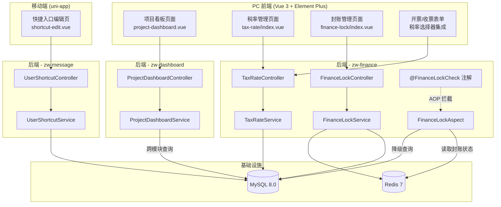
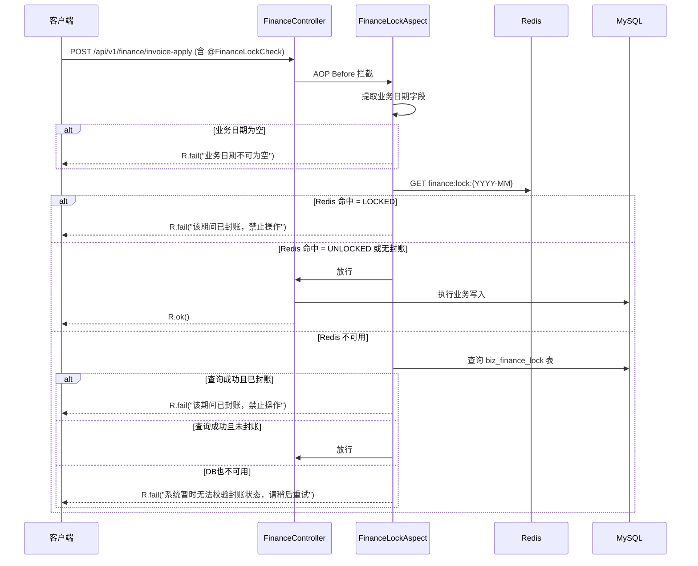

# Design Document: P2 Business Enhance

## Overview

本设计文档描述 ZW-Insight 工程项目管理平台 P2 第二批功能增强的技术实现方案，涵盖三大功能模块：

1. **项目看板（独立项目维度）** — 在已有公司级看板（DashboardController）基础上，新增按单项目聚合的数据看板，跨模块调用 zw-budget/zw-site/zw-contract/zw-finance 的数据
2. **财务封账与税率配置** — 基于 AOP 注解拦截模式（参考现有 @BudgetCheck），实现 @FinanceLockCheck 封账拦截 + 税率字典 CRUD
3. **移动端快捷入口自定义编辑** — 扩展现有 UserShortcutController 的批量保存能力，移动端实现拖拽排序编辑页面

### 设计原则

- 复用现有 AOP 切面模式，@FinanceLockCheck 注解设计与 @BudgetCheck 保持一致风格
- 封账状态通过 Redis 缓存加速查询（缓存 key 为 `finance:lock:{projectId}:{yyyy-MM}`）
- 项目看板聚合层独立为 ProjectDashboardController，不污染已有公司级 DashboardController
- 统一使用 `R<T>` 响应包装和 `PageResult<T>` 分页封装
- 税率以独立 TaxRateController 管理，与财务业务解耦
- 移动端拖拽基于 uni-app 原生 movable-area/movable-view 组件

---

## Architecture

### 系统架构图



### 封账拦截流程



---

## Components and Interfaces

### 1. 项目看板模块 (zw-dashboard)

#### ProjectDashboardController

| 方法 | 路径 | 描述 |
|------|------|------|
| GET | `/api/v1/dashboard/project/{projectId}/budget` | 预算执行数据 |
| GET | `/api/v1/dashboard/project/{projectId}/progress` | 进度完成率 |
| GET | `/api/v1/dashboard/project/{projectId}/contract` | 合同回款数据 |
| GET | `/api/v1/dashboard/project/{projectId}/output` | 产值上报汇总 |
| GET | `/api/v1/dashboard/project/{projectId}/overview` | 聚合四维度数据（一次调用） |

#### ProjectDashboardService

```java
public class ProjectDashboardService {
    // 注入跨模块 Mapper（通过 zw-app 模块依赖打通）
    ProjectDashboardDTO getProjectOverview(Long projectId);
    BudgetExecutionDTO getBudgetExecution(Long projectId);
    ProgressDTO getProgress(Long projectId);
    ContractReceiptDTO getContractReceipt(Long projectId);
    OutputTrendDTO getOutputTrend(Long projectId);
}
```

### 2. 财务封账模块 (zw-finance)

#### FinanceLockController

| 方法 | 路径 | 描述 |
|------|------|------|
| POST | `/api/v1/finance/lock` | 创建封账记录 |
| DELETE | `/api/v1/finance/lock/{id}/unlock` | 解封操作 |
| GET | `/api/v1/finance/lock/page` | 封账记录分页查询 |
| GET | `/api/v1/finance/lock/status` | 查询指定年月封账状态 |

#### @FinanceLockCheck 注解

```java
@Target(ElementType.METHOD)
@Retention(RetentionPolicy.RUNTIME)
public @interface FinanceLockCheck {
    /** 业务日期字段名（默认 "applyDate"，切面通过反射从参数对象中提取该字段值） */
    String dateField() default "applyDate";
}
```

#### FinanceLockAspect

- 拦截标注 @FinanceLockCheck 的方法
- 通过反射从参数对象提取 dateField 对应的日期值
- 优先从 Redis 查询封账状态，降级到 DB 查询
- 封账命中时抛出 BusinessException 阻止执行

### 3. 税率管理模块 (zw-finance)

#### TaxRateController

| 方法 | 路径 | 描述 |
|------|------|------|
| POST | `/api/v1/finance/tax-rate` | 新增税率 |
| PUT | `/api/v1/finance/tax-rate/{id}` | 修改税率 |
| DELETE | `/api/v1/finance/tax-rate/{id}` | 停用税率（逻辑删除） |
| GET | `/api/v1/finance/tax-rate/list` | 查询启用税率列表 |
| GET | `/api/v1/finance/tax-rate/all` | 查询全部税率（含停用） |

### 4. 快捷入口模块 (zw-message)

#### UserShortcutController（扩展现有）

| 方法 | 路径 | 描述 |
|------|------|------|
| GET | `/api/v1/message/shortcut` | 获取用户已选配置（已有） |
| GET | `/api/v1/message/shortcut/available` | 获取全部可选功能列表 |
| POST | `/api/v1/message/shortcut/batch` | 批量保存用户配置（整体替换） |
| PUT | `/api/v1/message/shortcut/sort` | 更新排序（已有） |

---

## Data Models

### 新增数据表

#### biz_finance_lock（财务封账记录表）

| 字段 | 类型 | 说明 |
|------|------|------|
| id | BIGINT PK | 主键 |
| period | VARCHAR(7) | 封账期间，格式 YYYY-MM |
| lock_type | VARCHAR(20) | 封账类型：MONTHLY / QUARTERLY |
| status | VARCHAR(20) | 状态：LOCKED / UNLOCKED |
| project_id | BIGINT | 项目ID（NULL 表示全局封账） |
| lock_by | BIGINT | 封账操作人ID |
| lock_time | DATETIME | 封账时间 |
| unlock_by | BIGINT | 解封操作人ID |
| unlock_time | DATETIME | 解封时间 |
| tenant_code | VARCHAR(50) | 租户编码 |
| create_time | DATETIME | 创建时间 |
| update_time | DATETIME | 更新时间 |
| deleted | TINYINT(1) | 逻辑删除标记 |

**索引**：`uk_period_project(period, project_id, tenant_code)` UNIQUE

#### biz_tax_rate（税率字典表）

| 字段 | 类型 | 说明 |
|------|------|------|
| id | BIGINT PK | 主键 |
| name | VARCHAR(30) | 税率名称 |
| rate_value | DECIMAL(5,2) | 税率数值（如 13.00 表示 13%） |
| status | VARCHAR(20) | 状态：ENABLED / DISABLED |
| tenant_code | VARCHAR(50) | 租户编码 |
| create_time | DATETIME | 创建时间 |
| update_time | DATETIME | 更新时间 |
| deleted | TINYINT(1) | 逻辑删除标记 |

**索引**：`uk_name_tenant(name, tenant_code)` UNIQUE

#### msg_available_shortcut（可选快捷功能定义表）

| 字段 | 类型 | 说明 |
|------|------|------|
| id | BIGINT PK | 主键 |
| name | VARCHAR(50) | 功能名称 |
| icon | VARCHAR(100) | 图标标识 |
| route_path | VARCHAR(200) | 路由路径 |
| sort_order | INT | 默认排序 |
| status | VARCHAR(20) | 状态：ENABLED / DISABLED |
| create_time | DATETIME | 创建时间 |

### 扩展现有表

#### msg_user_shortcut（用户快捷入口表，扩展字段）

增加字段：
- `shortcut_id` BIGINT — 关联 msg_available_shortcut.id（替代直接存储 menuId）

### DTO 结构

#### ProjectDashboardDTO（项目看板聚合响应）

```java
public class ProjectDashboardDTO {
    private BudgetExecutionDTO budget;
    private ProgressDTO progress;
    private ContractReceiptDTO contract;
    private OutputTrendDTO output;
}
```

#### BudgetExecutionDTO

```java
public class BudgetExecutionDTO {
    private BigDecimal totalBudget;       // 预算总额
    private BigDecimal usedAmount;        // 已使用金额
    private BigDecimal usageRate;         // 使用率（保留4位小数）
    private List<SubjectDetailDTO> subjects; // 各科目明细
}

public class SubjectDetailDTO {
    private String subjectName;   // 科目名称
    private BigDecimal budget;    // 预算金额
    private BigDecimal paid;      // 已付金额
    private BigDecimal ratio;     // 占比
}
```

#### ProgressDTO

```java
public class ProgressDTO {
    private Integer totalTasks;        // 总计划任务数
    private Integer completedTasks;    // 已完成任务数
    private BigDecimal completionRate; // 完成百分比（保留4位小数）
}
```

#### ContractReceiptDTO

```java
public class ContractReceiptDTO {
    private BigDecimal contractTotal;   // 施工合同总额
    private BigDecimal invoicedAmount;  // 累计开票金额
    private BigDecimal receivedAmount;  // 累计回款金额
    private BigDecimal receiptRate;     // 回款率（保留4位小数）
}
```

#### OutputTrendDTO

```java
public class OutputTrendDTO {
    private BigDecimal totalOutput;     // 累计上报产值
    private BigDecimal monthOutput;     // 本月产值
    private List<MonthlyOutputDTO> trend; // 近12月趋势
}

public class MonthlyOutputDTO {
    private String month;     // 月份 YYYY-MM
    private BigDecimal amount; // 产值金额
}
```

#### FinanceLockDTO

```java
public class FinanceLockDTO {
    private Long id;
    private String period;       // YYYY-MM
    private String lockType;     // MONTHLY / QUARTERLY
    private String status;       // LOCKED / UNLOCKED
    private Long lockBy;
    private LocalDateTime lockTime;
    private Long unlockBy;
    private LocalDateTime unlockTime;
}
```

#### TaxRateDTO

```java
public class TaxRateDTO {
    private Long id;
    private String name;           // 税率名称
    private BigDecimal rateValue;  // 税率数值
    private String status;         // ENABLED / DISABLED
    private LocalDateTime createTime;
}
```

#### ShortcutBatchSaveRequest

```java
public class ShortcutBatchSaveRequest {
    private List<Long> shortcutIds; // 功能ID列表（按排序顺序）
}
```

#### ShortcutBatchSaveResponse

```java
public class ShortcutBatchSaveResponse {
    private List<Long> savedIds;     // 成功保存的ID列表
    private List<Long> invalidIds;   // 被过滤的无效ID列表
}
```

### Redis 缓存设计

| Key 模式 | Value | TTL | 说明 |
|----------|-------|-----|------|
| `finance:lock:{YYYY-MM}` | `LOCKED` / `UNLOCKED` | 24h | 封账状态缓存 |
| `finance:lock:list` | JSON List | 1h | 全部封账期间列表缓存 |

封账/解封操作时主动刷新相关缓存 key。

---


## Correctness Properties

*A property is a characteristic or behavior that should hold true across all valid executions of a system—essentially, a formal statement about what the system should do. Properties serve as the bridge between human-readable specifications and machine-verifiable correctness guarantees.*

### Property 1: 预算使用率计算正确

*For any* 有效的预算总额（BigDecimal ≥ 0）和已使用金额（BigDecimal ≥ 0），当预算总额 > 0 时，使用率 SHALL 等于 `已使用金额.divide(预算总额, 4, RoundingMode.HALF_UP)`；当预算总额 = 0 时，使用率 SHALL 等于 BigDecimal.ZERO。

**Validates: Requirements 1.1, 9.1**

### Property 2: 回款率计算正确

*For any* 有效的累计回款金额（BigDecimal ≥ 0）和施工合同总额（BigDecimal ≥ 0），当合同总额 > 0 时，回款率 SHALL 等于 `累计回款.divide(合同总额, 4, RoundingMode.HALF_UP)`；当合同总额 = 0 时，回款率 SHALL 等于 BigDecimal.ZERO。

**Validates: Requirements 1.3, 9.2**

### Property 3: 完成百分比计算正确

*For any* 有效的已完成任务数（int ≥ 0）和总计划任务数（int ≥ 0），当总计划 > 0 时，完成百分比 SHALL 等于 `BigDecimal(已完成).divide(BigDecimal(总计划), 4, RoundingMode.HALF_UP)`；当总计划 = 0 时，完成百分比 SHALL 等于 BigDecimal.ZERO。

**Validates: Requirements 1.2, 9.3**

### Property 4: 月度产值趋势升序排列

*For any* 有效项目的产值上报记录集合，ProjectDashboardService 返回的月度趋势列表中，每条记录的月份 SHALL 严格不大于下一条记录的月份（即按月份自然升序排列）。

**Validates: Requirements 1.4, 9.4**

### Property 5: 比率结果为非负 BigDecimal

*For any* 有效的非负输入数据（预算总额、已使用金额、合同总额、回款金额、已完成任务数、总计划任务数），计算得到的使用率、回款率、完成百分比 SHALL 均为 BigDecimal 类型且值 ≥ 0。

**Validates: Requirements 9.5**

### Property 6: 封账期匹配时拦截所有写操作

*For any* 状态为 LOCKED 的封账期间（格式 YYYY-MM）和 *任何* 业务日期年月匹配该期间的财务单据，FinanceLockAspect 对该单据的新增、编辑、删除操作 SHALL 返回校验失败标识并阻止执行。

**Validates: Requirements 4.1, 4.2, 4.3, 10.1**

### Property 7: 非封账期正常放行

*For any* 业务日期的年月不匹配任何状态为 LOCKED 的封账期间的财务单据，FinanceLockAspect SHALL 返回校验通过标识，允许操作继续执行。

**Validates: Requirements 4.5, 10.2**

### Property 8: 解封后等同未封账

*For any* 已被封账然后解封的期间，FinanceLockAspect 对业务日期落在该期间的单据 SHALL 返回校验通过标识，与该期间从未封账时的行为一致。

**Validates: Requirements 4.6, 10.3**

### Property 9: 同期间封账幂等性

*For any* 期间（YYYY-MM），对同一期间执行多次封账操作，系统中 SHALL 仅存在一条该期间的封账状态记录，不产生重复。

**Validates: Requirements 3.4, 10.4**

### Property 10: 无效业务日期拦截

*For any* 业务日期为 null 或格式不符合日期规范（如空串、非日期字符串）的财务单据，FinanceLockAspect SHALL 返回校验失败标识。

**Validates: Requirements 4.7, 10.5**

### Property 11: 封账-解封状态往返

*For any* 合法的封账期间，执行封账→解封→再次封账的操作序列后，该期间状态 SHALL 为 LOCKED 且操作可正常完成。

**Validates: Requirements 3.5**

### Property 12: 税率保存-查询往返一致

*For any* 合法的税率名称（1-30字符非空）和税率数值（0.01-99.99 且不超过2位小数），新增后查询 SHALL 返回相同的名称和数值；修改后查询 SHALL 返回更新后的值。

**Validates: Requirements 5.1, 5.3**

### Property 13: 税率逻辑删除保留数据

*For any* 已启用的税率记录，执行删除操作后，该记录状态 SHALL 变为 DISABLED，且通过全量查询接口仍可找到该记录。

**Validates: Requirements 5.4**

### Property 14: 税率名称唯一性约束

*For any* 已存在的税率名称（无论该记录是 ENABLED 还是 DISABLED 状态），使用相同名称创建或修改税率 SHALL 被拒绝并返回名称重复错误。

**Validates: Requirements 5.5**

### Property 15: 税率数值与名称校验

*For any* 税率数值不在 [0.01, 99.99] 范围内，或小数位超过 2 位的请求，系统 SHALL 拒绝操作；*For any* 税率名称为空或长度超过 30 字符的请求，系统 SHALL 拒绝操作。

**Validates: Requirements 5.6, 5.7**

### Property 16: 快捷入口保存-查询往返一致

*For any* 有效的快捷入口配置（功能ID列表长度 1-20，各ID互不重复且均存在于 Available_Shortcut 集合中），保存后查询 SHALL 返回与保存时相同的功能ID列表且顺序一致。

**Validates: Requirements 7.3, 11.1, 11.3**

### Property 17: 用户配置隔离

*For any* 用户 A 的快捷入口配置保存操作，用户 B 在操作前后通过查询接口获得的功能ID列表和排序 SHALL 完全不变。

**Validates: Requirements 7.5, 11.2**

### Property 18: 无效ID过滤逻辑

*For any* 包含部分有效和部分无效功能ID的保存请求，系统 SHALL 仅保存有效ID部分，响应中 SHALL 包含被过滤的无效ID列表，且保存后查询返回的列表仅包含有效ID。

**Validates: Requirements 7.6**

### Property 19: 重复ID去重保留首次位置

*For any* 包含重复功能ID的保存请求，系统 SHALL 对重复项去重且仅保留首次出现的顺序位置，保存后查询结果的数量等于去重后的数量。

**Validates: Requirements 11.5**

### Property 20: 空列表清空配置

*For any* 用户，当保存请求的功能ID列表为空时，系统 SHALL 清空该用户的快捷入口配置，后续查询 SHALL 返回空列表。

**Validates: Requirements 11.4**

### Property 21: 封账记录查询按期间倒序

*For any* 封账记录列表查询结果，列表中每条记录的期间（YYYY-MM） SHALL 不小于下一条记录的期间（即按期间降序排列）。

**Validates: Requirements 3.3**

### Property 22: 税率列表按创建时间升序

*For any* 启用状态税率列表查询结果，列表中每条记录的 createTime SHALL 不大于下一条记录的 createTime（即按创建时间升序排列）。

**Validates: Requirements 5.2**

---

## Error Handling

### 后端错误处理策略

| 场景 | 错误码 | 错误信息 | 处理方式 |
|------|--------|----------|----------|
| 项目不存在 | 404 | "项目[{id}]不存在" | 直接返回，不抛异常 |
| 无项目权限 | 403 | "您无权限访问该项目" | 权限拦截器统一处理 |
| 封账期间已存在 | 400 | "期间{period}已封账，不可重复操作" | BusinessException |
| 不可对未来期间封账 | 400 | "不可对未来期间封账" | BusinessException |
| 封账拦截 | 403 | "期间{period}已封账，禁止{operation}" | BusinessException（AOP抛出） |
| 业务日期为空 | 400 | "业务日期不可为空" | BusinessException（AOP抛出） |
| 封账状态查询失败 | 503 | "系统暂时无法校验封账状态，请稍后重试" | BusinessException（AOP抛出） |
| 税率名称重复 | 400 | "税率名称[{name}]已存在" | BusinessException |
| 税率数值不合法 | 400 | "税率数值不合法，需在0.01-99.99之间且不超过2位小数" | BusinessException |
| 税率名称不合法 | 400 | "税率名称不合法，需1-30个字符" | BusinessException |
| 快捷入口超限 | 400 | "快捷入口数量超出上限（最多8个）" | BusinessException |
| 快捷入口无有效项 | 400 | "无有效功能项可保存" | BusinessException |
| 非财务管理员操作 | 403 | "权限不足，需财务管理员角色" | 权限注解统一拦截 |

### Redis 降级策略

1. FinanceLockAspect 优先从 Redis 读取封账状态
2. Redis 不可用时降级到 DB 查询 `biz_finance_lock` 表
3. DB 也不可用时，**拒绝当前操作**并返回 503 错误，不允许静默放行
4. 降级事件记录 WARN 日志，便于运维排查

### 前端错误处理

- PC 端项目看板：单个维度接口失败不影响其他维度的正常展示，失败维度展示错误提示
- 税率列表加载失败：表单仍允许手动输入税率数值，展示"税率列表不可用"提示
- 移动端保存失败：展示失败提示，保留编辑状态允许重试
- 移动端保存超时（10s）：展示超时提示，不丢弃用户编辑内容

---

## Testing Strategy

### 属性测试 (Property-Based Testing)

**PBT 库**：jqwik 1.9.1（项目已集成）

**配置要求**：
- 每个属性测试最少运行 100 次迭代
- 每个测试方法以注释标注对应的设计属性编号
- 标签格式：`Feature: p2-business-enhance, Property {number}: {property_text}`

**测试分组**：

| 属性编号 | 测试类 | 测试范围 |
|----------|--------|----------|
| P1-P5 | `ProjectDashboardPropertyTest` | 看板计算逻辑 |
| P6-P11, P21 | `FinanceLockPropertyTest` | 封账拦截逻辑 |
| P12-P15, P22 | `TaxRatePropertyTest` | 税率管理逻辑 |
| P16-P20 | `ShortcutConfigPropertyTest` | 快捷入口配置逻辑 |

**生成器设计**：

- `BigDecimal` 生成器：范围 0 - 999,999,999.99，精度2位小数
- 期间生成器：生成合法的 YYYY-MM 字符串（2020-01 到当前月份）
- 税率名称生成器：1-30 个中文/英文字符
- 税率数值生成器：合法范围 0.01-99.99 和非法范围的混合
- 功能ID列表生成器：从固定可选集合中抽取 1-20 个不重复 ID

### 单元测试

**框架**：JUnit 5 + Mockito

| 测试类 | 覆盖场景 |
|--------|----------|
| `FinanceLockServiceTest` | 封账/解封/查询业务逻辑 |
| `FinanceLockAspectTest` | AOP拦截行为（Mock Redis + DB） |
| `TaxRateServiceTest` | 税率 CRUD + 校验 |
| `UserShortcutServiceTest` | 批量保存/过滤/去重 |
| `ProjectDashboardServiceTest` | 跨模块数据聚合 |

**单元测试关注**：
- 封账/解封角色权限校验
- Redis 不可用降级行为
- 季度封账展开为3个月
- 税率边界值（0.01/99.99/超限）
- 快捷入口数量上限/下限

### 集成测试

| 测试场景 | 依赖 |
|----------|------|
| 封账拦截端到端 | MySQL + Redis (Testcontainers) |
| 项目看板聚合查询 | MySQL (Testcontainers) |
| 快捷入口批量保存 | MySQL (Testcontainers) |

### 前端测试

| 测试类型 | 工具 | 覆盖 |
|----------|------|------|
| 组件测试 | Vitest + @vue/test-utils | 税率选择器、项目看板图表配置 |
| E2E | Cypress (可选) | 移动端快捷入口编辑流程 |

---
