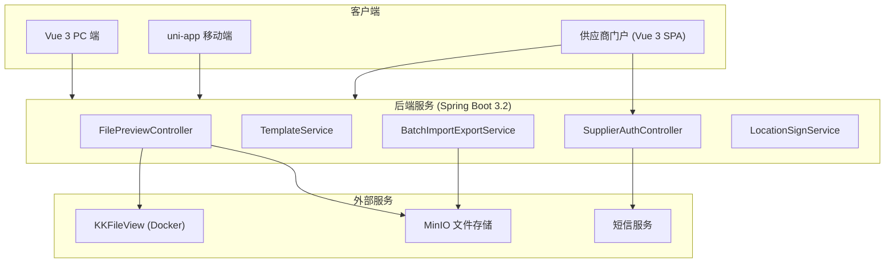

# Design Document: P2 体验增强

## Overview

本设计文档描述 ZW-Insight 工程项目管理系统 P2 优先级的 7 个体验增强功能的技术方案。涵盖移动端业务页面补全、材料退货、供应商门户、文件预览/模板管理、批量导入导出、甘特图渲染和移动端离线增强。

技术栈：Spring Boot 3.2 + MyBatis-Plus + Vue 3 + Element Plus + uni-app + MySQL + Redis 7 + MinIO + dhtmlx-gantt + EasyExcel + KKFileView。

### 设计决策

| 决策 | 选型 | 理由 |
|------|------|------|
| 文件预览 | KKFileView (Docker) | 开源免费、支持 Office/PDF/图片、Docker 一键部署 |
| 批量导入导出 | EasyExcel | 内存友好、流式读写、项目已引入 |
| 甘特图 | dhtmlx-gantt | 项目已安装、功能完善、支持拖拽和关键路径 |
| 供应商认证 | 短信验证码 + JWT | 轻量级独立认证、无需复杂权限体系 |
| 离线缓存 | uni.setStorageSync | uni-app 原生支持、简单可靠 |
| 水印合成 | Canvas API | 不可被简单移除、跨平台兼容 |
| 异步导出 | Spring @Async + Redis 状态 | 大文件非阻塞、状态可查询 |

---

## Architecture

### 系统架构图



---

## Components and Interfaces

### 1. 移动端业务页面

**纯前端开发**，复用已有后端 API，无需新增后端代码。

| 页面 | API | 路径 |
|------|-----|------|
| 收票登记 | POST /api/v1/finance/invoice-received | pages/finance/invoice-received |
| 其他费用付款 | POST /api/v1/finance/other-payment | pages/finance/other-payment |
| 备用金申请 | POST /api/v1/finance/reserve-fund/apply | pages/finance/reserve-fund-apply |
| 备用金归还 | POST /api/v1/finance/reserve-fund/return | pages/finance/reserve-fund-return |
| 个人报销 | POST /api/v1/finance/personal-reimbursement | pages/finance/personal-reimbursement |
| 材料退货 | POST /api/v1/material/outbound (type=RETURN) | pages/material/return |

### 2. 供应商门户

**独立项目**：`zw-supplier-portal/`（Vue 3 + Vite + Tailwind CSS）

```java
// 后端新增：供应商认证 Controller
@RestController
@RequestMapping("/api/v1/supplier-portal")
public class SupplierPortalController {
    POST /auth/send-code    // 发送短信验证码
    POST /auth/login        // 验证码登录，返回 JWT
    GET  /inquiry/list      // 获取被邀请的询价列表
    GET  /inquiry/{id}      // 询价详情
    POST /quotation         // 提交报价
    GET  /quotation/mine    // 我的报价记录
}
```

**数据模型新增**：
```sql
CREATE TABLE sys_supplier_account (
    id BIGINT PRIMARY KEY,
    supplier_id BIGINT NOT NULL,
    phone VARCHAR(20) NOT NULL,
    status TINYINT DEFAULT 1,
    last_login_at DATETIME,
    UNIQUE KEY uk_phone (phone)
);
```

### 3. 文件预览服务

**部署架构**：docker-compose 新增 KKFileView 容器

```yaml
# docker-compose.yml 新增
kkfileview:
  image: keking/kkfileview:4.4.0
  ports:
    - "8012:8012"
  environment:
    - KK_FILE_DIR=/opt/file
```

**后端接口**：
```java
@RestController
@RequestMapping("/api/v1/file")
public class FilePreviewController {
    GET /preview-url?fileId={id}  // 返回 KKFileView 预览 URL
}
```

预览 URL 生成逻辑：`http://kkfileview:8012/onlinePreview?url={base64EncodedMinIOUrl}`

### 4. 模板管理

**数据模型**：
```sql
CREATE TABLE sys_template (
    id BIGINT PRIMARY KEY,
    template_name VARCHAR(100) NOT NULL,
    template_type VARCHAR(20) NOT NULL COMMENT 'IMPORT/EXPORT/PRINT',
    module_code VARCHAR(50) NOT NULL,
    file_id BIGINT COMMENT 'MinIO文件ID(IMPORT/EXPORT)',
    template_content TEXT COMMENT 'HTML内容(PRINT)',
    is_default TINYINT DEFAULT 0,
    tenant_id BIGINT,
    created_at DATETIME DEFAULT CURRENT_TIMESTAMP
);
```

### 5. 批量导入导出

**核心组件**：
```java
public interface BatchImportService {
    ImportResult importData(String moduleCode, MultipartFile file);
    Long asyncExport(String moduleCode, Map<String, Object> params);
    ExportStatus getExportStatus(Long taskId);
}
```

**异步导出流程**：
1. 用户请求导出 → 创建异步任务 → 返回 taskId
2. @Async 执行 EasyExcel 写入 → 上传 MinIO → 更新 Redis 状态
3. 前端轮询状态 → 完成后获取下载 URL

**Redis 状态 Key**：`export:task:{taskId}` → `{status, fileUrl, progress}`

### 6. 甘特图组件

**纯前端组件**，位于 `zw-insight-web/src/components/GanttChart.vue`

```typescript
// Props
interface GanttProps {
  projectId: number
  editable?: boolean  // 是否允许拖拽编辑
}

// 数据格式转换：后端 ScheduleController → dhtmlx-gantt
interface GanttTask {
  id: number
  text: string
  start_date: string
  end_date: string
  progress: number
  parent: number
  predecessors?: string  // "2FS,3FS"
}
```

**集成位置**：替换 `src/views/site/schedule/index.vue` 中的表格展示

### 7. 离线缓存/水印/签到

**离线缓存架构**：
```
[用户操作] → [离线检测] → [有网] → 直接提交API
                         → [无网] → 存入 uni.setStorageSync → [网络恢复] → 逐条同步
```

**水印合成**（uni-app Canvas）：
```javascript
// 使用 uni.createCanvasContext 合成水印
function addWatermark(imagePath, watermarkInfo) {
  // 1. 绘制原图
  // 2. 底部半透明黑色条
  // 3. 白色文字：时间 + 姓名 + 位置 + 项目名
  // 4. 导出合成后图片
}
```

**签到数据模型**：
```sql
CREATE TABLE biz_sign_record (
    id BIGINT PRIMARY KEY,
    user_id BIGINT NOT NULL,
    project_id BIGINT NOT NULL,
    sign_time DATETIME NOT NULL,
    latitude DECIMAL(10,7),
    longitude DECIMAL(10,7),
    address VARCHAR(200),
    is_in_range TINYINT DEFAULT 1,
    tenant_id BIGINT,
    created_at DATETIME DEFAULT CURRENT_TIMESTAMP
);
```

---

## Testing Strategy

| 模块 | 测试方式 |
|------|---------|
| 移动端页面 | 手动测试 + uni-app 预览 |
| 供应商门户 | Playwright E2E 测试 |
| 文件预览 | 接口测试（各文件格式） |
| 批量导入 | JUnit 单元测试 + 集成测试 |
| 甘特图 | Vitest 组件测试 |
| 离线/水印/签到 | 真机测试 |
