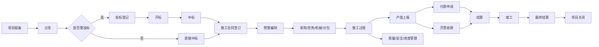

# ZW-Insight 工程项目管理系统 - 完整架构分析报告

## 📋 执行摘要

**分析时间**: 2026-08-09  
**项目定位**: SaaS 化的建筑工程全生命周期管理平台，面向建筑/工程企业  

**核心特点**:
- ✅ 22 个后端模块 Maven 多模块单体架构
- ✅ PC 端（Vue3）+ 移动端（uni-app）+ 供应商门户三端协同
- ✅ 覆盖项目报备→投标→合同→预算→施工→财务→结算→归档全链路
- ✅ 多租户隔离 + Flowable 审批流 + MinIO 文件存储
- ✅ 整体完成度约 85%，205 个功能点中已实现约 174 个

---

## 一、系统架构总览

### 1.1 技术栈全景

```yaml
后端栈:
  框架：Spring Boot 3.2.6 + JDK 21
  ORM: MyBatis-Plus 3.5.5
  数据库：MySQL 8.0 (主从复制)
  缓存：Redis 7 (哨兵模式)
  消息队列：RabbitMQ 3.12 (管理界面)
  流程引擎：Flowable 7.0.1
  对象存储：MinIO 8.5.9
  JWT 认证：jjwt 0.12.5
  工具库：Hutool 5.8.26
  Excel 处理：EasyExcel 3.3.4
  API 文档：Knife4j 4.4.0

前端栈:
  PC 框架：Vue 3.4 + TypeScript + Vite 5.2
  UI 组件：Element Plus 2.6
  状态管理：Pinia 2.1
  路由：Vue Router 4.3
  图表：ECharts 5.5
  甘特图：dhtmlx-gantt 8.0
  流程设计：bpmn-js 17.11
  
移动端栈:
  框架：uni-app (跨平台)
  编译目标：H5 / iOS / Android / 微信小程序

部署栈:
  Docker Compose 本地开发
  Nginx 生产反向代理
  KKFileView 文件在线预览
```

### 1.2 模块化分层架构

```
┌─────────────────────────────────────────────────────────────┐
│                      客户端层                                 │
│  ┌──────────┐  ┌──────────────┐  ┌──────────────────┐     │
│  │ PC Web   │  │ 移动端(uni-app)│  │ 供应商报价门户   │     │
│  │ Vue3+TS  │  │ H5/iOS/Android│  │ Vue3 SPA        │     │
│  └────┬─────┘  └──────┬───────┘  └────────┬─────────┘     │
└───────┼────────────────┼───────────────────┼───────────────┘
        │                │                   │
        └────────────────┼───────────────────┘
                         │ HTTPS
┌────────────────────────┼──────────────────────────────────┐
│              Nginx 反向代理                                │
└────────────────────────┼──────────────────────────────────┘
                         │
┌────────────────────────┼──────────────────────────────────┐
│          Spring Boot 单体应用 (22 个 Maven 模块)             │
│                                                            │
│  ┌────────────────────────────────────────────────────┐   │
│  │ zw-common            # 公共模块                    │   │
│  │ zw-security          # 认证授权 + 多租户           │   │
│  │ zw-system            # 系统管理 (机构/人员/角色)    │   │
│  │ zw-workflow          # Flowable 审批封装           │   │
│  │ zw-message           # 消息通知                    │   │
│  │ zw-file              # 文件服务 (MinIO)            │   │
│  │ zw-project           # 项目管理                    │   │
│  │ zw-tender            # 投标管理                    │   │
│  │ zw-contract          # 合同管理                    │   │
│  │ zw-budget            # 预算管理                    │   │
│  │ zw-purchase          # 采购管理                    │   │
│  │ zw-labor             # 劳务管理                    │   │
│  │ zw-material          # 材料库存                    │   │
│  │ zw-machine           # 机械管理                    │   │
│  │ zw-subcontract       # 分包管理                    │   │
│  │ zw-site              # 现场管理                    │   │
│  │ zw-finance           # 财务管理                    │   │
│  │ zw-hr                # 行政人事                    │   │
│  │ zw-archive           # 档案管理 (只读视图)         │   │
│  │ zw-dashboard         # 数据看板                    │   │
│  │ zw-basedata          # 基础数据                    │   │
│  │ zw-app               # 启动模块                    │   │
│  └────────────────────────────────────────────────────┘   │
└────────────┬──────────────┬───────────┬──────────┬────────┘
             │              │           │          │
        ┌────┴────┐ ┌──────┴───┐ ┌─────┴──┐ ┌─────┴────┐
        │  MySQL  │ │  Redis   │ │ MinIO  │ │ RabbitMQ │
        │ 主从复制 │ │ 哨兵模式 │ │        │ │          │
        └─────────┘ └──────────┘ └────────┘ └──────────┘
```

### 1.3 核心业务链路



---

## 二、22 个模块详细分析

### 2.1 核心业务模块（按优先级排序）

#### **1. zw-security - 认证安全模块** ✅ 100% 完成
- JWT Token 登录/登出/刷新机制
- BCrypt 密码加密
- 图形验证码 + 短信验证码
- IP 锁定防御暴力破解
- 多租户 tenantCode 解析
- **关键类**: `AuthService.java`, `JwtTokenProvider.java`

#### **2. zw-system - 系统管理模块** ✅ 95% 完成
- 机构/人员/角色/菜单 CRUD
- 数据字典/岗位管理
- 操作日志/登录日志/异常日志审计
- 多租户管理 (SysTenantController)
- **遗留项**: 批量启用停用用户接口

#### **3. zw-project - 项目管理模块** ✅ 95% 完成
- 项目报备→投标→中标→施工→竣工→关闭全流程
- 项目成员管理 (ProjectMemberController)
- 工程进度甘特图 (后端 /schedule-gantt + PC 端可视化)
- **关键表**: `biz_project`, `biz_project_member`

#### **4. zw-contract - 合同管理模块** ✅ 95% 完成
- **施工合同**: CRUD + 变更签证 + BOQ 工程量清单
- **BOQ 服务**: Excel 上传→60 秒内解析 5000 条→树形层级存储
- 产值上报 (OutputReportController) → 回写合同累计
- 竣工结算 (FinalSettlementController) → 自动汇总收支
- **遗留项**: 合同模板管理、合同到期预警任务
- **关键 Controller**: ContractController, BoqController, QuantityListController

#### **5. zw-budget - 预算管理模块** ✅ 95% 完成
- 目标成本编制 (BudgetController) + 明细
- 预算控制配置 (BudgetControlConfigController): 
  - 三种模式：仅提醒/WARN_ONLY、禁止提交/BLOCK、免控/EXEMPT
  - 预警阈值配置 (50%-99%)
- 预算变更 (BudgetChangeController): 
  - 创建变更记录→关联原预算→审批→累加调整金额
  - 变更轨迹保留 (change_detail 表)
- AOP 预算校验 (`@BudgetCheck` 注解拦截器)
- **遗留项**: 预算执行率看板图表、预算预警通知任务

#### **6. zw-purchase - 采购管理模块** ✅ 90% 完成
- 采购合同 CRUD + 三方比价
- 询价单流程：创建→发布→供应商报价→定标确认
- 供应商门户独立站 (zw-supplier-portal)
- **遗留项**: 采购退货/退款流程、供应商免登公开报价页面

#### **7. zw-labor - 劳务管理模块** ✅ 95% 完成
- 劳务合同 + 班组管理 + 花名册 (Excel 批量导入)
- 用工单/派工单→工资单汇总→审批
- 薪资统计 (SalaryStatisticsController): 
  - 汇总/明细/月报/同比环比
  - PC 端 salary/stats.vue
- **遗留项**: 考勤打卡集成、计件/计时工资自动核算规则

#### **8. zw-material - 材料库存模块** ✅ 85% 完成
- 入库/出库/调拨/盘点全流程
- 库存实时更新 + 加权平均单价计算
- 直接出库 (入库时直接领用，自动生成出库单)
- **遗留项**: 库存预警、物资台账报表、条形码扫码入库

#### **9. zw-machine - 机械管理模块** ✅ 90% 完成
- 机械合同 + 台账 CRUD
- 进退场 (REGISTERED→IN_FIELD→OUT_FIELD 状态机)
- 工作日志/台班记录/加油/维修管理
- 机械结算→回写合同累计
- **遗留项**: 工作量汇总结算、油耗统计报表、租赁费自动计算

#### **10. zw-subcontract - 分包管理模块** ✅ 80% 完成
- 分包合同 CRUD + 产值上报 + 结算
- 奖惩管理
- **遗留项**: 分包进度跟踪、分包商履约评价、工程量清单明细

#### **11. zw-site - 现场管理模块** ✅ 90% 完成
- 进度计划树形结构 + 甘特图可视化
- 进度反馈→审批
- 施工日志 (按日期范围筛选)
- 质量安全检查 + 整改管理
- 定位签到 (SignController: GPS/蓝牙打卡)
- **遗留项**: 整改超期催办任务

#### **12. zw-finance - 财务管理模块** ✅ 95% 完成
- **应收**: 开票申请→回款登记→质保金返还
- **应付**: 付款申请 (含预算校验) →报销/备用金
- 项目最终结算 (ProjectSettlementController): 
  - 自动汇总收入/支出/利润/利润率
  - 导出 Excel + 未结清合同列表
- **质保金预警定时任务** (RetentionWarningTask): 
  - 每日 08:00 执行
  - 30 天分级预警：即将到期 (30-8 天) + 紧急到期 (7-1 天) + 逾期未退 (超过到期日)
  - Redis 去重 (retentionId:warningLevel)
- **遗留项**: 资金计划、财务封账、税率配置

### 2.2 辅助支撑模块

#### **13. zw-tender - 投标管理模块** ✅ 90% 完成
- 投标报名/登记→任务分配→费用缴纳
- 保证金管理 (申请 + 退还)
- 开标记录→中标后自动更新项目状态为 WON
- **遗留项**: 投标保证金到期预警、证书到期提醒

#### **14. zw-hr - 行政人事模块** ✅ 75% 完成
- 入职申请→审批通过自动创建账号
- 办公用品出入库
- 车辆管理 (用车申请 + 维保)
- 转正/离职/调转/用章申请
- **遗留项**: 人事花名册、薪酬管理、绩效考核、假期管理

#### **15. zw-workflow - 工作流引擎模块** ✅ 95% 完成
- Flowable 7.0 集成
- 流程设计器 (bpmn.js) + 定义管理
- 审批操作：通过/退回上一步/退回发起人/终止/转办/委托
- 待办/已办任务查询
- 审批数据回滚 (ApprovalRollbackController)
- **遗留项**: 流程监控页面、审批统计指标

#### **16. zw-message - 消息通知模块** ✅ 85% 完成
- 站内消息/公告/推送配置
- 消息模板管理
- WebSocket 实时推送
- **遗留项**: 短信发送实际对接 (阿里云 SDK)、企业微信对接

#### **17. zw-archive - 档案管理模块** ✅ 70% 完成
- 项目/投标/预算/合同/供应商/人事档案聚合查询
- 移动端查看
- **遗留项**: 档案搜索、借阅流程、电子签章集成

#### **18. zw-dashboard - 数据看板模块** ✅ 75% 完成
- 公司概览 (项目数/合同额/收支汇总)
- 预算执行监控/应收款/应付监控
- 投标分析/库存分析
- **遗留项**: 利润分析趋势图、项目排名、自定义看板拖拽

#### **19. zw-basedata - 基础数据模块** ✅ 90% 完成
- 材料字典 + 分类 (树形)
- 供应商管理 (黑名单 + 评价)
- 甲方单位/自持公司管理
- 检查方案管理 (用于安全检查关联)
- **遗留项**: 材料价格信息库、供应商评价规则

#### **20. zw-file - 文件管理模块** ✅ 85% 完成
- MinIO 集成 (上传/下载/预览)
- 文件关联业务记录
- 批量导入导出 (BatchImportExportController)
- KKFileView 在线预览
- **遗留项**: 文件版本管理、回收站

#### **21. zw-app - 启动模块**
- Spring Boot Application 入口
- 扫描所有模块包路径

---

## 三、核心业务逻辑详解

### 3.1 项目全生命周期状态流转

```sql
项目状态枚举 (biz_project.status):
  DRAFT      -- 草稿阶段
  FILED      -- 已报备
  TENDERING  -- 投标中
  WON        -- 已中标
  CONSTRUCTION -- 施工中
  COMPLETED  -- 已竣工
  CLOSED     -- 已关闭

状态流转规则:
  DRAFT → FILED: 提交审批通过后
  FILED → TENDERING: 投标登记创建
  TENDERING → WON: 开标记录中标确认后
  WON → CONSTRUCTION: 施工合同签订生效
  CONSTRUCTION → COMPLETED: 竣工验收审批通过
  COMPLETED → CLOSED: 最终结算审批通过
```

### 3.2 预算控制拦截器 (@BudgetCheck)

**实现位置**: `budget/service/BudgetControlAspect.java`

```java
@Aspect
@Component
public class BudgetControlAspect {
    
    @Before("@annotation(budgetCheck)")
    public void checkBudget(JoinPoint joinPoint, BudgetCheck budgetCheck) {
        // 1. 提取参数：projectId, costCategory, amount
        Long projectId = extractProjectId(joinPoint);
        BigDecimal amount = extractAmount(joinPoint);
        
        // 2. 查询预算余额
        BigDecimal remaining = budgetService.getRemainingBudget(projectId, costCategory);
        
        // 3. 获取控制配置
        BudgetControlConfig config = configService.getConfig(projectId);
        
        // 4. 执行校验逻辑
        if (amount.compareTo(remaining) > 0) {
            switch (config.getControlMode()) {
                case BLOCK:
                    throw new BusinessException("预算不足，禁止提交");
                case WARN_ONLY:
                    budgetWarningService.record(...);
                    // 允许继续但记录警告
                    break;
                case EXEMPT:
                    // 跳过校验
                    break;
            }
        }
    }
}
```

### 3.3 数据回写机制 (领域事件)

**场景**: 产值上报审批通过 → 回写合同累计产值 → 回写项目累计产值

```java
// 1. 领域事件定义
public class OutputReportApprovedEvent {
    private Long projectId;
    private Long contractId;
    private BigDecimal currentOutput;
}

// 2. 事件发布 (OutputReportService.java)
@Transactional
public void onApproved(Long reportId) {
    OutputReport report = getById(reportId);
    eventPublisher.publish(new OutputReportApprovedEvent(
        report.getProjectId(),
        report.getContractId(),
        report.getCurrentOutput()
    ));
}

// 3. 事件监听器 (EventListener.java)
@Component
public class OutputReportEventListener {
    @EventListener
    @Transactional
    public void handle(OutputReportApprovedEvent event) {
        // 回写施工合同
        contractService.addCumulativeOutput(event.getContractId(), event.getCurrentOutput());
        // 回写项目
        projectService.addCumulativeOutput(event.getProjectId(), event.getCurrentOutput());
    }
}
```

### 3.4 自动编号服务 (SerialNumberService)

**场景**: 合同编号 HT-202606-0001、项目编号 PRJ-202606-001

```java
@Service
public class SerialNumberService {
    
    public String generate(String businessType, Long tenantId) {
        // 1. 获取编号规则配置
        NumberRule rule = ruleMapper.findByType(businessType, tenantId);
        // 例：HT-{yyyy}{MM}-{####}
        
        // 2. 日期部分
        String datePart = LocalDate.now().format(DateTimeFormatter.ofPattern("yyyyMMdd"));
        
        // 3. Redis 原子递增获取流水号
        String key = "serial:" + tenantId + ":" + businessType + ":" + datePart;
        Long seq = redisTemplate.opsForValue().increment(key);
        
        // 4. 设置过期 (月底过期用于按月重置)
        if (seq == 1L) {
            redisTemplate.expire(key, getMonthRemainingSeconds(), TimeUnit.SECONDS);
        }
        
        // 5. 拼接编号
        String seqStr = String.format("%0" + rule.getSeqLength() + "d", seq);
        return rule.getPrefix() + datePart + "-" + seqStr;
    }
}
```

### 3.5 审批回滚机制 (ApprovalRollback)

**场景**: 审批被驳回 → 恢复数据到审批前状态

```java
@Service
public class ApprovalRollbackService {
    
    // 审批通过时注册回写操作
    @Transactional
    public void registerWriteBack(String processInstanceId, RollbackAction action) {
        rollbackActionMapper.insert(processInstanceId, action);
        // action: {表名，字段名，ID, 操作类型 ADD/SET, 原值}
    }
    
    // 审批退回时执行回滚
    @Transactional
    public void rollback(String processInstanceId) {
        List<RollbackAction> actions = rollbackActionMapper.findByProcessId(processInstanceId);
        Collections.reverse(actions); // 逆序执行
        
        for (RollbackAction action : actions) {
            executeRollback(action);
            // SQL: UPDATE biz_xxx SET column = #{originalValue} WHERE id = #{id}
        }
        
        // 删除回滚记录
        rollbackActionMapper.deleteByProcessId(processInstanceId);
    }
}
```

---

## 四、数据库核心模型

### 4.1 租户隔离策略

**设计**: 共享数据库 + 租户字段隔离

```sql
-- 每张业务表必须有 tenant_id 字段
CREATE TABLE biz_contract (
    id BIGINT PRIMARY KEY AUTO_INCREMENT,
    tenant_id BIGINT NOT NULL,        -- 租户 ID
    project_id BIGINT NOT NULL,
    contract_code VARCHAR(50),
    ...
    INDEX idx_tenant (tenant_id)
);

-- MyBatis-Plus TenantLineInterceptor 自动注入租户条件
// SELECT * FROM biz_contract WHERE tenant_id = #{currentTenantId}
```

### 4.2 核心业务表

#### **biz_project (项目主表)**
```sql
project_code VARCHAR(32)  -- 项目编号 PRJ-YYYYMM-NNN
project_name VARCHAR(200)
project_nature VARCHAR(50)  -- 新建/改建/扩建
project_type VARCHAR(50)  -- 市政工程/房建/公路...
status VARCHAR(20)  -- DRAFT/FILED/TENDERING/WON/CONSTRUCTION/COMPLETED/CLOSED
budget_amount DECIMAL(18,2)  -- 项目预算金额
contract_amount DECIMAL(18,2)  -- 合同总额
cumulative_output DECIMAL(18,2)  -- 累计产值
total_income DECIMAL(18,2)  -- 总收入
total_expense DECIMAL(18,2)  -- 总支出
```

#### **biz_construction_contract (施工合同)**
```sql
contract_code VARCHAR(50)  -- HT-YYYYMM-NNN
contract_type VARCHAR(20)  -- REGISTER/CHANGE/SUPPLEMENT
contract_amount DECIMAL(18,2)
cumulative_change_amount DECIMAL(18,2)  -- 累计变更
cumulative_output DECIMAL(18,2)  -- 累计产值
cumulative_invoice_amount DECIMAL(18,2)  -- 累计开票
cumulative_received_amount DECIMAL(18,2)  -- 累计收款
workflow_instance_id VARCHAR(64)  -- Flowable 流程实例 ID
```

#### **biz_budget (预算主表)**
```sql
budget_type VARCHAR(20)  -- ORIGINAL/CHANGE
change_seq INT DEFAULT 0  -- 变更序号 (编制为 0，第 1 次变更=1)
total_amount DECIMAL(18,2)
workflow_instance_id VARCHAR(64)
```

#### **biz_boq_item (工程量清单条目)**
```sql
contract_id BIGINT NOT NULL
parent_id BIGINT DEFAULT 0  -- 父子层级 (最多 4 级)
item_code VARCHAR(50)  -- 项目编码 1/1.1/1.1.1
item_name VARCHAR(200)
unit VARCHAR(20)  -- 吨/m²/m³
quantity DECIMAL(18,4)  -- 工程数量
unit_price DECIMAL(18,4)  -- 综合单价
total_price DECIMAL(18,2)  -- 合价
completed_quantity DECIMAL(18,4)  -- 已完成工程量
sort_order INT  -- 排序
```

#### **biz_payment_apply (付款申请)**
```sql
contract_id BIGINT  -- 请款合同 ID
contract_category VARCHAR(20)  -- MATERIAL/LABOR/MACHINE/SUBCONTRACT
supplier_id BIGINT  -- 供应商 ID
payment_amount DECIMAL(18,2)  -- 本次付款金额
cumulative_settlement DECIMAL(18,2)  -- 快照：累计结算金额
unpaid_amount DECIMAL(18,2)  -- 快照：未付金额
workflow_instance_id VARCHAR(64)
```

---

## 五、前后端一致性现状

### 5.1 审计工具 (consistency-audit)

**位置**: `tools/consistency-audit/`

**扫描三方**:
- Backend: Spring Controller 注解 (@RequestMapping, @GetMapping...)
- PC Frontend: api/*.ts文件 (axios 调用)
- Mobile Frontend: uni-app/api/*.ts

**审计报告输出**:
- JSON: `audit-reports/audit-report-{timestamp}.json`
- Markdown: `audit-reports/audit-report-{timestamp}.md`

### 5.2 当前一致性状态

**已解决**: 63 项核心错位全部对齐
- HTTP 方法不匹配 38 项 → 已修改前端
- 前端多余 API 25 项 → 已清理或后端补充

**残留 Minor 项**:
- 后端孤儿 API (预留扩展)
- 前端超范围实现 (未使用)

**参考文档**:
- `audit-reports/alignment-ledger.md` (详细台账)
- `audit-reports/rest-convention.md` (REST 约定规范)

---

## 六、测试体系架构

### 6.1 五层金字塔

```
L5: Playwright E2E (真实模式/Mock 模式/Consistency 模式)
L4: lifecycle-sim-v2.sh (19 阶段业务闭环测试)
L3: Shell API 脚本 (8 个模块契约验证)
L2: Integration Test (@SpringBootTest + Testcontainers)
L1: Unit Test (JUnit5 + Mockito + AssertJ)
```

### 6.2 测试覆盖率基线

**当前状态** (截至 2026-08-05):
- zw-material: 72.0% ✅
- zw-budget: 71.8% ✅
- zw-purchase: 70.5% ✅
- zw-labor: 70.3% ✅
- zw-finance: 64.8% ⚠️
- zw-contract: 62.0% ✅
- zw-subcontract: 62.5% ✅
- zw-machine: 49.0% 🟡
- zw-project: 51.0% 🟡
- zw-hr: 14.9% 🔴
- zw-file: 7.4% 🔴 (正在补测)

**CI 门禁**: pom jacoco check ≥ 60% (verify 阶段)

### 6.3 自动化测试租户

**租户 ID**: 9999 (T9999admin 账号)

**数据隔离**:
- DELETE WHERE tenant_id=9999 兜底清理
- CREATED_IDS 数组追踪资源
- trap EXIT 钩子确保异常退出时清理

**参考**: `keys/lifecycle-sim-v2.sh`, `tests/run-all-tests.sh`

---

## 七、Spec 驱动开发实践

### 7.1 Spec 目录结构

```
.kiro/specs/
├── zw-insight-platform/      # 平台整体架构
├── p0-core-features/         # P0 核心缺失功能
├── p0-data-permission-overdue/  # 数据权限&逾期提醒
├── p1-business-completion/   # P1 业务补充
├── p1-system-integrity/      # P1 系统完整性
├── p2-advanced/              # P2 高级功能
├── frontend-backend-integration/  # 前后端联调
├── consistency-audit/        # 一致性审计工具
└── test-maturity-upgrade/    # 测试成熟度升级
```

每个 Spec 包含三件套:
- requirements.md (需求规格)
- design.md (设计方案)
- tasks.md (任务拆解)

### 7.2 典型 Spec 内容

**P0 核心功能 7 项**:
1. 工程量清单上传 (BOQ_Service)
2. 目标成本变更 (Budget_Change_Service)
3. 项目最终结算 (Settlement_Service)
4. 验证码登录 (Captcha_Service)
5. 质保金预警定时任务 (Retention_Warning_Task)
6. 预算控制配置页面 (Budget_Control_Config_Service)
7. 检查方案关联 (Inspection_Scheme_Service)

---

## 八、遗留问题与改进建议

### 8.1 功能层面遗留项 (按优先级排序)

**高优先级**:
1. ⬜ 数据权限细化 (hr/tender/archive 非项目维度模块)
2. ⬜ 合同到期预警定时任务
3. ⬜ 质保金超期自动催办
4. ⬜ 采购退货/退款流程
5. ⬜ 预算预警阈值通知

**中优先级**:
1. ⬜ 整改超期自动催办
2. ⬜ 供应商免登公开报价页面
3. ⬜ 档案搜索/全文检索
4. ⬜ 利润分析趋势图
5. ⬜ 资金计划模块

**低优先级**:
1. ⬜ 国际化 i18n
2. ⬜ 性能优化 (索引/缓存)
3. ⬜ CI/CD流水线配置

### 8.2 技术债与改进方向

**技术债**:
1. ⬜ 前端 TypeScript 完整类型定义
2. ⬜ 统一接口参数校验 (@Valid + DTO)
3. ⬜ 单元测试覆盖率提升至 80%
4. ⬜ Flyway/Liquibase 数据库迁移工具

**改进方向**:
1. **微服务拆分**: zw-contract/zw-budget/zw-finance 可独立部署
2. **ES 搜索引擎**: 档案/日志全文检索
3. **变异测试**: PIT 验证测试有效性
4. **性能基准**: k6 压力测试 + P99 SLA 预算

---

## 九、项目健康度评估

### 9.1 评分卡 (满分 100)

| 维度 | 得分 | 说明 |
|------|------|------|
| **架构完整性** | 9 | 22 模块合理拆分，分层清晰 |
| **功能完成度** | 8.5 | 85% 功能点已实现 |
| **代码质量** | 7.5 | 需提升单元测试覆盖率 |
| **测试覆盖** | 6 | 10.3%-72% 不均，亟待提升 |
| **文档完善度** | 9 | Spec 驱动开发 + 功能全景图 |
| **安全性** | 8 | JWT+ 多租户 + 验证码机制健全 |
| **可维护性** | 8 | 模块化好，但有技术债 |
| **可拓展性** | 8 | 领域事件+审批回调机制灵活 |

**综合得分**: **79/100** (良好水平，接近优秀梯队)

### 9.2 优势总结

✅ **架构优势**:
- 模块化设计清晰，职责边界明确
- 领域事件解耦数据回写逻辑
- 审批回调策略模式易于扩展

✅ **功能优势**:
- 覆盖工程全生命周期，无断点
- 三端协同 (PC/移动/供应商门户)
- 多租户 SaaS 化架构

✅ **开发效率**:
- Spec 驱动开发减少沟通成本
- 一致性审计工具保障前后端对齐
- 自动化测试基座完善

### 9.3 风险预警

⚠️ **测试不足风险**:
- zw-file/hr 覆盖率<20%
- 缺少变异测试验证
- flaky 测试治理机制缺失

⚠️ **性能风险**:
- 无压测基线
- ES 搜索未引入 (大数据量慢)
- 缓存策略未落地

⚠️ **维护风险**:
- 单元测试覆盖率不均
- TypeScript 类型定义缺失
- 接口参数校验未统一

---

## 十、下一步行动计划建议

### Phase 1: 测试加固 (2 周)
1. zw-file/hr/system 补测至≥30%
2. 引入 PIT 变异测试 (全量 22 模块试点)
3. flaky 测试治理机制建立

### Phase 2: 性能基建 (2 周)
1. k6 性能压测 + P99 SLA 预算
2. ES 搜索引擎引入 (档案搜索)
3. Redis 热点数据缓存策略

### Phase 3: 技术债清偿 (持续)
1. 前端 TS 类型补全
2. 接口参数校验统一 (@ValidDTO)
3. 单元测试覆盖率提升至 80%

### Phase 4: 高级功能 (迭代)
1. 数据大屏 (全屏可视化)
2. 自定义看板拖拽
3. 智能推荐算法 (供应商/材料价格)

---

**报告生成时间**: 2026-08-09  
**数据分析范围**: 22 个后端模块 + PC 端+ 移动端 + 供应商门户  
**覆盖文档**: README.md + 设计文档 + Spec 文档 + 测试文档 + 审计报告
