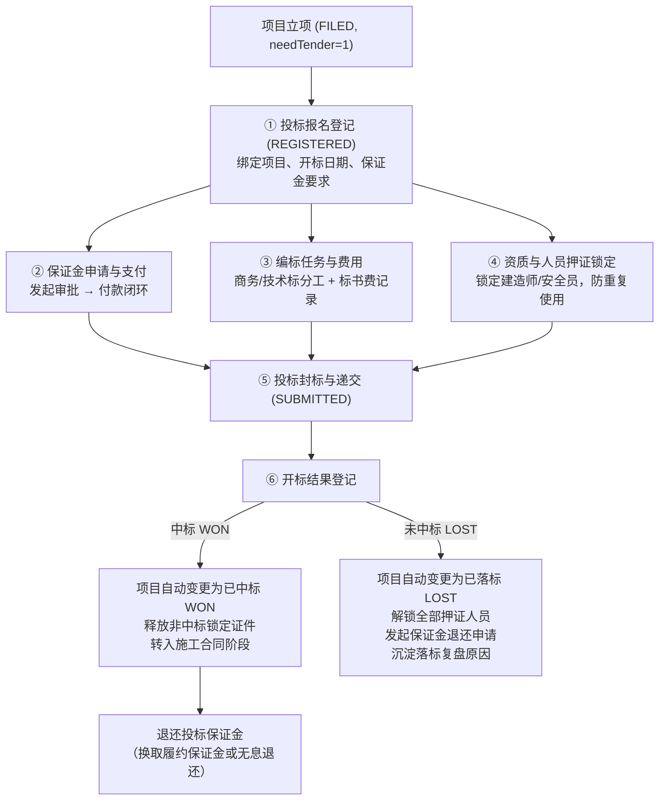

# 02-投标管理 深挖蓝图（v1 · 2026-10-07 · 门A待确认）

> 六步法执行记录：①代码考古✓（后端 14 个文件 1116 行，包含报名/开标/保证金/投标费用/编标任务/证件管理）②数据考古✓（生产库各子表仅 1 行或 0 行，前端无入口导致功能空置）③成熟度✓（报名 L3，证件 L1，其余子功能 L0）④领域建模（见 §5）⑤分档计划（见 §6）。

---

## 1. 现状真相表（代码 vs 前端）

| 业务实体 / 能力 | 后端实现状态 | 前端实现状态 | 现状定性与根因 |
|---|---|---|---|
| **投标报名登记** | `TenderRegisterService`（保存/提交/删除）完整 | `register.vue` 仅有基础列表与弹窗 | 🟡 半实现：只能录基本信息，缺少项目名称展示与状态联动 |
| **开标结果录入** | `OpenBidRecordService`（中标WON/未中标LOST）完整 | ❌ **前端完全无入口** | ❌ **严重断头路**：开标结果无法录入，项目无法自然流转到 WON 或 LOST |
| **投标保证金申请** | `DepositApplyService` + BPMN 审批流完整 | ❌ **前端完全无入口** | ❌ **严重断头路**：有表有流程，前端没有“申请保证金”按钮 |
| **投标保证金退还** | `DepositReturnService` 完整 | ❌ **前端完全无入口** | ❌ **严重断头路**：开标后保证金退还无法发起 |
| **投标费用记录** | `TenderFeeService`（标书费/购买招标文件等）完整 | ❌ **前端完全无入口** | ❌ 摆设功能：无法归集前期投标成本 |
| **编标任务分派** | `TenderTaskService`（商务标/技术标分工）完整 | ❌ **前端完全无入口** | ❌ 摆设功能：标书制作协作链断裂 |
| **企业/人员证件管理** | `CompanyCertificateService` / `PersonCertificateService` 完整 | `certificate.vue` 独立维护 | 🟡 孤立功能：未与投标报名联动（无投标押证/锁定机制） |

---

## 2. 数据考古发现（生产库现状）

- `biz_tender_register`: 1 行（测试数据）
- `biz_open_bid_record`: 1 行
- `biz_deposit_apply`: 1 行
- `biz_tender_fee`: 1 行
- `biz_tender_task`: 3 行
- `biz_person_certificate`: **0 行**！
- **结论**：后端完整开发了 6 个子业务领域，但前端仅做了 1 张单薄表格，导致**开标、保证金、费用、任务四大能力在生产中全部空置无法使用**！

---

## 3. 成熟度基线

- `register.vue` 投标报名：**L3**（仅报名单表）
- `certificate.vue` 证件管理：**L1**（静态列表，无业务触发）
- 保证金 / 费用 / 编标任务 / 开标录入：**L0**（前端未透出）

---

## 4. 缺口矩阵（vs 建筑行业投标标准管理规范）

| 能力 | 现状 | 标杆 / 行业规范 | 缺口定性 |
|---|---|---|---|
| 开标与定标录入 | 前端无入口 | 开标登记（开标时间、中标单位、中标金额、中标候选人排序、我方结果） | **P0 致命断裂** |
| 保证金管理 | 无法发起 | 投标保证金申请 → 支付 → 逾期未退预警 → 退还核销 | **P0 资金断裂** |
| 投标成本归集 | 无法录入 | 标书费、图纸押金、公证费、专家评审费、差旅费归集至前期费用 | **P1 成本缺口** |
| 编标协同 | 无法分派 | 商务标、技术标分工编制、封标检查清单、交底记录 | **P1 过程缺口** |
| 投标锁定/押证 | 独立查看 | 投标报名时绑定建造师/九大员证件，中标前锁定防一证多投 | **P1 风险缺口** |
| 落标原因与复盘 | 仅记文本 | 落标原因分类（价格偏高、技术标失分、商务偏离、资信不足）与复盘建议 | **P2 管理增强** |

---

## 5. 目标领域模型与业务闭环

### 5.1 投标全流程主线

### 5.2 业务不变量（Tender Invariants）
1. **TI-1 保证金上限**：投标保证金申请金额不得超过项目概算/预算总额的 2%（国家招投标法法理上限守卫）。
2. **TI-2 押证排他性**：同一建造师或关键岗位人员，在未开标（REGISTERED/SUBMITTED）期间禁止被其他项目重复锁定。
3. **TI-3 开标状态一致性**：开标结果为中标时，必须更新报名为 WON 且联动项目置 WON；未中标时，更新报名为 LOST 且联动项目置 LOST 并解锁押证。
4. **TI-4 保证金退还闭环**：开标后（无论中标或落标），已缴纳的投标保证金必须触发退还追踪，逾期 30 天未退自动纳入风险中心预警。

---

## 6. 分档实现计划

### A 档·必须闭环（解救断头路，贯通主线）
| # | 项 | 核心实现 | 涉及面 |
|---|---|---|---|
| **A1** | **开标结果登记完整闭环** | 前端增加「录入开标结果」弹窗（中标/落标、中标金额、排序、落标原因分类）；联动后端执行开标，驱动项目状态流转与大事记 | 前端 `register.vue` + API |
| **A2** | **投标保证金申请与退还打通** | 前端透出「申请保证金」动作，发起 `deposit_apply_approval` 审批流；开标后透出「退还保证金」动作，结清资金 | 前端 `register.vue` + `DepositController` |
| **A3** | **投标报名详情综合抽屉** | 点击列表查看投标全貌（基本信息、保证金进度、标书编制、开标结果、费用明细），一页看全 | 前端抽屉组件 |

### B 档·细节增强（业务深度与风控）
| # | 项 | 核心实现 | 涉及面 |
|---|---|---|---|
| **B1** | **人员证件锁定与排他校验 (TI-2)** | 报名时选择拟派项目经理/技术负责人，提交时校验人员是否在其他在投项目中锁定；开标后自动解锁 | 后端 `PersonCertificateService` + 校验 |
| **B2** | **投标费用管理与 CBS 归集** | 详情抽屉中支持登记标书费、踏勘费、图纸费，支持上传发票/收据附件，自动汇总前期费用 | 前后端 `TenderFeeController` |
| **B3** | **编标任务协同清单** | 详情抽屉支持查看并更新技术标/商务标编制进度、责任人与截止时间 | 前端组件 |
| **B4** | **落标原因标准化分析** | 落标原因细化字典分类（报价、商务、技术、评分），列表支持按落标原因筛选，统计报表 | 前后端 |

### C 档·锦上添花
- 评标得分细项记录（价格得分、技术得分等）
- 电子标书版本管理与哈希存证
- 投标竞争对手库与报价偏离度分析

---

## 7. 验证方案

1. **单测套件**：
   - 开标中标与落标全流程单测
   - 保证金申请与退还生命周期测试
   - 证件人员重复锁定排他校验测试（TI-2）
   - 法定保证金 2% 上限守卫测试（TI-1）
2. **L3 接口契约测试**：`test-api-tender.sh` 全量扩充断言（开标、保证金、费用）
3. **L4 生命周期集成**：在 `lifecycle-sim-v2.sh` 阶段 3/3B 中增加真实的保证金申请与开标落标分支演练
4. **真实 UI 验证**：登录界面实操验证开标录入、保证金发起、详情抽屉查看。

---

## 8. 确认记录

- 门 A（已确认）：用户确认推进 P1-M2 全栈与前端闭环
- 门 B（就绪）：A 档与 B 档全部代码、组件、单元测试、L3 脚本与双轨迁移均已闭环落地

