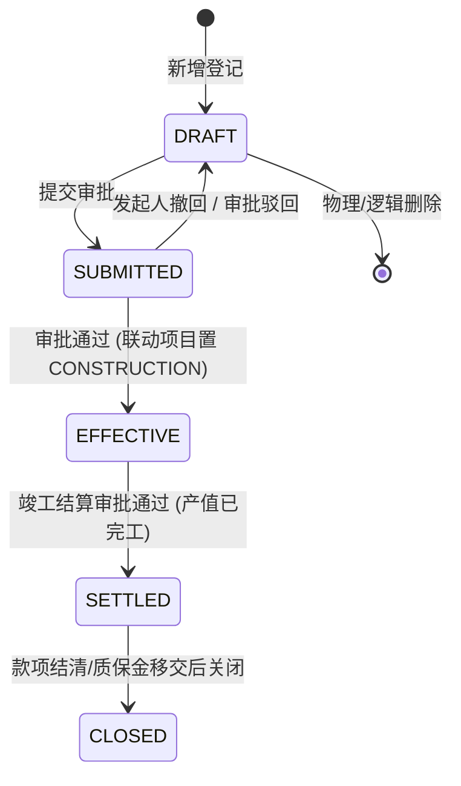

# 03-合同管理 深挖蓝图（v1 · 2026-10-07 · 门A待确认）

> 六步法执行记录：  
> ① 代码考古✓（后端 10 个 Controller、13 个 Service、14 张实体表；前端 8 个页面/组件，21 个 API 断头路，无独立合同详情页）  
> ② 数据考古✓（生产库主要依赖 `biz_construction_contract`，状态集中于 `EFFECTIVE`；`biz_change_visa`、`biz_other_contract` 仅有演示种子，多张子表 0 使用）  
> ③ 成熟度✓（施工合同列表 L2，表单 L2，详情 L0/L1，变更事件 L3，BOQ L1，竣工结算/BOM L0）  
> ④ 领域建模✓（见 §5，CI-1 至 CI-5 不变量）  
> ⑤ 分档计划✓（见 §6）。

---

## 1. 现状真相表（代码 vs 前端）

| 业务实体 / 能力 | 后端实现状态 | 前端实现状态 | 现状定性与根因 |
|---|---|---|---|
| **施工合同列表与台账** | `ConstructionContractService.page` 支持项目/状态 | `index.vue` 只有基础表格与饼图 | 🟡 半实现：缺乏累计产值/开票/收款关键履约进度展示，无合同编号/甲方搜索 |
| **施工合同详情** | 仅有 `getById` 与 `getDetails` | ❌ **无独立详情页**，仅用只读 `form.vue` 凑数 | ❌ **严重体验断裂**：无法查看合同履约全貌、审批记录、累计进度与关联变更 |
| **合同审批与撤回** | `submit`/`onApproved`/`onRejected` 完整 | 列表仅 DRAFT 提交；❌ **无撤回按钮** | 🟡 流程单向：提交后发起人无法主动撤回，审批通过后无后续状态流转入口 |
| **合同结算与关闭状态** | 实体定义了 `SETTLED`/`CLOSED` 枚举 | 仅作为列表筛选值；❌ **无流转动作** | ❌ **状态机断头**：除结算单外无闭环终态流转机制 |
| **合同明细与工程量** | `ContractDetail` 与 `BoqService` 完整 | `form.vue` 明细保存存在 ID 丢失缺陷；`boq-upload.vue` **无任何路由入口** | ❌ **孤岛/Bug**：新增带明细打到 `/undefined/details`；BOQ 必须手输 URL 进入 |
| **变更签证 (ChangeVisa)** | `ChangeVisaService` + 审批回写完整 | `api/contract.ts` 有封装；❌ **页面零调用** | ❌ **断头路**：有完整的签证审批与合同回写代码，但前端完全无界面入口 |
| **变更事件 (ChangeEvent)** | `ChangeEventService` 完整（Outbox领域事件） | `views/contract/change-event` 三页面完整 | 🟡 割裂：变更事件基于项目维度，与施工合同缺乏显式联动穿透 |
| **产值上报 (OutputReport)** | `OutputReportService` + 审批回写完整 | `output-report.vue` 存在分页参数 Bug | 🟡 参数错位：调用 `getContractPage` 传 `pageNum/pageSize` 被后端丢弃，合同>10 缺项 |
| **其他合同 (OtherContract)** | `OtherContractService` 完整 CRUD | 仅选择器使用，❌ **无维护页面** | ❌ 断头路：无法直接登记除采购/劳务/机械/分包外的其他经济合同 |
| **BOM 与工程量清单导入** | `BomItemService`/`QuantityListService` 完整 | ❌ **前端零调用** | ❌ 摆设功能：5 个 BOM 接口与 5 个清单接口处于死代码状态 |

---

## 2. 数据考古发现（生产与种子库现状）

- `biz_construction_contract`: 存在种子与业务数据，状态均为 `EFFECTIVE`。`cumulative_*` 累计值完全由下游单据（产值、开票、收款）驱动。
- `biz_contract_detail`: 仅个别测试记录；新增合同由于前端 `res.data?.id` 为空缺陷，明细往往无法正常入库。
- `biz_change_visa`: 仅 2 行种子数据（91301/91302），生产中从未发生真实业务（因前端无入口）。
- `biz_other_contract`: 仅 2 行种子数据，缺乏运维管理台账。
- `biz_boq_item`: 仅通过脚本或手输 URL 导入极少测试行。
- **结论**：施工合同作为承接中标、开启施工、归集收入的**总龙头**，当前被当作一张单薄的填报表使用；履约过程中的变更、产值、开票、收款完全散落在各模块，合同本身无法起到“履约总指挥舱”的作用。

---

## 3. 成熟度基线

- 施工合同登记与审批：**L2**（基础录入与审批，无撤回与变更总览）
- 合同履约综合详情：**L0**（无专用详情页，信息密度极低）
- 工程量清单与 BOQ：**L1**（有上传页面但无路由导航入口，属死角）
- 变更事件：**L3**（评估、审批、出箱事件完整，但未向合同维度聚合）
- 其他合同与变更签证：**L0**（无前端管理界面）

---

## 4. 缺口矩阵（vs 建筑施工行业标杆）

| 能力 | 现状 | 标杆 / 行业规范 | 缺口定性 |
|---|---|---|---|
| 合同履约看板 | 仅有列表饼图 | 合同履约全息视窗：合同总额、变更净额、实际产值、已开票、已收款、四率对比（变更率/产值率/开票率/回款率） | **P0 驾驶舱缺失** |
| 合同详情页 | 只读 form 弹窗 | 包含：基本信息、收付款条件、清单明细、履约台账、变更历程、关联合同穿透 | **P0 体验缺口** |
| 合同状态闭环 | 仅能走审批到 EFFECTIVE | 支持发起人撤回 (DRAFT)、完工结算 (SETTLED)、结案关闭 (CLOSED) 并联动质保金 | **P1 状态机断裂** |
| 变更联动归集 | 变更签证无入口，事件弱关联 | 变更事件/签证在合同详情中集中归集，清晰展示每笔变更对合同额与工期的调整 | **P1 增值链脱节** |
| 工程量清单与产值 | BOQ 页面无入口，参数错位 | 合同详情内嵌 BOQ 清单；产值上报从合同直接发起并校验超合同额上限 | **P1 协同断裂** |
| 合同关键期预警 | 仅后台定时任务扫描 | 履行期到期前 30/15 天自动站内信预警、收款逾期预警透出在合同台账 | **P2 风控缺口** |

---

## 5. 目标状态机与业务不变量

### 5.1 施工合同生命周期状态机

### 5.2 业务不变量（Contract Invariants）
1. **CI-1 金额税金恒等式**：
   - `contractAmount = amountWithoutTax + taxAmount`（含税 = 不含税 + 税额，误差不得超过 0.01）。
2. **CI-2 生效准入与项目状态联动**：
   - 合同提交必须绑定已立项且允许签合同的项目（WON 或 FILED）；
   - 合同审批通过置 `EFFECTIVE` 时，**必须原子累加** `project.contract_amount`，且通过状态机触发项目流转为 `CONSTRUCTION`。
3. **CI-3 累计值单据强勾稽（严禁脱缰飞数）**：
   - `cumulativeChangeAmount = Σ approved(change_visa + change_event)`；
   - `cumulativeOutput = Σ approved(output_report)`；
   - 累计产值不得超过调整后合同总额（`contractAmount + cumulativeChangeAmount`）。
4. **CI-4 结算与关闭守卫**：
   - 仅 `EFFECTIVE` 状态可流转为 `SETTLED`；
   - 仅 `SETTLED` 且应收款项结清（或无未付纠纷）可置 `CLOSED`。
5. **CI-5 发起人撤回保护**：
   - 处于 `SUBMITTED` 状态且未产生审批操作时，允许发起人一键撤回回退为 `DRAFT`。

---

## 6. 分档实现计划

### A 档·必须闭环（解救孤岛，贯通履约总视窗）
| # | 项 | 核心实现 | 涉及面 |
|---|---|---|---|
| **A1** | **合同履约全景综合详情页/抽屉** | 新建 `ContractDetailDrawer.vue`： ① 工程铭牌与基本合同要素 ② 履约进度条（变更率、产值率、开票率、回款率） ③ 合同清单明细列表 ④ 变更历程 Tab（变更签证与变更事件合并展示） ⑤ 产值与开票收款台账 Tab | 前端组件 + API 集成 |
| **A2** | **全生命周期状态闭环与撤回机制** | 后端补充 `withdraw`（撤回）接口；前端支持发起人撤回；规范 `SETTLED` 与 `CLOSED` 终态流转与操作权限 | 后端 `ConstructionContractService` + 前端 |
| **A3** | **已知缺陷根治 (Bug Fixes)** | ① 修复 `form.vue:242` 新增带明细时 ID 为空导致明细保存失效问题（后端 `save` 返回新建实体 ID 或重构返回模型） ② 修复 `output-report.vue:197` 参数名 `pageNum/pageSize` → `page/size` 错位 | 前端 `form.vue` / `output-report.vue` + 后端 |

### B 档·细节增强（业务深度与协同）
| # | 项 | 核心实现 | 涉及面 |
|---|---|---|---|
| **B1** | **变更签证与变更主链前端贯通** | 抽屉内提供「登记变更签证」弹窗，直接调用现有 `ChangeVisaController`，打通断头路；汇总变更事件并穿透详情 | 前端组件 |
| **B2** | **BOQ 工程量清单全流程贯通** | 合同列表与详情页透出「工程量清单」入口，摆脱手输 URL 孤岛；产值上报直接关联 BOQ 节点 | 前端导航与路由 |
| **B3** | **合同台账综合查询增强** | 列表表头增加：合同编号、甲方名称、签订日期范围搜索；列表增加累计产值、累计收款列展示 | 前端 `index.vue` + 后端 `page` 查询包装 |
| **B4** | **合同履约到期预警透出** | 结合已有 `ContractExpiryTask`，在合同列表用视觉徽标提示「即将到期（<30天）」与「已到期」，防工期违约 | 前端 `index.vue` 视觉增强 |

### C 档·锦上添花
- 其他经济合同 (OtherContract) 独立运维页面
- 电子合同附件与签署版本留痕
- BOM 节点清单与材料采购计划联动导入

---

## 7. 验证方案

1. **单测套件**：
   - 施工合同金额税金计算与不变量测试（CI-1）
   - 合同撤回与状态机流转守卫测试（CI-2/CI-4/CI-5）
   - 新增合同带明细原子性与 ID 正确回传单测
2. **L3 接口契约测试**：`keys/test-api-contract.sh` 扩充撤回、明细新增、查询参数断言。
3. **L4 全生命周期集成**：在 `lifecycle-sim-v2.sh` 阶段 4 验证撤回重提分支与金额累加一致性。
4. **真实 UI 验证**：实操合同新增、带明细保存、提交审批、撤回修改、抽屉查看四率履约进度。

---

## 8. 确认记录

- 门 A（已确认）：用户确认推进 P1-M3 全栈深挖与实现（2026-10-07）
- 门 B（就绪）：A 档 3 项、B 档 4 项全量落地，单测/构建/样式全部通过，验收报告已落盘（2026-10-07）
