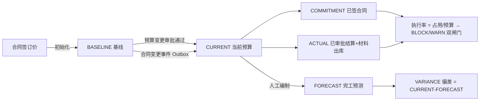

# 04-预算/CBS 深挖蓝图（v1 · 2026-10-07 · 门A待确认）

> 六步法执行记录：  
> ① 代码考古✓（后端 6 Controller / 9 Service / 10 实体 / 1 定时任务 / 4 切面链；前端 5 页面 2242 行 + 4 份 API）  
> ② 数据考古✓（基于既有 R7 审计基线与种子脚本推断，未新跑线上查询：`biz_cost_account` 30 账户已由 V2026_66 重建、V2026_71 补流水后 Section 3.6 PASS；`biz_budget_change.change_code` 全库恒 NULL；CBS baseline/forecast 两维全库为 0）  
> ③ 成熟度✓（预算编制 L2、预算变更 L3、CBS 账户 L2、控制配置 L2、预警链路 L1）  
> ④ 领域建模✓（BI-1 至 BI-5，见 §5）  
> ⑤ 分档计划✓（见 §6）。

---

## 1. 现状真相表（代码 vs 前端）

| 业务能力 | 后端实现状态 | 前端实现状态 | 现状定性与根因 |
|---|---|---|---|
| **预算编制（目标成本）** | `BudgetService`：提交即 `APPROVED`，无审批流；`workflowInstanceId` 死字段 | `budget/index.vue` 平铺明细 + 执行对比柱图；UI 预留永不出现的 APPROVING 态 | 🟡 半实现：基线无人工审批留痕，治理落差 |
| **预算变更（调整审批）** | `BudgetChangeService` + BPMN 双节点审批，调减校验、幂等回调完整 | 变更列表/表单/撤回完整 | 🟡 深实现但有硬伤：BPMN 两节点 assignee 均 `${initiator}`（发起人自审两轮）；`changeCode` 恒 NULL |
| **CBS 成本账户（六维）** | `CostAccountService` 六维金额 + 派生指标 | `cost-account/index.vue`（979 行）六维汇总条 + 流水抽屉 | 🟡 **六维只活三维半**：baseline/forecast 无任何写入者（`setAmount` 死代码），variance 恒基于 0 |
| **归集对账（CostRollUp）** | 每日 02:30 定时 + 手工端点；幂等键 `ROLLUP:{acct}:{type}:{from}->{to}` | 手工归集按钮 + 归集报告（绑定/unmapped） | 🔴 **并发缺陷**：`syncAccount` 吞 `RollbackDuplicateException` → 余额双记且不自愈；幂等键经不起 A→B→A→B 震荡；手工端点不取分布式锁 |
| **预算控制拦截（BLOCK/WARN）** | `@BudgetCheck` 切面挂 4 类支出合同保存；BLOCK 硬拦 / WARN 响应头 | 控制配置页可设阈值 | 🔴 **付款侧空转/误杀**：`PaymentApplyService.submit` category="" 且切面对 Long 参数跳过 → 校验完全空转；`OtherPaymentService.save` 空科目按 0 预算 BLOCK → 误杀全部其他付款；前端从不读 `X-Budget-Warning` |
| **双轨配置体系** | `/v1/budget/config`（旧，无消费方）与 `/v1/budget-control-configs`（新）并存 | 旧 Controller 整套无 UI；budget.ts 三段死代码 | 🟡 死代码堆积：旧配置、旧变更封装、子类字典均零调用 |
| **CBS 前端树** | 服务端 `/tree` 端点存在 | 弃用，前端用分页扁平数据自拼树 | 🟡 隐患：账户数超 page size 时父节点跨页丢失，树会碎 |
| **移动端** | `/v1/dashboard/project/{id}/cost-control` 只读看板 | 单页只读六格指标 | 🟡 管理动作零覆盖 |

---

## 2. 数据考古发现（基于既有审计基线与种子脚本）

- `biz_cost_account`：V2026_66 重建 30 账户（90001/90002/90004），V2026_71 补 SEED 流水后 R7 Section 3.6「余额=流水汇总」PASS——**台账不变量在种子层已成立，但生产代码仍有两条绕过路径**（/sync 直改、并发双记）。
- `biz_cost_account_txn.baseline/forecast`：全库无一条该维度流水，两维金额恒 0。
- `biz_budget_change.change_code`：全库 NULL（无赋值点）。
- `biz_budget.workflow_instance_id`：全库 NULL（死字段）。
- INDIRECT/OTHER 科目合同归集：`getContractAmountByCategory` default 返回 0 → 间接费执行率恒近 0，超支拦截永不触发。
- 预算明细占用三套口径并存（EFFECTIVE / EFFECTIVE+REGISTER / 合同+付款），同一"占用"概念三处数字不同。

---

## 3. 成熟度基线

- 预算编制：**L2**（录入完整、对比有图、无审批留痕无导出）
- 预算变更：**L3**（审批链完整、调减校验、幂等回调；BPMN 自审 + 编号缺失）
- CBS 成本账户：**L2**（六维展示与流水可查；树自拼、9 类后端能力无 UI：关闭/解绑/批量绑/存量绑定/跨账户台账/变更轨迹/手工调整/项目当前预算/子类字典）
- 控制配置与预警：**L2 配置 / L1 链路**（阈值可配，但预警有头无尾：前端零消费，通知只打日志）

---

## 4. 缺口矩阵（vs 成本管理标杆）

| 能力 | 现状 | 标杆 | 缺口定性 |
|---|---|---|---|
| 目标成本→动态成本主线 | baseline/forecast 恒 0，variance 无意义 | 基线（合同价）→当前（变更后）→预测（完工估算）→偏差分析全链 | **P0 主线残缺** |
| 资金硬控制 | 合同侧有效、付款侧空转/误杀 | 合同签订与付款申请双闸门 BLOCK/WARN | **P0 控制漏洞** |
| 台账不可抵赖 | 并发可双记、/sync 绕台账 | 余额=Σ流水恒等，唯一入口 | **P0 数据一致性** |
| 预警闭环 | 站内信半实现、前端零展示 | 阈值→站内信→页面横幅/角标→处置 | **P1 链路断裂** |
| 双变更管线归一 | 预算变更不传导 CBS current | 变更审批一处生效、两套账本同步 | **P1 口径割裂** |
| 成本分析报表 | 无导出、无跨账户台账 UI | 台账导出、科目执行月报 | P2 |

---

## 5. 目标模型与业务不变量

### 5.1 成本主线（目标态）

### 5.2 业务不变量（Budget Invariants）
1. **BI-1 台账唯一入口**：任何 CBS 账户金额变动必须经 `CostLedgerService.post` 落 `biz_cost_account_txn`（幂等键唯一）；`账户余额 ≡ Σ流水 delta`（容差 0.01）。并发冲突必须回滚而非吞掉。
2. **BI-2 基线唯一性**：每项目至多一条 APPROVED 的 ORIGINAL 预算；DB 唯一键兜底，服务端强校验 budgetType，禁止前端传参绕过。
3. **BI-3 调减下限**：科目调整后金额 ≥ 该科目已签合同金额（占用口径统一后执行）。
4. **BI-4 占用口径归一**：调减校验、归集承诺、执行率三处的"占用"必须同一口径（EFFECTIVE 合同 + APPROVED 付款），差异须显式命名而非混用。
5. **BI-5 变更传导完备**：预算变更审批通过必须传导 CBS `current`；任何维度金额有写入者、有展示者、不被归集无声抹平。

---

## 6. 分档实现计划

### A 档·必须闭环（数据一致性与控制漏洞）
| # | 项 | 核心实现 | 涉及面 |
|---|---|---|---|
| **A1** | **CBS 台账一致性修复** | ① `CostRollUpService.syncAccount` 不再吞 `RollbackDuplicateException`，改为回滚重试；② `/sync` 手工改账改走台账 post（或加幂等与流水）；③ 手工 `/rollup` 端点纳入分布式锁；④ 修复幂等键 A→B→A→B 震荡失配 | 后端 `CostRollUpService`/`CostLedgerService`/`CostAccountController` |
| **A2** | **付款侧预算控制修复** | ① 切面支持空 category 自动识别（从单据实体取科目）；② `PaymentApplyService.submit` 正确挂点（提取 projectId+科目）；③ `OtherPaymentService` 空科目走豁免而非误杀；④ 单测覆盖拦截/放行/豁免三分支 | 后端 `BudgetControlAspect` + zw-finance 两处挂点 |
| **A3** | **基线治理与唯一性** | ① DB 唯一键（project+budget_type 守卫，兼容删除语义）；② 服务端强校验 budgetType 白名单；③ 预算提交留痕（提交人/时间落库，死亡字段清理） | 后端 + 迁移 V2026_83 双轨 |

### B 档·细节增强（链路贯通与体验）
| # | 项 | 核心实现 | 涉及面 |
|---|---|---|---|
| **B1** | **CBS 前端能力补全** | 服务端 /tree 替换自拼树；补账户关闭/解绑/存量绑定/跨账户台账/变更轨迹入口 | 前端 `cost-account/index.vue` |
| **B2** | **预警链路贯通** | 前端读 `X-Budget-Warning` 响应头 → ElMessage/横幅；预算页与 CBS 页预警角标；INDIRECT/OTHER 执行率归集口径修复 | 前端 + `getContractAmountByCategory` |
| **B3** | **双变更管线归一** | 预算变更审批通过 → 同事务写 CBS `current`（经台账 post）；`changeCode` 编号生成；删除 `handleChangeEventApproval` 死代码 | 后端 `BudgetChangeService` |
| **B4** | **双轨配置与死代码清理** | 下线 `/v1/budget/config` 旧 Controller 与 budget.ts 三段死函数；子类字典接入 CBS 表单下拉 | 前后端 |

### C 档·锦上添花
- baseline/forecast 维度激活（合同价初始化基线、人工预测编制页）
- BPMN 发起人自审改角色分流（项目负责人+财务，非发起人）
- 预算/CBS 导出与科目执行月报
- 移动端成本管理页（预警推送+变更单处理）

---

## 7. 验证方案

1. **单测套件**：
   - BI-1 台账并发冲突回滚测试（模拟唯一键冲突，断言余额不双记）
   - BI-2 并发建预算唯一性测试
   - A2 切面三分支测试（拦截/放行/豁免）+ PaymentApply/OtherPayment 挂点集成测试
   - B3 变更传导 CBS 断言（审批通过后 current 变动且流水存在）
2. **L3**：`test-api-budget.sh` 扩充（基线唯一性负向、付款校验挂点、changeCode 非空）
3. **L4**：阶段 5 预算 BLOCK 拦截已有，补 WARN 放行分支与付款申请拦截分支
4. **R7**：Section 3.6 CBS 勾稽不劣化（PASS 数不得下降）
5. **真实 UI**：CBS 树完整展开、预警横幅出现、变更轨迹可查。

---

## 8. 确认记录

- 门 A（已确认）：用户确认推进 P2-M4 全栈深挖与实现（2026-10-07）
- 门 B（就绪）：A 档 3 项、B 档 4 项全量落地，单测/构建/样式全部通过，验收报告已落盘（2026-10-07）
