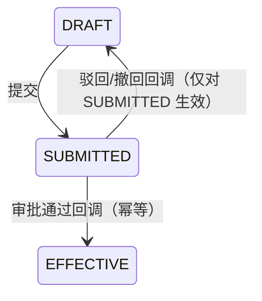

# 05-采购+材料 深挖蓝图（v1.1 复审修订版 · 2026-10-07 · 门A待确认）

> 六步法执行记录：  
> ① 代码考古✓（zw-purchase 54 文件 + zw-material 41 文件）  
> ② 数据考古✓（线上取证 2026-10-07，含复审补充取证：ROLLUP 流水全库 0 条、僵尸审批任务 91、移动端仅 save 不 submit）  
> ③ 成熟度✓ ④ 领域建模✓（PI-1~PI-5，v1.1 修订）⑤ 分档计划✓（v1.1）  
> **复审记录（v1→v1.1）**：删假阳性 B4（翻页参数——全局拦截器已映射）；A2 改为不动时点只修原子性；A3 Guard 改角色门槛（护住租户 1 测试基建）；A4 重写为 CBS 口径裁决（用户已裁：结算口径）；新增 5 项发现（CBS 双计 P0/移动端断链/僵尸任务/回调吞异常/结算列漂移）；快照激活降 C 档。  
> **证据分级**：标注〔亲验〕者为主会话逐条核过代码或线上数据；〔探报〕者为考古子代理结论、复审抽验未推翻但未逐行复核。

---

## 1. 现状真相表（代码 vs 前端 vs 数据）

| 业务能力 | 后端 | 前端 | 数据取证 | 定性 |
|---|---|---|---|---|
| **采购合同** | 〔亲验〕submit 即置 EFFECTIVE（PurchaseContractService:113-132），zw-purchase 全模块零审批监听器；update 裸 updateById 可覆写 status/累计字段（:96-106） | CRUD+提交；明细 /details 端点 Web 闲置（移动端在用） | 4 份全 EFFECTIVE；**僵尸审批任务 50** | 🔴 假审批+可篡改 |
| **采购结算** | 〔亲验〕submit 即 APPROVED+读改写回写累计（:196-224，原子 addSettlement 闲置） | 无发起付款入口（付款在 finance 另起） | 4 单全 APPROVED；**僵尸任务 41** | 🔴 假审批 |
| **材料入库** | 〔亲验〕submit 即 APPROVED 无审批；建库存行不写 materialId（:239-250）；删除回冲 `.max(0)` 钳位吞账（:113-128） | SUBMITTED/REJECTED 一律显示草稿；**移动端只 save 不 submit → 单据永停 DRAFT、库存与合同累计全不生效** | 库存表 4 行 material_id NULL | 🔴 移动端断链 |
| **材料出库** | 〔亲验〕save 即扣库存（预留语义）、submit 只改标签（:207-213）；扣减为 check-then-act 非原子可并发超卖；RETURN 事件在 save 即发（:104-106）→ 退款可在出库仍 DRAFT 时被批过 | 状态二值化；移动端同样只 save | RETURN_ONLY/RETURN_REFUND 均零使用 | 🟡 原子性缺陷（时点不改） |
| **材料调拨** | 状态机最完整（回调生效+幂等）；〔亲验〕update 白名单缺失可直置 status 绕库存（:181-190） | 四态完整 | SUBMITTED 10/REJECTED 3（唯一真实审批链） | 🟡 相对最优 |
| **材料退款** | 〔探报〕驳回无监听永卡 PENDING | 只读 | 仅 1 单 APPROVED | 🟡 断头 |
| **材料盘点** | 后端 6 端点全量 | Web 零 UI（5 函数死） | 无数据 | 🔴 断头 |
| **询价定标** | 〔亲验〕confirmWinner 不写 winnerName/Amount/Date；枚举 ANNOUNCED vs PUBLICIZED 错位 | 比价弹窗完整 | 13 单仅 1 AWARDED，公示页必空 | 🔴 断链 |
| **CBS 归集** | 〔亲验〕MATERIAL ACTUAL = 结算 + 出库消耗**同槽双计**（CostRollUpService:139-143）；RETURN 出库按正数入账（SQL 无符号翻转）；**ROLLUP 流水全库 0 条**（90001 两账户歧义落 unmapped 侥幸未爆） | — | 90001 actual=12M 恰等于结算；绑定补齐即跳 14.42M | 🔴 双计口径缺陷（P0） |
| **库存预警** | 仅 NORMAL/LOW；配置 materialId 强制非空与库存行 NULL 互斥 | 无页内汇总 | 4 行 NULL 吃全局默认 | 🟡 半实现 |
| **供应商门户** | 〔探报〕公开报价无验证码、凭 phone 可查任意报价；JWT 默认密钥 | 归 zw-supplier-portal | — | 🟡 安全 |

---

## 2. 数据考古发现（线上只读取证 2026-10-07）

- 采购合同 4 全 EFFECTIVE、结算 4 全 APPROVED——假审批必然结果。
- **ACT_RU_TASK 僵尸任务：PURCHASE_CONTRACT 50 + PURCHASE_SETTLEMENT 41**（活单仅 4+4；多为脚本 submit 后不 approve 及已删单据遗留）。A1 接真审批后 approve 僵尸将触发回调，**必须先清障**。
- **`biz_cost_account_txn` 中 source_type='ROLLUP' 流水 0 条**——归集任务从未成功入账一笔；90001 MATERIAL 双账户歧义是未爆的原因，也正是双计缺陷的遮羞布。
- 调拨 34 单为唯一真实审批链；RETURN 语义零使用；负库存现值 0（历史 -30 有取证）。

---

## 3. 成熟度基线

采购合同/结算/入库/出库/调拨 **L2**；盘点 **L1**（无 UI）；询价定标 **L1**；退款 **L2-**；库存预警 **L1**；移动端材料链 **L1-**（入库无生效路径）。

---

## 4. 缺口矩阵（vs 标杆）

| 能力 | 现状 | 标杆 | 定性 |
|---|---|---|---|
| 采购审批治理 | 提交即生效+91 僵尸任务 | 审批通过才生效、驳回回退、留痕 | **P0** |
| CBS 成本口径 | 结算+消耗双计（潜伏） | 单一口径与 AGENTS.md 权威一致 | **P0** |
| 账实一致 | check-then-act 超卖、钳位吞账 | 原子扣减+非负+报错不吞 | **P0** |
| 字段不可篡改 | status/累计可覆写 | 白名单+状态机强管 | **P0 安全** |
| 移动端材料链 | 入库永停 DRAFT | save→submit 全链生效 | **P1** |
| 盘点/结算付款联动/询价定标/退款驳回 | 各断一处 | 全贯通 | **P1** |
| 门户安全/超储预警/导出 | 半实现 | 补齐 | **P2** |

---

## 5. 目标状态机与业务不变量

### 5.1 采购合同/结算真实审批

### 5.2 业务不变量（v1.1 修订）
1. **PI-1 库存非负且原子**：扣减一律 `UPDATE ... SET stock=stock-x WHERE stock>=x` 原子式，影响行数=0 即报「库存不足」；**禁止 `.max(0)` 钳位**（对不上账必须报错）。出库扣减时点**保持 save（预留语义）不迁移**。
2. **PI-2 勾稽原子**：合同 cumulative_inbound/settlement/paid 只由单据驱动，统一原子 SQL（结算回写并入审批回调内执行 `addSettlement`）；三闸门保留。
3. **PI-3 审批一致性**：提交→SUBMITTED；生效/驳回一律回调驱动且幂等；回调须防「单据不存在/已终态」短路（清障后仍可能出现陈旧回调）；**onApproved 生效校验失败须置 REJECTED+站内信**（PaymentApply 模式），不得依赖监听器异常上抛（ProcessCompleteListener 吞异常，〔亲验〕:68-84）。
4. **PI-4 口径统一（已裁决：结算口径）**：**MATERIAL ACTUAL = 已审批采购结算合计**，出库消耗移出归集（listMaterialOutbounds 及 allocate 行删除）；退货符号缺陷随之消解；明细金额 setScale(2)。边界如实记录：无合同零星材料成本不入 CBS（维持 AGENTS.md 权威口径与 R7 基线）。
5. **PI-5 不可篡改**：合同/入库/出库/调拨/盘点 update 白名单拷贝（对齐 PurchaseSettlementService.update 做法）；E2eTestGuard 命中放行加 **SUPER_ADMIN 角色门槛**（不按租户收敛——batch2/3/4、cleanup、audit 脚本在租户 1 依赖此标记）。

---

## 6. 分档实现计划（v1.1）

### A 档·必须闭环
| # | 项 | 核心实现 | 涉及面 |
|---|---|---|---|
| **A1** | 采购真审批+清障 | ① submit 置 SUBMITTED；新增合同/结算两个 ApprovalListener（onApproved 幂等生效+结算原子回写；onRejected 仅对 SUBMITTED 回 DRAFT；生效失败置 REJECTED+通知）② 上线前按 runtimeService 逐实例终止 91 僵尸流程（禁 SQL 删 ACT_ 表）③ 存量 4 EFFECTIVE/4 APPROVED 不动 | zw-purchase+zw-workflow 清障脚本 |
| **A2** | 库存原子化三修 | ① 扣减原子 SQL+非负守卫（入/出/调/盘四处）② 入库删除回冲去 `.max(0)` 钳位、对不上即报错 ③ update 白名单（见 A3）。**不迁移扣减时点** | zw-material |
| **A3** | 防篡改与后门收敛 | 五类单据 update 白名单拷贝；E2eTestGuard 加 SUPER_ADMIN 门槛 | 两模块+zw-common |
| **A4** | CBS 口径归一（结算） | CostRollUpService 删 MATERIAL_OUTBOUND allocate 行与 Mapper 方法（含测试同步）；更新 AGENTS.md 口径注记与 unmapped 报告说明 | zw-budget |

### B 档·细节增强
| # | 项 | 核心实现 |
|---|---|---|
| **B1** | 盘点 Web 页面 | /material/inventory 列表+明细+提交，激活 5 个死 API |
| **B2** | 状态真实化 | 入库/出库四态标签+驳回重提；合同/结算「审批中」态 |
| **B3** | 结算→付款联动 | 结算行发起付款，跳 finance 预填合同与金额 |
| **B4** | 询价定标修复 | confirmWinner 写全 winner 字段；枚举统一（ANNOUNCED/PUBLICIZED 二选一）；公示页可查 |
| **B5** | 门户安全 | 公开报价接验证码；getMyQuotation 校验；JWT secret 环境变量化 |
| **B6** | 移动端 submit 链 | 入库/出库 save 成功后自动接 submit（离线队列重放路径同步补），使单据真正生效 |

### C 档·锦上添花
快照回滚激活（saveSnapshot 零调用方，另立管理端能力）；settlement_code/settlement_no 列漂移治理；超储预警+页内汇总；导出全套；合同明细抽屉；入库复制；孤儿清理（询价/调拨/盘点明细）；〔探报〕BPMN `${initiator}` 自审改角色分流（与 M4 预算 BPMN 同族，宜统一决策）。

---

## 7. 验证方案

1. **单测（CI 执行，禁本地 mvn）**：A1 回调幂等/驳回回退/陈旧回调短路/生效失败补偿；A2 原子扣减与钳位去除负向；A3 防篡改负向；A4 归集不再含出库项。
2. **L3**：test-api-purchase/material 扩充（SUBMITTED 态断言、防篡改负向、盘点端点）；现脚本只断 HTTP+code，与 A1 兼容已核。
3. **L4**：阶段 6A/9C 均 submit→approve→断言，A1 天然兼容；补合同驳回分支与盘点演练；补僵尸清障后 ACT_RU_TASK=0 断言。
4. **R7**：基线 PASS=67 不劣化（A4 结算口径与现行种子/审计口径一致，预期无扰动）。
5. **真实 UI**：盘点页、四态标签、付款联动、移动端提交后单据生效。

---

## 8. 确认记录

- 门 A（v1.1 待确认）：复审修订版已落盘；A4 口径已按用户意见定为**结算口径**；A2 已改为不迁移时点。
- 门 B（未到）。
