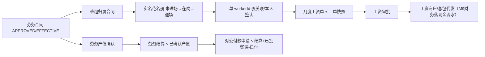

# 06-劳务管理 深挖蓝图（v1 · 2026-10-08 · 门A待确认）

> 六步法执行记录：  
> ① 代码考古✓（后端 10 Controller / 12 Service / 8 实体 / 8 Mapper / 3 Batch；无 BPMN、无审批监听器、无定时任务）  
> ② 前端考古✓（PC 6 页面：合同/班组/花名册/工单/工资/薪资统计；移动端仅工单；产值/结算/奖惩 3 组 API 全断头）  
> ③ 线上数据考古✓（2026-10-08 主环境只读实测：合同4、产值2、结算4、工资1、工单4、花名册6；累计产值 4份合同中3份无单据支撑、1份差20万；工资单 SETTLED/已付7万无生产写入链；5/6在岗工人无进场日期）  
> ④ 成熟度复核✓（feature-ledger 自动判合同/工资 L3、统计 L4，实证为信号误判；人工修正见 §3）  
> ⑤ 标杆/规范对照✓（中国政府网《工程建设领域农民工工资专用账户管理暂行办法》：实名制台账、按月工作量与考勤、工资支付表本人签字、总包专户代发、发放凭证）  
> ⑥ 领域建模与分档✓（LI-1 至 LI-6，见 §5/§6）。

---

## 1. 现状真相表

| 能力 | 后端现状 | 前端/移动端现状 | 定性 |
|---|---|---|---|
| **劳务合同** | `save` 受 LABOR 预算控制；`submit` 直接 DRAFT→EFFECTIVE，无 Flowable；不自动生成 `contractCode`（已有 LABOR 模块但无编号规则）；update 仅把状态/累计置 null，未做严格白名单 | PC 有 CRUD+提交、Excel 导入；称“提交审批”但实际无审批；无详情/履约穿透 | 🔴 假审批+编号缺失 |
| **班组** | 项目归属+成员数；update 裸 `updateById` 可改 projectId/status；无合同关联 | PC CRUD；班组选择器不接 projectId，工单可跨项目选班组 | 🔴 同租户串项目风险 |
| **实名花名册** | 实体有 projectId/teamId/身份证/进退场；`save` 直接 status=1（在岗）但不写 entryDate；update 裸写可绕进退场；手工 save 无身份证重复守卫；批导重复会跳过但返回总行数而非成功数 | **表单只填 teamName，不传 projectId/teamId**，Web 新增会造无项目/无班组孤儿（DB 非空时直接500）；移动端无实名花名册页 | 🔴 主链断裂 |
| **用工单/工时** | total=工时×时薪+加班×费率，负数守卫；submit 直接 APPROVED；**不校验 workerId/工人在岗/项目班组一致** | PC/Mobile 都只输入 workerName，**从不传 workerId**；移动端只 save 且 payload status=APPROVED 被服务重置 DRAFT，永不生效 | 🔴 漏薪/错薪风险 |
| **工资单** | 按 team+period+orderType 汇总 APPROVED 工单；submit 直接 APPROVED；周期重叠守卫**不含 orderType**，固定/临时两类工资单同周期互斥；无工资单明细快照；`totalPaid/SETTLED` 无生产写入者 | PC 可生成/提交/导入；展示已付/未付/SETTLED 但无任何发放入口 | 🔴 展示壳+不可审计 |
| **薪资统计** | 工人明细主动过滤 workerId=null 工单；团队 `totalActual = payable - (payable-paid-unpaid) = paid+unpaid`，**把未付也算实发**；工人明细实发=应发（无支付数据源） | 页面明确显示“实发合计/实发金额” | 🔴 财务数字虚报 |
| **劳务产值** | submit 直接 APPROVED；无金额>0、累计≤合同额守卫；合同累计回写读改写非原子；APPROVED 删除不回冲 | API 仅 CRUD，**漏 submit 函数**；Web 零页面 | 🔴 累计脱缰 |
| **劳务结算** | submit 直接 APPROVED；仅守卫累计≤合同额，不守卫≤已确认产值；累计回写读改写（已有原子 mapper 未用）；删除 APPROVED 原子冲销 | API 完整，Web 零页面；无发起付款入口 | 🔴 半闭环 |
| **劳务奖惩** | 直接 save/delete，无类型/金额/合同守卫、无审批；**PaymentApply 将其直接计入可付上限** | API 有，Web 零页面 | 🔴 资金额度可任意增减 |
| **对公/对私支付** | 对公：finance PaymentApply 通过 LABOR 合同结算+奖惩控制，完整；对私：工资 `totalPaid/SETTLED` 无写入链 | 工资页却展示实付 | 🔴 双口径未建模 |
| **权限** | 10 个 Controller 全部只有类级 `labor:view`，写/删/审批无细粒度权限 | — | 🟡 权限过粗（M18 统一治理更合适） |

---

## 2. 线上数据考古（主环境只读，2026-10-08）

### 2.1 状态分布
- 劳务合同：EFFECTIVE 4；产值：APPROVED 2；结算：APPROVED 4；工资：SETTLED 1；工单：APPROVED 3 / DRAFT 1；花名册在岗 6。
- Flowable 劳务任务：0（模块从未接审批流）。

### 2.2 累计勾稽
| 合同 | contract.cumulativeOutput | APPROVED 产值单汇总 | 结论 |
|---|---:|---:|---|
| 91601 | 3,800,000 | 4,000,000 | **MISMATCH -200,000** |
| 91602 | 1,800,000 | 0 | **无单据支撑** |
| 99532 | 8,000,000 | 0 | **无单据支撑** |
| 99556 | 3,000,000 | 0 | **无单据支撑** |

- 4 份合同 cumulativeSettlement 均与 APPROVED 结算单汇总一致；cumulativePaid 均与 APPROVED LABOR 付款申请一致。
- 线上 R7 仍 PASS=67，说明现有审计**未覆盖劳务累计产值勾稽**，属于审计盲点，不是数据正确。

### 2.3 实名与工资
- 班组2、花名册6、工单4；当前工单 workerId 均非空（均为种子/脚本数据），无孤儿、无重复身份证。
- 5/6 在岗人员 entryDate=NULL：`save` 直接 status=1 绕过 entry 动作。
- 唯一工资单：应发85,000、已付70,000、未付15,000、状态SETTLED；但全模块无写 `totalPaid`/`SETTLED` 的生产路径，属于无凭证种子值。

---

## 3. 成熟度基线（人工复核）

| 子域 | feature-ledger 自动值 | 人工值 | 原因 |
|---|---:|---:|---|
| 劳务合同 | L3 | **L2** | submit 端点被误判为协同流转，实际无流程、提交即生效 |
| 花名册 | L1/L2 | **L1** | 后端进退场有，但 PC 新增 payload 与实体错位，主链不可用 |
| 工单 | 未单列 | **L1** | 可录入但 workerId 断链，Mobile 永停 DRAFT |
| 工资单 | L3 | **L1** | 有 submit 但无审批、无明细快照、无支付链，已付/SETTLED 是死字段 |
| 薪资统计 | L4 | **L2** | 有统计/对比/导出信号，但“实发”口径错误且漏掉 workerId=null 工单 |
| 产值/结算/奖惩 | L0 | **L0/L1** | 后端有，PC 零页面，产值连 submit API 都漏 |

---

## 4. 标杆与法规对照

官方依据：[《工程建设领域农民工工资专用账户管理暂行办法》](https://www.gov.cn/zhengce/zhengceku/2021-07/15/content_5625083.htm)：
- 第15条：工程建设领域推行总包代发；
- 第16条：实名制登记并维护实名台账；
- 第17条：按月考核工作量，工资支付表需本人签字，并与考勤表、工程进度一并提交；
- 第18条：工资专户直接支付至工人本人银行账户，并保留代发凭证。

现系统仅有姓名工单与“日期去重≈出勤”，缺实名工人关联、考勤表、签字确认、工资专户/代发凭证、工资支付流水与欠薪预警。

---

## 5. 目标模型与业务不变量

### 5.1 主链

### 5.2 不变量（Labor Invariants）
1. **LI-1 实名强关联**：工单必须绑定 `workerId`；工人必须属于同项目、同班组且在岗；workerName 只作快照显示，不作为关联键。
2. **LI-2 进退场唯一通道**：新建花名册默认未进场（status=0, entryDate=NULL）；仅 entry/exit 方法可改 status/日期；同租户同项目身份证活动记录唯一。
3. **LI-3 工资可追溯**：工资单必须保存所含工单明细快照；同一工单只进入一张活动工资单；同班组同周期可按 orderType 分开但不可同类型重叠。
4. **LI-4 累计值单据支撑**：合同 cumulativeOutput=ΣAPPROVED产值、cumulativeSettlement=ΣAPPROVED结算、cumulativePaid=ΣAPPROVED付款；均原子回写、幂等、删除对称回冲。
5. **LI-5 结算上限**：劳务产值>0且累计不超合同额；结算>0且累计结算不超累计已确认产值（奖惩只影响付款可付额度，不改结算额）。
6. **LI-6 双支付口径隔离**：对公劳务合同付款与对私工人工资发放不得混用；页面“实发”只读真实工资支付流水，未接M9前不得用应发/未付推导实发。

---

## 6. 分档实现计划

### A档·必须闭环
| # | 项 | 核心实现 | 涉及面 |
|---|---|---|---|
| **A1** | 实名花名册与工单强关联 | PC 花名册表单改选 projectId/teamId；save默认未进场；身份证活动唯一guard（V2026_84双轨）；Roster/Team update白名单；工单前后端强制workerId并校验同项目/班组/在岗；TeamSelector支持projectId；移动端选择实名工人 | zw-labor + PC/App + DB |
| **A2** | 工资核算可追溯 | 新建 `biz_labor_payroll_detail`（payrollId/workOrderId/workerId/payable，workOrder唯一活动guard）；生成工资单时落快照；周期重叠校验加入orderType；update改重算或收窄为不可改；修Payroll导入按项目找班组与TEMPORARY导出文案 | zw-labor + V2026_84 |
| **A3** | 劳务真审批 | 新增劳务合同审批 BPMN + 劳务成本审批 BPMN（候选组使用真实角色码 PROJECT_MANAGER/FINANCE_STAFF，禁止initiator自审）；合同、产值、结算、工资、奖惩 submit→SUBMITTED，监听器onApproved/onRejected幂等；生效失败置REJECTED+通知 | zw-labor/workflow |
| **A4** | 产值/结算/奖惩勾稽 | Mapper原子 addOutput/addSettlement；产值金额与上限守卫、APPROVED删除对称回冲；结算≤已确认产值；奖惩类型白名单+金额>0+合同归属+审批后才被PaymentApply计入；finance SQL加 `status='APPROVED'` | labor + finance |
| **A5** | 薪资统计纠偏 | 团队实发=`ΣtotalPaid`，未付=`Σunpaid`，不得把未付计入实发；工人明细在无支付分摊前字段改“核定工资”而非“实发”；SETTLED/totalPaid写入只允许M9工资支付链驱动 | labor + PC |

### B档·细节增强
| # | 项 | 核心实现 |
|---|---|---|
| **B1** | 履约三断头页面 | 新增劳务产值、劳务结算、奖惩台账页面（含提交/审批态/付款联动）；补output submit API |
| **B2** | 劳务履约全景抽屉 | 合同详情聚合班组/在岗人数/累计产值/结算/付款/奖惩/工资应付，口径分栏 |
| **B3** | 移动端工单闭环 | 项目→班组→在岗工人三级选择；后端 `autoSubmit=true` 复合端点支持在线/离线队列，避免永久DRAFT |
| **B4** | 进退场履历与欠薪提示 | 新建人员进退场流水；退场时提示未计薪工单/未支付工资（提示不强拦） |
| **B5** | 合同编号与班组穿透 | LaborContractService接`SerialNumberService.generate("LABOR_CONTRACT")`（补规则种子id 900008）；Team可选关联laborContractId，支持合同→班组→工人穿透 |
| **B6** | 工资专户接口预留 | 工资单提供M9财务代发接口契约（工资单ID、工人明细、银行卡/社保卡、支付凭证），本模块只维护应付与审批，不伪造现金实发 |

### C档·锦上添花
- 实名认证/人脸门禁/考勤设备对接；劳动合同附件与本人电子签名；工资专户银行代发文件与回执自动解析；政府监管平台报送；欠薪预警、超龄/证件过期预警；劳务公司评价。

---

## 7. 数据迁移与生产语义变更（需门A确认）

1. **劳务累计产值修复**（生产写）：91601合同累计3.8M但单据汇总4M，建议以单据为准回写4M；91602/99532/99556有累计值但无单据，建议补3张APPROVED产值支撑单据（不改累计值）。迁移前只读报告+固定ID空闲探针，事务内双跑验证后上线。
2. **花名册进场日期**（生产写可选）：5名status=1人员entryDate=NULL。无可靠考勤证据，**建议不自动回填**；上线后标为“在岗（进场日未知）”，由业务补录。
3. **工资种子状态**：现有工资单SETTLED/已付70k无支付流水支撑。建议本轮不伪造流水，迁移为APPROVED、totalPaid=0、unpaid=85k；若需保持演示，由M9新增真实工资支付单后再恢复SETTLED。
4. **既有工单**：当前4条均有workerId，无需回填；新守卫上线可直接启用。

---

## 8. 验证方案

1. **CI后端单测（禁本地mvn）**：实名/项目班组一致性负向；工资工单快照唯一；5类审批通过/驳回/幂等/生效失败；产值结算上限；奖惩未批不进付款额度；薪资实发口径。
2. **L3 labor扩充**：花名册新增必须project/team；工单无workerId/跨项目/离岗拒绝；产值/结算/奖惩状态链；工资明细快照。
3. **L4扩充阶段7D**：合同审批→班组→实名进场→工单确认→工资单审批→产值审批→结算审批→付款；驳回重提分支；清理零残留。
4. **R7新增且验证可触发**：劳务累计产值/结算/已付三勾稽；工资总额=快照明细；同工单重复计薪；工单实名孤儿；在岗无entryDate列WARN。
5. **真实UI/App**：花名册选择项目班组、工单选在岗人员、移动端自动生效、工资统计不虚报实发、三台账页面。

---

## 9. 确认记录

- 门A（已确认 · 2026-10-08）：用户确认推进 A1-A5 与 B1-B6 全量落地；生产数据修复按推荐方案执行（91601产值回写4M、补支撑单据、工资种子改回APPROVED未付）。
- 门B（未到）。
