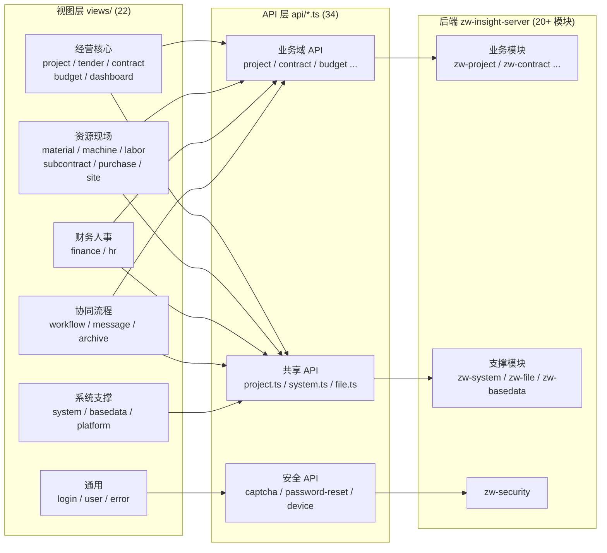
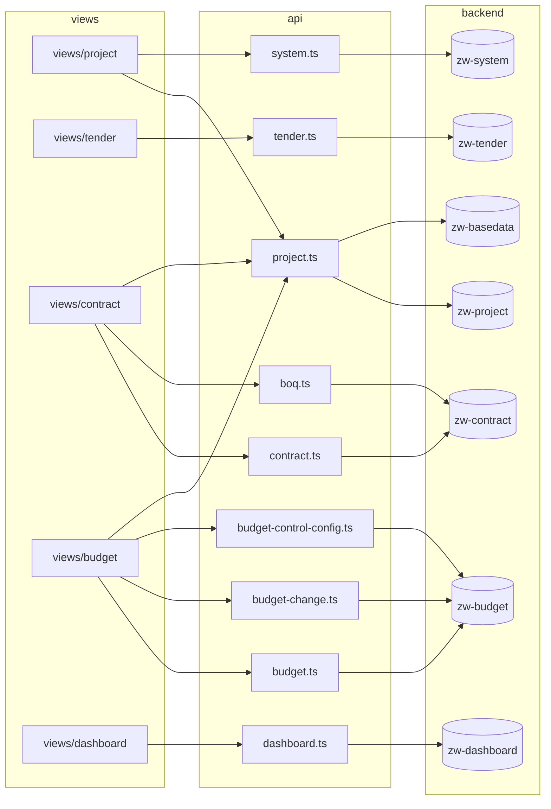
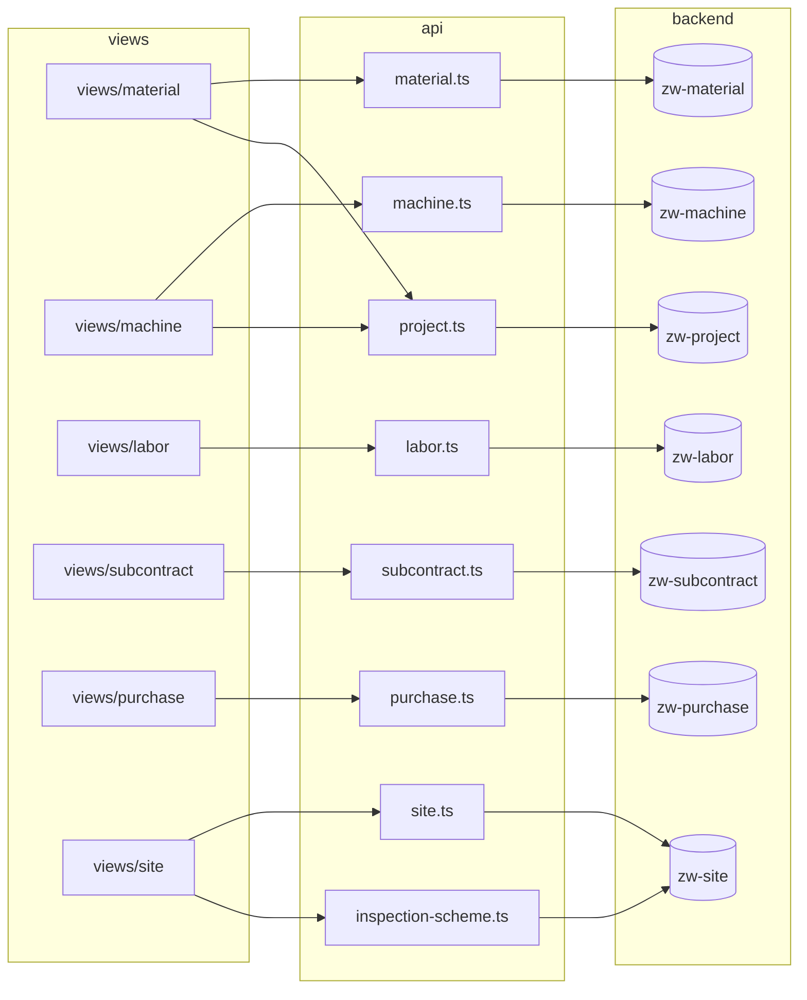
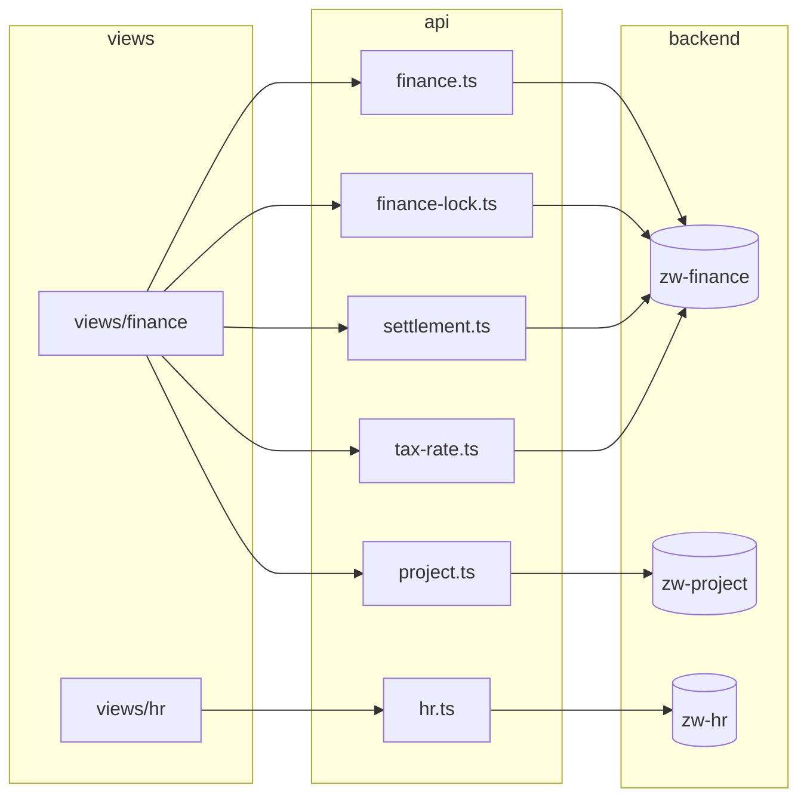
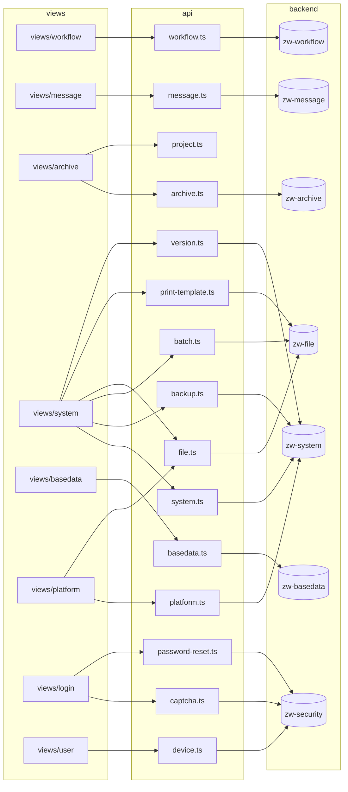

# 前端模块依赖关系图（PC 端 zw-insight-web）

> 生成方式：扫描 `zw-insight-web/src/views/**` 的真实 `import '@/api/*'` 语句 + 后端全部 `*Controller.java` 的 `@RequestMapping` 注解比对而成，非人工推测。
> 数据基线：22 个视图模块、34 个 API 文件、138 个后端 Controller（2026-07）。

## 一、全局分层总览

前端遵循「视图模块 → API 层 → 后端 Controller」三层结构，API 层是前后端唯一的对接边界。

## 二、分域依赖明细图

### 1. 项目与经营核心

### 2. 资源与现场管理

### 3. 财务与人事

### 4. 协同流程 + 系统支撑 + 通用

## 三、API 文件 → 后端 Controller 对应表（34 个）

| API 文件 | 后端模块 | 对应 Controller（`@RequestMapping` 前缀） |
|---|---|---|
| archive.ts | zw-archive | ArchiveController `/api/v1/archive`（13 类档案子路径） |
| backup.ts | zw-system | BackupController `/api/v1/system/backup` |
| basedata.ts | zw-basedata | Company / Owner / Supplier / SupplierBlacklist / SupplierEvaluation / Material / MaterialCategory / InspectionScheme（8 个，`/api/v1/basedata/*`） |
| batch.ts | zw-file | BatchImportExportController `/api/v1/batch` + FilePreview / Template |
| boq.ts | zw-contract | BoqController `/api/v1/contracts/{contractId}/boq` |
| budget.ts | zw-budget | Budget / BudgetConfig / CostSubcategory / BudgetChange `/api/v1/budget*` |
| budget-change.ts | zw-budget | BudgetChangeController `/api/v1/budget/change` |
| budget-control-config.ts | zw-budget | BudgetControlConfigController `/api/v1/budget-control-configs` |
| captcha.ts | zw-security | CaptchaController `/api/v1/captcha` |
| contract.ts | zw-contract | Contract / BomItem / ChangeVisa / OtherContract / OutputReport / QuantityList / FinalSettlement（7 个，`/api/v1/contract*`） |
| dashboard.ts | zw-dashboard | Dashboard / ProjectDashboard `/api/v1/dashboard*` |
| device.ts | zw-security | DeviceController `/api/v1/user/devices` |
| file.ts | zw-file | SerialNumber `/api/v1/file/serial`、Storage `/api/v1/file/storage` |
| finance.ts | zw-finance | InvoiceApply / InvoiceReceived / InvoiceSummary / PaymentApply / PaymentReceived / OtherPayment / PersonalReimbursement / ProjectReimbursement / ReserveFund / Retention（10 个，`/api/v1/finance/*`） |
| finance-lock.ts | zw-finance | FinanceLockController `/api/v1/finance/lock` |
| hr.ts | zw-hr | EntryApply / RegularApply / ResignApply / TransferApply / SealApply / OfficeSupply / Vehicle / HrStatistics（8 个，`/api/v1/hr/*`） |
| inspection-scheme.ts | zw-site | InspectionSchemeController `/api/v1`（`inspections`、`inspection-schemes`）+ InspectionController |
| labor.ts | zw-labor | LaborContract / Roster / Team / Payroll / Settlement / OutputReport / RewardPunish / WorkOrder / SalaryStatistics（9 个，`/api/v1/labor/*`） |
| machine.ts | zw-machine | MachineContract / Entry / Ledger / OilRecord / Repair / Settlement / UsageRecord / WorkLog（8 个，`/api/v1/machine/*`） |
| material.ts | zw-material | Inbound / Outbound / Inventory / Stock / Transfer / MaterialRefund（6 个，`/api/v1/material/*`） |
| message.ts | zw-message | Announcement / Message / Notice / PushConfig / Template / UserShortcut（6 个，`/api/v1/message/*`） |
| monitor.ts | zw-system | HealthMonitorController `/api/v1/system/monitor` ⚠️ 未被任何视图引用 |
| password-reset.ts | zw-security | PasswordResetController `/api/v1/auth/password-reset` |
| platform.ts | zw-system | SysTenant / SysTenantType `/api/v1/platform/*` |
| print-template.ts | zw-file | PrintTemplateController `/api/v1/print-template` |
| project.ts | zw-project + zw-basedata | Project / ProjectMember `/api/v1/project*`；另调 basedata 的 company/owner |
| purchase.ts | zw-purchase | BidResult / Inquiry / Quotation / PurchaseContract / PurchaseSettlement（5 个，`/api/v1/purchase/*`） |
| settlement.ts | zw-finance | ProjectSettlementController `/api/v1/project-settlements` |
| site.ts | zw-site | Completion / ConstructionLog / Inspection / Rectification / Schedule `/api/v1/site/*` |
| subcontract.ts | zw-subcontract | Subcontract / Output / RewardPunish / Settlement（4 个，`/api/v1/subcontract/*`） |
| system.ts | zw-system | SysUser / Role / Menu / Org / Post / Dict / DictItem / Config / Log（9 个，`/api/v1/system/*`） |
| tax-rate.ts | zw-finance | TaxRateController `/api/v1/finance/tax-rate` |
| tender.ts | zw-tender | Certificate / Deposit / Fee / OpenBid / Register / Task（6 个，`/api/v1/tender/*`） |
| version.ts | zw-system | VersionController `/api/v1/system/version` |
| workflow.ts | zw-workflow | Approval / Rollback / BusinessType / Delegate / ProcessDefinition（5 个，`/api/v1/workflow/*`） |

## 四、跨模块共享依赖（耦合点）

以下 API 文件被多个视图模块共享，修改时需评估影响面：

| 共享 API | 被引用的视图模块 | 说明 |
|---|---|---|
| **project.ts** | archive、budget、contract、finance、machine、material（+ project 本域）| 项目下拉/项目选择器是全系统最高频共享依赖 |
| **file.ts** | platform、system | 编号规则、存储配置 |
| **system.ts** | project、system | 项目成员选人依赖系统用户 |
| **inspection-scheme.ts** | site（+ basedata 域的检查方案在 basedata.ts 内） | 检查方案横跨 zw-site 与 zw-basedata 两个后端模块 |

## 五、审计发现

1. **孤儿 API**：`monitor.ts`（系统健康监控）未被任何视图 import，属 `FRONTEND_EXTRA_API` 候选项，建议接入 system 视图或删除。
2. **REST 路径特例**（与 `/api/v1/{module}/{resource}` 约定不完全一致，前后端目前已对齐，但需在审计工具中登记为已知特例）：
   - `boq.ts` → `/api/v1/contracts/{contractId}/boq`（嵌套资源风格）
   - `settlement.ts` → `/api/v1/project-settlements`（顶级复数）
   - `budget-control-config.ts` → `/api/v1/budget-control-configs`（顶级复数）
   - `inspection-scheme.ts` → `/api/v1/inspections`、`/api/v1/inspection-schemes`（顶级路径，Controller 基路径仅 `/api/v1`）
3. **一对多映射**：`platform.ts`、`backup.ts`、`version.ts`、`monitor.ts` 均落在后端 zw-system 模块；`batch.ts`、`file.ts`、`print-template.ts` 均落在 zw-file 模块——前端拆分粒度细于后端模块粒度，属合理分层。
