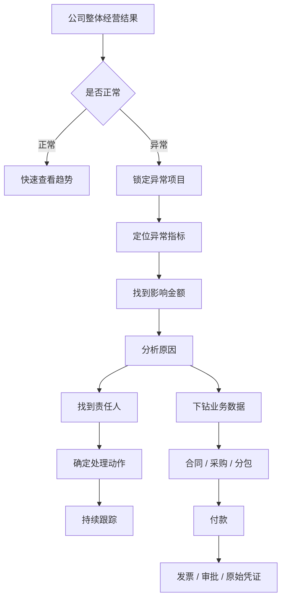

# 工程老板经营驾驶舱｜UI 原型结构 V1

## 1. 设计目标

工程老板最关心的不是单笔费用本身，而是：

- 项目最终赚不赚钱
- 现金够不够
- 哪个项目正在失控
- 哪类成本异常
- 哪些风险需要老板立即介入
- 每个异常能否追溯到具体责任人、合同、付款和原始凭证

驾驶舱设计遵循：

> **30秒看懂整体经营状态 → 3分钟定位异常项目 → 10分钟追到具体业务和单据。**

核心链路：

```text
经营结果
↓
项目
↓
问题
↓
原因
↓
责任
↓
业务数据
↓
原始凭证
```

---

## 2. 整体信息架构

```text
工程经营驾驶舱
│
├─ 01 经营总览
│   └─ 老板默认首页
│
├─ 02 项目经营
│   ├─ 项目列表
│   └─ 单项目详情
│
├─ 03 资金中心
│   ├─ 回款
│   ├─ 付款
│   └─ 未来资金预测
│
├─ 04 成本中心
│   ├─ 材料
│   ├─ 人工
│   ├─ 机械
│   ├─ 分包
│   └─ 管理 / 招待 / 差旅
│
├─ 05 风险中心
│   ├─ 利润风险
│   ├─ 超预算
│   ├─ 资金风险
│   ├─ 合同风险
│   └─ 异常费用
│
└─ 06 单据穿透
    ├─ 合同
    ├─ 变更
    ├─ 付款申请
    ├─ 发票
    ├─ 审批
    └─ 原始附件
```

---

# 3. 首页｜经营总览

建议桌面端按照 **1440px** 设计。

```text
┌──────────────────────────────────────────────────────────────────────────────┐
│ Logo  工程经营驾驶舱       全部项目 ▼     2026年度 ▼       数据更新 09:20      │
├───────────────┬──────────────────────────────────────────────────────────────┤
│               │                                                              │
│ 经营总览      │  合同收入   预计成本   预计利润   利润率   应收未收   资金缺口 │
│ 项目经营      │  2.80亿     2.35亿    4500万    16.1%   2700万    1200万⚠ │
│ 资金中心      │                                                              │
│ 成本中心      ├─────────────────────────────┬────────────────────────────────┤
│ 风险中心      │                             │                                │
│               │   预计利润趋势              │   现金流预测                    │
│               │                             │                                │
│               │     折线图                  │      折线 / 面积图               │
│               │                             │                                │
│               ├─────────────────────────────┼────────────────────────────────┤
│               │                             │                                │
│               │   项目经营健康度            │   成本结构                      │
│               │                             │                                │
│               │   横向排名                  │   横向条形图                    │
│               │                             │                                │
│               ├─────────────────────────────┴────────────────────────────────┤
│               │                                                              │
│               │  🔴 重大风险 3      🟡 关注 8       待老板审批 6              │
│               │                                                              │
│               │  C项目   预计亏损320万                         [查看 →]       │
│               │  B项目   未来30天资金缺口580万                [查看 →]       │
│               │  A项目   材料成本预计超预算180万               [查看 →]       │
└───────────────┴──────────────────────────────────────────────────────────────┘
```

---

# 4. 首页核心数字卡

首页数字卡建议不超过 **8 张**。

## 4.1 第一组：经营结果

```text
┌─────────────┐
│ 合同收入     │
│ ¥2.80亿     │
│ +3.2%       │
└─────────────┘

┌─────────────┐
│ 预计总成本   │
│ ¥2.35亿     │
│ ↑260万 ⚠    │
└─────────────┘

┌─────────────┐
│ 预计利润     │
│ ¥4500万     │
│ ↓260万 ⚠    │
└─────────────┘

┌─────────────┐
│ 预计利润率   │
│ 16.1%       │
│ 目标 18.0%  │
└─────────────┘
```

## 4.2 第二组：资金状态

```text
┌─────────────┐
│ 累计回款     │
│ ¥1.45亿     │
│ 回款率 51.8%│
└─────────────┘

┌─────────────┐
│ 累计支付     │
│ ¥1.31亿     │
│ 本月 1800万 │
└─────────────┘

┌─────────────┐
│ 应收未收     │
│ ¥2700万     │
│ ↑350万 ⚠    │
└─────────────┘

┌─────────────┐
│ 90天资金缺口 │
│ ¥1200万     │
│ 🔴           │
└─────────────┘
```

数字卡必须同时呈现：

```text
当前值
+
与上期变化
+
目标 / 预算
+
风险状态
```

---

# 5. 首页核心图表

## 5.1 预计利润趋势

老板最重要的趋势图之一。

```text
预计利润
5200 ┤●
5000 ┤ ╲ ●
4800 ┤     ╲ ●
4600 ┤          ╲ ●
4400 ┤               ●
     └─────────────────
      1月 2月 3月 4月 5月 6月
```

点击某个月后，展开利润变化原因：

```text
6月利润预测下降 -220万
│
├─ 材料上涨      -82万
├─ 分包变更      -65万
├─ 工期延长      -38万
├─ 管理费增加    -20万
└─ 其他          -15万
```

---

## 5.2 项目经营健康度

系统主动把异常项目放在前面。

```text
项目经营健康度
────────────────────────────────────────

🔴 合肥A项目
预计利润     -320万
利润变化     -520万
资金缺口      580万
主要风险      分包 + 材料

────────────────────────────────────────

🟡 芜湖B项目
预计利润      390万
利润率        6.0%
回款逾期      260万

────────────────────────────────────────

🟢 C项目
预计利润      820万
利润率        15.2%
状态          正常
```

默认排序：

```text
风险等级
↓
预计亏损
↓
利润下降幅度
↓
资金缺口
```

---

# 6. 单项目详情页

```text
┌──────────────────────────────────────────────────────────────────────┐
│ ← 合肥A项目                            项目状态：🔴 高风险             │
├──────────────────────────────────────────────────────────────────────┤
│ 合同收入 │目标成本 │预计成本 │预计利润 │利润率 │回款 │支付 │资金缺口 │
│ 8000万   │6800万   │8320万  │-320万   │-4%   │53%  │61%  │580万   │
├───────────────────────────────┬──────────────────────────────────────┤
│                               │                                      │
│ 利润变化趋势                  │ 成本执行率                           │
│                               │                                      │
│      折线图                   │ 材料  █████████ 108% 🔴              │
│                               │ 分包  ████████   96% 🟡              │
│                               │ 人工  ███████    83%                 │
├───────────────────────────────┼──────────────────────────────────────┤
│                               │                                      │
│ 回款 / 付款                   │ TOP 成本偏差                         │
│                               │                                      │
│     双折线图                  │ 钢筋       +82万                     │
│                               │ 消防分包   +65万                     │
│                               │ 机械租赁   +38万                     │
├───────────────────────────────┴──────────────────────────────────────┤
│ 项目风险                                                             │
│ 🔴 预计亏损320万                                                     │
│ 🔴 材料超预算180万                                                   │
│ 🟡 分包签证75万待确认                                                │
│ 🟡 回款逾期260万                                                     │
└──────────────────────────────────────────────────────────────────────┘
```

单项目详情重点回答：

- 这个项目最终还能不能赚钱
- 利润为什么下降
- 哪个成本类别出了问题
- 回款和付款是否匹配
- 接下来是否存在资金缺口
- 有哪些风险需要处理

---

# 7. 成本中心

核心问题：

> **钱到底花到哪里去了，哪里已经超预算。**

## 7.1 总览

```text
成本中心

目标成本        6800万
已发生          5200万
预计最终成本    8320万
预计超支        1520万 🔴
```

## 7.2 成本结构

```text
材料       ██████████████████    3200万   +8.2% 🔴
分包       █████████████         2100万   +6.5% 🔴
人工       ███████               960万    -1.2%
机械       ████                  520万    +3.8%
措施       ███                   380万
管理       ██                    260万
商务       █                     82万     +31% 🔴
```

建议每个成本类别同时显示：

```text
预算
实际发生
预计最终
偏差金额
偏差率
风险等级
```

---

# 8. 商务费用下钻

点击“商务费用”：

```text
商务及管理费用
│
├─ 招待费       8.6万     +43% 🔴
├─ 差旅费       12.3万    +8%
├─ 车辆费       9.8万     +27% 🟡
├─ 会议费       3.1万
├─ 办公费       6.2万
└─ 其他         2.8万
```

## 8.1 招待费详情

```text
招待费分析

预算             6万
实际             8.6万
超预算           2.6万
预算执行率       143%
同比             +18%
环比             +61%

────────────────────────

异常
🔴 超预算
🔴 单笔 >3000元       4笔
🟡 无事前审批         2笔
🟡 同一人员高频       3次
```

老板默认看异常，不默认看全部报销单。

原则：

> **正常费用隐藏，异常费用冒出来。**

---

# 9. 资金中心

资金中心解决：

> **钱够不够，什么时候会缺，缺多少。**

## 9.1 首页

```text
资金中心

┌───────────┬───────────┬───────────┬───────────┐
│ 账户资金   │ 应收未收   │ 应付未付   │ 90天缺口   │
│ 1800万     │ 2700万     │ 3200万     │ -1200万 🔴 │
└───────────┴───────────┴───────────┴───────────┘
```

## 9.2 未来90天资金预测

```text
未来90天资金预测
────────────────────────────────────────

           30天       60天       90天

预计回款   1200       1800       2600
预计付款   1600       2200       3100
资金差额   -400       -400       -500
```

老板必须能看到：

```text
什么时候缺钱
+
缺多少钱
+
哪个项目导致
+
主要付款对象
+
预计回款能否覆盖
```

## 9.3 未来大额支出

```text
未来30天最大支出

分包款              680万
材料款              520万
工资                260万
税款                130万
机械                 80万
```

---

# 10. 回款风险

```text
应收账款风险
──────────────────────────────────

项目        应收       逾期      逾期天数

项目A       520万      320万      47天 🔴
项目B       380万      180万      32天 🔴
项目C       260万       60万      12天 🟡
```

点击项目继续下钻：

```text
项目
↓
应收款
↓
对应工程节点
↓
应收日期
↓
实际申请日期
↓
甲方审核状态
↓
负责人
↓
下一步动作
```

---

# 11. 风险中心

风险中心不是单纯预警列表，而应成为：

> **老板待处理事项中心。**

```text
风险中心
──────────────────────────────────────────────────

             数量      影响金额

🔴 严重       6项       1860万
🟡 关注      18项        760万
⚪ 提醒      27项         -

──────────────────────────────────────────────────

TOP风险

① C项目预计亏损                    -320万
② A项目预计材料超支                -180万
③ B项目未来30天资金缺口            -580万
④ C项目消防分包变更异常              75万
⑤ A项目回款逾期                     320万
⑥ B项目招待费超预算                  2.6万
```

每条风险必须回答：

```text
发生了什么
+
影响多少钱
+
为什么发生
+
谁负责
+
下一步动作
+
当前处理状态
```

---

# 12. 风险详情弹窗

例如点击：

> 材料成本超预算180万

```text
┌───────────────────────────────────────────────┐
│ 材料成本超预算                     🔴 严重    │
├───────────────────────────────────────────────┤
│ 项目           合肥A项目                      │
│ 预算           2,800万                        │
│ 预计最终       2,980万                        │
│ 预计超支       180万                          │
│                                               │
│ 主要原因                                      │
│                                               │
│ 钢筋价格变化          +82万                   │
│ 实际耗量增加          +48万                   │
│ 设计变更              +35万                   │
│ 其他                  +15万                   │
│                                               │
│ 责任人         王XX                            │
│ 当前状态       处理中                          │
│                                               │
│ [查看材料明细] [查看合同] [查看采购记录]       │
└───────────────────────────────────────────────┘
```

---

# 13. 单据穿透

任何经营数字最终都必须可追溯。

```text
预计利润下降
↓
项目
↓
成本分类
↓
供应商
↓
合同
↓
采购 / 工程量
↓
付款
↓
发票
↓
审批流程
↓
原始附件
```

示例：

```text
预计利润 ↓260万
      ↓
A项目 ↓170万
      ↓
材料 ↓110万
      ↓
钢筋 ↓82万
      ↓
XX钢铁公司
      ↓
采购合同 CG-2026-018
      ↓
采购单
      ↓
入库单
      ↓
付款记录
      ↓
发票
```

---

# 14. 全局筛选器

顶部固定：

```text
[公司 ▼]
[区域 ▼]
[项目 ▼]
[项目经理 ▼]
[年度 ▼]
[月份 ▼]
[刷新]
```

老板常用快捷筛选：

```text
全部项目
高风险项目
亏损项目
资金紧张项目
利润下降项目
本月异常项目
```

---

# 15. 状态体系

建议只有四类状态：

| 状态 | 含义 |
|---|---|
| 🟢 正常 | 当前可控 |
| 🟡 关注 | 已出现明显偏差 |
| 🔴 严重 | 需要管理层介入 |
| ⚪ 信息 | 普通数据 |

状态必须由规则自动产生，而不是人工随意选择。

例如：

```text
利润风险
预计利润 ≥ 目标利润90%          → 🟢
低于目标利润10%以上            → 🟡
预计亏损                        → 🔴
```

```text
预算风险
预算执行率 < 80%               → 🟢
预算执行率 80%~100%            → 🟡
预算执行率 > 100%              → 🔴
```

```text
资金风险
未来90天无资金缺口             → 🟢
存在可覆盖的小额缺口           → 🟡
存在明确重大资金缺口           → 🔴
```

---

# 16. 核心交互逻辑

## 16.1 点击数字

```text
预计利润4500万
↓
各项目利润构成
```

## 16.2 点击项目

```text
A项目
↓
项目经营详情
```

## 16.3 点击异常

```text
材料超预算180万
↓
异常原因
```

## 16.4 点击原因

```text
钢筋 +82万
↓
供应商 / 采购数量 / 采购单价 / 实际耗量
```

## 16.5 点击最终记录

```text
供应商
↓
合同
↓
付款
↓
审批
↓
发票
↓
附件
```

---

# 17. V1建议只做5个页面

| 页面 | 老板要解决的问题 |
|---|---|
| **01 经营总览** | 公司整体经营是否正常 |
| **02 项目经营** | 哪个项目出了问题 |
| **03 成本中心** | 钱花在哪里、哪里超了 |
| **04 资金中心** | 什么时候会缺钱 |
| **05 风险中心** | 今天需要处理什么 |

暂时不要做大量低价值页面。

所有细节统一通过下钻解决。

---

# 18. 首页推荐布局比例

```text
┌──────────────────────────────────────────────────────────┐
│                    顶部全局筛选 5%                       │
├──────────────────────────────────────────────────────────┤
│                    核心指标卡 15%                        │
├────────────────────────────┬─────────────────────────────┤
│                            │                             │
│ 预计利润趋势 20%           │ 现金流预测 20%             │
│                            │                             │
├────────────────────────────┼─────────────────────────────┤
│                            │                             │
│ 项目健康度 20%             │ 成本结构 20%               │
│                            │                             │
├──────────────────────────────────────────────────────────┤
│                    TOP风险 / 待办 20%                    │
└──────────────────────────────────────────────────────────┘
```

首页不要出现：

- 大量原始表格
- 大量财务科目
- 十几个饼图
- 没有结论的数据
- 无法点击下钻的数字

---

# 19. 数据逻辑

驾驶舱底层至少要打通以下对象：

```text
项目
│
├─ 合同收入
├─ 目标成本
├─ 项目预算
│
├─ 收入
│   ├─ 计量
│   ├─ 应收
│   └─ 实际回款
│
├─ 成本
│   ├─ 人工
│   ├─ 材料
│   ├─ 机械
│   ├─ 分包
│   ├─ 措施
│   ├─ 管理
│   ├─ 招待
│   └─ 其他
│
├─ 合同
├─ 变更
├─ 应付款
├─ 实际付款
│
└─ 风险
    ├─ 利润风险
    ├─ 成本风险
    ├─ 资金风险
    ├─ 回款风险
    └─ 合规风险
```

---

# 20. 最终产品逻辑

整个系统不要按照“财务报表”的思路设计，而要按照“老板做经营决策”的顺序设计：



---

# 21. 最终一句话定义

> **工程老板经营驾驶舱不是“看数据的大屏”，而是一个从经营结果发现问题、定位原因、找到责任人并追溯原始业务的经营控制系统。**

最终结构：

```text
经营结果
↓
趋势
↓
偏差
↓
风险
↓
原因
↓
责任
↓
动作
↓
单据
```
