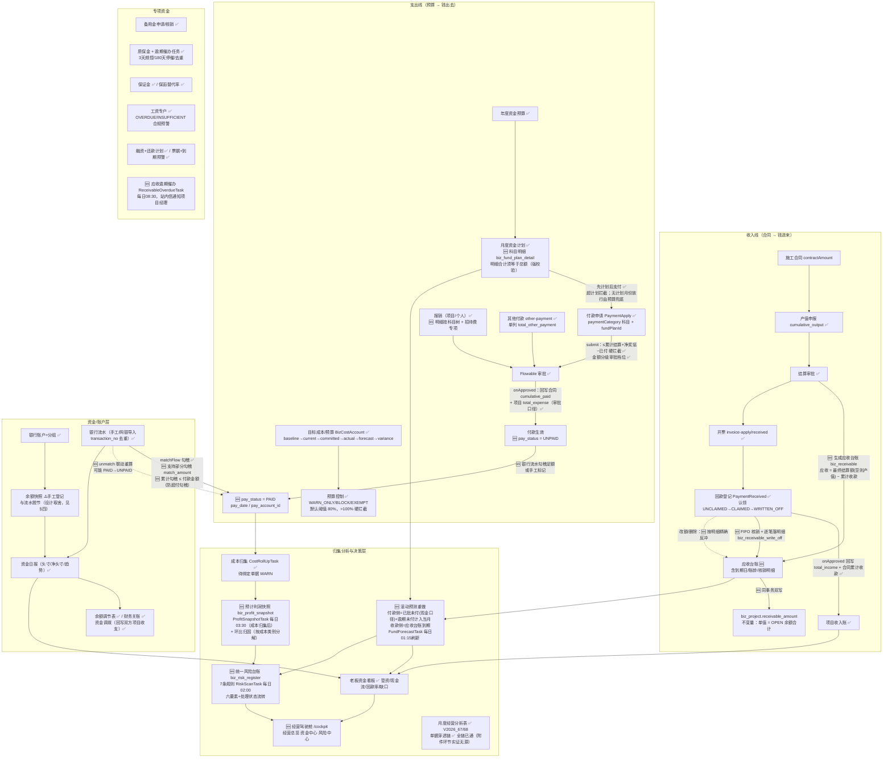

# 资金流转全景图与口径定义

> 生成时间：2026-09-23　分支：`feature/boss-cockpit-fund-flow`
> 依据：`docs/资金流转流程.md`（业务方法论）、`docs/工程老板经营驾驶舱_UI原型结构_V1.md`（呈现层）
> 取证方式：全部结论基于代码实读，非文档推断。差距分析见 `audit-reports/cockpit-fund-gap-analysis-2026-09-22.md`

---

## 一、资金流转全景图（改造后）

图例：✅已实现　🆕本次新增（V2026_56~62）　⚠️有约束需注意



---

## 二、双口径定义（最重要，禁止混用）

| 口径 | 字段 | 触发点 | 语义 | 消费方 |
|---|---|---|---|---|
| **审批口径** | `biz_project.total_expense` | `PaymentApplyService.onApproved` + 资金调拨 | 付款申请**审批通过即计入**支出，不论银行是否实际划款 | 项目账、月度计划 actualExpense 回填、R7 审计基线、已实现利润 |
| **现金口径** | `biz_payment_apply.pay_status` / `pay_date` | 银行流水勾稽足额，或手工标记支付 | 银行**实际已划款** | 滚动预测付款侧、未来大额支出 TOP、利润趋势支出分月、驾驶舱"已批未付"卡 |

**不变量（改造中必须保持）**：

1. `pay_status` 的任何变更**不回写** `total_expense` / 合同 `cumulative_paid`——否则破坏 R7 审计基线（PASS=65）与 `52_V2026_50` 勾稽种子。
2. `biz_project.receivable_amount` = 该项目 `biz_receivable` 中 OPEN 记录的 `(receivable_amount − written_off_amount)` 合计，由 `ReceivableService` 同事务双写维护。
3. `total_other_payment` 单列，不计入 `total_expense`（既有约定，权威说明见 `SubcontractSettlementService` 类注释）。
4. **滚动预测付款侧必须含逾期未付（V2026_63）**：`expected_payments` = 当月计划内未付 + 已逾期未付（`payment_date` 早于当月月初且 `pay_status≠PAID`）；后者单列 `overdue_unpaid` 作为**构成项**（不可相加），且仅计入当月、不向后续月份摊开。原口径只统计未来窗口，线上实测 16 条/5850 万逾期款全部漏计，当月缺口误显示为盈余 LOW（真实应 HIGH）。`futureExpenseTop` 同源修复（去掉 `payment_date >= today` 下界，返回 `overdueAmount` 构成）。
5. **预警/催办通知禁止假实现**：`RetentionWarningTask`（2026-09-23 修复）与 `ReceivableOverdueTask` 均经 `UrgeNotifyEvent` → zw-message 监听器落库站内信，收件人取项目 `PROJECT_MANAGER`。原实现 `log.info` 后 `return true` 属谎报成功（会写去重 key 导致永不重试）；无收件人时必须返回 false 并记 FAILED。
6. 月度计划明细合计 = 主表 `expense_plan`（容差 0.01），不一致抛异常，不静默落库。

**预计利润 vs 已实现利润**（驾驶舱两套并存，字段名区分）：

```text
预计利润 forecastProfit = 合同收入 − 预计最终总成本(CBS forecast/EAC 合计)
已实现利润 realizedProfit = total_income − total_expense（历史收付口径）
```

口径标记字段（如实呈现数据来源，不静默混用）：

- `income_basis`：`CONSTRUCTION_CONTRACT`（生效/已结算施工合同合计）｜`PROJECT_CONTRACT_AMOUNT`（无施工合同时回退项目合同额）
- `cost_basis`：`CBS_FORECAST`（成本账户完工预测）｜`FALLBACK_TOTAL_EXPENSE`（无成本账户时退化为已实现支出——此时"预计"名不副实，前端必须提示）

---

## 三、本次改造清单（V2026_56 ~ V2026_62）

| 迁移版本 | db-init | 内容 | 关键类 |
|---|---|---|---|
| V2026_56 | 58_ | 支付执行态三列 + 流水 `match_amount` + 存量按已勾稽事实初始化 PAID | `PaymentApplyService.refreshPayStatus/markPaid/revokePaid`、`BankFlowService.matchFlow` |
| V2026_57 | 59_ | `biz_receivable` + `biz_receivable_write_off` + 存量应收初始化 + 项目应收单值回填 | `ReceivableService`、`ReceivableController`、`ReceivableOverdueTask` |
| V2026_58 | 60_ | `biz_fund_plan_detail` 月度计划科目明细 | `FundPlanService.saveMonthlyPlan/listPlanDetails` |
| V2026_59 | 61_ | `biz_profit_snapshot` + `biz_risk_register` | `ProfitSnapshotService`、`RiskScanService`、`CockpitService`、7 条 `RiskRule` |
| V2026_60 | 62_ | 补 12 个二级科目 + 激活孤儿表 `biz_reimbursement_detail` + `biz_entertainment_detail` | `ReimbursementDetailService`、`BizEntertainmentDetailMapper` |
| V2026_61 | 63_ | 驾驶舱菜单 910070-910073 + `sys_role_menu` 绑定 | — |
| V2026_62 | 64_ | 应收台账菜单 910062 + 角色绑定 | — |
| V2026_63 | 65_ | `biz_fund_rolling_forecast.overdue_unpaid`（逾期未付构成列） | `FundPlanService.generateRollingForecast` |

**滚动预测数据源变更**（口径切换，看板数字会变）：

| 侧 | 改造前 | 改造后 |
|---|---|---|
| 付款 | `status=APPROVED` 的付款申请按付款日落月（注释称"已审批未付"，但该状态当时不存在）；**且只统计未来窗口，已逾期单据全部漏计** | `status=APPROVED` **且 `pay_status≠PAID`**，真实"已批未付"；**已逾期未付全额计入当月**并单列 `overdue_unpaid` 构成（V2026_63） |
| 收款 | 月度计划 `income_plan`（手工维护，不维护则恒为 0 → 缺口全红） | 应收台账 OPEN 余额按 `due_date` 落月；无台账时回退月度计划 |
| 刷新 | 仅手动触发 | `FundForecastTask` 每日 01:15 自动（公司级 + CONSTRUCTION/COMPLETED/CLOSING 项目） |
| 查询性能 | 每月一次 `selectList`（months 次查库） | 一次加载全窗口单据后内存分月（V2026_63 重构） |

**风险规则清单**（7 条，阈值全部 `@Value` 可配置）：

| 规则 | riskType | 判定式 | 默认阈值 |
|---|---|---|---|
| `ProfitLossRiskRule` | PROFIT_LOSS | 预计利润<0→RED；利润率<阈值→YELLOW | `zw.risk.profit-yellow-rate:0.05` |
| `BudgetOverRiskRule` | BUDGET_OVER | 执行率>红→RED；>黄→YELLOW（项目×成本类别，仅根账户） | `budget-red-rate:100` / `budget-yellow-rate:80` |
| `FundGapRiskRule` | FUND_GAP | 净缺口>0：预测 HIGH→RED，MEDIUM→YELLOW | — |
| `ReceivableOverdueRiskRule` | RECEIVABLE_OVERDUE | 逾期>红天数→RED，否则 YELLOW（按项目聚合） | `receivable-red-days:90` |
| `RetentionOverdueRiskRule` | RETENTION_OVERDUE | 逾期未退>红天数→RED | `retention-red-days:90` |
| `WageComplianceRiskRule` | WAGE_COMPLIANCE | OVERDUE→RED；INSUFFICIENT→YELLOW | — |
| `EntertainmentAnomalyRule` | ENTERTAINMENT_ANOMALY | 单笔超限/无事由/无对象/无发票→RED；无事前审批/同人同日多笔/同人月高频→YELLOW | `entertainment-single-limit:3000`、`entertainment-handler-monthly-count:5` |

**定时任务时序**（错峰，后者依赖前者产物）：

```text
01:15  FundForecastTask      滚动预测刷新（付款侧依赖 pay_status + 逾期口径，收款侧依赖应收台账）
02:00  RiskScanTask          风险扫描（FUND_GAP 规则消费 01:15 的预测快照，必须在其后）
02:30  CostRollUpTask        成本归集（zw-budget，写 biz_cost_account.actual）
03:30  ProfitSnapshotTask    预计利润快照（成本侧取自 CBS，必须等 02:30 归集完成；
                             曾与归集同点 02:30，会读到中间值导致快照抖动、趋势假断点）
08:00  RetentionWarningTask  质保金催办（站内信真实发送，2026-09-23 修复假通知）
08:30  ReceivableOverdueTask 应收逾期催办（新增，错开质保金）
```

---

## 四、设计取舍与已知边界（实事求是记录）

1. **银行余额不由流水推导**：网银流水非全量导入（现金账/手工账户无法覆盖），自动推导会造成余额失真。保留手工余额快照 + 余额调节表对账，流水勾稽仅联动单据支付态。
2. **手工标记支付是备选路径**：若单据已有勾稽流水，`markPaid` 直接拒绝（流水为唯一事实源，防双轨冲突）；撤销同理，须走取消勾稽。
3. **存量支付态初始化只信事实**：V2026_56 仅将"勾稽流水金额合计 ≥ 付款金额"的 APPROVED 单据置 PAID，其余保持 UNPAID，不伪造支付事实。
4. **应收台账仅由结算驱动**：进度款阶段的应收（已开票未收）未建模，故应收台账覆盖的是结算后尾款；`ReceivableOverdueTask` 无项目经理时记日志不静默指定收件人。
5. **招待费分析端点前端入口待接**：`GET /api/v1/finance/reimbursement/entertainment-analysis` 已实现并有风险规则消费，但 PC 端尚无独立分析页（一致性审计计为 Minor 级 BACKEND_ORPHAN_API，非 Critical）。
6. **月度经营分析表（资金流转文档 §9）已实现**（P2-1，V2026_67/68，10 类×6 列）：首次生成「本月发生」无上期基线时如实 NULL + `occurred_basis=NO_BASELINE`，不用 0 冒充。
7. **单据穿透链全链已通**（P2-4，2026-09-24 第五期）：首批为风险详情 → 项目成本主线/项目看板/应收台账/资金计划/质保金/工资专户（未登记类型显式提示“暂无穿透映射”，不伪造跳转；移动端仅 `PROJECT`/`COST_ACCOUNT` 提供穿透）；二期新增 `DrillDownService` 逐级链：经营数字 → 成本分类（CBS+合同侧对照）→ 供应商（或成本流水）→ 合同 → 原始单据（结算/付款/收票/入库）→ 审批轨迹（/workflow/approval/trace）；**原始附件环节实证无数据源（单据无附件上传功能），固定展示说明不伪造环节**。PC 三页接入（驾驶舱首页/成本中心/项目经营，DrillDownBreadcrumb 面包屑抽屉）。
8. **风险处理接口参数走请求体**（`RiskHandleRequest`）而非 query：移动端 `uni.request` 对 PUT 会把 `data` 放 body，用 `@RequestParam` 取不到；且一致性审计工具会把 URL 中的 query string 误当成路径的一部分而报 `FRONTEND_EXTRA_API` Critical（2026-09-23 实测踩坑，已改三端统一传 body）。**后续新增写接口勿在移动端拼 query 传参。**

---

## 五、验证结果

| 层级 | 命令 | 结果 |
|---|---|---|
| L1 后端单测 | `mvn -pl zw-finance test` | 976 passed / 0 failed |
| L1 后端单测 | `mvn -pl zw-dashboard test` | 166 passed / 0 failed |
| PC 前端单测 | `npx vitest --run`（zw-insight-web） | 116 files / 1218 passed / 2 skipped |
| 移动端单测 | `npx vitest run`（zw-insight-app） | 30 files / 246 passed |
| PC 类型 | `npx vue-tsc --noEmit` | 新增/改动文件 0 error（存量 5 处错误逐条比对未变） |
| PC 构建 | `npm run build` | built in 1m48s |
| 移动端构建 | `npm run build:h5` | Build complete |
| 样式门禁 | `npx stylelint src/views/cockpit/*.vue src/views/dashboard/project-cost-control.vue src/views/finance/{receivable,payment-apply,bank-flow,fund-plan}/**` | 0 error |
| 三端一致性 | `npx tsx src/cli.ts --root ../../` | 后端 873 / PC 757 / 移动端 88 / 20-20 模块；**Critical 0、Major 0**，Minor 323 |
| L3 契约 | `keys/test-api-fund-loop.sh`、`keys/test-api-risk.sh` | **待在服务器执行**（需真实登录基座 + jq，本地无法验证，不谎报为通过） |
