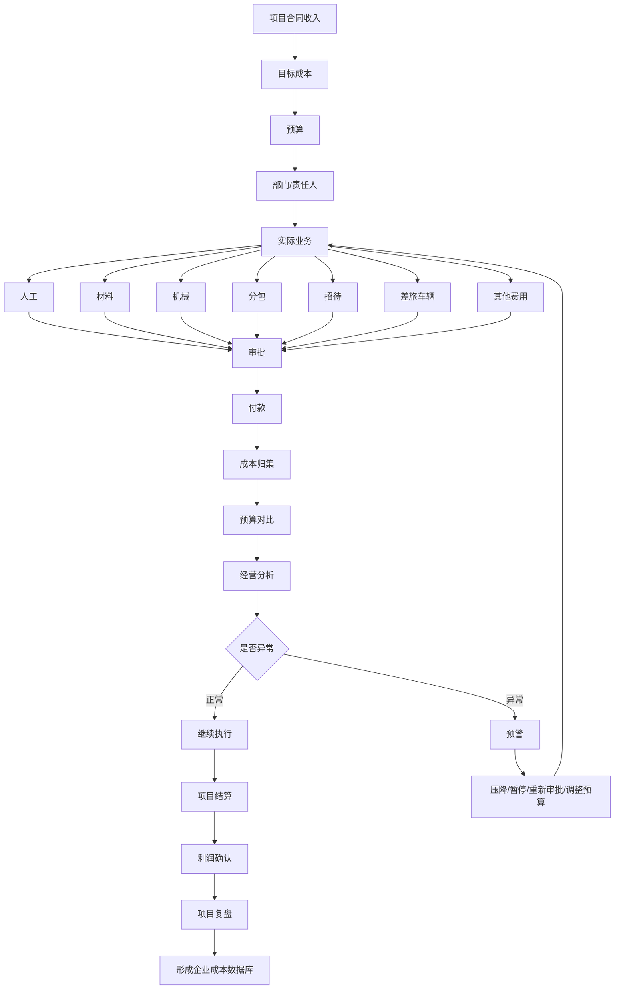

# 工程项目资金闭环管理体系

## 1. 管理目标

工程资金管理不是单纯“记账”，而是同时回答 7 个问题：

1. 项目有多少钱可以花？
2. 钱计划花在哪里？
3. 实际已经发生了多少？
4. 已经形成多少付款责任？
5. 实际支付了多少？
6. 哪些费用异常或超预算？
7. 项目最终还能赚多少钱？

核心闭环：


---

# 2. 工程资金总体结构

```text
工程项目资金
│
├── 一、收入及资金来源
│   ├── 工程合同收入
│   ├── 预付款
│   ├── 进度款
│   ├── 结算款
│   ├── 财政资金
│   ├── 企业自有资金
│   └── 融资资金
│
├── 二、生产直接成本
│   ├── 人工费
│   ├── 材料费
│   ├── 机械费
│   ├── 分包费
│   └── 措施费
│
├── 三、项目管理费用
│   ├── 管理人员工资
│   ├── 办公费
│   ├── 房租
│   ├── 水电网络
│   ├── 项目生活费
│   └── 零星行政费用
│
├── 四、商务经营费用
│   ├── 招待费
│   ├── 差旅费
│   ├── 车辆费
│   ├── 会议费
│   └── 商务活动费用
│
├── 五、专业服务费用
│   ├── 检测费
│   ├── 试验费
│   ├── 咨询费
│   ├── 审计费
│   └── 专家费
│
├── 六、财税资金费用
│   ├── 税费
│   ├── 保函费
│   ├── 保证金
│   ├── 银行手续费
│   └── 融资成本
│
└── 七、结算与资金状态
    ├── 已发生成本
    ├── 应付未付
    ├── 实际已付
    ├── 待结算金额
    ├── 预计总成本
    └── 预计项目利润
```

---

# 3. 两套账必须同时存在

## 3.1 资金控制账

解决：

> 项目整体资金是否失控。

| 指标    | 说明        |
| ----- | --------- |
| 合同收入  | 项目预计可形成收入 |
| 目标成本  | 项目计划成本上限  |
| 项目预算  | 各类费用预算    |
| 已签合同额 | 已经形成合同责任  |
| 已发生成本 | 已实际形成成本   |
| 应付金额  | 已产生付款义务   |
| 已支付金额 | 实际现金流出    |
| 预计总成本 | 项目最终可能花费  |
| 预计利润  | 收入－预计总成本  |

---

## 3.2 实际费用账

解决：

> 钱具体花去了哪里。

| 一级分类 | 二级分类示例       |
| ---- | ------------ |
| 人工   | 工资、劳务、临时工、奖金 |
| 材料   | 主材、辅材、运输、装卸  |
| 机械   | 租赁、油料、维修、进退场 |
| 分包   | 劳务分包、专业分包    |
| 措施   | 临建、临水临电、安全文明 |
| 管理   | 办公、房租、水电、生活  |
| 商务   | 招待、会议、商务活动   |
| 差旅   | 交通、住宿、补贴     |
| 车辆   | 油费、停车、维修、过路费 |
| 专业服务 | 检测、咨询、审计、专家  |
| 财税   | 税费、保函、利息     |
| 其他   | 临时零星支出       |

---

# 4. 项目预算结构

项目启动后，应将目标成本直接拆到费用科目。

例如：

| 费用类型   |         预算 |
| ------ | ---------: |
| 人工费    |       500万 |
| 材料费    |     2,000万 |
| 机械费    |       300万 |
| 分包费    |     1,200万 |
| 措施费    |       200万 |
| 项目管理费  |       150万 |
| 商务招待费  |        20万 |
| 差旅车辆费  |        30万 |
| 检测咨询费  |        30万 |
| 财税及其他  |        70万 |
| **合计** | **4,500万** |

每个科目必须具备：

```text
预算金额
+
已发生
+
已支付
+
应付未付
+
预计新增
=
预计最终成本
```

---

# 5. 单笔资金实际使用闭环

所有工程资金，无论大小，统一进入：


---

# 6. 四类典型资金闭环

## 6.1 材料采购

```text
预算
↓
材料需求计划
↓
询价 / 比价
↓
采购审批
↓
签订采购合同
↓
材料进场
↓
验收入库
↓
供应商对账
↓
付款申请
↓
付款
↓
成本归集
↓
材料耗用分析
```

重点控制：

* 数量
* 单价
* 采购总价
* 到货数量
* 实际使用数量
* 损耗量
* 库存量
* 已付
* 欠款

---

# 6.2 分包付款

```text
分包预算
↓
招标/询价
↓
签订分包合同
↓
现场施工
↓
工程量确认
↓
产值申报
↓
商务审核
↓
确认应付款
↓
付款审批
↓
支付
↓
结算
```

核心关系：

```text
合同金额
+ 变更
+ 签证
- 扣款
= 动态合同金额
```

同时必须监控：

```text
完成产值 ≥ 应付金额 ≥ 已付款金额
```

防止：

* 超合同付款
* 超工程量付款
* 超结算付款

---

# 6.3 招待费

这是项目中最需要单独控制的费用之一。

流程：


最少字段：

| 字段   | 内容      |
| ---- | ------- |
| 项目   | 哪个项目    |
| 日期   | 发生时间    |
| 招待对象 | 对方单位/人员 |
| 事项   | 为什么招待   |
| 人数   | 双方人数    |
| 地点   | 消费地点    |
| 金额   | 实际金额    |
| 经办人  | 谁发生     |
| 审批人  | 谁批准     |
| 发票   | 是否完整    |
| 支付方式 | 公账/报销   |
| 备注   | 补充说明    |

分析维度：

```text
招待费总额
招待次数
人均金额
单次最高金额
责任人累计金额
月度变化
预算执行率
```

---

# 6.4 差旅及车辆

### 差旅

```text
出差申请
→ 审批
→ 出行
→ 车票/机票/住宿
→ 报销
→ 财务审核
→ 付款
```

### 车辆

```text
车辆
├── 油费
├── 过路费
├── 停车费
├── 维修费
├── 保养费
├── 保险
└── 租赁费
```

建议按：

```text
车牌号
+ 驾驶人
+ 日期
+ 里程
+ 金额
```

进行统计。

---

# 7. 每笔资金统一数据结构

不管是 100 元招待费还是 1000 万分包款，底层数据结构统一。

| 字段     | 必填    |
| ------ | ----- |
| 项目名称   | 是     |
| 日期     | 是     |
| 一级费用类别 | 是     |
| 二级费用类别 | 是     |
| 三级费用类别 | 建议    |
| 事项名称   | 是     |
| 收款方    | 是     |
| 金额     | 是     |
| 经办人    | 是     |
| 责任部门   | 是     |
| 审批人    | 是     |
| 合同编号   | 合同类必填 |
| 发票     | 按规则   |
| 付款状态   | 是     |
| 支付日期   | 支付后   |
| 支付账户   | 支付后   |
| 关联预算   | 是     |
| 备注     | 建议    |

---

# 8. 资金状态设计

每笔资金不要只有“付了/没付”。

建议设计：

```text
01 已申请
02 审批中
03 已批准
04 已发生
05 已确认应付
06 待付款
07 部分付款
08 已付款
09 待结算
10 已结算
11 已关闭
```

这样才能真正看到资金未来压力。

---

# 9. 月度资金分析

每月必须形成一个项目经营表。

| 类别   | 预算 | 本月发生 | 累计发生 | 累计支付 | 应付未付 | 预计最终 |
| ---- | -: | ---: | ---: | ---: | ---: | ---: |
| 人工   |    |      |      |      |      |      |
| 材料   |    |      |      |      |      |      |
| 机械   |    |      |      |      |      |      |
| 分包   |    |      |      |      |      |      |
| 措施   |    |      |      |      |      |      |
| 管理   |    |      |      |      |      |      |
| 招待   |    |      |      |      |      |      |
| 差旅车辆 |    |      |      |      |      |      |
| 专业服务 |    |      |      |      |      |      |
| 财税   |    |      |      |      |      |      |

---

# 10. 必须计算的核心指标

## 10.1 预算执行率

```text
预算执行率
=
累计发生成本 ÷ 预算金额
```

---

## 10.2 支付率

```text
支付率
=
累计实际支付 ÷ 累计确认应付
```

---

## 10.3 合同执行率

```text
合同执行率
=
累计完成产值 ÷ 动态合同金额
```

---

## 10.4 资金缺口

```text
未来预计支付
-
可用资金
=
资金缺口
```

---

## 10.5 预计利润

```text
预计收入
-
预计最终总成本
=
预计利润
```

---

# 11. 风险预警规则

资金系统真正有价值的地方，不是统计，而是自动发现异常。

## 一级预警

### 预算预警

```text
实际发生 / 预算 > 80%
→ 黄色预警

实际发生 / 预算 > 100%
→ 红色预警
```

### 付款预警

```text
累计支付 > 已确认产值
→ 禁止付款
```

### 合同预警

```text
变更后金额 > 原合同金额 × 设定比例
→ 进入重点审核
```

### 招待费预警

例如：

```text
单笔过高
同一经办人频繁报销
同一天多笔招待
无事由
无对象
无审批
票据异常
超月度限额
```

### 材料预警

```text
采购量 > 预算量
采购价 > 控制价
实际耗用 > 理论耗用
库存异常
同一供应商价格异常
```

---

# 12. 项目管理层最终只看一张表

## 项目经营总览

| 指标      | 当前数据 | 状态 |
| ------- | ---: | -- |
| 合同收入    |      |    |
| 目标成本    |      |    |
| 已签合同    |      |    |
| 已发生成本   |      |    |
| 已确认应付   |      |    |
| 已付款     |      |    |
| 应付未付    |      |    |
| 剩余预算    |      |    |
| 预计总成本   |      |    |
| 预计利润    |      |    |
| 本月现金需求  |      |    |
| 三个月资金需求 |      |    |

---

# 13. 管理驾驶舱结构

```text
项目资金驾驶舱
│
├── 01 总体经营
│   ├── 收入
│   ├── 成本
│   ├── 利润
│   └── 现金流
│
├── 02 成本分析
│   ├── 人工
│   ├── 材料
│   ├── 机械
│   ├── 分包
│   └── 措施
│
├── 03 费用分析
│   ├── 管理
│   ├── 招待
│   ├── 差旅
│   ├── 车辆
│   └── 其他
│
├── 04 合同管理
│   ├── 合同额
│   ├── 变更
│   ├── 产值
│   ├── 已付
│   └── 欠款
│
├── 05 资金计划
│   ├── 本月
│   ├── 下月
│   └── 未来3个月
│
└── 06 风险中心
    ├── 超预算
    ├── 超付款
    ├── 异常报销
    ├── 费用异常
    └── 资金缺口
```

---

# 14. 最终管理闭环



---

# 15. 最小可执行版本

如果暂时不做复杂系统，只需要先建立 **6 张表**：

| 表       | 作用      |
| ------- | ------- |
| 项目预算表   | 钱计划怎么花  |
| 合同台账    | 已经承诺多少钱 |
| 费用支出台账  | 钱实际花在哪里 |
| 付款台账    | 钱实际付给谁  |
| 月度经营分析表 | 是否偏离预算  |
| 风险异常表   | 自动发现问题  |

整个体系最终形成：

> **项目 → 预算 → 合同/事项 → 费用发生 → 应付 → 支付 → 成本 → 利润 → 风险 → 复盘**

这才是工程资金管理真正可使用的闭环。
