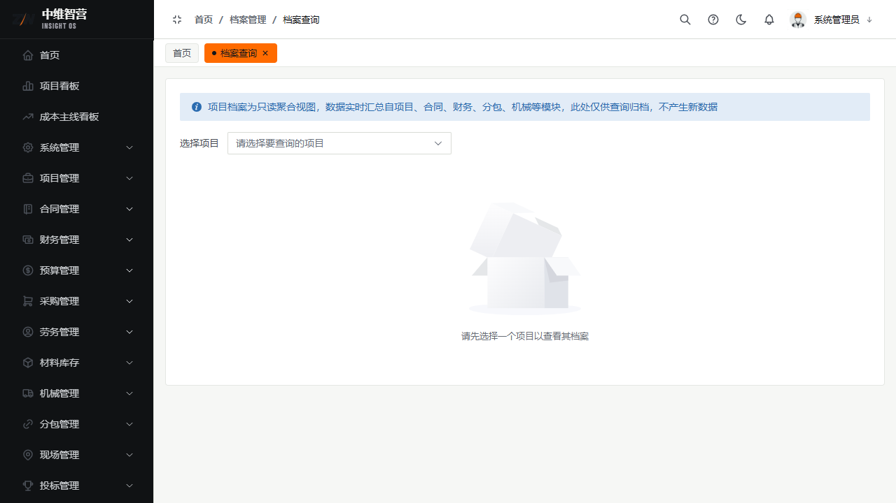

档案管理把各业务模块"已生效"的单据归集为只读视图，便于跨项目检索与留档查阅，不可在此修改数据。

> 入口：**档案管理** 菜单：档案查询 `/archive/index`、其它收入合同档案 `/archive/other-income-contract`、其它支出合同档案 `/archive/other-expense-contract`、办公用品档案 `/archive/office-supply`。

## 档案查询

按项目/类型检索已归档的业务单据（合同、结算、付款等）。结果为只读列表，点击可跳回源单据详情。

## 其它收入/支出合同档案

查看非主线（OTHER 类别）的其他合同归档记录；**办公用品档案**查看领用归档（来自行政人事 › 办公用品审批通过的单）。

## 关键校验与规则

- **档案为只读视图**：数据来源于各业务模块已生效单据，档案页不提供新增/编辑/删除。
- 归档口径=单据审批通过（APPROVED/EFFECTIVE）；草稿与驳回单据不进入档案。

## 常见问题

**Q：为什么档案里查不到某单据？**
A：该单据还未审批生效，或属于不归档的类型。档案只收录已生效单据。
