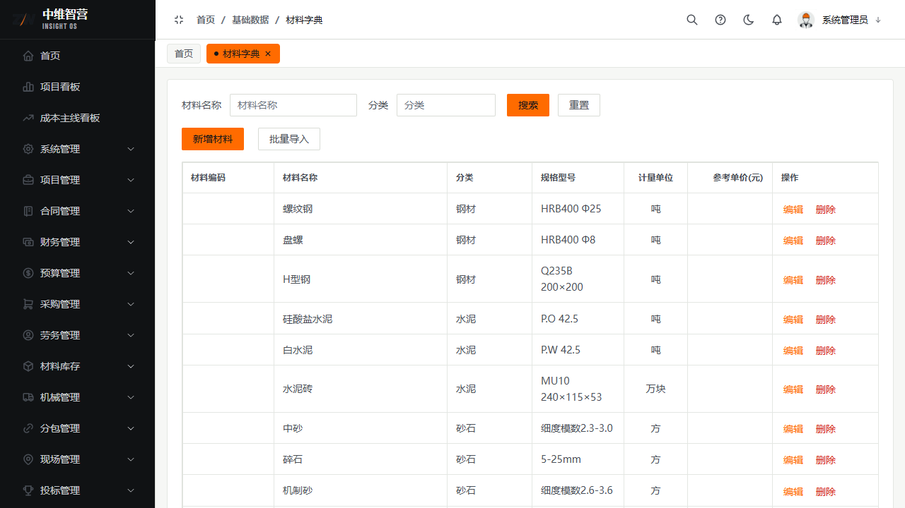
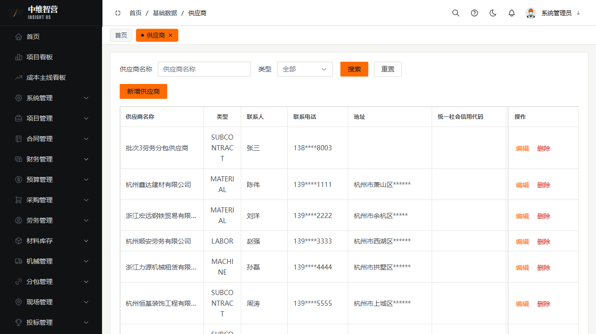
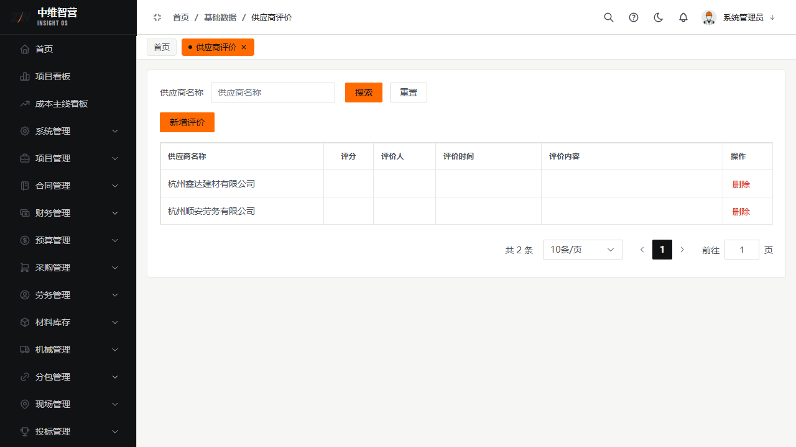

基础数据是全系统的"主数据底座"：业务单据里的材料、供应商、甲方等下拉选项都来自这里。维护好基础数据，业务录入才规范统一。

> 入口：**基础数据** 菜单：材料字典 `/basedata/material`、供应商 `/basedata/supplier`、甲方单位 `/basedata/owner`、自持公司 `/basedata/company`、检查方案 `/basedata/inspection-scheme`、供应商评价 `/basedata/supplier-evaluation`、供应商黑名单 `/basedata/supplier-blacklist`。

## 材料字典

统一材料主数据：材料名称、分类、材料编码、规格型号、计量单位、参考单价。业务入出库/预算明细引用此字典，保证同名同码。支持批量导入。

## 供应商 / 甲方单位 / 自持公司

- **供应商**：供应商名称、类型、联系人、联系电话、统一社会信用代码、地址。采购/劳务/机械/分包合同的"供应商/分包单位"下拉来源。
- **甲方单位**：甲方名称、联系人、联系电话、统一社会信用代码、地址。施工合同/投标的业主来源。
- **自持公司**：公司名称、简称、法人、统一社会信用代码、注册地址、联系电话。项目的"签约公司"来源。

## 检查方案

质量安全检查页发起检查时可选的"检查方案"模板：方案名称、方案类型、备注；方案内含检查项清单，供现场检查逐条套用。

## 供应商评价与黑名单

- **供应商评价**：对供应商打分（评分、评价内容、评价人、评价时间），用于定标参考。
- **供应商黑名单**：将不良供应商加入黑名单（加入原因）；黑名单供应商在新增合同/询价时应被规避，可移出。

## 关键校验与规则

- 基础数据为**只读引用源**：业务单据引用其 ID/名称，删除已被引用的主数据会被引用拦截。
- 材料字典的编码/单位是库存与结算口径的基础，变更需谨慎（历史单据保留快照名称）。
- 黑名单/评价不影响历史合同，只约束新增业务选择。

## 常见问题

**Q：业务页下拉里选不到某个供应商/材料？**
A：该主数据未在基础数据维护，或已被加入黑名单/停用。先去基础数据补充或解除限制。
