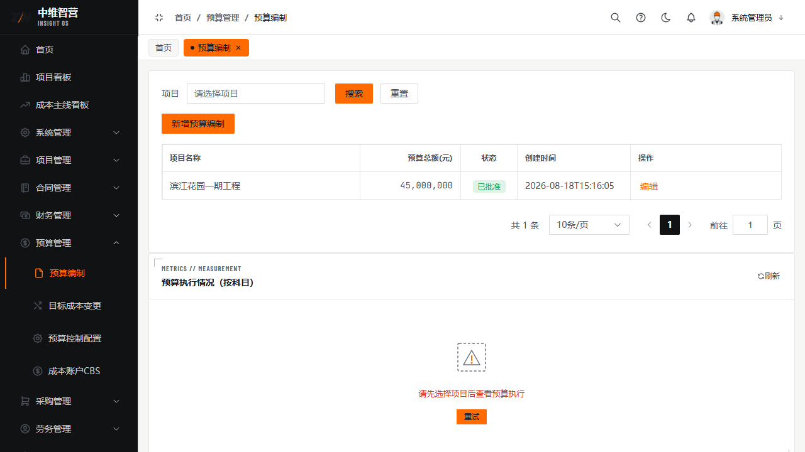
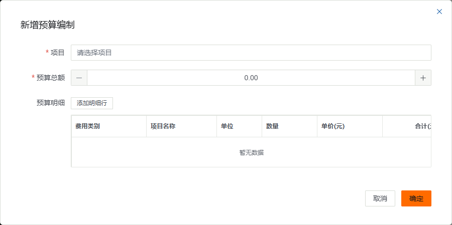
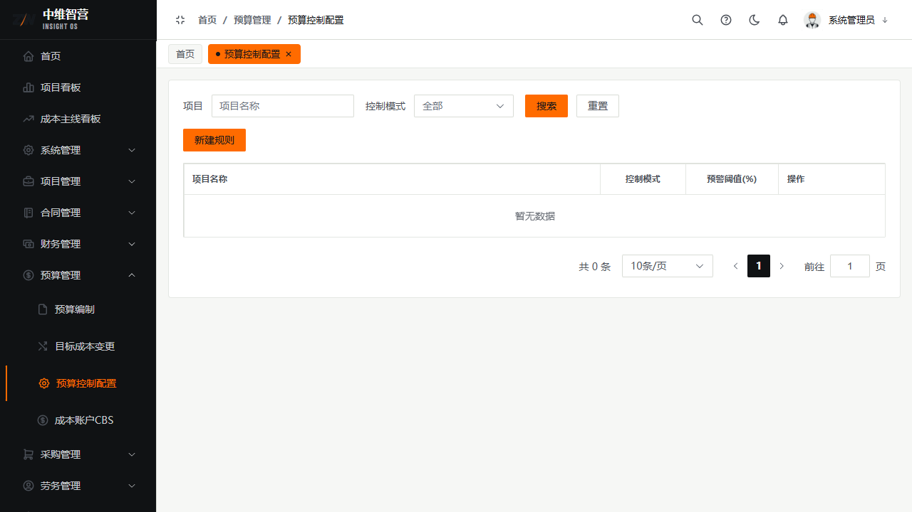
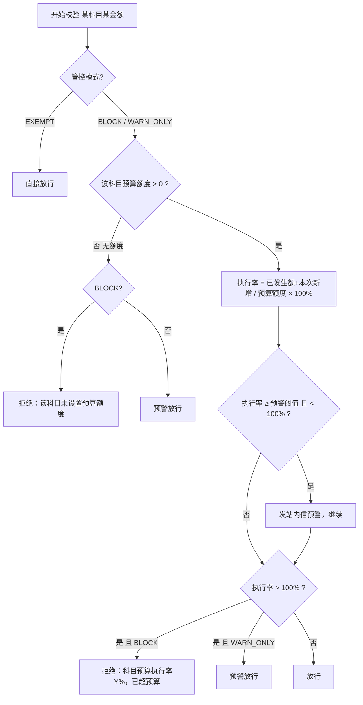
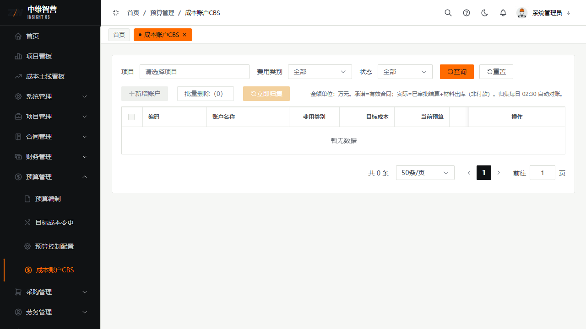

预算管理是成本管控的"总闸"：先按科目编制目标成本，再为项目设定管控模式，之后所有支出类单据（支出合同、付款申请）都会受预算执行率约束。

> 入口：**预算管理** 菜单下四个页面 —— 预算编制 `/budget/list`、目标成本变更 `/budget/change`、预算控制配置 `/budget/control-config`、成本账户CBS `/budget/cost-account`。

## 一、预算编制

为项目按科目建立目标成本（类型 `ORIGINAL`，**每个项目仅一条 ORIGINAL 预算**），填写后提交审批生效。

新增表单字段：

| 字段 | 必填 | 说明 |
|---|---|---|
| 项目 | 是 | 选择要编制预算的项目 |
| 预算总额 | 是 | 目标成本总额（金额，DECIMAL(18,2)） |
| 预算明细 | — | 「添加明细行」逐行录入：费用类别 / 项目名称 / 单位 / 数量 / 单价(元) / 合计金额 |

明细的"费用类别"即管控科目（`MATERIAL` 材料、`LABOR` 劳务、`MACHINE` 机械、`SUBCONTRACT` 分包等），决定后续哪类支出挂到哪个额度上。

## 二、预算控制配置（三种管控模式）

为项目设定支出遇到"超预算"时的处置策略：

| 模式 | 行为 |
|---|---|
| `BLOCK` | **拦截**：科目无额度、或执行率超 100% 时，该科目的支出合同保存 / 付款申请被直接拒绝 |
| `WARN_ONLY` | **仅预警**：超预算只发预警、不拦截，单据仍可保存 |
| `EXEMPT` | **豁免**：完全不做预算校验，直接放行 |

- **预警阈值**：可配范围 **50%–99%**（超出会报"预警阈值必须在50-99之间"）；执行率达到阈值即发站内信。
- 未单独配置的项目走默认档：`BLOCK` + 阈值 `80%`。

## 三、执行率与拦截判定（权威口径）

后端 `checkBudget` 的计算与决策如下——这也是"为什么提示已超预算"的根因：

- **已发生额 = 该科目已签合同金额 + 该科目已审批付款金额**。其中材料（MATERIAL）科目的"已签合同金额"= 采购合同已签金额 **+ 已审批调拨净占用**（调入为正、调出为负）。
- **执行率 =（已发生额 + 本次新增金额）÷ 预算额度 × 100%**。
- 拦截发生在**保存支出合同 / 提交付款申请**时点（`@BudgetCheck`），错误文案即上图的红字提示。

## 四、目标成本变更

对已生效预算发起**调整单**（`/budget/change`），走审批后生效，用于追加/调减科目额度。CBS 成本账户树（`/budget/cost-account`）展示各账户预算与发生额，是执行率的底层数据视图。

## 关键校验与规则

- 每项目仅一条 `ORIGINAL` 预算；调整通过变更单，不新建第二份原始预算。
- 管控模式仅接受 `WARN_ONLY`/`BLOCK`/`EXEMPT` 三个枚举值；预警阈值限 50–99。
- BLOCK 模式下"无额度"与"超 100%"都会被拒绝——新增支出前先确认科目已编额度、且额度未被占满。

## 常见问题

**Q：为什么新增支出合同提示"已超预算"？**
A：项目为 `BLOCK` 模式且该科目执行率已超 100%（或该科目根本没编预算额度）。三条出路：把管控模式调成 `WARN_ONLY`/`EXEMPT`、走目标成本变更追加额度、或改挂到有额度的科目。

**Q：执行率里的"已发生额"包不包括还没审批的草稿？**
A：不包括。只统计"已签合同金额 + 已审批付款金额"，草稿/审批中的单据不占额度。
