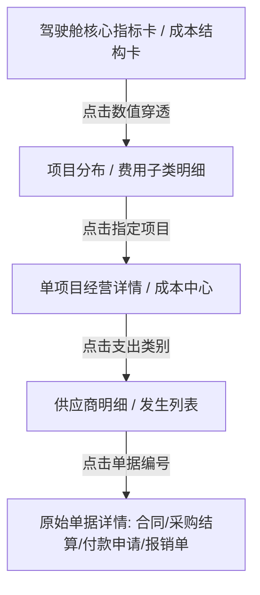

经营驾驶舱是面向企业老板与决策层的高维经营中枢（V2026_59 引入，区别于执行层看板），聚焦「还能不能赚钱、利润为何变化、钱花到哪里去了、资金何时有缺口、风险隐患在哪里」。

系统支持强大的 **P2-4 单据穿透链**：在驾驶舱、成本中心、项目经营中点击关键指标数值，可逐级向下钻取明细、项目构成与原始业务单据（合同、入出库、结算、付款凭证）。

> 入口：左侧一级菜单 **经营驾驶舱**，包含五个专属视图：
> - **经营总览** `/cockpit/overview`
> - **资金中心** `/cockpit/fund-center`
> - **风险中心** `/cockpit/risk-center`
> - **项目经营** `/cockpit/project-operation`
> - **成本中心** `/cockpit/cost-center`

## 穿透下钻全景架构

## 一、经营总览 (`/cockpit/overview`)

经营总览是高管登录后的第一决策大屏：

1. **全局筛选器与快捷筛选**：
   - 顶部提供所属公司、项目范围、年度筛选与数据刷新时点；
   - 快捷筛选提供 6 档常用筛选（全部项目、严重风险、资金缺口、已超预算、负利润、质保金逾期）。
2. **8 张核心经营指标卡（四要素结构）**：
   - **经营结果（4张）**：累计合同额、累计产值、预计总成本（CBS完工预测 EAC）、预计利润（含预计利润率）；
   - **资金状态（4张）**：累计收款、累计支出（审批口径）、应收账款（应收台账未核销）、资金缺口（未来90天缺口）；
   - 每张指标卡均遵循严格四要素呈现：**当前值**、**环比/较上期变化**、**目标或口径依据**、**风险状态**。支持点击数字发起穿透下钻。
3. **四象限经营图表**：
   - **预计利润趋势**：每月利润走势，点击月份直接下钻成本类别归因；
   - **资金预测与缺口**：支持按「月度滚动6个月」或「未来 30/60/90 天」切换资金差额与缺口视图。

## 二、资金中心 (`/cockpit/fund-center`)

资金中心负责集团与跨项目维度的现金流动性安全管控：

1. **资金总览四卡**：
   - 账户资金（银行账户可用总额）、应收未收（应收台账未结清）、应付未付（已结算未支付总额）、90天缺口。
2. **未来资金预测（滚动 6 个月）**：
   - **收款侧**：应收台账按到期日分摊落月；
   - **付款侧**：已批未付付款申请按预计付款日分月；已逾期未付款项全额计入当月（「其中逾期」列，避免向后摊开掩盖当月缺口）；
   - **资金差额与风险等级**：差额 = 预计回款 − 预计付款；系统自动评定 LOW/MEDIUM/HIGH 风险等级。
3. **未来 90 天资金预测（30/60/90 天累计窗口）**：
   - 严格提供 30 天、60 天、90 天三档累计现金流入、流出、资金差额与筹资缺口。
4. **待支付大额支出 TOP（含逾期）**：
   - 筛选未来 30/60/90 天内需划拨的大额应付款项清单，列示支出科目、金额、逾期构成与笔数。

## 三、风险中心 (`/cockpit/risk-center`)

风险中心是老板的「待处理事项与风险中枢」，汇总全业务链自动扫描识别的经营隐患：

1. **风险分级与影响金额**：
   - 风险级别按 **RED（红色严重）**、**YELLOW（黄色警示）**、**GREEN（绿色关注）** 实时聚类；
   - 统计待处理项总数及合计「影响金额（万元）」。支持点击「重新扫描」触发后台规则引擎。
2. **核心风险规则识别式**：
   - **负利润项目**：预计利润 < 0；
   - **超预算支出**：实际发生额已超目标成本（CBS baseline）；
   - **应收长账龄逾期**：款项到期未收超 90 天；
   - **质保金到期未返**：质保金逾期未收回；
   - **资金缺口预警**：未来 30 天出现不可覆盖的净现金流出；
   - **工资专户合规异常**：未按期足额拨付劳务工人工资专户；
   - **招待费异常预警**：命中单笔超限、无事由、无审批、超月度限额等 8 类违规。
3. **闭环台账处理**：
   - 每项风险记录均可查阅六要素详情与责任人；
   - 支持管理人员在线操作：**认领（PROCESSING）**、**标记解决（RESOLVED）** 或 **重新打开（OPEN）**。

## 四、项目经营 (`/cockpit/project-operation`)

从项目横向对比到单项目精细穿透：

1. **项目健康度列表**：
   - 列表展示项目健康度红黄绿灯、合同收入、预计成本、预计利润、利润率、回款率（累计收款/合同收入）、支付率（累计支付/预计成本）、资金缺口与风险数；
   - 真实口径提示：未建 CBS 成本账户的项目，其预计成本退化为已实现支出，系统如实告警。
2. **单项目深度档案（8 指标 + 四象限）**：
   - 选中项目后展示目标成本、合同毛利、垫资规模、回款完成率等 8 项核心指标；
   - 提供「单据穿透」入口，从项目总括直达采购、劳务、机械、分包等明细台账。

## 五、成本中心 (`/cockpit/cost-center`)

成本中心透视钱花到了哪里、哪个科目超出预期：

1. **成本总览四要素**：
   - **目标成本**：原始批准预算（Σ CBS baseline）；
   - **已发生**：累计已结算或已发生成本及使用率；
   - **预计最终成本（EAC）**：CBS 完工预测值；
   - **预计超支**：超出目标成本的绝对差额（红色超支提示）。
2. **七类成本结构与下钻**：
   - 清晰划分直接费（材料、人工、机械、分包）与间接费/管理费/商务费；
   - 点击进度条或「穿透」按钮，直接查看分包商/供应商明细与合同结算构成；
3. **招待费异常预警卡**：
   - 直观展示招待费当月计划额 vs 实际发生额，高亮单笔超限、同人高频、无事前审批等异常命中项，一键直达「招待费专项分析」。

## 关键校验与规则

- **双口径不混淆**：驾驶舱涉及的「支出」严格区分**审批口径**（`total_expense`，单据审批通过即计入）与**现金口径**（`pay_status=PAID`，实际银行划款流水）。
- **穿透链路保真**：穿透下钻严格遵循数据关联拓扑（项目 → CBS 账户 → 对应支出合同 → 结算单据），无数据映射时不伪造假链接。
- **定时任务错峰**：资金预测快照由每日 01:15 定时任务生成；风险扫描每日 02:00 执行；CBS 成本归集每日 02:30 执行；利润快照每日 03:30 执行。

## 常见问题

**Q：为什么个别项目的预计成本和预计利润显示为已发生数？**
A：该项目尚未在「预算管理 › 成本账户CBS」中编制完整的 CBS 成本账户树。缺少预测基线时，系统会自动提示 fallback，避免展示虚假预测。

**Q：驾驶舱里的数字点击没有反应？**
A：右上角带有箭头图标或鼠标悬停呈现下划线手型的数值支持下钻；若无对应单据或为宏观聚合项则不可下钻。
