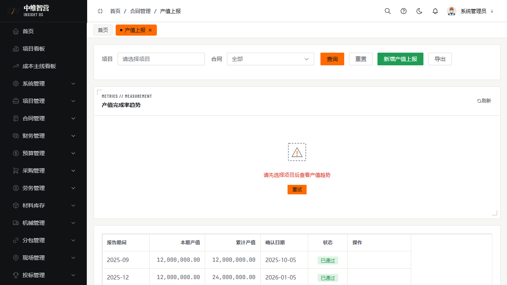
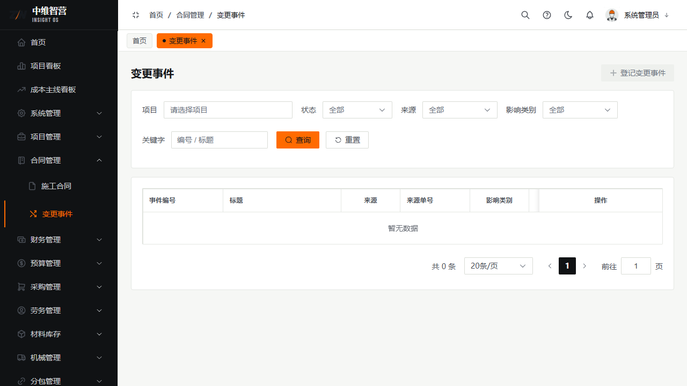

施工合同是收入侧的"载体"：产值、开票、回款都挂在已生效的施工合同上。本章覆盖主合同、BOQ 工程量、产值上报与变更事件。

> 入口：**合同管理 › 施工合同**（`/contract/list`）、**产值上报**（`/contract/output-report`）、**变更事件**（`/contract/change-event`）。

## 施工合同

列表检索：项目 / 状态。表格列：合同编号、所属项目、甲方、合同金额、签订日期、状态、操作（查看/编辑/提交/删除）。工具栏：新增合同、批量导入、导出。

新增/编辑表单字段：所属项目、合同编号、合同类型、甲方名称、签订日期、合同金额、开工日期、竣工日期、税率(%)；并可录入**合同明细行**（项目名称/规格/单位/数量/单价/合计）。保存为 `DRAFT`，提交审批通过后置 `EFFECTIVE` 并回写项目累计合同额。

### BOQ 工程量清单

合同详情可上传 BOQ（Excel 解析），列：项目编码、项目名称、单位、工程数量、综合单价、合价、已完成工程量。BOQ 是产值上报与结算的**量价依据**。

## 产值上报

按期间登记产值。表单字段：项目、施工合同、报告期间、确认日期、填报方式、本期产值；可按 BOQ 清单逐行填"本期完成量"自动算金额。列表列：报告期间、本期产值、累计产值、确认日期、状态、操作。

- 必须挂接**已生效**施工合同；
- 审批通过后回写合同**累计产值**与项目**累计产值**；
- 支持保存草稿、提交、导出。

## 变更事件

登记合同变更/签证。列表列：事件编号、标题、来源、来源单号、影响类别、成本影响、工期影响、状态、登记时间、操作（详情/编辑/转评估/批准/驳回/作废）。

变更事件走"登记 → 影响评估（填成本/工期影响与受影响账户）→ 批准"的闭环；批准后传导至合同金额与成本账户。

## 关键校验与规则

- **仅 DRAFT 可编辑/删除/提交**；生效后（EFFECTIVE）不可改，删除受状态与引用守卫。
- **产值上报需已生效施工合同**；审批通过才回写累计产值，提交/驳回不回写。
- **变更事件批准后才影响合同金额与成本账户**；作废/驳回不传导。
- 合同金额含税，税金按税率自动计算。

## 常见问题

**Q：产值上报选不到合同？**
A：该施工合同还未审批生效（EFFECTIVE）。先去施工合同页提交并通过审批。

**Q：变更事件和预算变更有什么区别？**
A：变更事件针对**合同金额/工期**（收入与成本侧的合同层面）；预算变更针对**目标成本额度**（预算管控层面）。两者独立走各自审批。
