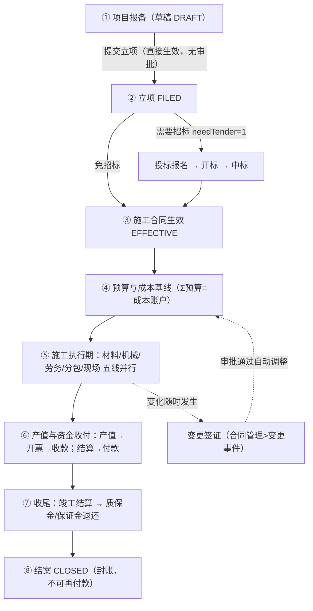
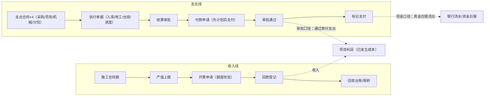

> **怎么读**：赶时间只看 §1 全景图、§2 资金双线图、§6 角色速查；日常操作按 §3 链路卡片查阅；被系统拦截时查 §5 红线速查。完整分模块文档见左侧章节列表。

## 1. 项目全生命周期全景

**一句话主线：先把项目立起来（①②③）→ 用合同锁定甲乙方（③）→ 用预算圈住成本（④）→ 干活花钱结钱（⑤⑥）→ 收尾关账（⑦⑧）。**

## 2. 资金双线与双口径

**双口径三句话**（看板里两个"支出"的区别）：

1. **审批口径**：付款申请**审批通过**即计入项目支出（已发生成本）——反映经营责任
2. **现金口径**：出纳**标记支付**/银行流水勾稽后才算真付了——反映资金实况
3. 「已批未付」清单（财务管理 > 付款申请，按支付状态筛选）就是两个口径的差

**先计划后支付**：付款日期所在月份必须有**已审批的月度资金计划**，且当月累计已批付款 ≤ 计划付款额，否则付款申请直接被拦。

## 3. 七条核心链路卡片

### 3.1 项目主线：报备 → 立项 → 投标 → 合同

| | |
|---|---|
| 做什么 | 新项目进系统：报备登记 → 立项 →（需要招标的项目走投标）→ 签施工合同 |
| 在哪操作 | 项目管理 > 项目报备 / 新增项目；投标管理 > 投标报名；合同管理 > 施工合同 |
| 审批与状态 | 报备提交后直接 FILED（立项无审批）；投标：报名→开标→中标；合同提交→审批→EFFECTIVE |
| 系统自动做 | 合同生效后项目进入施工态，预算/支出/财务模块才能挂该项目 |
| ⚠️ 红线 | 项目/合同**仅草稿可删**（推进过后不可删，只能走业务终止）；免招标项目勾选 needTender=0 跳过投标 |

### 3.2 预算与成本（花钱的"笼子"）

| | |
|---|---|
| 做什么 | 编制预算（WBS + 成本科目）形成 CBS 成本账户基线；过程中受预算控制 |
| 在哪操作 | 预算管理 > 预算编制 / 预算控制配置；经营驾驶舱 > 成本中心 |
| 审批与状态 | 预算提交→审批通过生效；Σ各账户预算 = 项目总预算 |
| 系统自动做 | 五类支出按**已审批结算单**每日自动归集到成本账户（凌晨对账）；BLOCK 模式：超预算 80% 预警、100% 拦截 |
| ⚠️ 红线 | 没有已审批预算 → 支出类单据提交直接被 BLOCK 拦截 |

### 3.3 支出四件套：采购 / 劳务 / 机械 / 分包（同构）

| | |
|---|---|
| 做什么 | 每类都是同一条链：**签支出合同 → 过程执行 → 结算 → 付款**，只是"执行"单据不同 |
| 在哪操作 | 采购管理 > 采购合同/采购结算、材料库存 > 到货入库/领料出库；劳务管理 > 劳务合同/用工单/工资单；机械管理 > 机械合同/机械台账/台班工作量；分包管理 > 分包合同/分包结算 |
| 审批与状态 | 合同：草稿→提交→审批→EFFECTIVE；执行单据→结算单审批（APPROVED）；付款申请审批 |
| 系统自动做 | 结算审批通过 → 回写合同累计结算额；付款审批通过 → 回写累计已付 + 项目支出（审批口径）；材料出库自动校验库存 |
| ⚠️ 红线 | 累计付款 ≤ 累计结算（多付拦截）；材料出库超库存拦截 |

### 3.4 收入与应收

| | |
|---|---|
| 做什么 | 按进度上报产值 → 按合同开票 → 登记回款 → 跟踪应收 |
| 在哪操作 | 合同管理 > 产值上报；财务管理 > 开票申请 / 回款登记 / 应收台账 |
| 审批与状态 | 产值审批（APPROVED 才计累计产值）；开票审批（额度校验）；回款登记 |
| 系统自动做 | 产值→项目累计产值；开票→合同累计开票额；回款→累计收款 + 应收台账自动核销；逾期应收自动进风险中心 |
| ⚠️ 红线 | 开票总额 ≤ 合同额 − 已开票（超出被拒） |

### 3.5 资金计划与预测

| | |
|---|---|
| 做什么 | 每月编制资金计划（收入/支出双线），驱动"先计划后支付"；看滚动预测与缺口 |
| 在哪操作 | 财务管理 > 资金计划 / 资金看板 / 资金日报 / 月度经营分析；经营驾驶舱 > 资金中心 |
| 审批与状态 | 月度计划：草稿→提交→审批（APPROVED 才对付款放行） |
| 系统自动做 | 滚动预测自动生成 6 个月快照；**已逾期未付款项全额计入当月**（单列"逾期未付"，不向后续月摊开）；月度计划实际支出自动回填 |
| ⚠️ 红线 | 付款日期所在月无已审批计划 → 拦截；计划额度用尽 → 拦截 |

### 3.6 变更签证

| | |
|---|---|
| 做什么 | 现场变化（地质、设计、甲方要求等）登记 → 评估成本/工期影响 → 审批 → 联动预算 |
| 在哪操作 | 合同管理 > 变更事件 |
| 审批与状态 | DRAFT → ASSESSING（评估中）→ APPROVING（审批中）→ APPROVED / 驳回；可退回重评、作废（仅未批准） |
| 系统自动做 | 审批通过自动：调整受影响 CBS 成本账户金额 + 回写合同累计变更额，全程留痕 |
| ⚠️ 红线 | 成本影响 ≠ 0 必须**挂真实受影响成本账户**且明细合计 = 成本影响额；**已批准变更不可作废**，须登记反向变更冲销 |

### 3.7 收尾与结案

| | |
|---|---|
| 做什么 | 竣工验收 → 项目最终结算 → 质保金留存/退还、保证金缴纳/退还 → 结案 |
| 在哪操作 | 财务管理 > 项目最终结算、保证金台账；项目上发起结案检查 |
| 审批与状态 | 竣工验收单审批；最终结算审批；结案检查通过 → 项目 CLOSED |
| 系统自动做 | 结案检查自动核验：无未完成审批、无未付尾款等前置条件 |
| ⚠️ 红线 | CLOSED 项目不得再发起任何付款申请 |

## 4. 主要单据状态速查

| 单据 | 状态流转 |
|---|---|
| 项目 | DRAFT → FILED →（TENDERING）→ CONSTRUCTION → COMPLETED → CLOSED |
| 施工/支出合同 | 草稿 → 审批中 → EFFECTIVE →（结算中）→ 结清 |
| 结算/付款/开票/产值 | 草稿 → 审批中 → APPROVED（驳回可改后重提） |
| 变更事件 | DRAFT → ASSESSING → APPROVING → APPROVED / REJECTED（退回重评回 ASSESSING） |
| 付款支付态 | APPROVED（已批未付）→ PAID（标记支付后，可撤销重标） |

## 5. 红线拦截速查（为什么走不下去 → 怎么办）

| 你遇到的拦截 | 原因 | 怎么办 |
|---|---|---|
| 提交支出单据报"未编制预算/超预算" | 无已审批预算，或已达 BLOCK 阈值 | 先完成预算审批；超预算走**变更签证**调增后再提交 |
| 付款申请被拒"无当月资金计划/超计划额度" | 先计划后支付 | 财务管理 > 资金计划，编制并审批当月计划（或调整付款日期） |
| 删除项目/合同报"仅草稿状态可删除" | 已推进的单据不可物理删除（保账） | 走业务终止/作废流程，历史留痕 |
| 材料出库报"库存不足" | 出库量 > 当前库存 | 先到货入库或材料调拨 |
| 开票报"可开票额度不足" | 累计开票将超合同额 | 走变更签证调增合同额，或核对已开票记录 |
| 付款报"累计付款超结算" | 付款 > 已审批结算额 | 先完成结算审批再付款 |
| 变更评估报"必须指定受影响的成本账户" | 成本影响≠0 必须挂真实账户 | 在变更事件里添加受影响 CBS 账户（增/减方向 + 金额，合计=成本影响） |
| 已批准变更不能作废 | 终态不可逆（审计要求） | 登记一笔**反向变更**冲销 |

## 6. 角色速查表（谁在哪一步做什么）

| 角色 | 主责链路 | 高频入口 |
|---|---|---|
| 项目经理 | 项目主线、执行期五线、产值上报、变更发起 | 项目管理、现场管理、产值上报/变更事件 |
| 商务/预算员 | 合同、预算与成本、投标 | 合同管理、预算管理、投标管理 |
| 采购/材料员 | 采购合同、到货入库、领料出库 | 采购管理、材料库存 |
| 机械管理员 | 机械合同、台账、台班 | 机械管理 |
| 劳务管理员 | 劳务合同、用工单、工资单 | 劳务管理 |
| 分包管理员 | 分包合同、分包结算 | 分包管理 |
| 财务 | 开票/回款/付款/资金计划/最终结算 | 财务管理 |
| 出纳 | 标记支付、银行流水 | 付款申请（支付状态）、银行流水 |
| 管理层 | 经营监控 | 经营驾驶舱、项目看板 |
| 系统管理员 | 组织/角色/菜单/流程/编号规则 | 系统管理、工作流管理 |

> 审批统一入口：**消息管理 > 消息中心**（待办提醒）与**工作流管理 > 审批管理**；被驳回的单据在原页面修改后重新提交。
