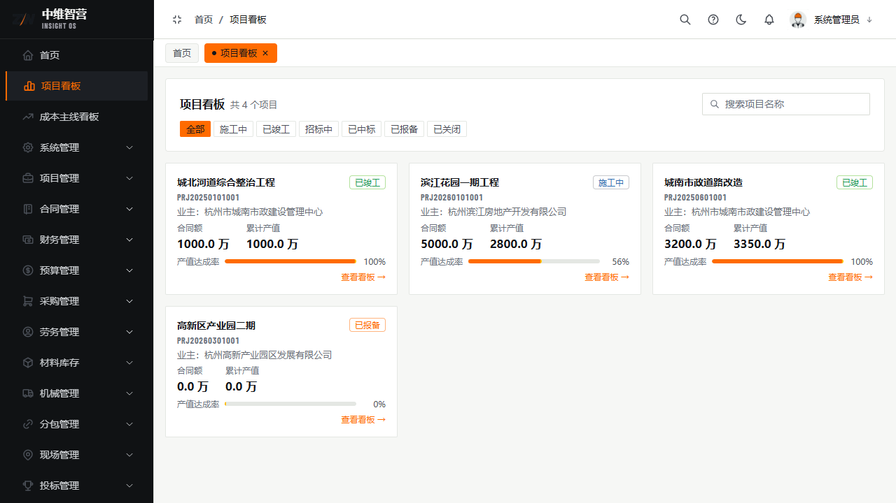
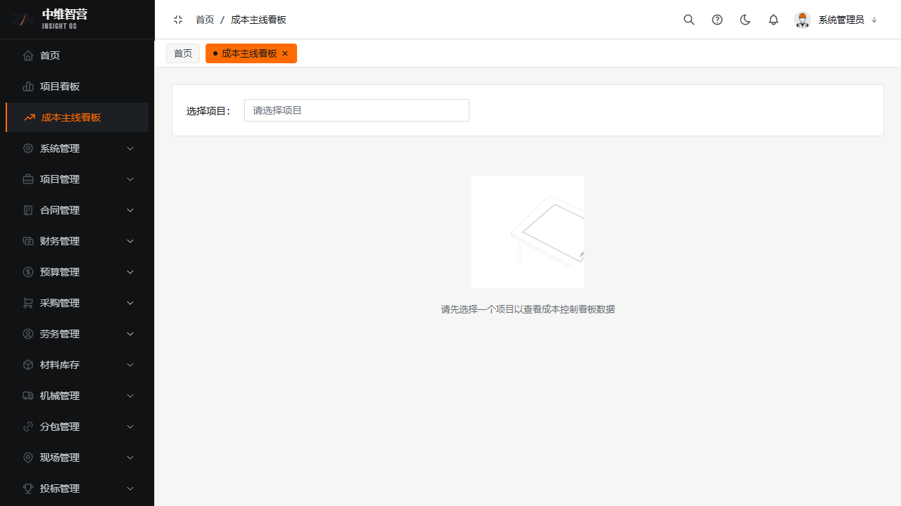

看板提供三个层级的经营视角，数据全部来自真实业务单据的汇总，非静态示意。

> 入口：顶栏/菜单 **首页**（`/dashboard`）、**项目看板**（`/project-dashboard`）、**成本主线看板**（`/project-cost-control`）。

## 首页（公司概览）

公司级 KPI：在建项目数、总产值、总收款、**垫资**等，配待办提醒与趋势图。登录后默认落地页。

## 项目看板（多项目对比）

按关键词/状态筛选多项目，以卡片对比各项目的产值、收款、支出与进度，便于横向比较经营状况。

## 成本主线看板（单项目）

先**选择项目**，再查看该项目的成本账户执行、预测超支与变更待办，是单项目成本管控的驾驶舱。

## 关键校验与规则

- **垫资口径 = 总支出 − 总收款**（付款口径）；为正表示公司仍在垫资，随回款推进而减少。
- **成本主线看板未选项目时显示引导插画**，选项目后才加载数据（避免全量扫描）。
- 看板数字均为审批通过单据的汇总，与财务/合同页累计值同源可勾稽。

## 常见问题

**Q：成本主线看板为什么是空的？**
A：需先在顶部"选择项目"下拉中选一个项目；未选择时只显示引导提示。

**Q：首页垫资和财务章的垫资一致吗？**
A：一致，同为"总支出−总收款"付款口径，只是展示层级不同（公司级 vs 项目级）。
