财务管理覆盖资金的"收—支—结—管"全链路：收入侧确认回款，支出侧控制付款，结算封账锁账期，资金管理（保证金/工资专户/资金计划/看板/票据/融资/银行流水等）提供集团级资金视图与专项管控。

> 入口：**财务管理** 菜单（路由前缀 `/finance/*`），共 24 个功能页。下文按"收入 / 支出 / 结算封账 / 资金管控 / 基础配置"分组说明。

## 资金流转全景

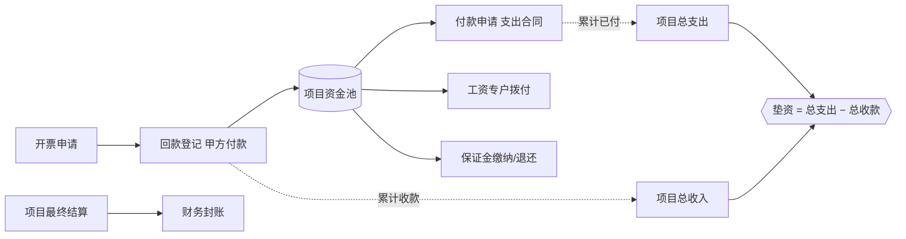

## 一、收入侧

| 页面 | 路由 | 作用 | 审批通过后回写 |
|---|---|---|---|
| 开票申请 | `/finance/invoice-apply` | 对施工合同发起销项开票 | 合同**累计开票** |
| 收票登记 | `/finance/invoice-received` | 登记供应商进项发票 | 进项台账 |
| 发票汇总 | `/finance/invoice-summary` | 按项目/期间汇总进销项 | — （只读视图） |
| 回款登记 | `/finance/payment-received` | 登记甲方回款 | 合同**累计收款**、项目**总收入** |

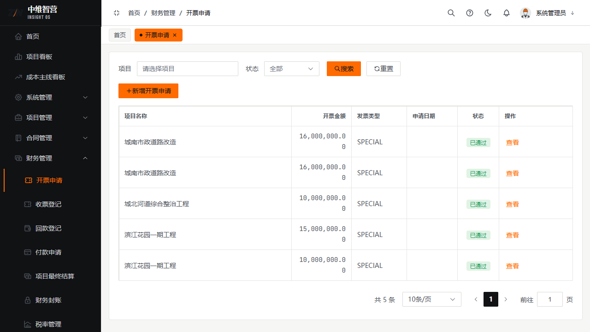

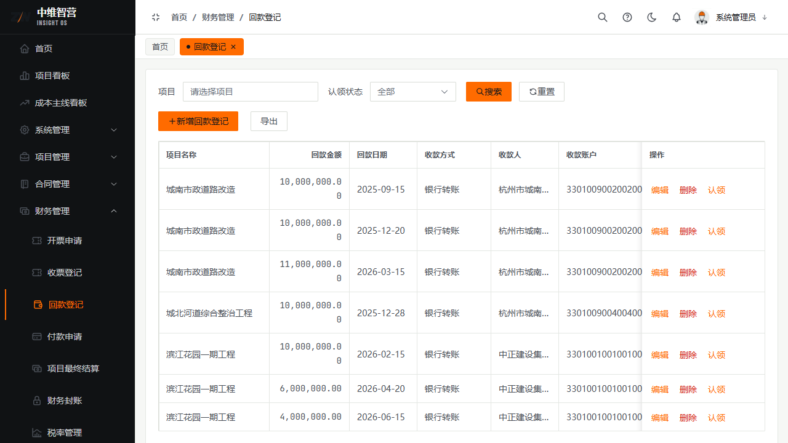

开票/回款都必须挂接**已生效的施工合同**；只有审批通过才回写累计值，删除已生效单据会对称冲销。

## 二、支出侧

| 页面 | 路由 | 作用 |
|---|---|---|
| 付款申请 | `/finance/payment-apply` | 对已结算的支出合同付款（受可付上限约束） |
| 其他费用付款 | `/finance/other-payment` | 非主线合同类支出付款（OTHER 类别） |
| 项目报销 / 个人报销 | `/finance/project-reimbursement`、`/finance/personal-reimbursement` | 项目/个人费用报销 |
| 备用金管理 | `/finance/reserve-fund` | 备用金借支与核销 |
| 质保金管理 | `/finance/retention` | 质保金登记、到期与逾期催办 |

### 付款申请（核心，字段级）

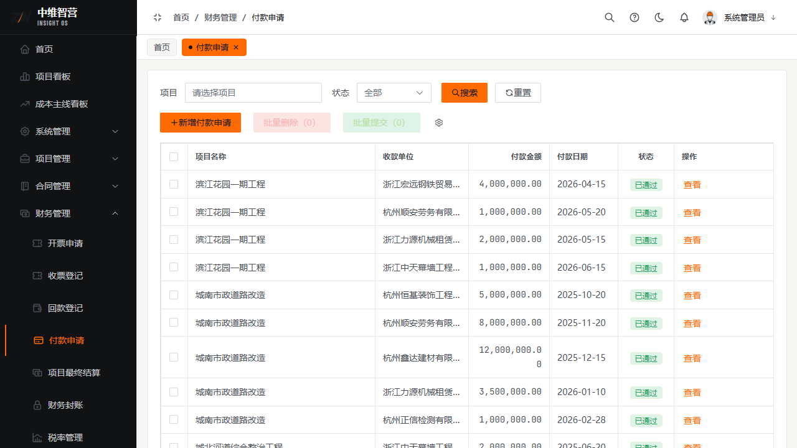

新增付款申请表单字段：

| 字段 | 必填 | 说明 |
|---|---|---|
| 项目 | 是 | 付款所属项目 |
| 合同类型 | 是 | 决定路由到哪张合同表（采购/劳务/机械/分包/其他） |
| 关联合同 | 是 | 先选项目与合同类型后才可选 |
| 收款单位 | 是 | 供应商/班组/分包单位 |
| 付款金额 | 是 | 受"可付上限"校验（见下） |
| 付款日期 | 是 | — |

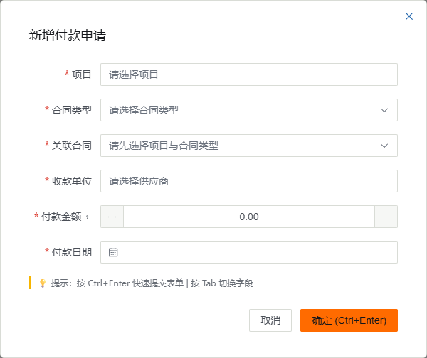

**可付上限（权威口径）**：

```
最大可付金额 = 合同累计结算 + 净奖惩 − 合同累计已付
```

- 付款金额 > 上限即被拒，提示"付款金额不能超过（累计结算含奖惩）减已付金额，最大可付金额：X"。
- **净奖惩**（奖励为正、处罚为负）仅**劳务/分包**合同适用，其它类型计 0。
- 付款按合同类型路由到对应合同表读取累计值；OTHER 类别走"其它合同"。
- **提交时**回填"累计结算快照/未付金额快照"到单据，供详情追溯；**审批通过（onApproved）时**才回写合同累计已付与项目总支出，且生效前会**重新校验**可付上限（审批期间额度若变化会超限自动驳回）。
- **金额分级审批**：付款金额命中「审批分级配置」（`/system/amount-tier`）的档位时，流程按 `approvalTier` 路由到更严的审批节点。

### 质保金

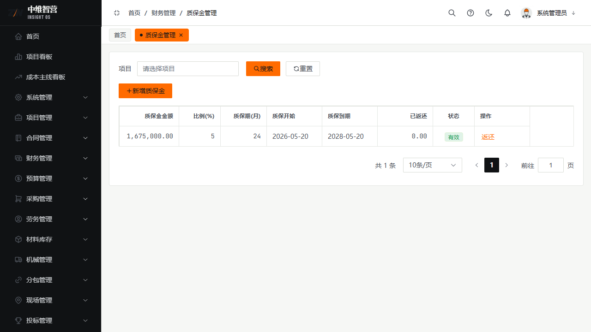

登记质保金及到期日，到期未返还即逾期，系统定期站内信催办；长期逾期需人工处理。

## 三、结算与封账

| 页面 | 路由 | 作用 |
|---|---|---|
| 项目最终结算 | `/finance/settlement` | 生成结项结算单（收入/支出汇总，用于结案） |
| 财务封账 | `/finance/finance-lock` | 锁定会计期间，封账期内单据不可新增/修改 |

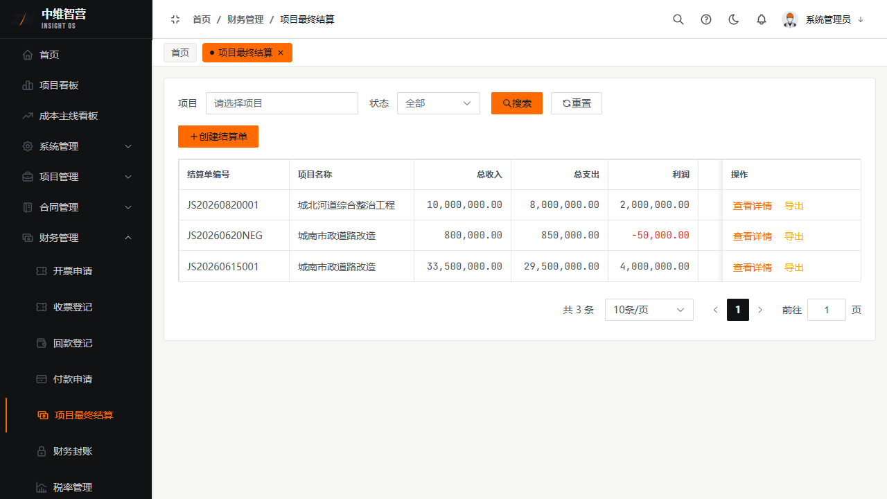

## 四、资金管控（P0–P2）

### 资金看板（老板视角）

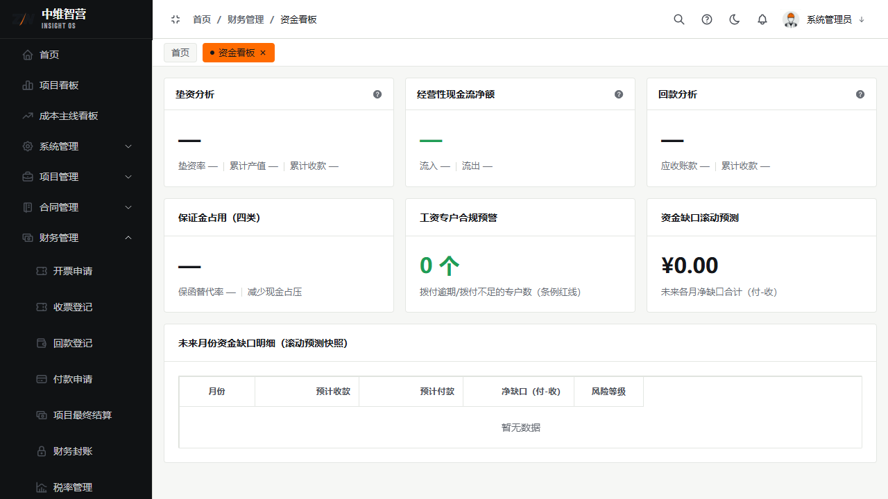

集团级资金总览，KPI 卡包括：**垫资分析**（垫资率 / 累计产值 / 累计收款）、**经营性现金流净额**（流入/流出）、**回款分析**（应收账款 / 累计收款）、**保证金占用（四类）**（保函替代率 / 减少现金占压）、**工资专户合规预警**（拨付逾期/不足的专户数）、**资金缺口滚动预测**（未来各月净缺口合计 = 付−收），并配"未来月份资金缺口明细"表（月份/预计收款/预计付款/净缺口/风险等级）。

### 保证金台账 / 工资专户 / 资金计划

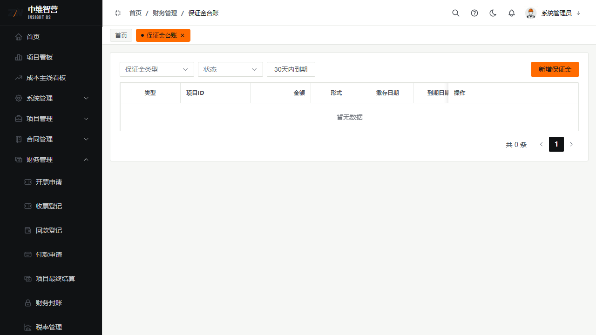

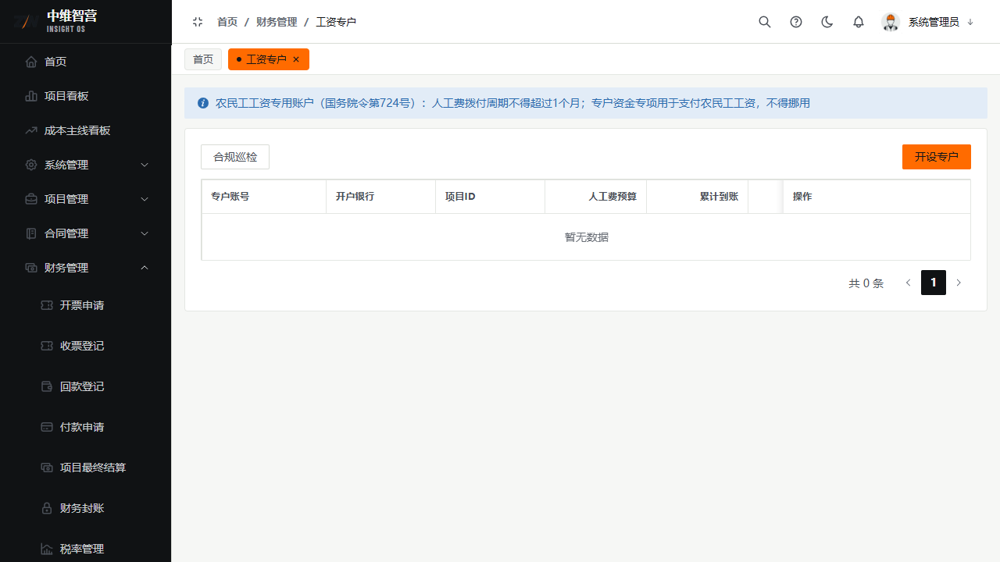

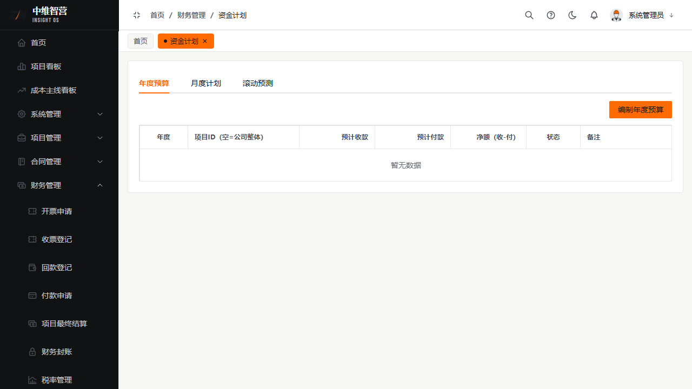

- **保证金台账** `/finance/security-bond`：投标/履约/质量等各类保证金的缴纳、退还与占用监控。
- **工资专户** `/finance/wage-account`：劳务工资专户的拨付与合规预警（防欠薪）。
- **资金计划** `/finance/fund-plan`：按期间的资金收支计划编制与执行对比。

### 票据 / 融资（P1）

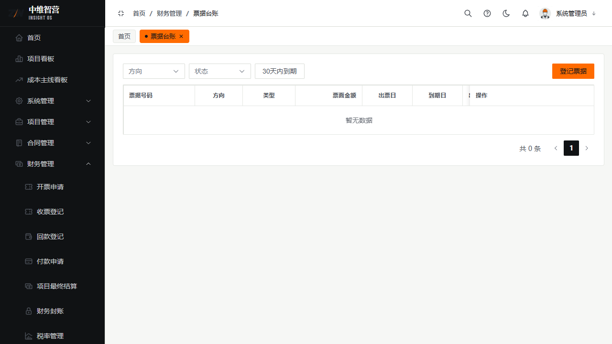

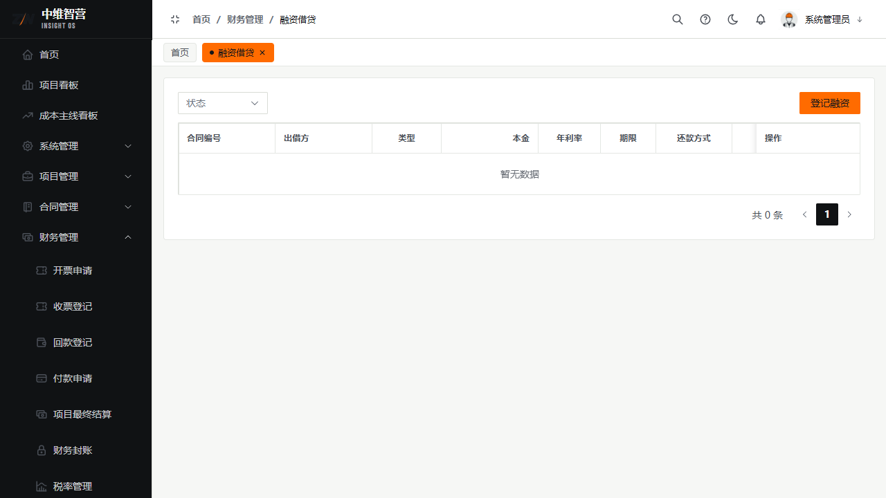

- **票据台账** `/finance/bill`：应收/应付票据（承兑汇票等）的登记与到期跟踪。
- **融资借贷** `/finance/financing`：借款/融资的台账、利息与到期管理。

### 银行对账（P2）

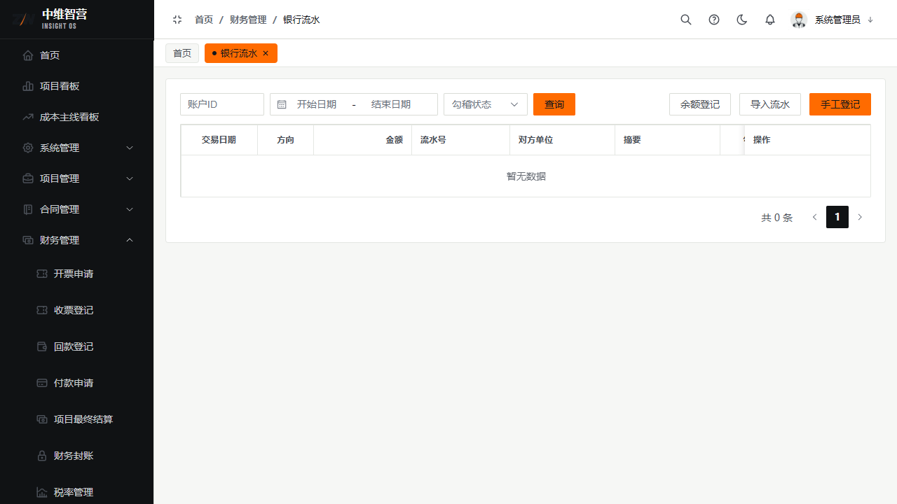

- **账户分组** `/finance/bank-account-group`：银行账户的分组归集。
- **银行流水** `/finance/bank-flow`：银行交易流水导入与查询。
- **余额调节表** `/finance/balance-reconciliation`：账面余额与银行流水的对账调节。
- **资金日报** `/finance/daily-cash-report`：每日资金头寸与收支汇总。

## 关键校验与规则

- **回写只在生效时点**：付款/回款/开票审批通过才回写合同累计值与项目总收支；删除已生效单据对称冲销。
- **可付上限 = 累计结算 + 净奖惩 − 累计已付**；付款生效前二次校验，超限自动驳回并通知发起人。
- **项目总支出（付款口径）** 仅由付款申请审批通过与资金调拨回写，不含"其他费用付款"（后者单列）。
- **封账保护**：封账期间内财务单据不可新增/修改，需先解封。
- 金额统一 `DECIMAL(18,2)`；所有累计值可被数据一致性审计勾稽核对。

## 常见问题

**Q：付款申请提示超出可付金额？**
A：确认该合同是否已有足额"已审批结算"。可付上限 = 累计结算 + 净奖惩 − 累计已付；没结算就没额度。

**Q：垫资是怎么算的、为什么一直在变？**
A：垫资 = 项目总支出 − 总收款（付款口径）。随着付款增加、回款增加而动态变化，回款跟上后垫资收窄。

**Q：为什么"其他费用付款"没算进项目总支出？**
A：项目总支出统一为"付款口径"，仅由付款申请（对支出合同）与资金调拨回写；其他费用付款单列在"其他付款"，不并入总支出，避免口径混淆。
