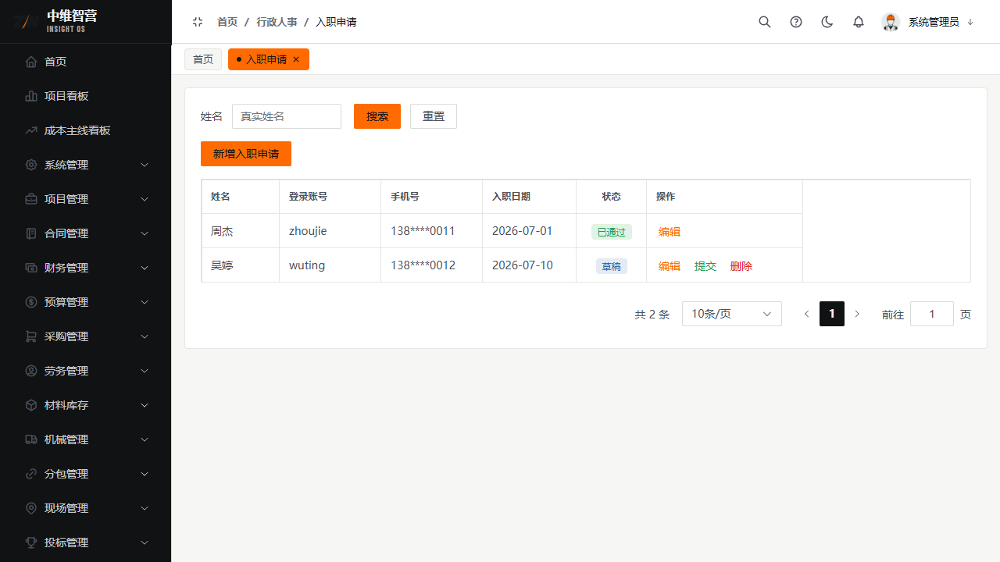
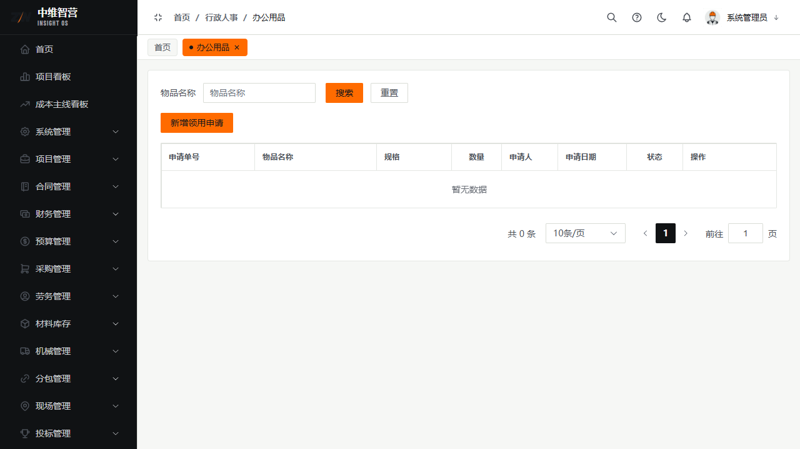
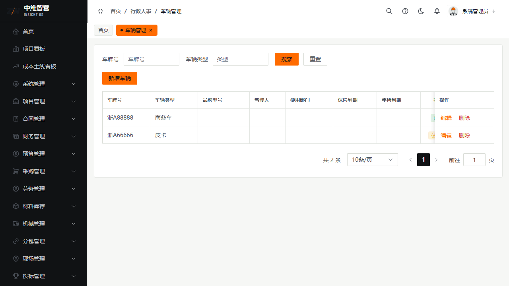
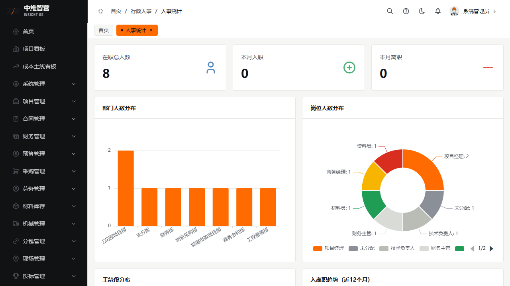

行政人事管理公司内部的"人与物"：员工入离职、办公用品领用、车辆台账与人事统计。

> 入口：**行政人事** 菜单：入职申请 `/hr/entry`、离职申请 `/hr/resign-apply`、办公用品 `/hr/office-supply`、车辆管理 `/hr/vehicle`、人事统计 `/hr/statistics`。

## 入职 / 离职

**入职申请**字段：姓名、真实姓名、登录账号、手机号、性别、部门、岗位、入职日期；列：姓名、登录账号、手机号、入职日期、状态、操作（编辑/提交/删除）。走审批流，通过后建立人员档案。

**离职申请**字段：姓名、离职日期、交接人、是否已交接；离职需指定交接人并完成交接。

## 办公用品

领用申请字段：物品名称、规格、数量、用途；列：申请单号、物品名称、规格、数量、申请人、申请日期、状态、操作。审批通过后计入领用归档（档案 › 办公用品档案）。

## 车辆管理

车辆台账字段：车牌号、车辆类型、品牌型号、驾驶员、使用部门、保险到期、年检到期；用于车辆使用与证照到期提醒。

## 人事统计

按部门/时间汇总人员结构与入离职变动，数据由审批通过的入离职单据汇总。

## 关键校验与规则

- 入离职/办公用品单据遵循**通用审批流**；仅草稿可编辑/删除。
- **统计数据由审批通过的单据汇总**，草稿/驳回不计入。
- 离职必须指定交接人；保险/年检到期触发车辆提醒。

## 常见问题

**Q：入职审批通过后会自动建账号吗？**
A：入职单含登录账号字段，审批通过后同步人员档案；账号启用/停用由系统管理 › 人员管理控制。
