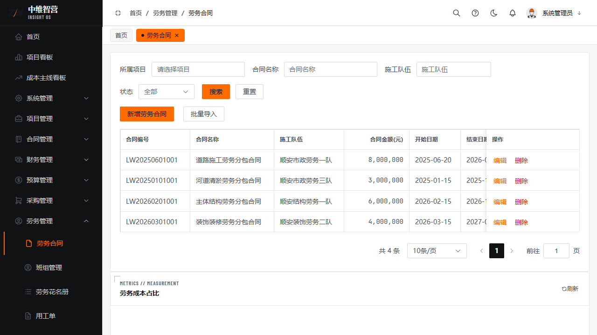
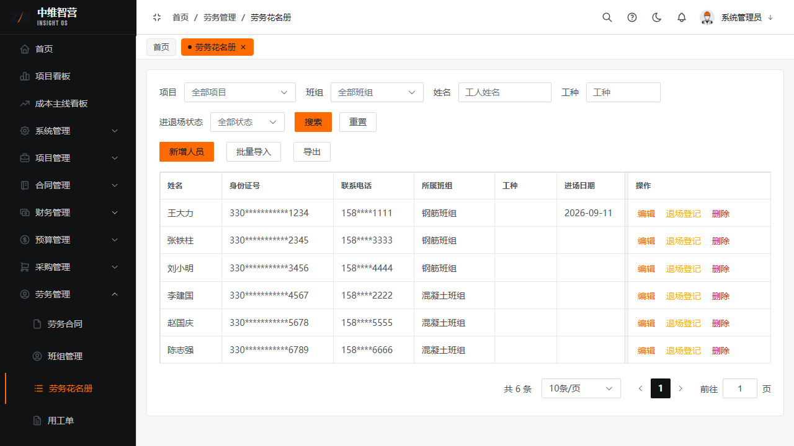
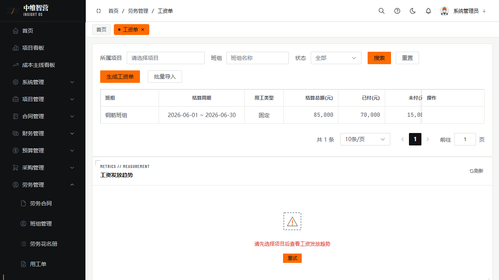

劳务管理覆盖"人"的链条：签劳务合同 → 建班组/花名册 → 派工（用工单）→ 生成工资单 → 劳务结算 → 付款。

> 入口：**劳务管理** 菜单：劳务合同 `/labor/contract`、班组管理 `/labor/team`、劳务花名册 `/labor/roster`、用工单 `/labor/work-order`、工资单 `/labor/payroll`、薪资统计 `/labor/salary-stats`。

## 劳务合同

新增字段：所属项目、合同名称、施工队伍、合同金额、开始日期、结束日期、备注。列表列：合同编号、合同名称、施工队伍、合同金额(元)、开始日期、结束日期、状态、操作。提交审批生效。

## 班组与花名册

**班组管理**：班组名称、工种、班组长、联系电话、人数。

**劳务花名册**登记工人：姓名、身份证号、联系电话、所属班组、工种、进场日期；支持进场登记/退场登记、批量导入、导出。列：姓名、身份证号、联系电话、所属班组、工种、进场日期、退场日期、状态、操作。

## 用工单（派工）

按日对花名册工人派工：工人姓名、用工类型、工作日期、工时、时薪(元)、加班工时、加班费率，实时"合计预览"。列：工人、工作日期、用工类型、工时、时薪(元)、加班工时、合计(元)、状态、操作。

## 工资单与薪资统计

**工资单**按班组+结算周期汇总生成：列班组、结算周期、用工类型、结算总额(元)、已付(元)、未付(元)、状态；操作"生成工资单"→提交审批。**薪资统计**按项目/月份/班组/工人汇总出勤、应发、扣款、实发，可导出 Excel。

## 关键校验与规则

- **劳务结算金额不得超过合同金额**（超合同拦截）；结算审批通过回写合同累计结算。
- **工人已有派工记录时不可从花名册删除**（引用拦截）；退场需走退场登记。
- 工资单由用工单汇总生成，审批通过才计入应付；仅草稿可编辑/删除。
- 净奖惩（奖励−处罚）会计入付款"可付上限"（劳务合同适用）。

## 常见问题

**Q：花名册里删除工人报错？**
A：该工人已有用工单（派工）记录，属引用拦截。先处理其派工/工资数据或走退场登记。

**Q：工资单金额从哪来？**
A：由该班组结算周期内的用工单（工时×时薪+加班）自动汇总，非手工填写，保证可追溯。
