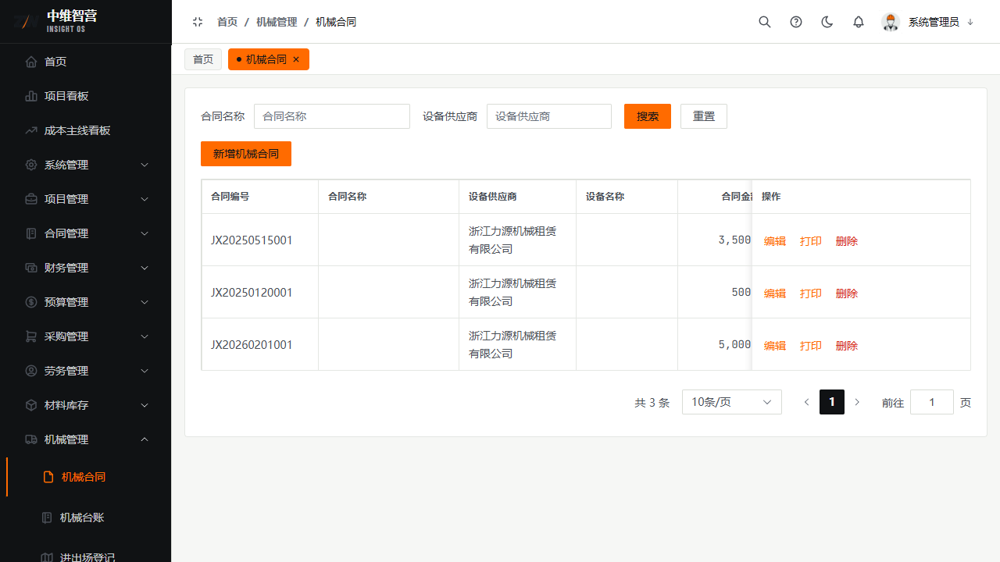
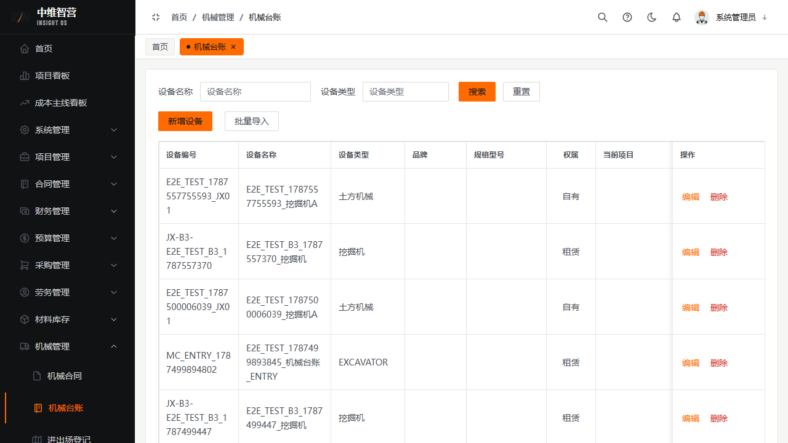
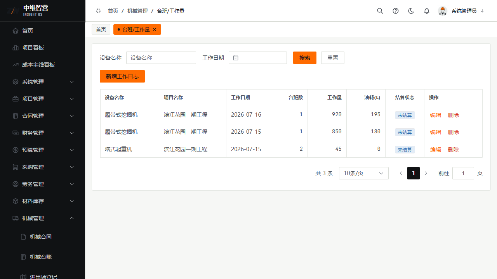
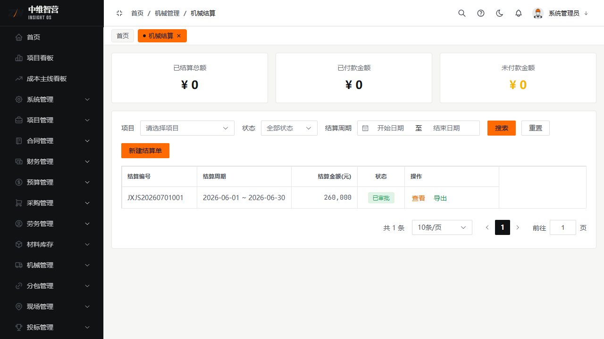

机械管理覆盖设备租赁的"合同—台账—进出场—台班—维修—结算"全链条。

> 入口：**机械管理** 菜单：机械合同 `/machine/contract`、机械台账 `/machine/ledger`、进出场登记 `/machine/entry`、台班/工作量 `/machine/work-log`、故障维修 `/machine/repair`、机械结算 `/machine/settlement`。

## 机械合同

新增字段：合同名称、设备供应商、所属项目、设备名称、合同金额、租赁方式、开始日期、结束日期。列表列：合同编号、合同名称、设备供应商、设备名称、合同金额(元)、租赁方式、开始日期、结束日期、操作。提交审批生效。

## 设备台账与进出场

**机械台账**维护设备档案：设备名称、设备类型、品牌、规格型号、权属、当前项目；列含设备编号、状态。**进出场登记**记录设备进场/退场（类型、设备、项目、日期）。

## 台班/工作量与维修

**台班/工作量**按日登记机械作业：设备、工作日期、台班数、工作量、油耗(L)；列含"结算状态"标记该记录是否已计入结算。**故障维修**登记故障描述、报修人、维修日期、维修费用。

## 机械结算

对机械合同发起结算（按合同或按工作量）。新建结算单：项目、结算周期 + 明细行（机械名称、规格型号、工作天数、单价、金额、备注）；列表列：结算编号、结算周期、结算金额(元)、状态、操作（查看/提交审批/导出）。

## 关键校验与规则

- **机械结算金额不得超过合同金额**；审批通过回写合同累计结算。
- **台班/工作量单据是"按工作量结算"的依据**，与合同级结算分表存储；已计入结算的台班记录会标记结算状态，防重复计。
- 仅草稿可编辑/删除；进出场/维修记录为执行留痕，不参与金额回写。

## 常见问题

**Q：按工作量结算时金额从哪来？**
A：由结算周期内未结算的台班/工作量记录汇总（台班数×单价），非手工随意填，保证与作业留痕一致。
