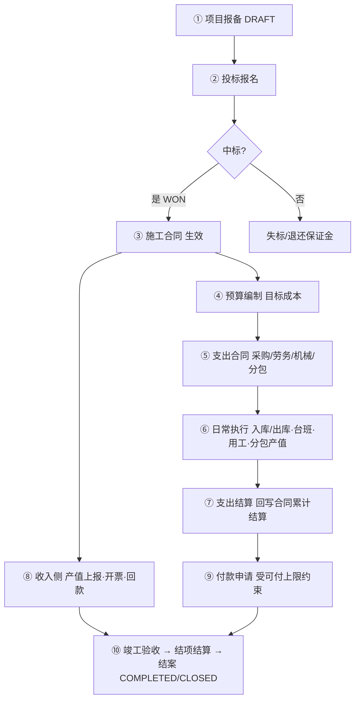
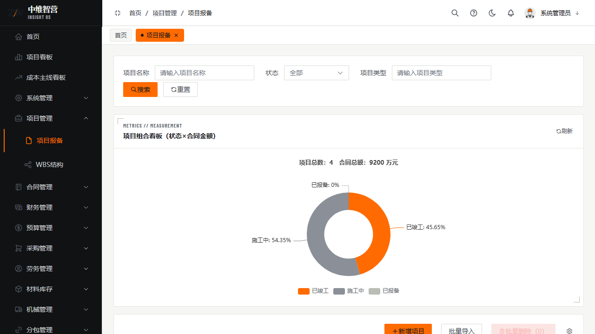
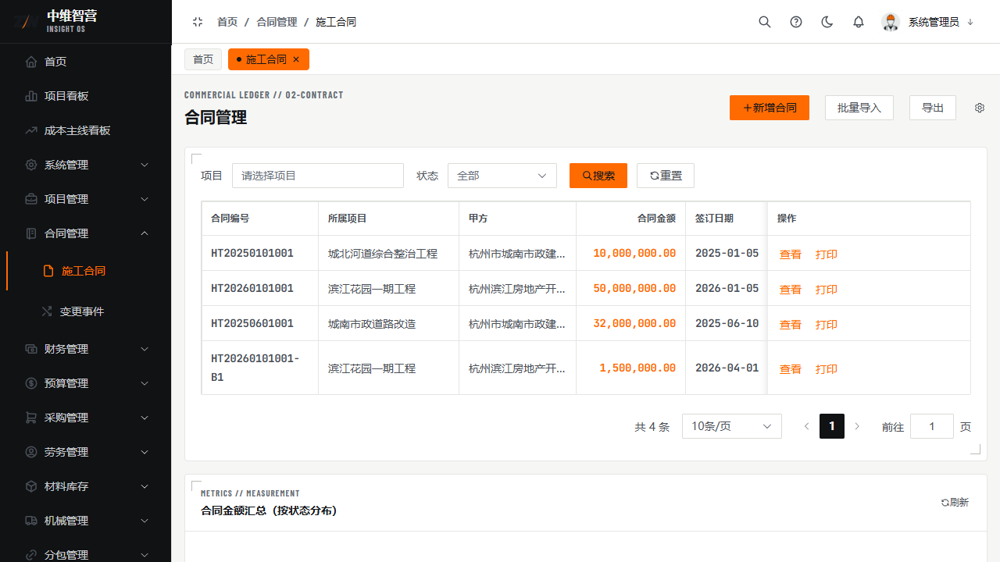

工程项目管理系统的主线，是围绕"**一个项目从报备到结案**"的完整闭环。各模块不是孤立的菜单，而是有**硬先后依赖**的链条：上游单据没做好，下游就无处挂接或被拦截。本章给你一张全局地图。

## 全链路一览

## 各阶段：入口 · 前置依赖 · 产出回写

| 阶段 | 入口页面 | 前置依赖（缺它则做不了） | 审批通过后回写 |
|---|---|---|---|
| ① 项目报备 | 项目管理 › 项目报备 `/project/list` | — | 生成项目主数据（DRAFT→立项） |
| ② 投标 | 投标管理 › 投标报名 `/tender/register` | 已有报备项目 | 中标后项目状态置 `WON` |
| ③ 施工合同 | 合同管理 › 施工合同 `/contract/list` | 项目已中标 | 合同置 `EFFECTIVE`，回写项目累计合同额 |
| ④ 预算 | 预算管理 › 预算编制 `/budget/list` | 已有项目 | 生效目标成本，供支出管控 |
| ⑤ 支出合同 | 采购/劳务/机械/分包合同页 | 已有项目（受预算管控） | 回写对应合同额、占预算执行率 |
| ⑥ 执行 | 材料入出库、机械台班、劳务用工、分包产值 | 已有对应支出合同 | 更新库存 / 累计入库等 |
| ⑦ 结算 | 各模块结算单 | 已有支出合同（材料结算需入库单） | 回写合同**累计结算** |
| ⑧ 收入 | 产值上报、开票申请、回款登记 | 已有生效施工合同 | 回写合同累计产值/开票/收款、项目总收入 |
| ⑨ 付款 | 财务管理 › 付款申请 `/finance/payment-apply` | 已有结算（算可付上限） | 回写合同**累计已付**、项目总支出 |
| ⑩ 结案 | 项目管理发起结项 + 项目最终结算 | 竣工验收完成 | 项目状态置 `COMPLETED`/`CLOSED` |

## 三条最关键的依赖链

1. **收入链**：施工合同（生效）→ 产值上报 → 开票申请 → 回款登记。没有生效的施工合同，产值/开票/收款都无处挂接。
2. **支出链**：支出合同 → 执行单据 →（结算）→ 付款申请。付款的"可付上限"直接来自**累计结算**，没结算就没额度付款。
3. **管控链**：预算编制 → 支出合同/付款受执行率约束（`BLOCK` 模式超预算直接拒绝）。见「预算管理」章。

## 关键校验与规则

- **顺序有硬依赖**：无施工合同则产值/开票/收款无处挂接；无预算则支出合同可能被 `BLOCK` 拦截；无结算则付款无可付上限。
- **金额逐级汇总**：合同额、累计结算、累计已付、项目总收入/总支出都是"下游单据审批通过后回写上游累计值"，因此各页看到的累计数都来自真实单据，可勾稽核对。
- **项目删除是级联删除**：会同步清理该项目下 69 张关联表数据，不可恢复；存在投标报名引用的项目不允许删除。

## 常见问题

**Q：为什么我的付款申请一直提示没有可付额度？**
A：付款额度 = 该合同"累计结算 + 净奖惩 − 累计已付"。多半是该支出合同还没做结算（或结算未审批通过）。先去对应模块提交并通过结算单。

**Q：产值、开票、收款是什么关系？**
A：都以**已生效的施工合同**为载体：产值上报确认"干了多少活"，开票申请确认"开了多少发票"，回款登记确认"收到多少钱"，三者分别回写合同的累计产值/累计开票/累计收款。
