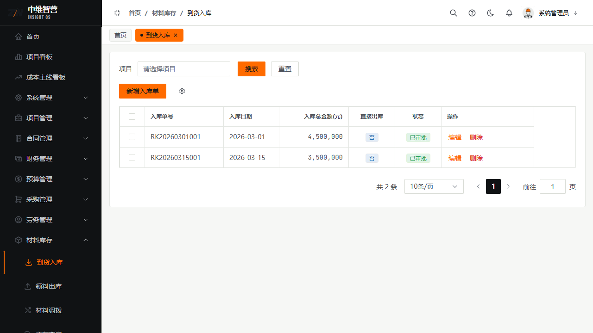
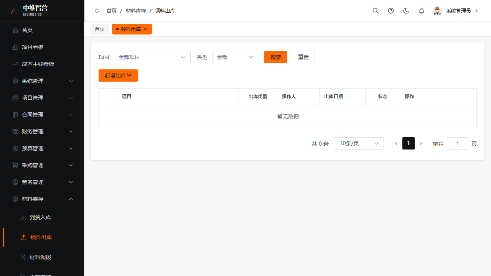
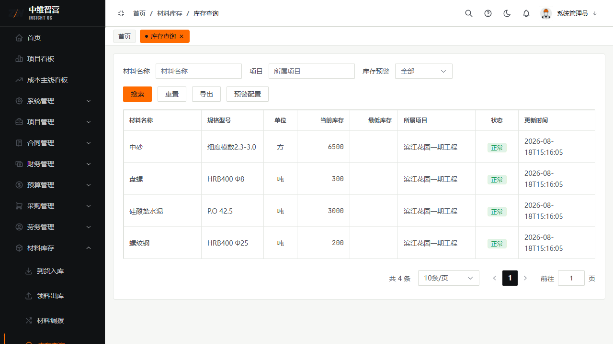

材料库存管理材料的"进—出—调—退"，并以不变量保证账实一致。所有变动都需审批通过才生效。

> 入口：**材料库存** 菜单：到货入库 `/material/inbound`、领料出库 `/material/outbound`、材料调拨 `/material/transfer`、库存查询 `/material/stock`、退货退款 `/material/refund`。

## 到货入库

登记入库单（挂接采购合同/供应商）。表头：项目、采购合同、入库日期、是否直接出库；明细行：材料名称、规格、单位、数量、单价、金额。审批通过后**增加库存**与合同**累计入库**；勾选"直接出库"会在入库同时自动生成一张出库单。

## 领料出库

登记出库单：项目、出库类型、操作人、出库日期；明细：材料名称、规格型号、单位、数量、单价。审批通过后**扣减库存**；**出库量超当前可用库存会被后端拦截**。

## 材料调拨 / 退货退款

**调拨**：在项目/仓库间转移库存（调出项目、调入项目、调拨日期、明细数量/单价），审批后调入+、调出−。**退货退款**：登记退回供应商（关联采购合同、退货数量、单价、退款金额、退款原因）。

## 库存查询与预警

按项目查看当前库存：列材料名称、规格型号、单位、当前库存、最低库存、所属项目、状态、更新时间。支持**预警配置**（安全库存阈值），低于安全库存触发预警；可导出。

## 关键校验与规则

- **库存不变量**：库存 = 累计入库 − 累计出库 − 累计退货 + 累计调入 − 累计调出。
- **入库/出库审批通过才更新库存**；删除已审批单据会**对称回滚**库存与累计值。
- **出库数量不得超过当前可用库存**，否则后端拦截。
- 入库单"直接出库"为便捷开关：一次录入同时完成入+出，两笔变动都留痕。

## 常见问题

**Q：出库提交提示库存不足？**
A：当前可用库存 < 出库数量。先确认是否有未审批的入库单，或调整出库量/走调拨补料。

**Q：删除已审批入库单会怎样？**
A：会对称回滚：库存与合同累计入库同步扣减，保证不变量不被破坏。
