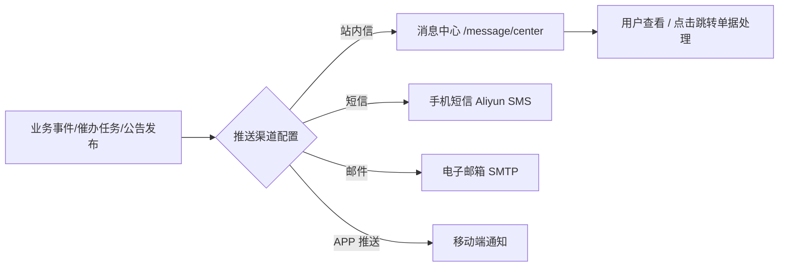

消息管理是系统内外部信息通达与待办催办的触达中枢。它不仅支持面向全员或特定群体的通知公告发布，还管理全系统的推送通道（站内信、短信、邮件、APP 推送），并为用户提供集中的消息处理窗口。

> 入口：左侧一级菜单 **消息管理**，包含四个页面：
> - **通知管理** `/message/notice`
> - **公告管理** `/message/announcement`
> - **推送渠道配置** `/message/push-config`
> - **消息中心** `/message/center`

## 消息流转机制

## 一、通知管理 (`/message/notice`)

用于系统管理人员起草、发布针对特定业务或人员的通知消息：

1. **通知列表**：
   - 检索字段：通知标题、状态（草稿 `DRAFT` / 已发布 `PUBLISHED`）；
   - 表格列：标题、状态、创建时间、操作（查看、发布、编辑、删除）。
2. **新增与发布**：
   - 表单字段：通知标题、通知内容、接收对象（全部人员 / 指定部门 / 指定角色）；
   - 支持暂存草稿；发布后系统将自动生成对应接收人的站内消息。

## 二、公告管理 (`/message/announcement`)

用于发布全公司或全员知晓的重要制度、停服通知或业务公报：

1. **公告展示与优先级**：
   - 公告支持置顶与展示优先级设置；
   - 登录系统后，重要公告将在首页或顶部滚动播报；
2. **生命周期**：
   - 草稿 → 发布（生效）→ 撤回/下线。支持设置生效起始日期与截止日期。

## 三、推送渠道配置 (`/message/push-config`)

推送渠道配置决定了当各类业务事件触发时，系统通过哪些通道触达相关人员：

1. **业务事件类型覆盖**：
   - 包含：流程审批待办、催办提醒、超预算预警、质保金到期、库存安全预警、整改复查提醒等数十种业务事件。
2. **通道开关（四通道）**：
   - **站内信 (enableInApp)**：默认开启，消息落库至个人「消息中心」；
   - **短信 (enableSms)**：通过短信网关发送关键紧急通知至手机；
   - **邮件 (enableEmail)**：发送详尽业务凭证通知至绑定邮箱；
   - **APP 推送 (enableAppPush)**：推送到移动端（uni-app）客户端消息栏。
3. **真实触达约束**：
   - 系统严禁虚假发送：预警与催办类任务统一走 `UrgeNotifyEvent` 事件总线落库站内信，收件人自动绑定项目经理等有效责任人。无有效收件人时记 FAILED 日志并报警，不谎报成功。

## 四、消息中心 (`/message/center`)

每位员工日常查看系统通知与待办催办的个人工作台：

1. **分类标签**：
   - **待办通知**：审批节点到达、需本人签署或确认的业务单据；
   - **催办提醒**：上游发起人发起的催审提醒、质保金返还催办等；
   - **预警通知**：预算执行率超限预警、质量安全整改超期预警；
   - **系统公告**：平台维护与公司公报。
2. **操作便捷性**：
   - 支持「一键全部标为已读」；
   - 点击消息记录可**直接跳转**到对应业务单据详情（如施工合同审批页、付款申请页、整改单页），实现「从消息直达单据」的闭环。

## 关键校验与规则

- **权限隔离**：通知管理、公告管理和推送渠道配置仅具备管理员角色的用户可见并可配置；消息中心对所有登录用户开放。
- **发布不可撤销已读**：已发布的公告若撤回，用户端将不再显示，但用户已接收的站内信记录保留在消息历史中。
- **短信防刷与限频**：短信通道配置了发送频次与内容模板审核，防止频繁打扰。

## 常见问题

**Q：为什么我收不到审批待办的短信提醒？**
A：请管理员前往「推送渠道配置」，核对对应审批业务类型的「短信」开关是否开启，并确认当前账号在「人员管理」中维护了有效的手机号码。

**Q：消息中心里的已读消息能找回吗？**
A：可以。消息列表中提供「全部 / 未读 / 已读」筛选切换，历史消息永久存档供查阅。
