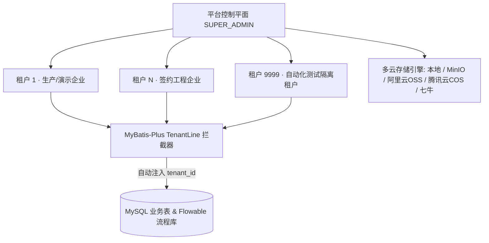

平台管理是 ZW-Insight SaaS 平台的多租户运维底座，仅面向平台级超级管理员（`SUPER_ADMIN`）开放。负责开通企业租户、管理套餐规格、监控资源配额以及管理底层文件对象存储。

> 入口：左侧一级菜单 **平台管理**，包含三个页面：
> - **租户管理** `/platform/tenant`
> - **用户类型** `/platform/tenant-type`
> - **存储管理** `/platform/storage`

## 多租户隔离与资源架构

## 一、租户管理 (`/platform/tenant`)

管理入驻 SaaS 平台的各家建筑/工程企业租户生命周期：

1. **租户检索与列表**：
   - 筛选条件：租户名称、状态（正常 / 已停用 / 已过期）、用户类型（试用 `TRIAL` / 标准 `STANDARD` / 企业 `ENTERPRISE`）；
   - 表格列：租户名称、联系人、联系电话、用户类型、账号配额、到期时间、状态、创建时间、操作。
2. **新增与维护租户**：
   - 表单字段：租户名称、联系人姓名、联系电话、用户类型套餐、最大用户数限制、最大存储空间配额、到期日期、初始化管理员账号密码；
   - **初始化联动**：新建租户时自动初始化该租户的组织架构根节点、管理员角色、默认菜单授权、单据编号规则（前缀防撞号）与 BPMN 审批流定义。
3. **状态控制与到期守卫**：
   - 支持手动「停用 / 启用」租户或「续期」；
   - 系统定时任务（每日 01:00 与 09:00）自动巡检租户到期时间，过期租户将限制新建业务单据并向租户管理员发出续费预警。

## 二、用户类型 (`/platform/tenant-type`)

定义不同等级租户套餐的功能权限边界与资源上限：

1. **三档标准套餐**：
   - **试用版 (TRIAL)**：面向短期体验客户，限定基础模块、较少用户数与短期有效期；
   - **标准版 (STANDARD)**：覆盖项目、合同、预算、采购、劳务、材料、财务核心闭环；
   - **企业版 (ENTERPRISE)**：全模块开放（含高管经营驾驶舱、风险引擎、多维穿透分析、大额存储配额）。
2. **模块级授权**：
   - 为各套餐配置可访问的模块集合；`TenantModuleInterceptor` 在后端接口层实时校验当前租户套餐是否具备模块访问权。

## 三、存储管理 (`/platform/storage`)

配置系统附件、合同扫描件、现场带水印照片、BOQ 清单及备份包的对象存储后端：

1. **支持五类存储引擎**：
   - **LOCAL**：服务器本地磁盘存储；
   - **MINIO**：私有化部署 MinIO 对象存储（默认容器编排内置）；
   - **ALIYUN_OSS**：阿里云对象存储；
   - **TENCENT_COS**：腾讯云对象存储；
   - **QINIU**：七牛云存储。
2. **配置字段**：
   - 存储类型、端点地址 (`endpoint`)、存储桶名称 (`bucket`)、基础路径 (`basePath`)、访问密钥 (`accessKey` / `secretKey`)、自定义域名、启用状态；
   - 同一时间启用一套主存储策略，切换后新上传文件自动路由至新存储桶，历史文件按原记录地址读取与通过 kkFileView 在线预览。

## 关键校验与规则

- **行级强隔离（`tenant_id`）**：所有业务表（`biz_*`）均含 `tenant_id` 列，由 `MybatisPlusConfig` 的 `TenantLineInnerInterceptor` 自动从登录安全上下文注入，前端无需且不能伪造租户头，杜绝跨租户越权读写。
- **全局唯一编号防撞**：不同租户配置独立的单据编号规则前缀（如隔离测试租户 `9999` 强制使用 `T9` 前缀），确保全局唯一索引不冲突。
- **高危操作二次确认**：删除租户、修改存储密钥等高风险操作受 `@SecondaryConfirm`（HTTP 449）密码确认保护。

## 常见问题

**Q：租户到期后里面的业务数据会丢失吗？**
A：不会丢失。租户过期后数据完整保留，仅冻结新增/提交操作；平台管理员在「租户管理」中延长到期时间并恢复为「正常」状态后，即可无缝继续使用。

**Q：如何更换文件上传的存储桶（如从本地迁往阿里云 OSS）？**
A：在「存储管理」中新增阿里云 OSS 配置并测试连通后将其设为「启用」，系统后续上传的合同附件与现场照片将自动存入 OSS。
