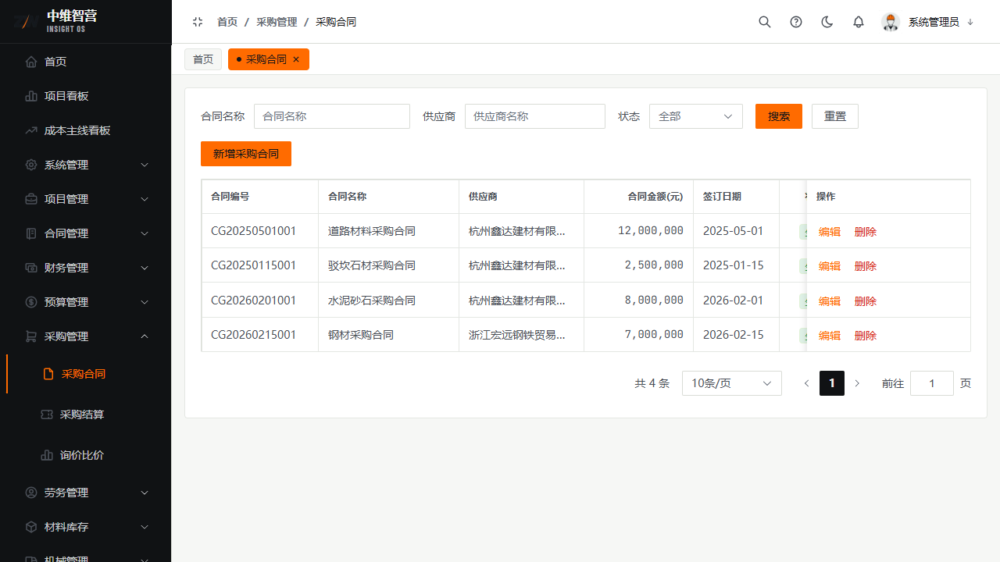
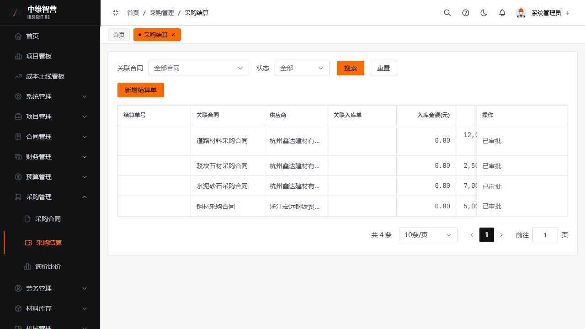
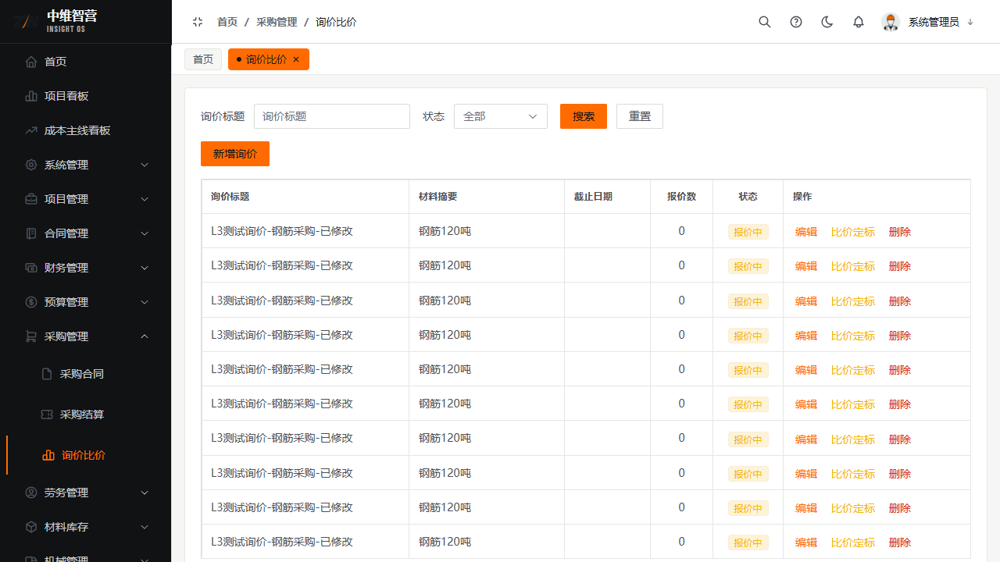

采购管理对应材料类支出：签采购合同 → 材料到货入库 → 以入库为依据结算 → 付款。询价比价用于采购前的供应商选择。

> 入口：**采购管理 › 采购合同**（`/purchase/contract`）、**采购结算**（`/purchase/settlement`）、**询价比价**（`/purchase/inquiry`）。

## 采购合同

新增表单字段：合同名称、供应商、项目、合同金额、签订日期、合同内容。列表列：合同编号、合同名称、供应商、合同金额(元)、签订日期、状态、操作（编辑/提交审批/删除）。提交审批生效。

## 采购结算（以入库为依据）

对已入库的采购合同发起结算。表单字段：关联合同、关联入库单、入库金额（自动带入）、本次结算金额、结算日期、备注。列表列：结算单号、关联合同、供应商、关联入库单、入库金额(元)、结算金额(元)、结算日期、状态、操作。

> 入库单在**材料库存 › 到货入库**登记（挂接采购合同），审批后更新库存与合同累计入库。

## 询价比价

采购需求发起询价 → 供应商报价 → 比价定标。询价字段：询价标题、材料名称、规格型号、采购数量、截止日期、要求说明。报价明细列：报价供应商、报价总额(元)、来源、排名、中标。操作：发布、计算排名、确认定标、关闭。

## 关键校验与规则

- **采购结算以入库单为依据**：必须关联一张已审批入库单；**同一入库单只能结算一次**；**结算金额 ≤ 入库金额**。
- 结算审批通过回写合同**累计结算**；之后付款申请按"可付上限"校验（见财务章）。
- 采购合同仅草稿可编辑/删除；提交后锁定。
- 询价定标后不可再改报价排名；关闭的询价不可恢复。

## 常见问题

**Q：结算时选不到入库单？**
A：入库单未审批通过，或该入库单已被结算过（一单只结一次）。

**Q：结算金额能大于入库金额吗？**
A：不能。结算以实际入库为上限，超出会被后端拦截。
