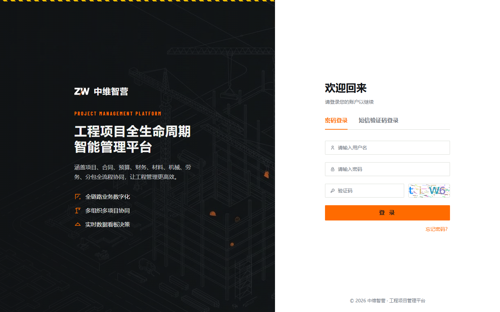
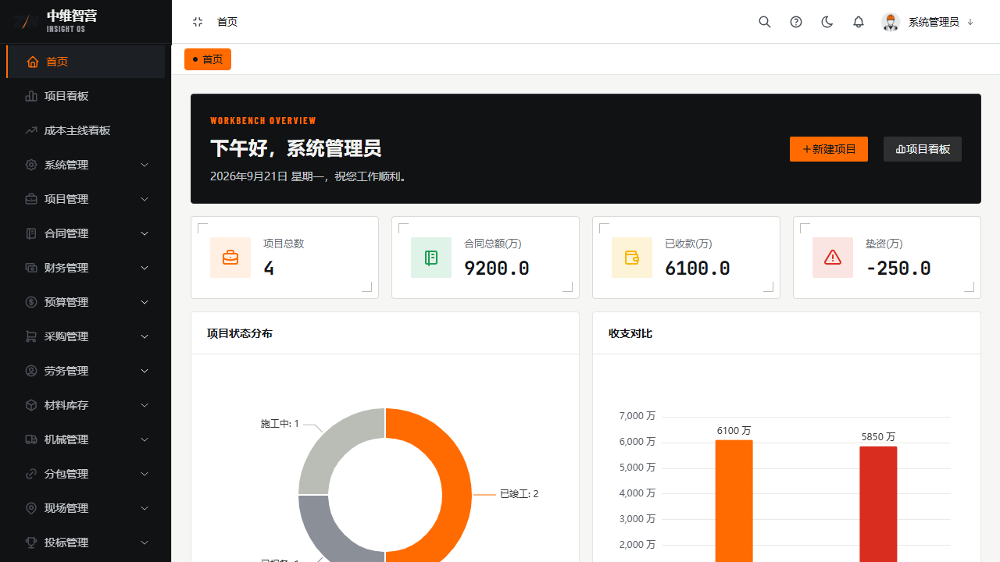
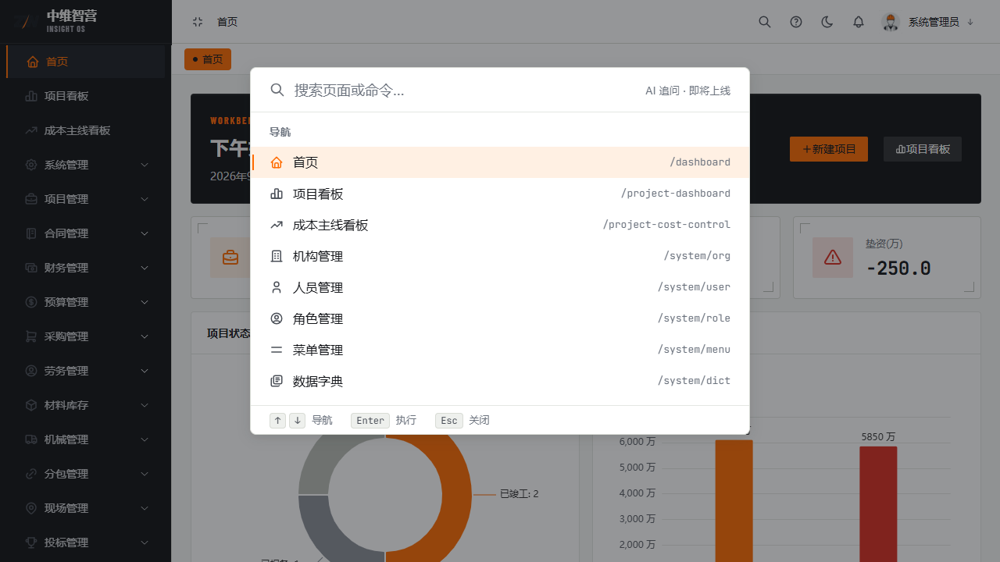

本章带你用最短路径进入系统并掌握全局操作：登录、菜单导航、命令面板、主题与高危操作二次确认。

## 登录

使用管理员分配的账号在登录页登录（用户名 + 密码 + 图形验证码）；也支持"短信验证码登录"页签。连续输错密码会被临时锁定，等待解锁或联系管理员；忘记密码走"找回密码"流程。

## 首页与菜单导航

登录后默认进入**首页**公司概览。左侧菜单按你的**角色授权**动态显示，无权限的菜单不出现；顶栏右侧可切换明暗主题、查看消息与催办、打开帮助中心；头像菜单可进入"登录设备"管理在线会话。

## 命令面板（Ctrl+K）

按 `Ctrl+K`（Mac `⌘K`）或在不输入文字时按 `/` 唤起命令面板，输入页面名/关键词即可跳转任意已授权页面、执行常用操作、直达使用文档章节。

## 全局快捷键

| 按键 | 作用 |
|---|---|
| `Ctrl/⌘ + K` 或 `/` | 唤起命令面板 |
| `Ctrl/⌘ + S` | 表单/弹窗内保存 |
| `Ctrl/⌘ + Enter` | 表单/弹窗内提交 |
| `Esc` | 关闭命令面板等自绘浮层 |

## 关键校验与规则

- 菜单与命令面板的导航项都来自**后端真实授权**（getUserMenus），不会越权显示无权限页面。
- **二次确认（HTTP 449）**：删除等高危操作会弹出密码框，输入当前登录密码后携带确认头重发原请求；密码错返回 403，15 分钟内连续 5 次错→423 临时锁定 15 分钟。

## 常见问题

**Q：忘记密码怎么办？**
A：登录页点"找回密码"按流程重置；若账号被锁定（423）需等待解锁或联系管理员。

**Q：为什么有些菜单看不到？**
A：菜单按角色授权过滤。联系管理员在"角色管理"中为你的角色勾选对应菜单与按钮权限。
