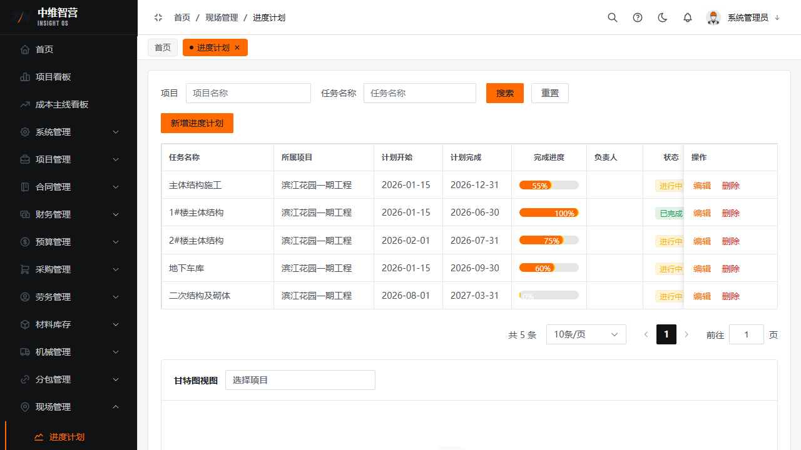
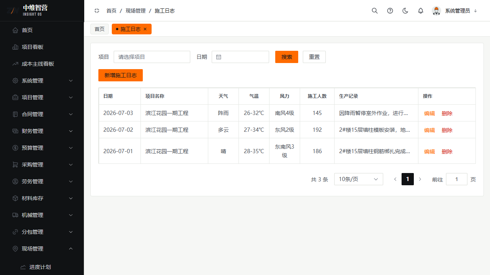
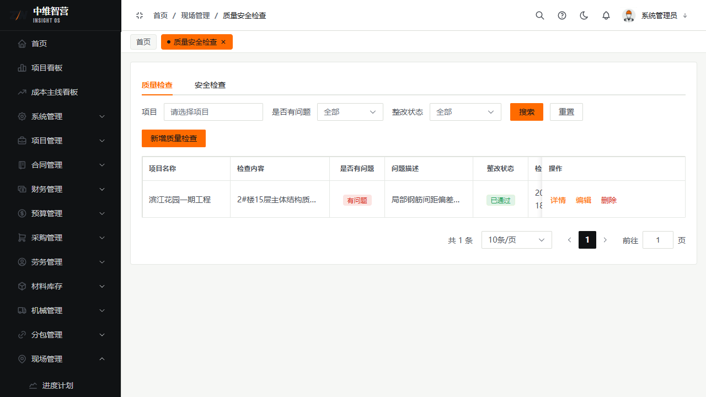

现场管理记录工地的"过程"：进度计划、每日施工日志、质量安全检查与整改闭环。

> 入口：**现场管理** 菜单：进度计划 `/site/schedule`、施工日志 `/site/construction-log`、质量安全检查 `/site/inspection`。

## 进度计划

为项目建立计划节点并反馈实际进度。字段：任务名称、所属项目、计划开始、计划完成、负责人、完成进度(%)。列：任务名称、所属项目、计划开始、计划完成、完成进度、负责人、状态、操作。

## 施工日志

按日登记现场日志：日期、天气、气温、风力、施工人数、生产记录、技术记录。列：日期、项目名称、天气、气温、风力、施工人数、生产记录、操作。

## 质量安全检查 → 整改 → 复查

- **发起检查**：选项目、检查类型、检查方案，逐条"添加检查项"填检查内容与结果。
- **发现问题**：检查单标记"是否有问题"+问题描述，可**指派整改**（整改责任人、整改期限）。
- **整改与复查**：整改单填整改内容→提交整改→**复查通过**关闭。列表列：项目名称、检查内容、是否有问题、问题描述、整改状态、检查时间、操作。

## 关键校验与规则

- **检查→整改→复查为闭环**：整改单必须关联检查记录；关闭前必须复查通过，未复查不可关闭。
- 检查/整改单据遵循通用审批与状态守卫；仅草稿可编辑/删除。
- 施工日志按日唯一性由项目+日期约束，避免重复登记。

## 常见问题

**Q：整改单为什么关不掉？**
A：还未"复查通过"。闭环要求整改提交后由检查方复查，复查通过才关闭。
