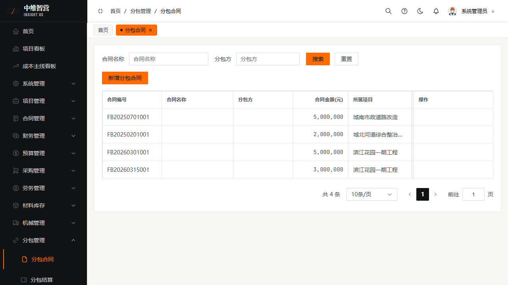
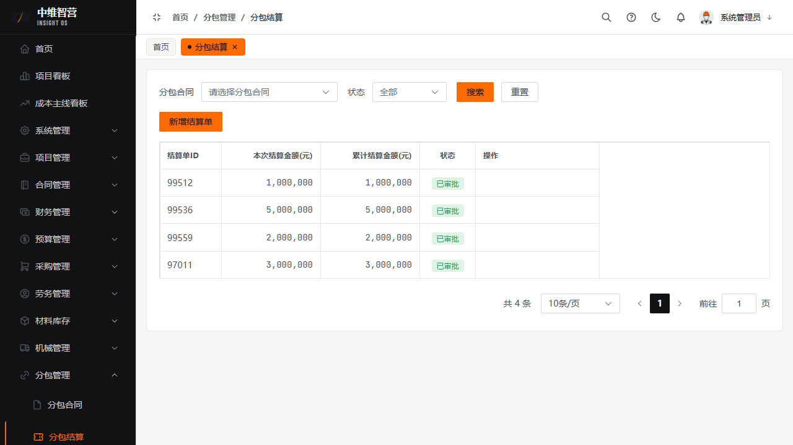

分包管理覆盖专业分包的"合同—结算"两环节，结算以明细行（工程量）为依据。

> 入口：**分包管理 › 分包合同**（`/subcontract/contract`）、**分包结算**（`/subcontract/settlement`）。

## 分包合同

新增字段：合同名称、分包单位、所属项目、合同金额、分包内容、签订日期。列表列：合同编号、合同名称、分包单位、合同金额(元)、所属项目、签订日期、状态、操作（编辑/提交审批/删除）。提交审批生效。

## 分包结算

对分包合同发起结算，含**明细行**（工程项名称、单位、数量、单价、小计）。表头：分包合同、项目；列表列：结算单ID、本次结算金额(元)、累计结算金额(元)、状态、操作。审批通过后回写合同**累计结算**。

## 关键校验与规则

- **分包结算金额不得超过合同金额**；结算审批通过回写累计结算。
- **净奖惩（奖励−处罚）会计入付款"可付上限"**：分包合同的净奖惩由后端奖惩数据汇总（奖励为正、处罚为负），在付款校验时叠加到"累计结算−累计已付"之上。奖惩本身无独立录入页，随结算/付款口径体现。
- 仅草稿可编辑/删除；结算明细行决定结算金额，需与实际完成工程量一致。

## 常见问题

**Q：分包的奖励/处罚在哪里录？**
A：系统未设独立"奖罚单"页面；净奖惩作为后端汇总值参与付款可付上限计算。如需调整可付额度，通过结算与合同层面处理。

**Q：分包结算和采购结算有何不同？**
A：分包结算以**明细行工程量**为依据；采购结算以**入库单**为依据（一单只结一次）。两者回写各自合同的累计结算。
