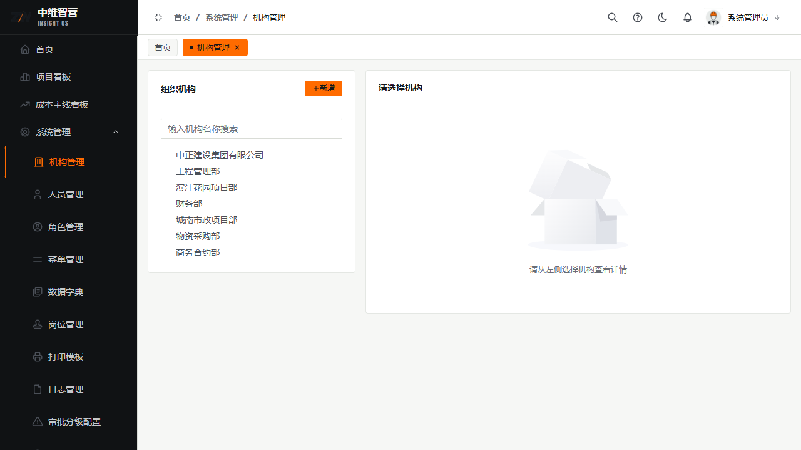
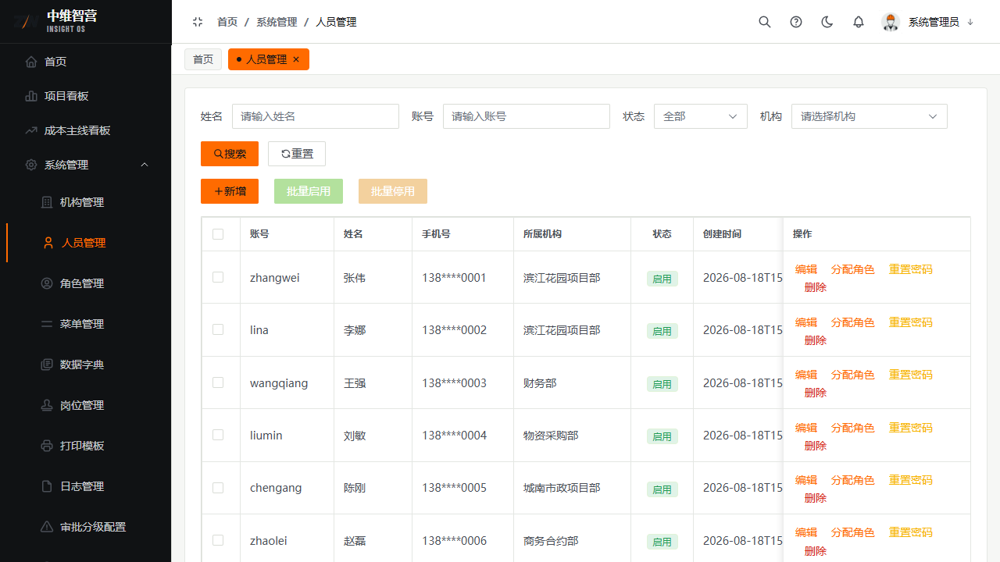
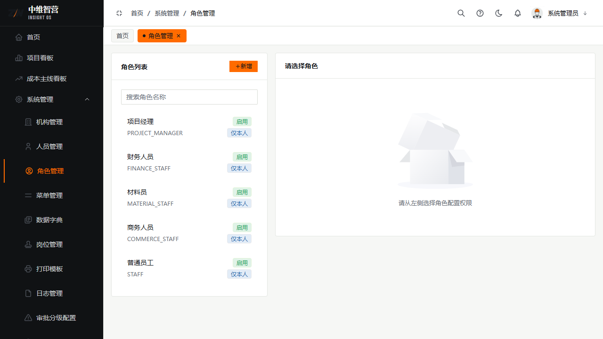
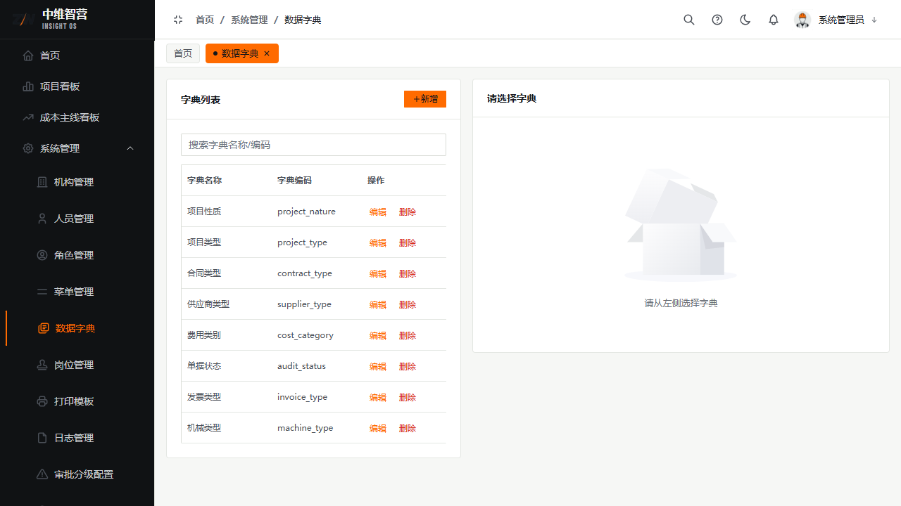
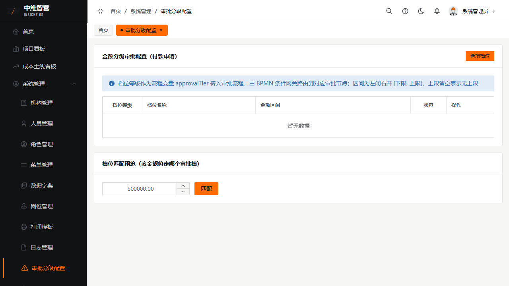
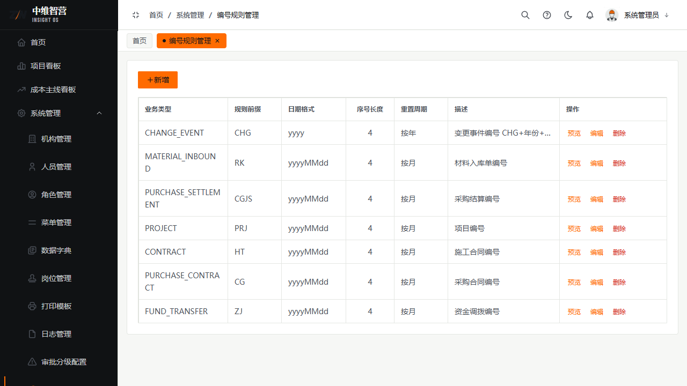
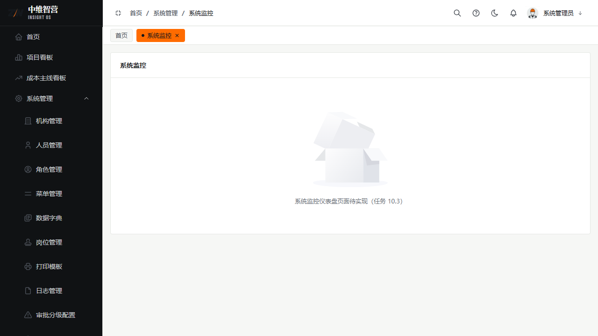

系统管理是平台的"配置与运维中枢"：组织与权限、字典与模板、编号规则，以及日志/备份/版本/监控。多数能力仅管理员可见。

> 入口：**系统管理** 菜单：机构 `/system/org`、人员 `/system/user`、角色 `/system/role`、菜单 `/system/menu`、数据字典 `/system/dict`、岗位 `/system/post`、模板 `/system/template`、打印模板 `/system/print-template`、日志 `/system/log`、审批分级 `/system/amount-tier`、编号规则 `/system/serial-number`、数据备份 `/system/backup`、版本 `/system/version`、监控 `/system/monitor`。

## 组织与人员

**机构管理**维护组织树：上级机构、机构名称、机构编码、机构类型、排序；可新增子机构。

**人员管理**维护用户：用户名、真实姓名、手机号、邮箱、所属机构、岗位、密码；操作含新增、编辑、分配角色、重置密码、批量启用/停用、删除。

## 角色与权限

**角色管理**：角色名称、角色编码、状态、备注、**数据范围**；通过"配置数据权限/保存权限"为角色勾选**菜单+按钮**两级权限与数据可见范围。**菜单管理**维护菜单树（菜单类型、路由路径、组件路径、权限标识、图标、排序）。

## 字典 / 岗位 / 模板

- **数据字典**：字典名称/编码 + 子项（标签、值、排序），驱动全系统下拉枚举。
- **岗位管理**：岗位名称、岗位编码、状态、排序。
- **模板/打印模板**：模板名称、业务类型、渲染引擎、所属模块、模板内容；打印模板维护单据打印样式。

## 审批分级配置

按**业务类型+金额区间**设定审批档位：档位等级、档位名称、金额下限、金额上限、是否启用。付款等单据提交时命中档位，流程按 `approvalTier` 路由到更严的审批节点（金额越大审批越严）。

## 编号规则

配置各类单据编号生成：业务类型、规则前缀、日期格式、序号长度、重置周期；支持预览。**规则变更只影响之后新生成的单据编号，不回溯历史**。

## 日志 / 备份 / 版本 / 监控

- **日志管理**：操作日志（操作模块/类型/操作人/时间/IP/描述/状态）与登录日志（账号/时间/地点/浏览器/操作系统/异常）。
- **数据备份**：手动备份/下载/恢复/删除；**恢复为高风险操作**，需二次确认（449 密码确认），会覆盖当前库。
- **版本管理**：版本号、发布日期、更新日志。
- **系统监控**：运行状态查看。

## 关键校验与规则

- 权限为**菜单+按钮**两级：角色决定可见菜单与可点按钮；**数据权限**决定可见数据范围。
- 编号规则变更不回溯历史单据。
- 备份恢复、批量操作等高风险接口带 `@SecondaryConfirm` 守卫（449/403/423）。
- 系统设置/备份/监控为管理员能力，普通角色不可见。

## 常见问题

**Q：给角色加了菜单但用户还是看不到？**
A：检查是否同时勾选了按钮权限与数据范围；或用户需重新登录刷新授权缓存。

**Q：编号规则改了为什么旧单号没变？**
A：设计如此——规则只约束新单号，历史单号保持不变以保证可追溯。
