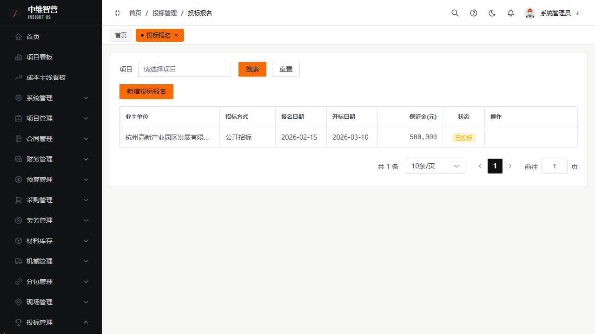
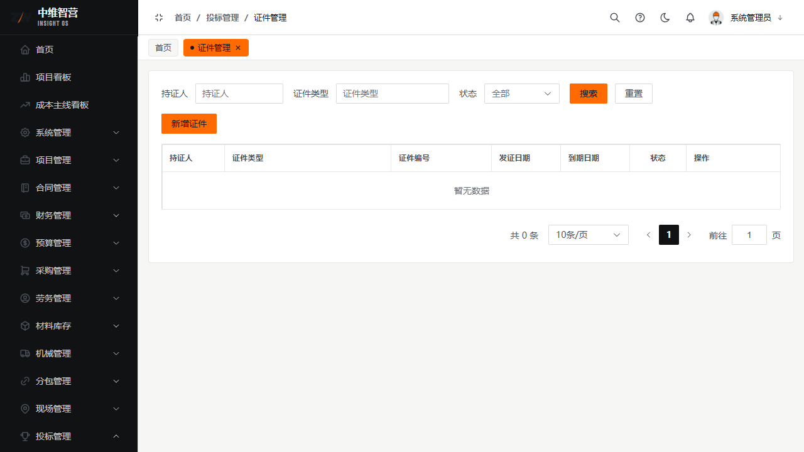

投标管理承接"项目报备之后、施工合同之前"的环节：对项目登记投标报名，中标后项目才能签主合同。

> 入口：**投标管理 › 投标报名**（`/tender/register`）、**投标管理 › 证件管理**（`/tender/certificate`）。

## 投标报名

新增报名表单字段：项目、业主单位、招标方式、报名方式、投标方式、报名日期、开标日期、保证金金额。列表列：业主单位、招标方式、报名日期、开标日期、保证金金额、状态、操作（编辑/提交/删除）。

## 保证金

涉及保证金的走**保证金申请**流程：申请 → 审批 → 确认付款 → 中标后退还。保证金申请单遵循通用审批流（提交置 `SUBMITTED`，审批通过置 `PAID`，驳回/撤回回退 `DRAFT`）。

## 证件管理

维护公司/人员投标所需证照。字段：持证人、证件类型、证件编号、发证日期、到期日期、启用状态。列表列：持证人、证件类型、证件编号、发证日期、到期日期、状态、操作。用于投标时校验证照是否在有效期内。

## 关键校验与规则

- **项目一旦存在投标报名记录，该项目即不可删除**（引用拦截）——这是项目级联删除的前置守卫。
- 报名/保证金单据遵循通用审批流：`DRAFT → SUBMITTED → APPROVED/REJECTED`；仅草稿可编辑/删除。
- 证件到期会影响投标合规提示，请及时维护到期日期。

## 常见问题

**Q：报名提交后还能改吗？**
A：提交（SUBMITTED）后锁定；需撤回或等驳回后才能修改重提。

**Q：保证金什么时候退？**
A：中标/未中标确定后按流程退还；保证金台账（财务 › 保证金台账）统一监控缴纳与退还状态。
