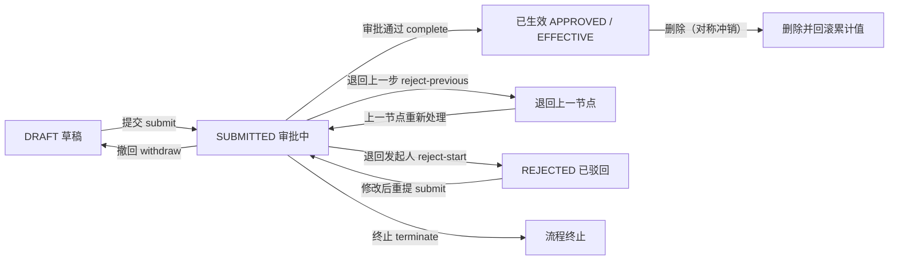
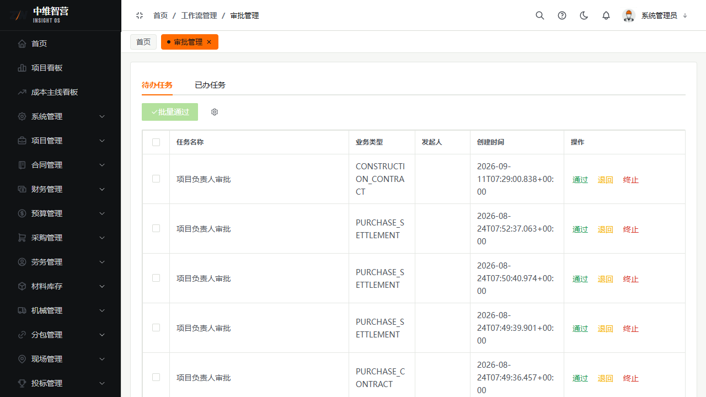
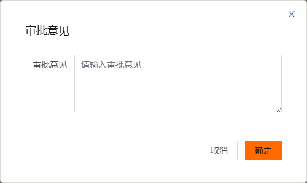
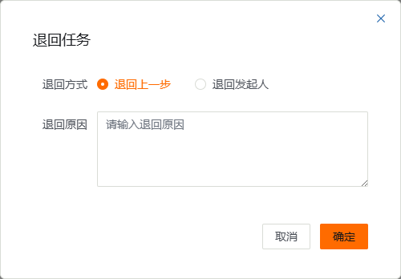
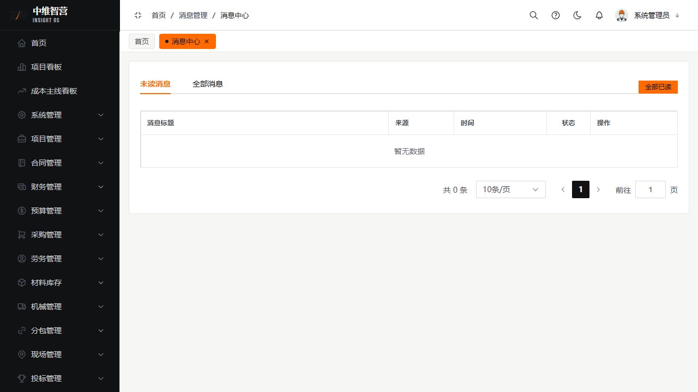

系统中所有需要审批的业务单据（施工合同、支出合同、各类结算、付款、开票、回款、预算变更、保证金、入出库……）都走同一套**审批中枢**（基于 Flowable 引擎）。本章讲清它们的共同流转规则，以及你在「审批管理」页如何处理待办。

> 入口：左侧菜单 **工作流管理 › 审批管理**（路由 `/workflow/approval`）；也可用命令面板 `Ctrl+K` 搜「待办 / 审批」直达。

## 单据状态机

单据从创建到生效会经历下列状态。**注意：系统里有两类"生效时机"**（这是最容易踩坑的地方）：

- **A 类 · 审批回调生效（多数单据）**：`提交` 只把状态置 `SUBMITTED`，**不回写任何累计值**；待审批人在引擎里办结后，由后端监听器回调 `onApproved` 才真正生效并回写。典型：施工合同（终态是 `EFFECTIVE`）、付款申请（`APPROVED`）、保证金（`PAID`）、竣工验收（联动项目 `COMPLETED`）、预算变更。
- **B 类 · 提交即生效（部分执行/结算单）**：`提交` 当场把状态置 `APPROVED` 并立即回写合同累计值，审批流仅作事后留痕并行进行。典型：**采购结算**、**材料入库/出库**。这类单据"提交后金额立刻变化"属正常设计，不是 Bug。

> 施工合同的终态是 `EFFECTIVE`（生效）而非 `APPROVED`；列表与详情按各自业务语义展示状态文案。

## 待办处理界面（字段级）

「审批管理」页顶部两个 Tab：**待办任务** / **已办任务**。待办表格列：

| 列 | 含义 |
|---|---|
| 任务名称 | Flowable 任务名（如"项目负责人审批"） |
| 业务类型 | 单据类型码（如 `CONSTRUCTION_CONTRACT`、`PURCHASE_SETTLEMENT`） |
| 发起人 | 提交该单据的用户 |
| 创建时间 | 任务生成时间 |
| 操作 | **通过** / **退回** / **终止** 三个行内按钮 |

工具栏「批量通过」按钮：勾选多行后可一次性通过（未勾选时禁用）。

### 通过

点行内「通过」→ 弹出**审批意见**框（可选填意见）→ 确定。A 类单据由此办结，触发后端 `onApproved` 回写累计值。

### 退回

点行内「退回」→ 弹出**退回任务**框，含两个字段：

- **退回方式**（单选）：`退回上一步`（回退到前一审批节点）或 `退回发起人`（直接打回起草人，单据置 `REJECTED`）。
- **退回原因**（文本域）。

### 终止

点行内「终止」→ 二次确认后终止整个流程实例（不可恢复）。

待办与催办也会推送到**消息中心**（`/message/center`），可从消息直接跳转对应单据：

## 键盘快捷操作（待办 Tab）

| 按键 | 作用 |
|---|---|
| `↑` / `↓` | 在待办行间移动高亮 |
| `空格` | 选中/取消当前行（用于批量） |
| `Enter` | 快速通过当前行（有勾选则批量通过） |
| `Ctrl/⌘ + A` | 全选当前页 |
| `Ctrl/⌘ + Enter` | 在通过/退回弹窗内直接提交 |

## 关键校验与规则

- **仅 DRAFT（部分单据含 REJECTED）可编辑/删除/提交**；`APPROVED`/`EFFECTIVE` 单据不可编辑，删除受引用与状态守卫限制。
- **回写只发生在生效时点**：A 类在 `onApproved` 回调、B 类在 `submit` 当场；`SUBMITTED`、`REJECTED`、撤回均不产生回写。
- **删除已生效单据会对称冲销**其曾回写的累计值（如合同累计已付、项目总支出），保证"账实一致"。付款申请删除即按此冲销。
- **付款申请在生效前会二次校验可付上限**：审批期间合同结算/已付可能变化，若办结时已超限，系统自动把该单置 `REJECTED` 并通知发起人，而非强行入账。
- **撤回**：发起人可撤回自己 `SUBMITTED` 的流程（`withdraw-by-business`）；撤回会同步终止引擎流程实例，避免残留僵尸待办。
- **催办**：发起人可对当前节点处理人发起催办（`urge`）。
- **SUPER_ADMIN 可办结任意待办**（跨候选人校验），便于运维兜底。

## 二次确认（高危操作）

删除、批量操作、数据库恢复等高风险接口带服务端守卫：请求缺少确认头时返回 **HTTP 449**，前端自动弹出密码框，输入**当前账号登录密码**后携带 `X-Confirm-Password` 重发。

- 密码正确 → 放行并清零失败计数；
- 密码错误 → **HTTP 403**；
- 15 分钟内累计 5 次错误 → **HTTP 423** 临时锁定 15 分钟。

## 常见问题

**Q：提交后发现填错了怎么办？**
A：`SUBMITTED` 状态可撤回；被驳回（`REJECTED`）可改后重提。若已生效（A 类 `APPROVED`/`EFFECTIVE`），需走变更/删除冲销流程，不能直接改单。

**Q：为什么我审批通过了，合同金额却没变？**
A：先确认该单据是 A 类还是 B 类。A 类需你在待办里真正点「通过」办结后才会回写；B 类（采购结算、材料入出库）是提交当场就回写了的。

**Q：退回"上一步"和"发起人"有何区别？**
A：退回上一步只回退一个节点，前面已审批的人要重审；退回发起人则直接打回起草人（单据置 `REJECTED`），修改后从第一个节点重新走。
